# 05 — Garbage Collection

> **The Anatomy of Go** (Phuong Le) — 7-bob, 5-bo'lim.
> Bu material kitob so'zma-so'z tarjimasi emas — o'qib tushunilib, o'z so'zlarim bilan qayta tushuntirilgan versiya.

[← 04 Escape Analysis](04_escape_analysis.md) | [Keyingi: 06 Xulosa →](06_summary.md)

---

## Nima uchun bu mavzu muhim?

Go'da siz `free()` yozmaysiz. `new`, `make`, `append` bilan xotira olasiz, lekin uni **qachon** va **qanday** qaytarishni Go runtime o'zi hal qiladi. Bu ishni **garbage collector** (GC) bajaradi.

Savol shu: GC dasturingizni sekinlashtirmaydimi? Qadimgi tillar (masalan, eski Java) "dunyoni to'xtatib" (stop-the-world, STW) xotirani tozalar edi — dastur soniyalab muzlab qolardi. Go esa boshqacha: GC ishining **deyarli hammasi dasturingiz bilan parallel** ishlaydi, STW pauzalar esa millisekundning kichik ulushigacha qisqartirilgan.

Bu bo'limda quyidagilarni chuqur o'rganamiz:

- GC nima uchun kerak va u qanday ishlaydi (tracing vs reference counting)
- **tri-color marking** va **write barrier** — parallel GC'ning yuragi
- `GOGC` va `GOMEMLIMIT` — xotira va CPU o'rtasidagi muvozanatni sozlash
- GC'ning to'rt fazasi: **sweep termination → marking → mark termination → sweeping**

Bu bob avvalgi bo'limlar bilan chambarchas bog'liq: [02 Heap](02_heap.md)'dagi `mcache`/`mcentral`/`mheap`, span va arena tushunchalari, [03 Goroutine Stack](03_goroutine_stack.md)'dagi stek skanerlash, va [04 Escape Analysis](04_escape_analysis.md)'dagi "nima uchun obyekt heap'ga tushadi" — bularning barchasi GC uchun poydevor.

---

## Garbage Collection asoslari

### Muammo nima edi? — Xotirani qo'lda boshqarish

C tilida siz `malloc` bilan xotira olasiz va `free` bilan qaytarasiz. Ikki xatoning har biri halokatli:

- `free` qilishni **unutsangiz** → memory leak (xotira asta-sekin tugaydi).
- Bir xotirani **ikki marta** `free` qilsangiz yoki `free`'dan keyin ishlatsangiz → use-after-free, dastur qulaydi yoki xavfsizlik teshigi ochiladi.

Avtomatik xotira boshqaruvi (GC) bu ikki muammoni ham hal qiladi: obyekt endi kerak emasligini runtime o'zi aniqlaydi.

### Yechim 1 — Reference counting (havolalar sanash)

Eng oddiy g'oya: har bir obyektga nechta havola (pointer) ishora qilayotganini sanab boramiz. Hisoblagich **nolga** yetsa — obyektga hech kim yetib bora olmaydi, demak uni bo'shatsa bo'ladi.

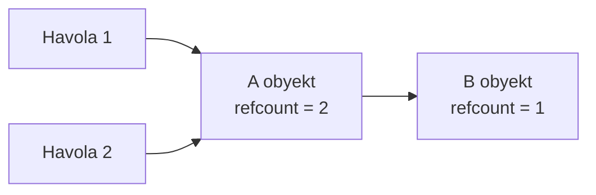

Kamchiliklari:

- **Bookkeeping xarajati:** har bir pointer yozuvi hisoblagichni yangilashi kerak, ko'pincha **atomic** operatsiya bilan — bu hot path'larni sekinlashtiradi.
- **Reference cycle:** A → B va B → A bir-birini ko'rsatsa, ikkalasining ham hisoblagichi hech qachon nolga tushmaydi, garchi tashqaridan hech kim ularga yetib bora olmasa ham. Ular abadiy "tirik" bo'lib qoladi.

### Yechim 2 — Tracing GC (kuzatuvchi yig'uvchi) — Go shu yo'ldan boradi

Go havolalarni sanamaydi. Uning o'rniga **root set**dan (ildizlar to'plami) boshlanadi va pointerlar bo'ylab yurib, **yetib borish mumkin bo'lgan** (reachable) hamma narsani topadi.

Root'larga quyidagilar kiradi:

- goroutine steklar
- global o'zgaruvchilar (DATA va BSS segmentlar)
- runtime'ning ichki bookkeeping ma'lumotlari

Root'lardan **yetib bo'lmaydigan** hamma narsa — axlat, uni bo'shatish mumkin.

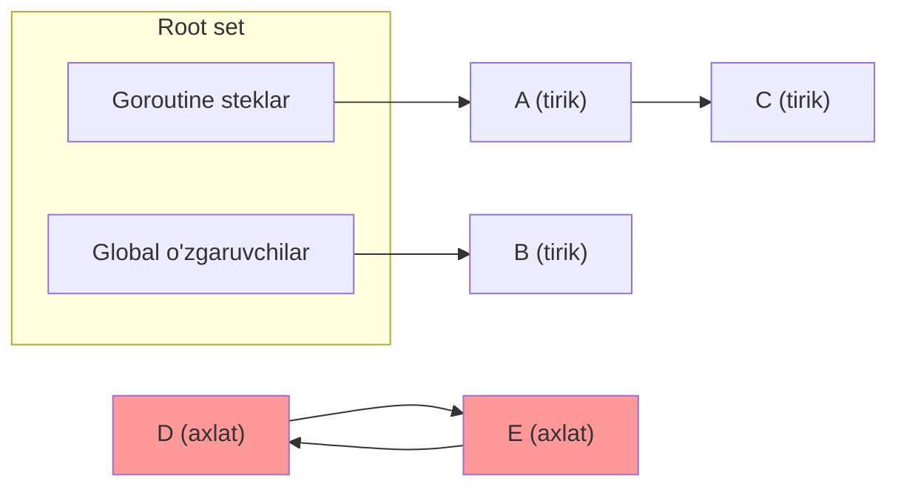

E'tibor bering: yuqoridagi `D ↔ E` sikli reference counting'da abadiy tirik bo'lib qolar edi, lekin tracing GC uchun ular oddiygina yetib bo'lmaydigan axlat.

Tracing'ning kamchiligi — u xotirani **skanerlashi** kerak, bu esa qo'shimcha ish. Go bu xarajatni ikki yo'l bilan yumshatadi: (1) pauzalarni qisqa saqlash uchun faqat muhim o'tish nuqtalarida qisqacha STW qiladi, (2) marking va sweeping'ning aksariyatini dastur ishlab turgan holda **parallel** bajaradi.

### Go GC'sining to'rt xususiyati

Go **precise, concurrent, non-generational, non-compacting** yig'uvchiga ega.

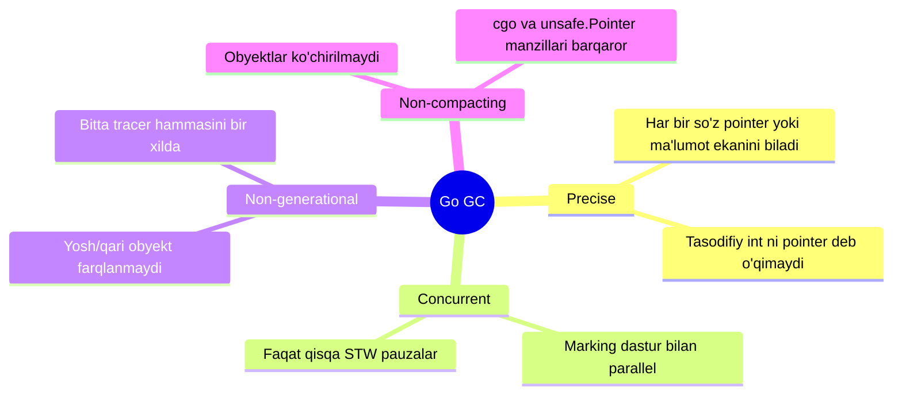

- **Precise (aniq):** runtime har bir mashina so'zi (word) pointer'mi yoki oddiy ma'lumotmi — aniq biladi. GC bit-naqshiga qarab taxmin qilmaydi, shuning uchun tasodifiy `int`ni pointer deb yanglishmasdan xato marklamaydi. Har bir GC sikli qisqa STW nuqtalariga ega — ulardan biri runtime'ni mark fazasiga o'tkazadi va **write barrier**'ni yoqadi.

- **Concurrent (parallel):** marking ishining aksariyati dasturingiz bilan bir vaqtda ishlaydi. Marking davomida dasturingiz pointerlarni yozishda davom etadi; **write barrier** bu yangilanishlarni qayd etadi, shuning uchun skan davomida yetib boriluvchi bo'lgan obyektlar ham topiladi. Mark fazasida yangi ajratilgan obyektlar darhol **qora** (black) bo'ladi — ularni ikkinchi marta qidirish shart emas.

- **Non-generational (avlodlarsiz):** ko'p GC'lar *generational* — yangi obyektlarni qari obyektlardan alohida ko'rib chiqadi (chunki ko'p yangi obyekt tez o'ladi). Go bunday bo'linmani ishlatmaydi; bitta parallel tracer barcha obyektni — yosh yoki qari — bir xilda ko'rib chiqadi. Buning narxi: qisqa umrli axlat keyingi to'liq tracing siklgacha yashab qolishi va unga qo'shimcha ish qo'shishi mumkin.

- **Non-compacting (zichlashtirilmaydigan):** ba'zi yig'uvchilar *compacting* — jonli obyektlarni ko'chirib, bo'shliqlarni yo'q qiladi va bump-pointer allokatsiyani osonlashtiradi. Go esa ajratilgan obyektni **hech qachon ko'chirmaydi**, chunki manzilni o'zgartirish `cgo` va `unsafe.Pointer` tayangan "manzil barqaror" taxminini buzadi. Fragmentatsiyaga qarshi Go boshqa yo'l tutadi: xotirani o'lchamga ajratilgan span va arena'larda boshqaradi ([02 Heap](02_heap.md)'ga qarang), foydalanilmagan obyektlarni fonda tozalaydi, bo'sh span'larni qayta ishlatadi yoki birlashtiradi va imkon bo'lganda xotirani OS'ga qaytaradi.

### Marking va Sweeping — qaysi biri qimmatroq?

Tracing GC'ning ikki asosiy vazifasi bor:

- **Marking** — "qaysi obyektlar hali yetib boriluvchi?" degan savolga javob beradi.
- **Sweeping** — "endi qaysi xotirani qayta ishlata olamiz?" degan savolga javob beradi.

Ko'pchilik sweeping qimmatroq deb o'ylaydi (u span'lar bo'ylab yuradi, xotira bo'shatadi). Amalda esa odatda **marking qimmatroq**:

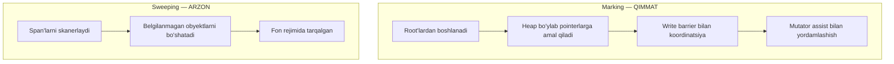

- **Marking** root'lardan boshlanadi, heap bo'ylab pointerlarni kuzatadi va tashrif buyurganini qayd etadi. Ayni paytda dastur ham pointerlarni yangilaydi, shuning uchun GC write barrier'ga tayanadi. Agar ajratish (allocation) GC'dan tezroq ketsa, **mutator assist** ishga tushadi — allokatsiya qilayotgan goroutine'ga bir oz marking ishi yuklanadi. Marking koordinatsiya, bookkeeping va dastur bilan zich muloqotni talab qiladi, shuning uchun ko'proq CPU yeydi. Uning narxi jonli ma'lumot hajmi va pointerlar zichligiga bog'liq holda o'sadi.

- **Sweeping** oddiyroq va ko'proq **bandwidth**'ga bog'liq. Marking tugagach, sweeper span'larni skanerlaydi, marklanmagan obyektlarni qaytaradi va bo'sh span'larni qayta ishlatish uchun ozod qiladi. U goroutine'lar bilan kam koordinatsiya qiladi va bitta pauzaga to'planmasdan oddiy bajarilish davomida tarqaladi.

Sweeping ba'zi holatlarda sezilarli bo'lishi mumkin: juda ko'p mayda span bo'lganda, majburiy yig'imdan keyin ko'p span tozalanmagan qolganda yoki keskin allokatsiya to'lqinida. Lekin odatiy sharoitda marking CPU'ni ustunlik bilan yeydi, sweeping esa fonda jimgina ketadi.

---

## Tri-color Marking va Write Barrier

### Muammo nima edi? — Eski STW mark-and-sweep

Go'ning dastlabki versiyalari oddiy **stop-the-world mark-and-sweep** yig'uvchisidan foydalanardi. Uning ish oqimi:

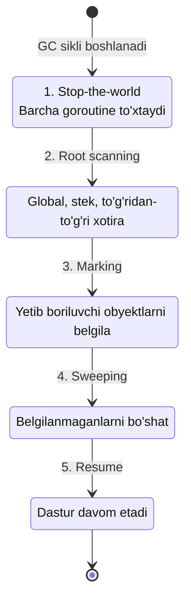

Asosiy kamchilik — **global pauza**: yig'uvchi ishlayotganda butun dastur to'xtab turishi kerak. Eski Go versiyalarida bu pauzalar yuzlab millisekunddan bir necha soniyagacha yetardi. Latency'ga sezgir dasturlar uchun bu falokat.

Nega umuman pauza kerak? Chunki dastur doimo xotirani o'zgartirib turadi: pointer yaratadi, havolalarni yangilaydi, ba'zilarini tashlab yuboradi. Koordinatsiyasiz GC "harakatlanuvchi nishonni" quvlagan bo'lardi va jonli ma'lumotni axlatdan ishonchli ajrata olmasdi.

### Yechim — bosqichma-bosqich takomillashuv

Go GC'ni bir necha bosqichda tezlashtirdi:

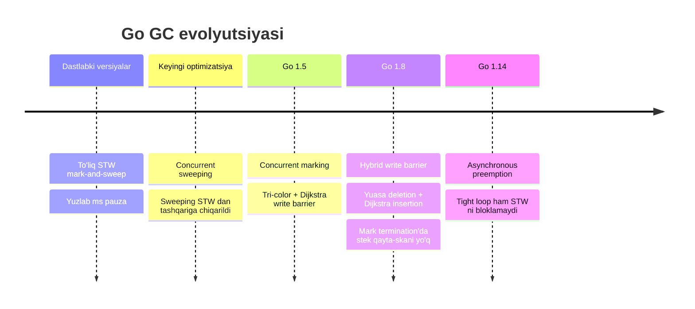

1. **Concurrent sweeping** — avval sweeping STW oynasidan tashqariga, dastur bilan parallel ishlashga o'tkazildi.
2. **Go 1.5 — concurrent marking** — endi marking ham parallel. Buning uchun ikki g'oya kerak bo'ldi: **tri-color marking** va **write barrier**. Go 1.5 davrida runtime **Dijkstra-uslubidagi insertion write barrier** ishlatardi. Uning kamchiligi — mark termination'da qo'shimcha stek ishi: runtime concurrent skandan beri faol bo'lgan stek freymlarini **qayta skanerlashi** kerak edi.
3. **Go 1.8 — hybrid barrier** — Yuasa-uslubidagi deletion barrier'ni Dijkstra insertion barrier bilan birlashtirdi. Bu concurrent marking davomida pointer yangilanishlarini zichroq kuzatadi va mark termination'dagi STW ishini kichraytiradi.

### Async preemption — tight loop muammosi

Yana bir muammo — goroutine'larni **talab bo'yicha to'xtatish**. STW pauza uchun runtime har bir goroutine'ni **safe point**ga keltirishi kerak. Odatda bu tez bo'ladi, lekin muhim istisno bor:

```go
func forever() {
    for {
        // hech qanday funksiya chaqiruvi yo'q
    }
}

func main() {
    go forever()
    time.Sleep(time.Second) // goroutine ishga tushsin
    runtime.GC()            // GC ni majburan ishga tushiramiz
    println("GC done")
}
```

Eski Go versiyalarida runtime asosan **cooperative preemption**'ga tayanardi — goroutine faqat funksiya chaqiruvi kabi safe point'larda to'xtatilar edi. Hech narsa chaqirmaydigan `for {}` tsikli hech qachon safe point'ga yetmaydi, shuning uchun `runtime.GC()` abadiy kutib qolishi va oxirgi qator hech qachon chop etilmasligi mumkin edi.

**Go 1.14** dan boshlab **asynchronous preemption** qo'shildi: scheduler goroutine'ni cheksiz tsikl ichida ham to'xtatib, safe point'ga keltira oladi va GC o'z vaqtida STW'ga kira oladi. (Preemption 8-bobda batafsil ko'riladi.)

### Tri-color Marking — nega uchta rang?

Avval eng oddiy modeldan boshlaymiz: **ikki rangli** GC. Har bir obyekt yo *unmarked* (belgilanmagan) yo *marked* (belgilangan). Agar GC butun mark fazasi davomida dasturni to'xtatib tura olsa, ikki rang yetarli: yig'uvchi root'ni oladi, yetib boriluvchi obyektni topadi, uni marklaydi, **darhol** uning pointerlarini skanerlaydi va davom etadi. Bu dunyoda "marked" = "marked va scanned", chunki dastur pointerlarni GC ostidan o'zgartirmaydi.

Asosiy muammo — uzun pauza. Agar dastur GC marking paytida **ishlashda davom etsin** desak, GC endi "markla va darhol skanerla" ni bitta uzluksiz o'tishda bajara olmaydi. Shu payt "marked" ikki holatni aralashtiradi: topilgan lekin hali skanerlanmagan obyektlar, va allaqachon skanerlangan obyektlar. Marking'ni bo'lakma-bo'lak (incremental) qilish uchun runtime'ga "yetib boriluvchi, lekin hali skanerlanmagan" obyektlarning **to-do ro'yxati** kerak. Aynan shu — uchinchi rangning vazifasi.

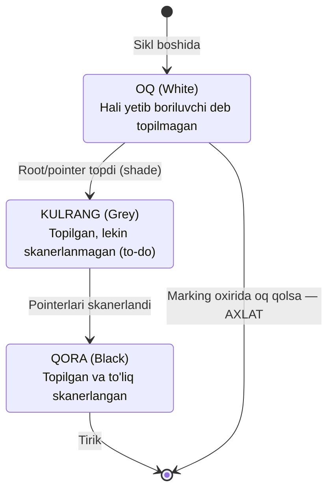

Mark fazasida GC obyektlarni uch rangga ajratadi:

- **Oq (White):** GC hali yetib boriluvchi deb belgilamagan. Marking tugaganda hali oq bo'lsa — axlat, xotirasi qaytariladi.
- **Qora (Black):** GC to'liq qayta ishlagan. Tirik ekani ma'lum va pointerlari allaqachon skanerlangan.
- **Kulrang (Grey):** yetib boriluvchi deb topilgan, lekin hali skanerlanmagan. U hali oq obyektlarga ishora qilishi mumkin.

GC diqqatini **kulrang** obyektlarga qaratadi, chunki ularning pointerlariga amal qilish yangi obyektlarni ochib berishi mumkin. Marking **kulrang qolmaganda** tugaydi. Kulrang — o'rtadagi holat, ya'ni ichki qurilgan to-do ro'yxati: GC obyektni kulrangga bo'yaydi, dasturni davom ettiradi, keyin qaytib kulranglarni skanerlab marking'ni yakunlaydi.

Marking ish oqimi:

1. **Tayyorgarlik:** mark fazasi boshida heap obyektlari yetib boriluvchi deb topilgunicha oq.
2. **Root scanning:** GC root'larni skanerlaydi, yetib boriluvchilarni kulrangga bo'yaydi va work queue'ga qo'yadi. Pointeri yo'q obyektlarni darhol qora qilsa bo'ladi.
3. **Marking:** GC navbatdan kulrang obyektni oladi, pointerlarini skanerlaydi, yangi topilganlarni kulrang qiladi. Obyekt to'liq skanerlangach — qora.
4. **Incremental ish:** kulrang navbat bo'shaguncha takrorlanadi. Parallel yig'uvchida bu ish dastur bilan aralashtirib tarqatiladi.
5. **Sweeping:** marking tugagach, yetib bo'lmaydiganlar hali oq. Sweeper ularni qaytaradi.

### Nega write barrier zarur? — yo'qolgan obyekt muammosi

Marking davomida yangi allokatsiya yoki pointer yangilanishi bo'lsa nima bo'ladi? Kichik misol bilan ko'ramiz:

```go
type Ref struct {
    Ptr *int
}

func doSomething(a, b *Ref) {
    a.Ptr = b.Ptr  // yagona pointer a ga ko'chdi
    b.Ptr = nil    // b endi hech narsaga ishora qilmaydi
}
```

Uchta havola muhim: `a`, `b`, va `b.Ptr`. Faraz qilaylik, ular heap'da va GC ularni allaqachon topgan — `a` va `b` ikkalasi **kulrang**.

`doSomething` ishlashidan **oldin** GC `a` ga yetadi, uni skanerlaydi va **qora** qiladi. GC uchun `a` endi tugagan — bu siklda unga qaytib kelmaydi. U `a.Ptr`ga amal qilib, u ko'rsatgan obyektni ham marklaydi.

Ayni damda `b` hali kulrang. Endi `doSomething(a, b)` chaqiriladi: yagona pointer `b.Ptr`dan `a.Ptr`ga ko'chadi, keyin `b.Ptr` nil qilinadi.

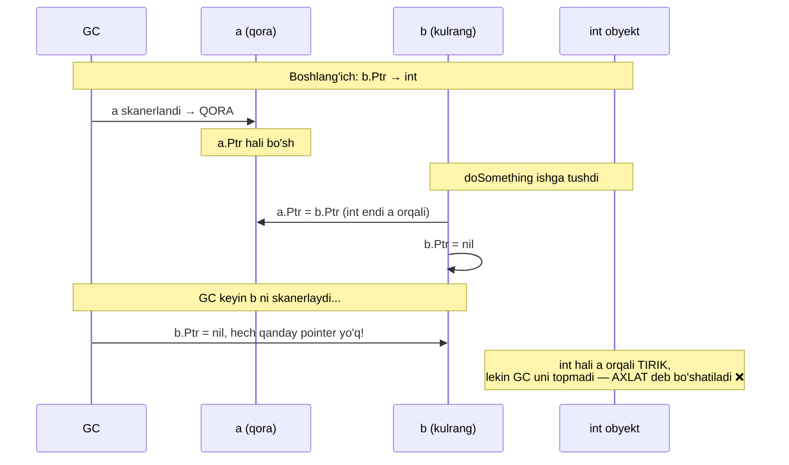

Write barrier bo'lmasa, GC bu o'zgarish sodir bo'lganini bilmaydi. U `a`ni skanerlashni allaqachon tugatgan, `b`ni skanerlaganda esa `b.Ptr` allaqachon nil. Natijada `int` obyekt dastur uchun `a.Ptr` orqali hali **tirik**, lekin GC uni topmagani uchun axlat deb bo'shatib yuborishi mumkin. Bu — **write barrier** oldini olish uchun yaratilgan aynan shu turdagi xato.

### Write Barrier — pointer yozuvlarini kuzatuvchi

**Write barrier** — kompilyator ma'lum pointer yozuvlari atrofiga qo'yadigan kichik GC bookkeeping kodi. U faqat GC marking paytida (`writeBarrier.enabled == true`) ishlaydi va heap grafiga ta'sir qiluvchi yozuvlarga tatbiq etiladi (masalan, pointer'ni heap obyektiga yoki global'ga saqlash).

Yuqoridagi misolda xavfli lahza — `b.Ptr = nil`. Write barrier buni **qayta yoziladigan eski pointer qiymatini qayd etib** hal qiladi. Go'ning hybrid barrier'ida bu **deletion** qismi: pointer slot yangilanmasidan oldin runtime eski pointer qiymatini **soyalaydi (shade)**, shunda GC bu obyektni yetib boriluvchi deb hisoblaydi, garchi `b` uni skanerlashdan oldin slot o'zgarsa ham.

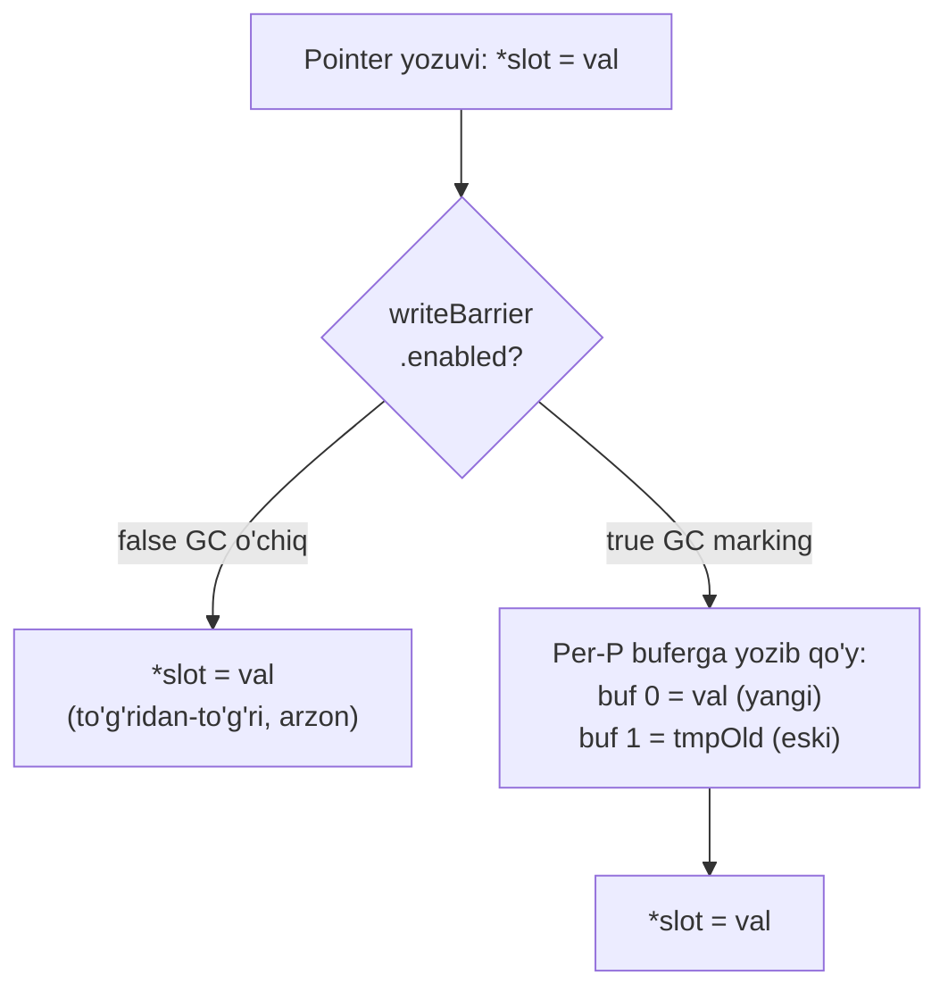

Kompilyator write barrier'ni **SSA fazasida** (5-bobdan eslang, SSA pass'lar ro'yxati bor) qo'yadi. `writebarrier` pass uchta operatsiyani himoya qiladi:

- **`OpStore`** — pointer o'z ichiga olgan qiymatni GC kuzatadigan xotiraga saqlash (`node.next = child` yoki `global = ptr`).
- **`OpMove`** — pointer maydonlari bo'lgan qiymatni ommaviy nusxalash (`*dst = *src`, struct pointerli).
- **`OpZero`** — pointer bo'lishi mumkin bo'lgan xotirani ommaviy nollashtirish (`*dst = T{}`, T pointerli).

Har bir nomzod uchun kompilyator uchta ha/yo'q savol beradi:

1. **Yoziladigan tur pointer maydoniga egami?** Agar shunchaki son yoki bayt bo'lsa — barrier kerak emas.
   ```go
   x := 42            // int yozish, pointer yo'q, barrier yo'q
   parent.val = 7     // val — int, barrier yo'q
   parent.child = kid // child — *Node, pointer bor, tekshirishda davom
   ```
2. **Manzil GC kuzatadigan xotirada joylashganmi?** Agar u local stek slot bo'lsa — barrier yo'q.
   ```go
   var local *int
   local = &g  // stek slotga yozish; stek, barrier yo'q
   ```
3. **Qayta yoziladigan slot hali eski pointerlarni saqlashi mumkinmi?** Agar xotira endigina yaratilgan/nollangan va kompilyator uni nol ekanini bilsa — yo'qotadigan eski pointer yo'q. Aks holda eski pointer bor deb faraz qilinadi.

Agar barrier kerak bo'lsa, kompilyator `OpStore`, `OpMove`, `OpZero`'ni mos ravishda `OpStoreWB`, `OpMoveWB`, `OpZeroWB`'ga qayta yozadi. `*ptr = val` uchun generatsiya qilingan kod taxminan bunday:

```go
tmpOld := *ptr  // faqat slot hali heap pointer saqlashi mumkin bo'lsa olinadi
if writeBarrier.enabled {
    buf := gcWriteBarrier2() // runtime'dan per-P buferda joy so'raydi
    buf[0] = val             // saqlanayotgan yangi pointer
    buf[1] = tmpOld          // kerak bo'lsa, qayta yoziladigan eski pointer
}
*ptr = val
```

GC o'chiq bo'lganda bu **arzon** (bayroq `false`, kod o'tib ketadi). GC yoqilganda pointer so'zlarini kichik **per-P buferga** jurnallaydi — bu shunchaki pointer o'lchamidagi qiymatlarni nusxalash, allokatsiya ham, goroutine almashinuvi ham yo'q.

`move` va `zero` uchun Go har bir pointer maydoniga alohida barrier o'rniga **bulk write barrier** ishlatadi:

```go
// OpMoveWB uchun
if writeBarrier.enabled {
    runtime.wbMove(typ, dst, src)
}
memmove(dst, src, size)

// OpZeroWB uchun
if writeBarrier.enabled {
    runtime.wbZero(typ, dst)
}
runtime.memclr(dst, size)
```

**Bufer o'lchami:** write barrier bufer **512 ta yozuv** saqlaydi. Har biri bitta `uintptr` — 64-bit tizimda jami **4 KiB**, 32-bit tizimda **2 KiB**. Ikki xil flush bor:

- **Automatic flush** — keyingi write barrier rezervatsiyasi per-P buferga sig'maganda. Dastur pointerlarni muntazam yangilaganda bu odatiy holat.
- **On-demand flush** — runtime buferlangan pointerlarni marker'ga darhol ko'rsatmoqchi bo'lganda. Masalan, GC ishchisi skanerlash uchun kulrang obyekt topolmasa, buferni flush qilib yangi ish paydo qiladi. Runtime GC faza o'tishlarida ham flush qiladi.

Bufer to'lganda runtime uni ishlaydi: har bir qayd etilgan pointerni ko'rib chiqadi, heap manzili bo'lmaganlarni tashlaydi, manzilga tegishli obyektni topadi va marklamagan bo'lsa marklaydi. Marklangan obyektlar skanerlash uchun navbatga qo'yiladi.

---

## GOGC: xotira va CPU muvozanati

### Root'lar va heap goal

Har bir GC sikli **root obyektlar to'plamidan** boshlanadi. Ko'p Go dasturida ikki root ustunlik qiladi: **goroutine steklar** va **global data segmentlar**.

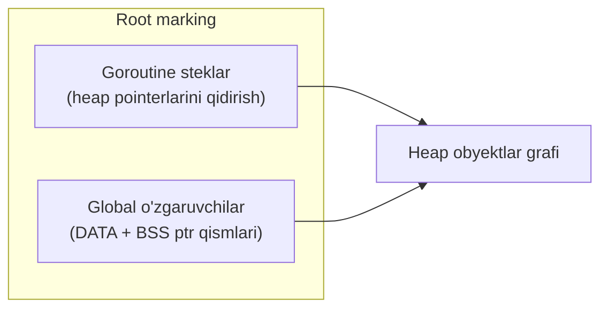

Har bir goroutine steki root marking davomida heap'ga pointerlar uchun skanerlanadi. Global o'zgaruvchilar dasturning DATA va BSS segmentlarida yashaydi va ularning pointerli qismlari ham skanerlanadi.

> **Eslatma:** goroutine steki "heap allokatsiyasi emas" deyish to'liq to'g'ri emas. Steklar bir xil global allokator (`mheap`)dan ajratilgan xotira bilan ta'minlanadi. Lekin GC kontekstida steklar GC boshqaradigan heap obyektlar grafiga **kirmaydi**. GC'ning "jonli heap"i — faqat marking oxirida yetib boriluvchi heap obyektlarning baytlari. Steklar alohida "stack span"lar bo'lib, ular jonli heap'ga sanalmaydi. GC steklarni **skanerlanadigan root** deb qaraydi, marklanadigan heap obyekt deb emas.

### Commit qadami — hisob-kitob

Marking va sweeping ketma-ket ketadi (avval marking, keyin sweeping), ikkalasi ham dastur allokatsiya qilishda davom etayotib parallel ishlaydi. Marking tugagach, runtime siklning hisobini yakunlaydi va keyingi sikl uchun pacing raqamlarini belgilaydi. Misol raqamlari bilan:

| O'zgaruvchi | Qiymat | Ma'nosi |
|---|---|---|
| `heapMarked` | 250 MiB | Sweep fazasiga omon qolgan marklangan baytlar (scan + noscan) |
| `heapLive` | 250 MiB | Jonli heap (hozir marklanganlarga teng) |
| `lastHeapScan` | 220 MiB | Skanerlangan heap baytlari (faqat pointerli qismlar, shuning uchun kichikroq) |
| `lastStackScan` | 8 MiB | Oldingi siklda skanerlangan stek baytlari |
| `globalsScan` | 4 MiB | Skanerlanadigan global data (modul init'da hisoblanadi) |

250 MiB keyingi sikl uchun **baseline** bo'ladi.

### heapGoal — deadline

Eng muhim miqdor — **heap goal (`heapGoal`)**. Buni "keyingi mark fazasi tugaganda runtime yetishni istagan heap o'lchami" deb tasavvur qiling. Bu marking **qachon tugashi kerakligining** deadline'i, qachon boshlanishi emas. Bu deadline'ni ushlash uchun runtime marking'ni **ertaroq** (kichikroq heap'da) ishga tushiradi, toki dastur allokatsiya qilishda davom etayotib concurrent marking yetib olsin.

Normal GOGC pacing rejimida (GOMEMLIMIT'siz):

```
heapGoal = heapMarked + (heapMarked + lastStackScan + globalsScan) * GOGC / 100
         = 250 MiB + (250 + 8 + 4) * 100 / 100
         = 512 MiB
```

`heapGoal` 512 MiB degani — GC heap 512 MiB ga o'sganda marking'ni tugatishga intiladi. `GOGC` sukut bo'yicha **100**. Runtime uni `GOGC` environment o'zgaruvchisidan o'qiydi; ish vaqtida `debug.SetGCPercent` bilan o'zgartirish mumkin. Kichik `GOGC` — yaqinroq finish, tez-tez GC. Katta `GOGC` — uzoqroq finish, kam GC.

### Runway va trigger point — poyezd analogiyasi

GC marking'ni **heap goal'ga yetmasidan oldin** boshlashi kerak. Poyezdga chiqishga o'xshaydi: poyezd (`heapGoal`) soat 15:00 da kelsa, siz stansiyaga 15:00 da emas, **14:00 da** jo'naysiz. 14:00 va 15:00 orasidagi vaqt — **runway** (uchish yo'lakchasi), 14:00 esa **trigger point** (ishga tushirish nuqtasi).

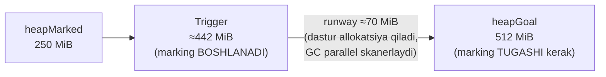

**Runway** — marking ketayotganda dastur allokatsiya qilishda davom etishi uchun qoldirilgan bayt byudjeti. Uni hisoblash uchun uchta parametr kerak:

- **`consMark`** — allokatsiya-marking tezlik nisbati (bayt/CPU-ns). Dastur qanchalik tez allokatsiya qiladi, GC qanchalik tez skanerlaydi. Misolda `consMark = 0.1` (dastur GC marking o'tkazuvchanligining 10%'ida allokatsiya qiladi).
- **`gcGoalUtilization` (U)** — concurrent marking'ga ajratiladigan CPU ulushi (GOMAXPROCS'dan). Sukut — **0.25** (GC CPU'ning chorak qismini oladi, dasturga uchdan uch qismi qoladi).
- **`expectedScan`** — keyingi mark fazasida skanerlanishi kutilgan baytlar = `lastHeapScan + lastStackScan + globalsScan`.

```
expectedScan = 220 + 8 + 4 = 232 MiB

runway = consMark * (1 - U) / U * expectedScan
       = 0.1 * (1 - 0.25) / 0.25 * 232 MiB
       = 0.1 * 3 * 232 MiB
       ≈ 70 MiB
```

Demak trigger = `heapGoal - runway` ≈ **442 MiB** (512 − 70).

### Trigger chegaralari (clamp)

GC trigger'ni juda erta yoki juda kech qo'ymaslik uchun ikki chegara qo'yadi (`heapMinimum = 4 MiB` deb faraz qilaylik):

```
triggerLowerBound = heapMarked + ((heapGoal - heapMarked) / 64) * 45
                  = 250 + ((512 - 250) / 64) * 45  ≈ 434 MiB

maxTriggerRatio   = heapMarked + ((heapGoal - heapMarked) / 64) * 61
maxTrigger        = max(maxTriggerRatio, heapGoal - heapMinimum)
                  = max(≈500 MiB, 508 MiB)  =  508 MiB

trigger = clamp(heapGoal - runway, triggerLowerBound, maxTrigger)
        = clamp(442 MiB, 434 MiB, 508 MiB)
        = 442 MiB
```

G'oya oddiy: trigger'ni juda erta ham, juda kech ham qo'yma. Pastki chegara — `heapMarked`dan `heapGoal`gacha masofaning ~70%'i. Yuqori chegara kichik heap'lar uchun ~95%, katta heap'lar uchun esa `heapGoal`ga yaqinroq (lekin kamida `heapMinimum` bayt headroom qoladi). Bizning 442 MiB chegaralar ichida, shuning uchun o'zgarmaydi.

### GOGC ta'siri va chekka holatlar

`heapGoal` biz ko'rgan har bir formulada bor. `GOGC`ni o'zgartirsangiz, keyingi siklgacha heap qancha o'sishiga ruxsat berilishini o'zgartirasiz:

- **Past `GOGC`** → kam o'sish, GC tezroq ishga tushadi → ko'proq GC sikl, ko'proq GC CPU, lekin **kamroq xotira**.
- **Yuqori `GOGC`** → ko'proq o'sish, GC kechroq → kamroq GC sikl, kamroq GC CPU, lekin **ko'proq xotira**.

Ikki chekka holat:

- **`GOGC=0`** → 0% o'sish, heap goal deyarli oxirgi jonli heap'ga teng, GC deyarli doim ishlaydi. Asosan debugging uchun.
- **`GOGC=off`** → foizga asoslangan avtomatik GC o'chadi (`debug.SetGCPercent(-1)` bilan bir xil). `runtime.GC()` bilan majburan ishga tushirish mumkin, `GOMEMLIMIT` esa `heapGoal`ni alohida cheklashi mumkin.

---

## GOMEMLIMIT

### Muammo nima edi? — GOGC nisbiy, mutlaq shift bermaydi

`GOGC` **nisbiy** qoida bilan ishlaydi: "heap'ni oxirgi jonli heap'dan foizga o'stir". Bu jonli heap tor diapazonda turganda yaxshi ishlaydi. Muammo shundaki, baseline — runtime oxirgi o'lchagan jonli heap.

Misol: dastur odatda **200 MiB** atrofida, lekin vaqti-vaqti bilan katta partiyani qayta ishlaganda **1 GiB** kerak bo'ladi. Partiya tugab GC yakunlangach, runtime 1 GiB jonli heap ko'radi. `GOGC=100` bilan endi keyingi yig'imgacha heap'ning **2 GiB**gacha o'sishiga ruxsat beradi. Ya'ni GC endi 200 MiB atrofida ushlab turishga urinmaydi — u 1 GiB'ni baseline deb qabul qiladi.

Amalda siz ikki yomon variant orasida qolasiz:

- `GOGC`ni **cho'qqi** uchun sozlash → normal ishda xotira isrof bo'ladi.
- `GOGC`ni **o'rtacha** uchun sozlash → cho'qqilarda ortiqcha GC ishi.

`GOGC` CPU'ni xotiraga almashtiradi, lekin **qat'iy shift** bermaydi. Haqiqiy byudjet uchun mutlaq limit — **`GOMEMLIMIT`** kerak.

### GOMEMLIMIT — soft byudjet

Go 1.19'dan boshlab `GOMEMLIMIT` environment o'zgaruvchisi yoki ish vaqtida `debug.SetMemoryLimit` bilan sozlanadi. Bu **yumshoq (soft), GC tomonidan qo'llanadigan** byudjet — Go runtime tomonidan xaritalangan, boshqariladigan va hali qaytarilmagan xotira uchun. U heap va boshqa runtime xotirasini o'z ichiga oladi, tashqi manbalarni (binary mapping, runtime'dan tashqari xotira) hisobga olmaydi.

Muhim nuqtalar:

- **Yumshoq, qattiq emas:** runtime Go xotirasini byudjet ostida saqlashga intiladi, lekin vaqtincha oshib ketishi mumkin.
- **Faqat runtime xotirasi:** heap, goroutine steklar, runtime metadata. Katta cgo allokatsiyalari yoki o'zingizning `mmap` mintaqalaringiz **sanalmaydi**.
- **Pacing'ni o'zgartiradi:** `GOMEMLIMIT` qo'yilganda keyingi heap goal ham limit bilan cheklanadi.

Qisqasi: `GOGC` — nisbiy CPU/xotira murosasi, `GOMEMLIMIT` — umumiy xotira byudjeti.

### Dual-goal tizimi

`GOMEMLIMIT` **ikki maqsadli** tizim yaratadi: `GOGC` bitta heap goal hisoblaydi, limit boshqasini. Runtime **kichigini** (cheklovchiroq) tanlaydi.

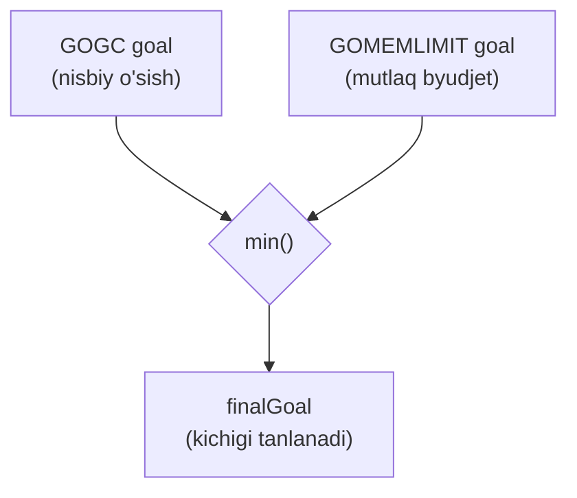

Runtime `mappedReady` — xaritalangan va hali OS'ga qaytarilmagan baytlar sonini kuzatadi. Bu `GOMEMLIMIT` bilan solishtiriladigan raqam. Misol (Ready = 680 MiB, limit = 600 MiB):

```
overage = max(mappedReady - memoryLimit, 0)
        = max(680 - 600, 0) = 80 MiB

// heap bo'lmagan xaritalangan baytlar (steklar, metadata, keshlar)
nonGCHeap = mappedReady - heapAlloc - heapFree
          = 680 - 360 - 40 = 280 MiB

gomemlimitGoal = memoryLimit - nonGCHeap - overage
               = 600 - 280 - 80 = 240 MiB

// marklangandan past bo'lmasligi uchun clamp
gomemlimitGoal = max(gomemlimitGoal, heapMarked)
               = max(240, 250) = 250 MiB

finalGoal = min(gogcGoal, gomemlimitGoal)
```

### Thrashing va GC CPU limiter

Agar yangi limit trigger nuqtasini joriy heap o'lchamidan (`heapLive`) pastga tushirsa, runtime GC'ni **darhol** boshlashi mumkin. Ya'ni tor `GOMEMLIMIT` GC'ni tez-tez ishlatib, byudjetga yaqin ushlaydi.

GC qayta-qayta ishlaganda dasturni juda sekinlashtiradi — bu holat **thrashing** deyiladi. Oldini olish uchun runtime'da **GC CPU limiter (`gcCPULimiter`)** bor. U **leaky bucket** kabi qurilgan va o'rtacha ~50% GC CPU ulushini nishonga oladi. Limiter qisqa cho'qqilarga ruxsat beradi, lekin GC juda ko'p CPU olsa — chekinadi: mutator assist'larni to'xtatadi, scavenging assist'larni ham to'xtatishi mumkin, shunda dastur `GOMEMLIMIT` byudjetidan vaqtincha oshib ketsa ham ishlashda davom etadi.

Natijada `GOMEMLIMIT`ni juda past qo'ysangiz ham, dastur odatda oldinga siljishda davom etadi. Eng yomon holatda o'tkazuvchanlik taxminan yarim tezlikkacha tushishi mumkin, chunki limiter GC ishining CPU'ni bosib olishiga yo'l qo'ymaydi.

---

## To'rtta faza — umumiy manzara

Runtime source'da faqat uchta GC faza qiymati ochilgan:

```go
var gcphase uint32
const (
    _GCoff             = iota // GC ishlamayapti; sweeping fonda, write barrier o'chiq
    _GCmark                   // root va workbuf marking: yangilar qora, write barrier YOQIQ
    _GCmarktermination        // mark termination: yangilar qora, P'lar yordamlashadi, WB YOQIQ
)
```

Lekin o'rganish qulayligi uchun **to'rt konseptual faza** ishlatamiz:

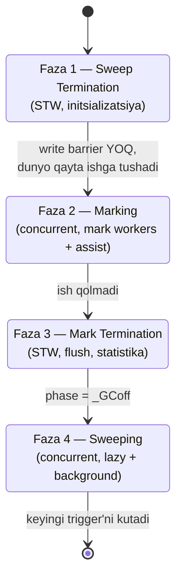

---

## Step 0: GC Triggering — qachon ishga tushadi?

GC yangi siklni bir necha usulda boshlashi mumkin:

- **Heap-based trigger:** jonli heap (`heapLive`) trigger chegarasiga (`trigger`) yetganda.
- **Time-based trigger:** oxirgi tugallangan sikldan `forcegcperiod` (sukut — **2 daqiqa**) o'tganda.
- **Cycle-based manual trigger:** `runtime.GC()` chaqirganingizda.

```go
func (t gcTrigger) test() bool {
    if !memstats.enablegc || panicking.Load() != 0 || gcphase != _GCoff {
        return false
    }
    switch t.kind {
    case gcTriggerHeap:
        trigger, _ := gcController.trigger()
        return gcController.heapLive.Load() >= trigger
    case gcTriggerTime:
        if gcController.gcPercent.Load() < 0 {
            return false // GOGC=off bo'lsa vaqt trigger'i ishlamaydi
        }
        lastgc := int64(atomic.Load64(&memstats.last_gc_nanotime))
        return lastgc != 0 && t.now-lastgc > forcegcperiod
    case gcTriggerCycle:
        return int32(t.n-work.cycles.Load()) > 0
    }
    return true
}
```

Trigger "hozir boshla" desa ham, runtime bir necha **xavfsizlik darvozasini** tekshiradi:

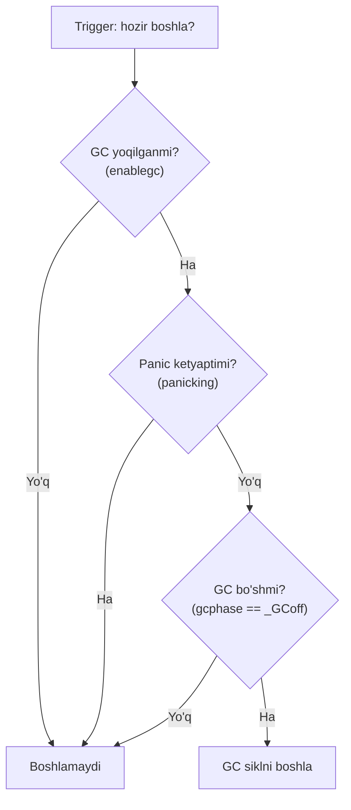

- **GC yoqilgan bo'lishi kerak** — dastlabki startup davomida init tugagunча GC o'chiq.
- **Panic yo'q** — panic ishlovi davomida runtime yangi GC ishini boshlamaydi.
- **GC bo'sh (`_GCoff`)** — joriy sikl hali marking (`_GCmark`) yoki mark termination (`_GCmarktermination`)da bo'lsa, yangi sikl boshlanmaydi.

**Muhim:** sweeping ketayotganda yangi sikl boshlanishi mumkinmi? **Ha.** Sweeping `gcphase`da alohida faza emas — sweep ishi GC bo'sh (`_GCoff`) bo'lganda ham (fon sweeper'ida va allokatsiya yo'lida) davom etadi. Trigger ishga tushsa va sweep ishi qolgan bo'lsa, runtime marking'ga o'tishdan oldin qolgan sweep'ni tugatib olishi mumkin.

---

## Faza 1: Sweep Termination — initsializatsiya

**Sweep termination** sweeping tugagan zahoti ishlamaydi — u **keyingi GC sikli boshida** ishlaydi. Bu siklning tozalash va tayyorlash qadami, marking'dan darrov oldin bajariladi — GC'ning **initsializatsiya fazasi** deb tasavvur qiling.

GC ikki rejimda boshlanishi mumkin:

- **Background mode:** odatiy holatda oldingi sikldan sweeping allaqachon tugagan (ba'zi mayda qoldiqlar bo'lishi mumkin).
- **Forced mode:** GC istalgan vaqtda ishga tushishi mumkin, sweeping tugamagan bo'lsa ham (masalan, `runtime.GC()`).

Shu sababli GC boshlanganda darhol marking'ga sakramaydi. Avval oldingi sikldan qolgan sweep ishini tugatib, toza holatdan marking'ni boshlaydi:

```go
func gcStart(trigger gcTrigger) {
    mp := acquirem()
    if gp := getg(); gp == mp.g0 || mp.locks > 1 || mp.preemptoff != "" {
        releasem(mp)
        return // xavfsiz bo'lmagan kontekstda boshlamaydi
    }
    releasem(mp)
    mp = nil
    // Sweep termination: qolgan span'larni tozala
    for trigger.test() && sweepone() != ^uintptr(0) {
    }
    // ...
}
```

Tsikl ikki shartni tekshiradi: trigger hali kuchdami (`trigger.test()`) va tozalanmagan span qoldimi (`sweepone()`). `runtime.sweepone` bir vaqtda bitta span tozalaydi va: butun span'ni bo'shatsa — qaytarilgan sahifalar sonini, span'ni tozalab lekin band qolsa — 0, tozalash uchun hech narsa yo'q bo'lsa — `^uintptr(0)` (barcha bir) qaytaradi.

### Darvozalar (latches)

Bir necha goroutine trigger'ni bir vaqtda sezishi mumkin, shuning uchun runtime faqat bittasi o'tishni boshqarishini ta'minlash uchun darvozalar ishlatadi:

- **`work.startSema`** (GC start latch) — bir vaqtda faqat bitta GC start bo'lishini ta'minlaydi. Bittasi uni oladi, trigger'ni qayta tekshiradi va davom etadi; qolganlari chekinadi.
- **`gcsema`** (GC transition latch) — GC start bilan poyga qilmasligi kerak bo'lgan operatsiyalarni bloklaydi, eng muhimi `GOMAXPROCS`ni o'zgartirishni.
- **`worldsema`** (world-stop latch) — STW pauzani boshlash huquqini beradi.

### Fon mark ishchilarini tayyorlash

Keyin runtime yetarli **background mark worker** borligiga ishonch hosil qiladi. Bu — dastur bilan parallel marking qiladigan runtime goroutine'lari. Runtime har bir scheduler processor'iga (P) bitta worker'ni maqsad qiladi, GOMAXPROCS'gacha. (Aynan shuning uchun GC start davomida `gcsema` bilan GOMAXPROCS o'zgarishi bloklanadi.)

```go
func gcBgMarkStartWorkers() {
    if gcBgMarkWorkerCount >= gomaxprocs {
        return
    }
    mp := acquirem()
    ready := make(chan struct{}, 1)
    releasem(mp)
    for gcBgMarkWorkerCount < gomaxprocs {
        mp := acquirem()
        go gcBgMarkWorker(ready)
        releasem(mp)
        <-ready
        gcBgMarkWorkerCount++
    }
}
```

Har bir worker ishga tushadi, worker pool'ga ro'yxatdan o'tadi, keyin runtime uni P'ga rejalashtirgunicha uxlaydi. Runtime shuningdek per-goroutine stek-skan holatini reset qiladi (steklar yangi siklda qayta skanerlanadi) va `mheap`dagi heap-skan holatini reset qiladi.

### STW va tozalash

Endi **dunyoni to'xtatish** vaqti keladi. Bu har bir goroutine aynan bir onda muzlashini bildirmaydi — goroutine'lar safe point'da to'xtaydi, tez to'xtamaganlari esa preempt qilinadi.

```go
func gcStart(trigger gcTrigger) {
    // ...
    var stw worldStop
    systemstack(func() {
        stw = stopTheWorldWithSema(stwGCSweepTerm)
    })
    // Concurrent skandan oldin sweep'ni tugat
    systemstack(func() {
        finishsweep_m()
    })
    clearpools()
    // ...
    gcCPULimiter.startGCTransition(true, now)
    // ...
}
```

STW davomida:

1. **`finishsweep_m()`** — `sweepone()` orqali span'larni hech narsa qolmaguncha tozalaydi. Amalda bu `mcentral`dagi unswept ro'yxatlar bo'shatilishini bildiradi. To'liq bo'sh bo'lgan span heap'ga qaytadi, band qolgani `mcentral`ning tegishli swept ro'yxatiga o'tadi. Keyin runtime scavenger'ni uyg'otadi.

2. **`clearpools()`** — pool keshlarini tozalaydi. Mashhur misol — `sync.Pool`. Shuning uchun pool yozuvini uzoq umrli obyekt deb qaramaslik kerak.
   > **`sync.Pool` victim mexanizmi:** pool reset qilinsa ham barcha obyekt darhol o'chmaydi. `sync.Pool`da **victim cache** (ikkilamchi pool) bor. Foydalanilmagan obyekt odatda yo'qolishi uchun **kamida ikki GC sikl** kerak: birinchi siklda asosiy pool'dan victim cache'ga, ikkinchi siklda victim cache'dan butunlay o'chadi.

   Shu bosqichda reset bo'ladigan yana ikki komponent:
   - **`unique` registry maps** — `unique` paketi takroriy chaqiruvlar bir xil obyektni qayta ishlatishi uchun global registry saqlaydi. U **weak reference** ishlatadi, shuning uchun obyekt yetib bo'lmaydigan bo'lsa GC uni bo'shatadi, lekin kalit cleanup pass'gacha map'da qolishi mumkin. Har bir GC sikli boshida `clearpools` cleanup hook'ni signallaydi.
   - **Central `sudog` cache va central `defer` pool** — concurrency kutish tugunlari (`sudog`) va deferred chaqiruvlar (`defer`) uchun runtime keshlari. Bu bosqichda central ro'yxatlar tashlab yuboriladi.

3. **`gcCPULimiter`** — leaky bucket counter, GC juda ko'p CPU olsa uni cheklaydi.

---

## Step 2: Marking Phase — belgilash

Marking fazasi runtime GC holatini `_GCoff`dan `_GCmark`ga o'tkazganda boshlanadi. Ayni paytda **write barrier yoqiladi**. Shundan keyin har bir pointer yozuvi kuzatiladi.

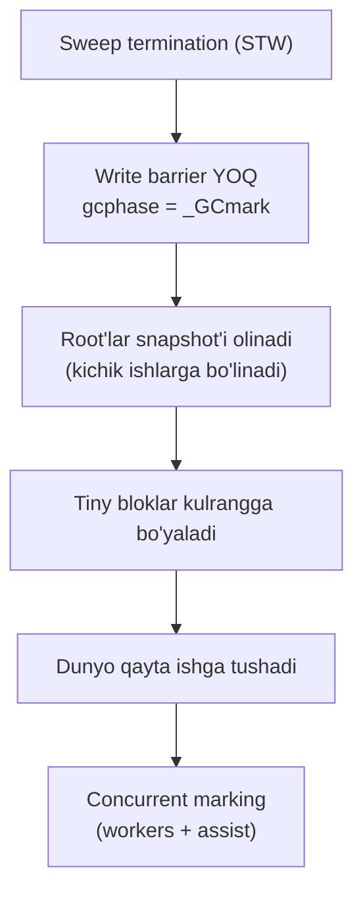

Dunyo hali to'xtagan. Qayta ishga tushganda barcha P'lar write barrier allaqachon yoqilganini ko'radi.

### Root set snapshot'i

STW davomida runtime root'larni **tez** aniqlashi kerak. U root'larni to'liq skanerlamaydi (uzoq ketardi) — uning o'rniga **snapshot** oladi, ishni kichik joblarga bo'ladi va work queue'ga qo'yadi, toki dunyo qayta ishga tushgach worker'lar ularni ishlasin.

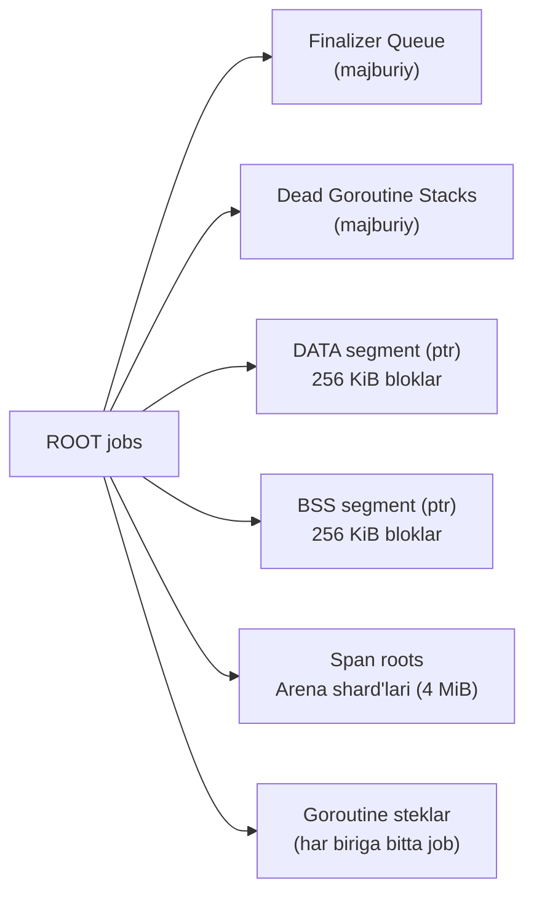

**Root toifalari:**

- **Globals (DATA va BSS):** har bir modulning DATA va BSS mintaqalari eng ko'pi **256 KiB bloklarga** bo'linadi. Masalan, 928 KiB DATA to'rt bo'lakka bo'linadi (uch 256 KiB + bitta 160 KiB). Bir xil bloklar ko'p worker'ga parallel skanerlash imkonini beradi.
  > **Modul** — jarayonda yuklangan Go image. Plugin ishlatmasangiz, bitta modul bor: asosiy dasturingiz. (Bular `go.mod` "modules"'idan farq qiladi.)

- **Maxsus yozuvlar (finalizer):** **finalizer** — obyekt yetib bo'lmaydigan bo'lgach runtime ishga tushirishi mumkin bo'lgan tozalash funksiyasi.
  ```go
  func main() {
      open := &fileHandle{name: "/tmp/demo"}
      runtime.SetFinalizer(open, func(f *fileHandle) {
          fmt.Println("closing", f.name)
      })
      open = nil
      runtime.GC() // finalizer eligible bo'lishi uchun sikl
      fmt.Println("done")
  }
  ```
  Finalizer alohida goroutine'da ishlaydi, shuning uchun `done` finalizer chiqishidan oldin chop etilishi mumkin. Muhim nozik jihat: GC finalizer record'ini root deb qaraydi va finalizatsiya qilinadigan obyekt ko'rsatgan hamma narsani skanerlaydi, lekin **obyektning o'zini marklamaydi** — aks holda obyekt abadiy tirik ko'rinardi va finalizer hech qachon ishlamasdi.

- **Span roots:** 64-bit build'da har bir arena 64 MiB, har bir sahifa 8 KiB (arenada 8192 sahifa). Runtime har arenani **16 shard'ga** (512 sahifa = 4 MiB) bo'ladi. Har bir span-root job bitta shard'ni skanerlaydi va maxsus yozuvlarga (finalizer) ega span'larni qidiradi.

- **Goroutine steklar:** har bir stek uchun bitta job. Job goroutine'ni to'xtatadi va stek diapazonini (`gp.stack.lo`dan `gp.stack.hi`gacha) skanerlaydi.

- **Ikki majburiy job:** har bir mark siklda ikkita shard'lanmagan majburiy job bor: (1) **finalizer navbatini** skanerlash (oldingi siklda finalizatsiyaga navbatga qo'yilgan obyektlarni tirik saqlash), (2) **o'lik goroutine steklarini** bo'shatib, ularni no-stack pool'ga ko'chirish.

Root job'lar 0'dan boshlab raqamlanadi. Mark worker'lar umumiy hisoblagichdan keyingi job ID'sini olib, o'sha job'ni oxirigacha bajaradi.

### Tiny bloklarni kulrangga bo'yash

Root'lar snapshot'idan keyin runtime joriy **tiny bloklarni kulrang** qiladi. [02 Heap](02_heap.md)'dan eslang: har bir per-P kesh (`mcache`) joriy tiny blokka pointer saqlaydi. Tiny blok — bitta **16-baytli** heap obyekti, tiny allokator uning ichidan ko'p mayda allokatsiya beradi. GC faqat 16-baytli backing obyektni biladi, mayda bo'laklar uchun alohida metadata yo'q.

Marking davomida yangi heap obyektlar **qora** ajratiladi. Tiny allokatsiyalar boshqacha: ular joriy tiny blokdan olinadi — bu GC allaqachon kuzatayotgan mavjud 16-baytli obyekt. Sikl davomida qilingan tiny allokatsiyalarni xavfsiz saqlash uchun runtime har P'ning joriy tiny blokini mark boshida **kulrang** qiladi (marking worklist'ga qo'yadi). Bu backing obyektni sikl davomida yangi tiny allokatsiyalar uchun ham mavjud saqlaydi. (Runtime har tiny sub-allokatsiyada metadata'ni o'zgartirmaydi, chunki tiny path — tez bump-pointer yo'li.)

### Worker rejimlari

Dunyo qayta ishga tushgach, scheduler `findRunnable()`da GC worker pool'ini tekshiradi (`gcBlackenEnabled != 0`). Worker'lar aniq P'ga bog'lanmagan — istalgan P'da ishlashi mumkin. P worker'ni olganda uchta rejimdan biriga kiradi:

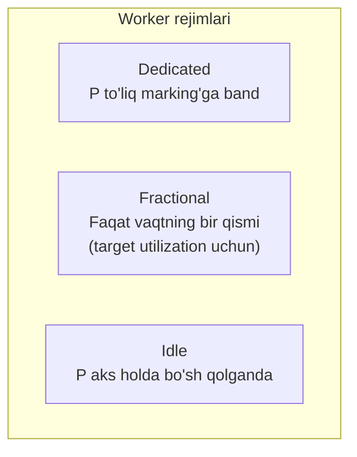

- **Dedicated:** runtime P'ni to'liq marking uchun ajratadi. Ammo P'ning local run queue'sidagi goroutine'lar shu P'da ishlay olmaydi. Ochlikdan saqlanish uchun runtime dedicated worker'ni taxminan **10 ms**dan keyin preempt qilib, local queue'ni global queue'ga surishi mumkin.
- **Fractional:** worker faqat ma'lum ulush vaqt ishlaydi (target background utilization'ni ushlash uchun). Ulushini bajargach o'zini preempt qiladi.
- **Idle:** P aks holda bo'sh qolganda ishlaydi — GC boshqacha isrof bo'ladigan CPU vaqtini ishlatadi. Idle worker'lar prioritetlanmaydi; scheduler avval oddiy goroutine qidiradi.

### Background utilization — 0.25

GC background marking uchun CPU utilization target'i bor — runtime'da qat'iy **0.25**:

```go
const gcBackgroundUtilization = 0.25 // src/runtime/mgcpacer.go
```

Ya'ni "mavjud CPU vaqtining ~25%'i background marking'ga". `GOMAXPROCS = 5` bo'lsa, target = 5 × 0.25 = **1.25 processor**'lik marking vaqti. 0.25 P'ni tom ma'noda rezerv qilib bo'lmaydi, shuning uchun runtime butun sonli dedicated worker'lar tanlaydi va qolgani fractional bilan qoplanadi.

Masalan `GOMAXPROCS = 6` → target = 1.5 P. Runtime **1 dedicated** worker ishlatadi, qolgan 0.5 P'ni barcha P'lar bo'ylab fractional vaqt sifatida tarqatadi: `(1.5 - 1) / 6 ≈ 8.3%`. Har P uchun goal ~8.3% o'tgan vaqt:

```
elapsed = now - markStartTime
run = p.gcFractionalMarkTime / elapsed <= c.fractionalUtilizationGoal
```

Agar per-P nisbat goal'dan past bo'lsa — fractional worker ishga tushadi; teng yoki yuqori bo'lsa — ishlamaydi. Fractional worker'lar target'ga yetganda darhol to'xtamaydi — target'dan ~20% o'tguncha ishlaydi, keyin o'zini preempt qiladi (churn'dan qochish uchun).

### GC Mark Assist — allokatsiya "narxi"

Concurrent marking allokatsiya tezligiga yetishi kerak. Background marking ~25% CPU olsa ham, allokatsiya cho'qqisida bu yetmasligi mumkin. Agar GC orqada qolsa, heap goal'dan oshib ketadi.

Pacer marking boshida allokatsiya uchun **"narx"** belgilaydi: "dastur har ajratgan bayt uchun qancha skanerlash ishini to'lashi kerak". Ikki birlik bor: **allocation bytes** va **scan work**. Assist narxi bularni bir-biriga aylantiradi.

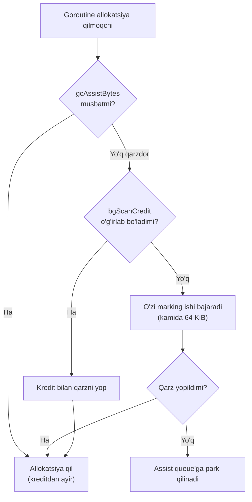

Har bir goroutine **assist credit (`gcAssistBytes`)** kuzatadi (allocation baytlarda). Kredit musbat bo'lsa, goroutine shuncha bayt qo'shimcha GC ishisiz ajratadi. Allokatsiyalar kreditdan ayiradi. Kredit **manfiy** bo'lsa — goroutine **assist qarzida**: keyingi allokatsiyadan oldin marking ishi bajarishi yoki background scan credit o'g'irlashi kerak.

Buni allokatorning asosiy funksiyasi `mallocgc`da ko'rish mumkin:

```go
func mallocgc(size uintptr, typ *_type, needzero bool) unsafe.Pointer {
    if gcphase == _GCmarktermination {
        throw("mallocgc called with gcphase == _GCmarktermination")
    }
    // ...
    assistG := deductAssistCredit(size)
    // ...
    if assistG != nil {
        assistG.gcAssistBytes -= int64(fullSize - dataSize)
    }
    return x
}
```

Masalan, qolgan heap runway 4 GiB, qolgan scan work 1 GiB bo'lsa — har 4 bayt allokatsiya uchun 1 bayt skanerlash kerak. Goroutine 16 KiB obyekt ajratsa, 4 KiB marking ishi bajaradi. Ammo aynan 4 KiB emas, **kamida 64 KiB** ishlaydi (fractional worker kabi overshoot): bu qarzni yopadi va kelajakdagi allokatsiyalar uchun oldindan to'laydi. 64 KiB skanerlash ≈ 256 KiB allokatsiya krediti; 16 KiB qarzni ayirsak ≈ 240 KiB oldindan to'lov qoladi.

> Allocation baytlari va ish birliklari orasidagi kurs — **dinamik**. GC heap'dan tez o'ssa, narx tushadi; heap GC'dan tez o'ssa, narx ko'tariladi.

### Background scan credit — o'g'irlash

Har allokatsiya qarzga tushganda darrov marking qilsa, hot path'ga latency qo'shar edi. Buning oldini olish uchun goroutine avval **kredit o'g'irlaydi**. Background worker'lar (dedicated, fractional, idle) skanerlaganda umumiy **background scan credit (`bgScanCredit`)** pool'ini to'playdi — scan work'da o'lchanadi va barcha goroutine bo'ylab bo'linadi.

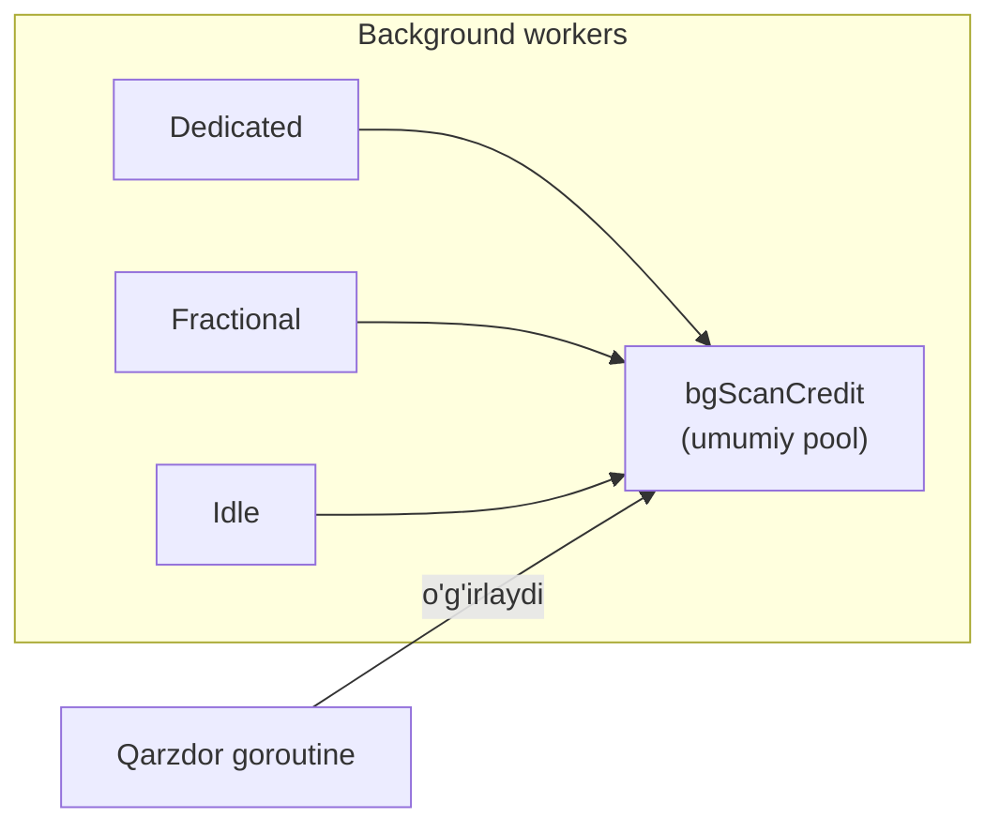

Qarzdor goroutine bu pool'dan o'g'irlab qarzini yopadi. Agar o'g'irlashdan keyin ham va o'zi ish bajarishdan keyin ham qarzini yopolmasa — **assist queue'ga park** qilinadi (heap goal'dan oshib allokatsiya qilmasligi uchun). Park qilingan goroutine ikki holatdan biri sodir bo'lguncha bloklangan qoladi:

- Background marking scan credit'ni flush qilganda, u avval park qilingan qarzni yopadi. To'liq to'lov — darhol ready; qisman — park'da qoladi va navbat oxiriga ko'chadi.
- GC mark fazasi tugaganda scheduler barcha park'langan assist'larni ready qiladi.

Goroutine musbat kredit bilan chiqsa, qolgan kreditni scan work'ga aylantirib `bgScanCredit`ga qo'yadi.

### Marking qanday ishlaydi — work buffer'lar

GC worker ikki vazifani ketma-ket bajaradi: **root-marking job'larni** va keyin **heap-marking job'larni** drenaj qilish. Kashf etilgan pointerlar worker'ning **per-P GC work cache (`p.gcw`)**ga kulrang obyektlar sifatida navbatga kiradi.

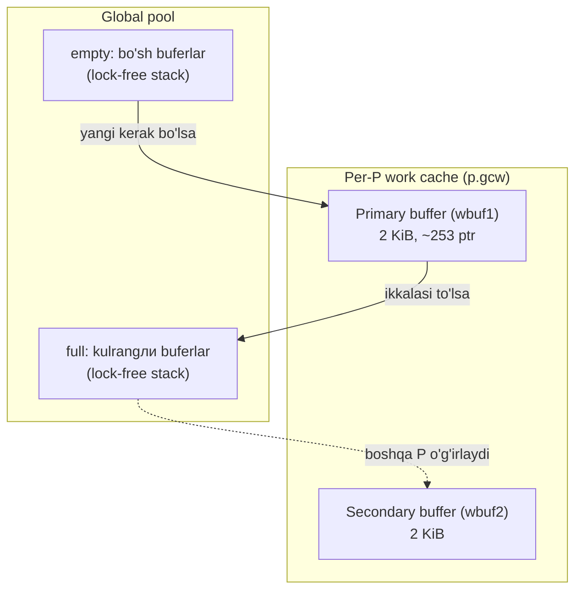

Per-P work cache'da ikki local bufer bor: **primary** va **secondary**. Worker yangi kulrang pointerlarni avval primary'ga push qiladi va primary'dan pop qiladi. Primary joyi/ishi tugaganda ikki buferni almashtiradi. Har bufer **2 KiB** — kichik header (64-bit'da 24 bayt) va qolgani 64-bit'da **253** ta kulrang pointer (`uintptr`) saqlaydi (32-bit'da 508).

Global pool ikki bufer ro'yxatini saqlaydi:

- **`full`** — kamida bitta kulrang pointerli buferlar (lock-free stack). Qisman to'lgan buferlarni ham saqlaydi, shuning uchun consumer'lar to'lishini kutmay ish topadi.
- **`empty`** — kulrang pointeri yo'q buferlar, qayta ishlatishga tayyor.

**Push qilish (yangi kulrang qo'shish):**
1. Joy bo'lsa — primary'ga (`wbuf1`) qo'shadi.
2. Primary to'lsa — primary va secondary almashadi (global holatga tegmay davom etadi).
3. Yangi primary ham to'lsa (ikkalasi to'la) — bitta to'la buferni global `full`'ga push qiladi (boshqa P o'g'irlashi uchun), `empty`'dan yangi bufer oladi.

**Pop qilish (skanerlash uchun kulrang olish):** teskari jarayon — primary bo'sh bo'lsa almashadi, ikkalasi bo'sh bo'lsa `full`'dan to'la bufer oladi. Global bufer yo'q bo'lsa, worker write barrier buferini flush qiladi (bu yangi ish yaratishi mumkin). Baribir hech narsa chiqmasa — worker haqiqatan ishsiz, 0 qaytaradi.

> Marker ishni balanslash uchun vaqti-vaqti secondary buferni (bo'sh bo'lmasa) yoki primary'ning ~yarmini global'ga chiqaradi, shunda boshqa P'lar ish ko'radi.

### Obyektni skanerlash — heap bits va oblet

Konkret misol: heap obyekt A ikki maydonli. Maydon B — skalyar ma'lumot, maydon C — bitta pointer.

```mermaid
flowchart LR
    A["Obyekt A"] --> B["B: skalyar<br/>(skanerlanmaydi)"]
    A --> C["C: pointer"]
    C --> Y["Y (target obyekt)"]
```

A allokatsiya qilinganda allokator **heap bits** (aniq GC layout)ni A tipiga qarab qayd etadi: B so'zi skalyar, C so'zi pointer deb belgilanadi. Bu bitlar span metadata'sida yashaydi. Skaner bu bitlar bilan skalyar so'zlarni o'tkazib yuborib, faqat pointer so'zlarini ko'radi.

> [02 Heap](02_heap.md)'dan eslang: span `mspan` metadata'sida ikki per-obyekt bitmap saqlaydi — `allocBits` (qaysi slotlar ajratilgan) va `gcmarkBits` (qaysi obyekt marklangan). Har arena metadata'sida esa `pageInUse` (qaysi span ajratilgan) va `pageMarks` (qaysi span'da marklangan obyekt bor) bitmaplar bor.

A marking target'iga ikki yo'l bilan aylanadi: skanerlangan root/kulrang obyekt A'ni ko'rsatsa, yoki dastur A'ga pointer saqlab, write barrier buni qayd etsa. GC A manzilini uning span'iga va span ichidagi obyekt indeksiga aylantiradi. Keyin span'ning tipiga qarab:

- **`noscan` span** (pointersiz): obyekt marklangach darhol qora — skanerlashga hech narsa yo'q.
- **Pointerli span** (`noscan` emas): GC A'ni marklaydi (`gcmarkBits`'ni set), span-mark bitini (`pageMarks`) set qiladi, keyin A'ni per-P primary buferga navbatga qo'yadi. Endi A **kulrang** — tirik, lekin hali skanerlanmagan.

> Arena bitmap'da har **sahifaga** bitta bit (span'ga emas). Faqat span'ning birinchi sahifasining biti ishlatiladi — u "bu span'da tirik obyekt bor" signalini beradi.

Keyin worker A'ni buferdan pop qiladi va skanerlaydi. A'ning heap pointer bitmap'iga qarab qaysi so'zlar pointer ekanini aniqlaydi, C maydonini o'qiydi, target obyekt Y'ni topadi va Y'ni (marklanmagan bo'lsa) kulrang qiladi. GC manba slot C'ni emas, **target manzil Y'ni** navbatga qo'yadi.

**Oblet:** juda katta obyektlarni bir vaqtda skanerlash worker'ni uzoq bloklaydi. Shuning uchun:
- **128 KiB**gacha obyektlar butunicha skanerlanadi.
- Kattaroqlari ketma-ket bo'laklarga (**oblet**, har biri eng ko'pi 128 KiB) bo'linadi. Birinchi bo'lak darhol skanerlanadi, qolganlarining boshlang'ich manzillari work queue'ga qo'shiladi.

### Write barrier nazariyasi — invariantlar

> Bu bo'lim write barrier'ning nazariyasini yoritadi. Amaliy jihatlar yuqorida ko'rilgan.

Dastur ishlab turganda marking qilish nozik. Ikki shart birga sodir bo'lsa, GC hali ishlatilayotgan obyektni yig'ib yuborishi mumkin:

1. **Qora** obyekt **oq** obyekt A'ga pointer oladi.
2. Ayni paytda A'ga har qanday **kulrang** obyektdan ketgan oxirgi yo'l o'chiriladi.

```mermaid
flowchart LR
    Black["QORA obyekt<br/>(skanerlangan)"] -->|yangi pointer| White["OQ obyekt A"]
    Grey["KULRANG obyekt"] -.->|"yo'l O'CHIRILDI ❌"| White
    style White fill:#fff,stroke:#333
    style Black fill:#333,color:#fff
    style Grey fill:#999
```

Qora obyekt allaqachon qayta ishlangani uchun GC uni qayta skanerlamaydi. Agar A'ga kulrang yo'l qolmasa, GC A'ni hech qachon topmaydi va uni noto'g'ri axlat deb hisoblaydi — garchi dastur qora obyekt orqali A'ga yeta olsa ham.

Buni oldini olish uchun ikki **tri-color invariant**dan biriga tayanadi:

- **Strong tri-color invariant:** qora obyekt oq obyektga **to'g'ridan-to'g'ri** ishora qila olmaydi. **Insertion barrier** buni yangi target'ni store'dan oldin soyalab ushlaydi.
- **Weak tri-color invariant:** qora obyekt oq obyektga ishora qilishi mumkin, **lekin faqat** o'sha oq obyekt biror kulrangdan hali yetib boriluvchi bo'lsa. **Deletion barrier** buni eski target'ni qayta yozishdan oldin soyalab ushlaydi.

**Dijkstra barrier (insertion) — strong invariant:**

```
writePointer(slot, ptr):
    shade(ptr)      // yangi target'ni store'dan oldin kulrang qil
    *slot = ptr
```

`shade(ptr)` — ptr ko'rsatgan heap obyektini topib, mark bitini set qiladi (endi oq emas) va kerak bo'lsa work queue'ga qo'yadi. Bu obyektni **kulrang** holatga o'tkazadi.

Dijkstra barrier heap tomonini xavfsiz qiladi, lekin **stek yozuvlari** bilan bo'shliq qoldiradi. Go odatda stek slot yozuvlariga barrier qo'ymaydi (ular juda tez-tez, hot path'da). Buning o'rniga Go steklarni **stack scanning** bilan boshqaradi va barrier'ni heap pointer store'lariga qo'yadi. Muammo: mark davomida dastur yangi stek→heap havolasini yaratishi mumkin va Dijkstra uni o'tkazib yuborishi mumkin. Go 1.5 buni **mark termination**da qo'shimcha stek skanerlash bilan hal qilardi — bu STW ishi edi va ko'p goroutine'li dasturlarda pauza uzayardi.

**Yuasa barrier (deletion) — weak invariant:**

```
writePointer(slot, ptr):
    shade(*slot)    // ESKI target'ni store'dan oldin kulrang qil
    *slot = ptr
```

Yuasa qoidasi: **qayta yozishdan oldin slot'dagi eski qiymatni soyala**. Agar eski target allaqachon oq bo'lmasa, bu no-op. Shunday qilib havolalar o'chirilsa ham, GC mark boshida yetib boriluvchi bo'lgan obyektlarni yo'qotmaydi. Yuasa mark oxirida heap qayta-skanini talab qilmaydi. Lekin uning ham stek bo'shlig'i bor: agar oq heap obyekt B faqat kulrang stek slot C orqali yetib boriluvchi bo'lsa va dastur C'ni tashlab yuborsa (stek yozuvi, barrier yo'q), B qora→oq qirra ostida yo'qolishi mumkin.

**Hybrid barrier — Dijkstra + Yuasa (Go 1.8):**

```mermaid
flowchart TB
    W["writePointer(slot, newPtr)"] --> Y["shade(*slot)<br/>Yuasa: eski target"]
    Y --> D["shade(newPtr)<br/>Dijkstra: yangi target<br/>(amalda har doim)"]
    D --> S["*slot = newPtr"]
```

Konseptual qoida:
```
writePointer(slot, newPtr):
    shade(*slot)             // Yuasa deletion barrier
    if current stack is grey:
        shade(newPtr)        // Dijkstra insertion barrier
    *slot = newPtr
```

Amalda fast path "stek kulrangmi?" deb shoxlanmaydi — u eski va yangi pointer'ni per-P buferga yozadi, slow path esa hammasini soyalaydi. Bu **kuchliroq** qoida (yangi pointer'ni har doim soyalaydi):
```
writePointer(slot, ptr):
    shade(*slot)    // Yuasa
    shade(ptr)      // amalda har doim
    *slot = ptr
```

Hybrid barrier'ning 5 asosiy nuqtasi:

1. Marking boshidan oldin runtime dunyoni to'xtatib barcha goroutine steklarini **snapshot** qiladi.
2. Stek skanerlash concurrent marking qismi sifatida bajariladi — dastlabki pauza qisqa qoladi.
3. GC aktiv bo'lganda (`gcphase != _GCoff`) yangi allokatsiyalar darhol **qora**.
4. Heap pointer qayta yozilganda barrier eski target'ni (`*slot`) soyalaydi — havola o'chganda obyekt yo'qolmaydi.
5. Goroutine steki hali kulrang bo'lganda heap pointer yozuvlari yangi target'ni (`ptr`) ham soyalaydi — yangi stek→heap havolasi oq obyektni yashira olmaydi.

Hybrid barrier mark oxirida stek qayta-skanini yo'q qiladi, lekin boshida steklarni snapshot qilish uchun STW hali kerak (bu arzon — har freymni oxirida skanerlashdan ko'ra).

**Yangi obyektlar qora:** `mallocgc`da GC aktivligi tekshiriladi. GC ishlayotganda har yangi allokatsiya darhol qora marklanadi:

```go
func mallocgc(size uintptr, typ *_type, needzero bool) unsafe.Pointer {
    // ...
    if gcphase != _GCoff {
        gcmarknewobject(span, uintptr(x))
    }
    // ...
}
func gcmarknewobject(span *mspan, obj uintptr) {
    objIndex := span.objIndex(obj)
    span.markBitsForIndex(objIndex).setMarked() // obyektni markla
    arena, pageIdx, pageMask := pageIndexOf(span.base())
    if arena.pageMarks[pageIdx]&pageMask == 0 {
        atomic.Or8(&arena.pageMarks[pageIdx], pageMask) // span'ni markla
    }
    gcw := &getg().m.p.ptr().gcw
    gcw.bytesMarked += uint64(span.elemsize)
}
```

---

## Step 3: Marking Termination — belgilashni yakunlash

Endi concurrent marking'damiz: GC fonda, mutator goroutine'lar ishlab turibdi. Runtime concurrent marking'ni faqat **hech qayerda marking ishi qolmaganday** ko'ringanda tugatishga urinadi:

- Barcha GC worker'lar bo'sh.
- Har bir P'da local marking ishi yo'q.
- Global marking ishi mavjud emas.

```mermaid
flowchart TB
    Check{"Marking ishi<br/>qoldimi?"} -->|Flush WB buferlar<br/>+ p.gcw'larni| Recheck{"Ish paydo<br/>bo'ldimi?"}
    Recheck -->|Ha| Back["Concurrent marking'ga qayt"]
    Recheck -->|Yo'q| STW["STW pauza"]
    STW --> Race{"Race oynasi:<br/>yangi ish paydo<br/>bo'ldimi?"}
    Race -->|Ha| Restart["Dunyoni qayta ishga tushir,<br/>qayta urin"]
    Race -->|Yo'q| Finish["Marking'ni yakunla<br/>phase = _GCoff"]
```

Bu shartlar bajarilganda runtime `_GCmarktermination`ga o'tishni boshlaydi. **Commit qilishdan oldin** avval per-P write barrier buferlarini GC work queue'ga va per-P work cache'larni global work ro'yxatiga **flush** qiladi. Bu muhim: P bo'sh ko'rinsa ham local buferda ish saqlashi mumkin. Flush yangi ish ochsa — runtime chekinadi va concurrent marking'ga qaytadi.

Mark termination **STW pauza**ni talab qiladi. Oxirgi "ish yo'q" tekshiruvi va pauzaga kirish orasida kichik race oynasi bor — mutator'lar hali write barrier orqali yangi ish yaratishi mumkin. Agar shunday bo'lsa, runtime dunyoni qayta ishga tushirib qayta urinadi.

Tekshiruv o'tsa: runtime marking'ni yakunlaydi, GC statistikasini qayd etadi, fazani `_GCoff`ga o'tkazadi (marking tugadi) va sweeping'ga tayyorlanadi. **Sweeping GC o'chiq bo'lganda ishlaydi, shuning uchun alohida `_GCSweep` fazasi yo'q.**

Bu bosqichda uch muhim xotira boshqaruvi hodisasi:

1. **Foydalanilmagan stek span'larini bo'shatish:** global small stack pool (`stackpool`) va large stack pool (`stackLarge`)dan foydalanilmagan stek span'lari heap'ning sahifa allokatoriga bo'sh sahifalar sifatida qaytariladi. ([03 Goroutine Stack](03_goroutine_stack.md)'dagi bu ikki pool'ni eslang.) Endi scavenger ularni ko'radi va OS'ga qaytarishi mumkin.

2. **Har P `mcache`ini flush:** har per-P small-object kesh central free ro'yxatlarga (`mcentral`) chiqariladi — bu span'larni sweeper ko'rishi uchun.
   ```go
   func gcMarkTermination(stw worldStop) {
       // ...
       forEachP(waitReasonFlushProcCaches, func(pp *p) {
           pp.mcache.prepareForSweep()  // mcache flush
           if pp.status == _Pidle {
               systemstack(func() {
                   lock(&mheap_.lock)
                   pp.pcache.flush(&mheap_.pages) // page cache flush
                   unlock(&mheap_.lock)
               })
           }
           pp.pinnerCache = nil
       })
   }
   ```
   Bu bosqichdagi ko'p span hali tozalanmagan (stale). `mcentral` ularni ham tozalab swept ro'yxatlarga (partial-swept, full-swept) ko'chiradi.

3. **Bo'sh P'larning `p.pcache`ini flush:** bo'sh P uzoq allokatsiya qilmasligi mumkin, uning page cache'i scavenger ko'rmaydigan bo'sh sahifalarni saqlashi mumkin. Flush ularni darhol global allokatorga va scavenger ko'rinishiga qaytaradi.

---

## Step 4: Sweeping Phase — tozalash

Sweeping'ga kirishdan oldin uch savolga javob beramiz:

1. Tozalanadigan span'lar qayerdan keladi?
2. Kim tozalaydi?
3. Go tozalashni allokatsiyadan orqada qolmasligi uchun nima qiladi?

### mcentral tuzilishi

[02 Heap](02_heap.md)'dagi central free list'ni eslang:

```go
type mcentral struct {
    _         sys.NotInHeap
    spanclass spanClass
    partial [2]spanSet // bo'sh obyektli span'lar (swept + unswept)
    full    [2]spanSet // bo'sh obyektsiz span'lar (swept + unswept)
}
```

`partial` va `full` har biri **ikki span set** saqlaydi: biri swept, biri unswept. Runtime qaysi set hozir "swept" va qaysi "unswept" ekanini **sweepgen** hisoblagichi bilan hal qiladi — har span'ni aylanib bayroq reset qilmasdan.

Span tozalangach:

```mermaid
flowchart TB
    Sweep["Span tozalandi"] --> Empty{"To'liq<br/>bo'shmi?"}
    Empty -->|Ha| Heap["Heap'ga qaytariladi"]
    Empty -->|Qisman bo'sh| Partial["partial-swept set'ga"]
    Empty -->|To'liq band| Full["full-swept set'ga"]
    Sweep --> Large{"Katta-obyekt<br/>span?"}
    Large -->|Obyekt o'lgan| Heap
    Large -->|Obyekt jonli| Full
```

### sweepgen — avlodlar mexanizmi

Sodda yo'l — har span'da `isSwept` boolean saqlash. Lekin GC takroriy sikllarda ishlaydi; boolean har sikl boshida barcha span'ni aylanib reset qilishni talab qiladi — sekin va yomon masshtablanadi.

Go tozalashni **avlodlarda** (generations) kuzatadi. `sweepgen` — "bu tozalash raundi qaysi" degan hisoblagich. `mcentral` har ro'yxat uchun ikki `spanSet` slot saqlaydi, `sweepgen` esa qaysi slot unswept, qaysi swept ekanini hal qiladi:

```go
func (c *mcentral) partialUnswept(sweepgen uint32) *spanSet {
    return &c.partial[1-sweepgen/2%2]
}
func (c *mcentral) partialSwept(sweepgen uint32) *spanSet {
    return &c.partial[sweepgen/2%2]
}
```

Runtime yangi sweep avlodi boshlanganda global `sweepgen`ni **+2** ga oshiradi. Bu flip qaysi massiv slot "unswept" va qaysi "swept" ekanini almashtiradi — barcha span'ni aylanib per-span bayroq qayta yozmasdan.

Har `mspan` o'z sweep holatini `s.sweepgen`da saqlaydi. Global `heap.sweepgen`ga nisbatan **besh holat** bor:

| Holat | Shart |
|---|---|
| Tozalanishi kerak | `s.sweepgen == heap.sweepgen - 2` |
| Tozalanmoqda (sweeper egallagan) | `s.sweepgen == heap.sweepgen - 1` |
| Tozalangan va tayyor | `s.sweepgen == heap.sweepgen` |
| Sweep boshlanishidan oldin keshlangan (stale) | `s.sweepgen == heap.sweepgen + 1` |
| Tozalanib keyin keshlangan | `s.sweepgen == heap.sweepgen + 3` |

**Misol:** `sweepgen = 8`, span'lar shu avlod uchun tozalangan. `mcentral`dagi span'lar `s.sweepgen = 8` (tozalangan), `mcache`dagilar `s.sweepgen = 11` (tozalanib keshlangan, 8+3). Endi sweeping boshlanadi va `sweepgen`ni **10** ga oshiradi:

- `mcentral`dagi `s.sweepgen = 8` span → endi `heap.sweepgen - 2`, tozalanishi kerak.
- Keshdagi `s.sweepgen = 11` → endi `heap.sweepgen + 1`, stale keshlangan, `mcentral`ga qaytganda tozalanadi.
- Flip'dan keyin allokatsiya qilingan span `s.sweepgen = 10` (= `heap.sweepgen`), allaqachon tozalangan.

Sweeper tozalanishi kerak span'ni topib (`heap.sweepgen - 2`), atomik ravishda egallaydi (`heap.sweepgen - 1` qilib), tozalaydi, keyin `heap.sweepgen` qiladi — shu avlodda qayta tozalanmaydi.

### Kim tozalaydi — background va on-demand

Marking kabi sweeping ham ikki manbadan keladi: **background sweeper** va allokatsiya qilayotgan goroutine'lar **on-demand** sweeping.

Runtime init tugagach background sweeper'ni ishga tushiradi:

```go
func gcenable() {
    c := make(chan int, 2)
    go bgsweep(c)      // background sweeper
    go bgscavenge(c)   // background scavenger
    <-c
    <-c
    memstats.enablegc = true
}
```

Bu worker ishga tushib darhol o'zini park qiladi. Sweep ishi bo'lganda ishlaydi va dastur bilan aралашmaslikка urinadi: dastur band bo'lsa scheduler'ga yield qiladi, bo'sh CPU bo'lsa davom etadi. Eski implementatsiyada har span'dan keyin `Gosched` chaqirilardi, lekin bitta span'ni tozalash juda tez (o'nlab ns), shuning uchun bu ortiqcha overhead edi. Bugun **batch**'da tozalaydi: **10 span** (`sweepBatchSize`) ketma-ket, keyin yield.

**On-demand sweeper'lar:** sweeping davom etayotganda allokatsiya qilayotgan goroutine'lar sweep ishi bajarishi mumkin — ikki joyda:

- Per-P kesh (`mcache`) `mcentral`dan yangi span olganda. Runtime span baytlariga qarab sweep ishi yuklaydi.
- Goroutine katta obyekt ajratganda (kichik-obyekt keshlarini chetlab). Runtime sahifalarni baytga aylantirib qancha sweep ishi yuklashni hisoblaydi.

`n` bayt ajratish uchun goroutine `m` sahifalik sweep "to'lashi" mumkin. Runtime moving ratio hisoblaydi:

```
sweepPagesPerByte = sweepDistancePages / heapDistance
```

- `sweepDistancePages` — hali tozalanishi kerak span sahifalari soni.
- `heapDistance` — keyingi GC trigger'gacha heap qancha o'sishi mumkin (bayt byudjeti).
- Bo'linma — "har ajratilgan bayt uchun necha sahifa sweep".

Bu ratio sweeping'ni heap keyingi trigger'ga yetishidan oldin tugashiga sozlaydi. (Bu yerda "sahifa" — bir sahifalik sweep ishi, bo'shatilishi kafolatlangan sahifa emas.)

### Span reclaimer — butun span'ni tez qaytarish

Yuqoridagi tozalash **obyekt** darajasida (span ichidagi marklanmagan obyektlarni bo'shatadi). U butun span'ni yon ta'sir sifatida bo'shatishi mumkin, lekin bunga optimallashtirilmagan. Katta allokatsiya uchun "yetarli sahifa bo'shatguncha tozala" ko'p mayda span'ni kavlashni talab qilib sekin bo'lishi mumkin.

Buni hal qilish uchun Go **span reclaimer (`mheap.reclaim`)**ga ega. U obyektlarni birma-bir ko'rish o'rniga per-arena bitmap'larni skanerlaydi va marklangan obyekti yo'q span'larni qidiradi:

```mermaid
flowchart LR
    PIU["pageInUse<br/>(span ajratilganmi?)"] --> Cmp{"Band, lekin<br/>mark biti bo'sh?"}
    PM["pageMarks<br/>(span'da tirik obyekt bormi?)"] --> Cmp
    Cmp -->|Ha| Free["Span'da tirik obyekt yo'q<br/>→ butun span'ni heap'ga qaytar"]
    Cmp -->|Yo'q| Keep["Span'da tirik obyekt bor<br/>→ saqla"]
```

Marking davomida runtime span'ning boshlang'ich sahifasi uchun `pageMarks` bitini set qiladi ("bu span'da tirik obyekt bor"). Sweeping davomida span reclaimer `pageInUse` va `pageMarks`ni birlashtiradi: span band, lekin mark biti bo'sh bo'lsa — span'da marklangan obyekt yo'q, uni butunicha heap'ga qaytarsa bo'ladi.

**Xulosa:** *object reclaimer* qisman jonli span'larni small-object allokatsiya uchun bo'sh slotlarga aylantirishga zo'r, *span reclaimer* esa butun span'larni tez qaytarib sahifa allokatorini to'ldirishga (katta allokatsiyalar uchun) fokuslangan.

### Sweeping mexanizmi — ikki bitmap'ni kelishtirish

Sweeping'ning asosiy vazifasi — allokatsiya va marking qismlaridan ikki per-span bitmap'ni kelishtirish:

- **`gcmarkBits`** — bu GC siklida jonli deb topilgan obyektlar.
- **`allocBits`** — hozirda ajratilgan obyekt slotlari (allokator nuqtai nazaridan).

```mermaid
flowchart TB
    Slot["Har obyekt slotini ko'r"] --> Cmp{"allocBits vs<br/>gcmarkBits"}
    Cmp -->|"Ajratilgan + marklanmagan"| Free["Slotni bo'shat"]
    Cmp -->|"Ajratilgan + marklangan"| Keep["Slotni saqla"]
    Cmp -->|"Hech qachon ajratilmagan"| Nothing["Harakat yo'q"]
```

Sweeper har span'dagi obyekt slotini ko'rib chiqadi va bu ikki ko'rinishni solishtiradi. Tozalashdan keyin allokator ko'rinishi omon qolganlarga mos qayta quriladi: runtime qancha obyekt ajratilgan qolganini qayta hisoblaydi, ichki kursorlarni reset qiladi, `allocBits`ni bu siklning `gcmarkBits`i bilan almashtiradi va keyingi sikl uchun toza `gcmarkBits` yaratadi:

```go
allocBits = gcmarkBits  // omon qolganlar endi "ajratilgan"
gcmarkBits = empty      // keyingi sikl uchun toza bitmap
```

Span tozalangach heap'ga qaytadi (to'liq bo'sh bo'lsa) yoki `mcentral`ning tegishli swept ro'yxatiga o'tadi. Bir istisno: `mcache` `mcentral`dan unswept span olganda, uni avval tozalab, keyin allokatsiya uchun saqlaydi — egalik to'g'ridan-to'g'ri `mcache`ga o'tadi (yana bir on-demand sweeping shakli).

---

## Eslab qol

- **Tracing GC, reference counting emas.** Go root'lardan (steklar + globallar) yetib boriluvchi hamma narsani topadi. Reference cycle muammosi yo'q.
- **To'rt xususiyat:** precise (pointer'ni aniq biladi), concurrent (parallel), non-generational (yosh/qari farqlamaydi), non-compacting (obyektni ko'chirmaydi).
- **Marking > Sweeping** narx bo'yicha. Marking CPU'ni yeydi, sweeping bandwidth'ga bog'liq va fonda ketadi.
- **Tri-color:** oq (topilmagan) → kulrang (topilgan, skanerlanmagan, to-do) → qora (skanerlangan). Marking kulrang qolmaganda tugaydi.
- **Write barrier** parallel marking'ni to'g'ri qiladi. **Hybrid** = Yuasa (eski target'ni soyala) + Dijkstra (yangi target'ni soyala). Bu mark termination'da stek qayta-skanini yo'q qiladi.
- **`GOGC`** — nisbiy tutqich: `heapGoal = heapMarked + (heapMarked + stack + globals) * GOGC/100`. Marking `heapGoal`ga yetmasdan (runway masofasi) oldin ishga tushadi.
- **`GOMEMLIMIT`** — mutlaq soft byudjet. `finalGoal = min(gogcGoal, gomemlimitGoal)`. Thrashing'dan `gcCPULimiter` himoya qiladi.
- **To'rt faza:** sweep termination (STW init) → marking (concurrent) → mark termination (STW flush) → sweeping (concurrent lazy). Faqat ikki qisqa STW.
- **Yangi obyektlar mark davomida qora** ajratiladi — qayta qidirilmaydi.
- **sweepgen +2 flip** boolean reset o'rniga span holatlarini bir zumda qayta talqin qiladi.

---

## Tez-tez uchraydigan xatolar

- **"GC dasturimni to'xtatadi" deb o'ylash.** Zamonaviy Go GC'sida faqat ikki qisqa STW bor (sweep termination va mark termination). Ishning aksariyati parallel.
- **`runtime.GC()`ni production'da chaqirish.** Bu majburiy to'liq sikl — pacer'ni chalg'itadi va latency oshiradi. Faqat test/benchmark yoki maxsus holatlarda.
- **`sync.Pool`ni uzoq umrli kesh deb ishlatish.** Pool GC chegaralarida tozalanadi (victim mexanizmi bilan ~2 sikl). Uni faqat tez-tez qayta ishlatiladigan qisqa umrli obyektlar uchun ishlating.
- **`GOGC`ni cho'qqi uchun sozlab xotira isrof qilish.** Spiky workload'da `GOMEMLIMIT` to'g'riroq — u mutlaq shift beradi.
- **`GOMEMLIMIT`ni juda past qo'yish.** Bu thrashing'ga olib keladi; `gcCPULimiter` dasturni to'xtatmasa ham, o'tkazuvchanlik ~yarim tezlikgacha tushishi mumkin.
- **`for {}` tight loop.** Go 1.14 gacha bu STW'ni bloklardi. Endi async preemption bor, lekin baribir bunday loop'lardan qochish yaxshi.
- **Finalizer'ga tayanish.** Finalizer alohida goroutine'da, kechikib ishlaydi va kafolatlanmagan — resurs yopish uchun `defer` ishlating.

---

## Amaliyot

1. **GC'ni kuzatish.** Quyidagi dasturni `GODEBUG=gctrace=1 go run main.go` bilan ishga tushiring va har GC siklidagi `heapGoal`, marking vaqti, STW pauzalarni tahlil qiling:
   ```go
   package main
   func main() {
       var s [][]byte
       for i := 0; i < 100; i++ {
           s = append(s, make([]byte, 1<<20)) // 1 MiB
           if i%10 == 0 { s = s[:0] } // ba'zilarini tashla
       }
   }
   ```

2. **`GOGC` ta'sirini o'lchash.** Yuqoridagi dasturni `GOGC=50`, `GOGC=100`, `GOGC=400` bilan ishga tushiring. GC sikllar soni va umumiy xotira qanday o'zgaradi? Nima uchun?

3. **`GOMEMLIMIT` sinash.** Spiky workload yozing (odatda 50 MiB, ba'zan 500 MiB). `GOMEMLIMIT=200MiB` qo'yib, `GOGC=off` bilan birlashtiring. `debug.ReadGCStats` bilan natijani kuzating.

4. **Write barrier'ni ko'rish.** Pointer maydonli struct'ga qiymat saqlaydigan funksiya yozing va `go build -gcflags="-m"` bilan kompilyator qayerda write barrier qo'yayotganini toping. Keyin `int` maydonli variant bilan solishtiring — farqni tushuntiring.

5. **Fikrlash mashqi.** `doSomething(a, b)` misolida (`a.Ptr = b.Ptr; b.Ptr = nil`) hybrid barrier'ning qaysi qismi (Yuasa yoki Dijkstra) `int` obyektni saqlab qoladi? Nima uchun?

---

[← 04 Escape Analysis](04_escape_analysis.md) | [Keyingi: 06 Xulosa →](06_summary.md)
