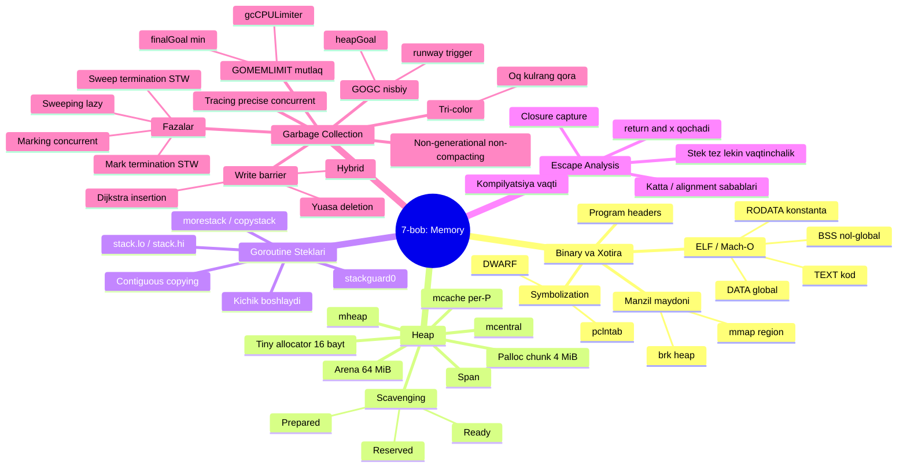
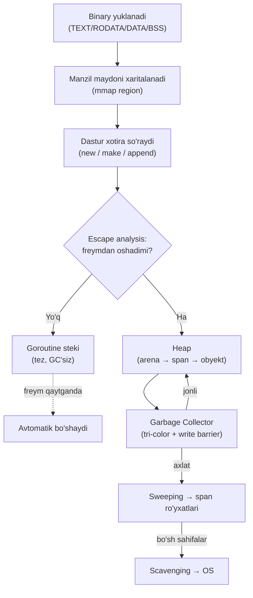

# 06 — Xulosa (Summary)

> **The Anatomy of Go** (Phuong Le) — 7-bob "Memory" ning umumiy xulosasi.
> Bu bo'lim butun bobni bir joyga bog'laydi. Har bir mavzu bo'yicha eng muhim fikrlar punktlarda, oxirida esa bobni umumlashtiruvchi katta konsept xaritasi.

[← 05 Garbage Collection](05_garbage_collection.md) | [Keyingi: 07 Manbalar →](07_references.md)

---

## Nima uchun bu xulosa muhim?

7-bob Go dasturingizning xotira bilan bog'liq **butun hayotiy siklini** past darajada ochib beradi: binary diskdan yuklanishidan (TEXT/RODATA/DATA/BSS), heap qanday tashkil etilishigacha (arena → span → obyekt), goroutine steklari qanday o'sishigacha, kompilyator qiymatni stek yoki heap'ga qayerga qo'yishini qanday hal qilishigacha (escape analysis), va nihoyat GC keraksiz xotirani qanday qaytarishigacha.

Bu bo'limlar zanjir kabi bog'langan — biri ikkinchisisiz to'liq tushunilmaydi. Xulosa shu zanjirni yaxlit ko'rsatadi.

---

## Binary va Xotira (Binary & Memory)

- **ELF (Linux) yoki Mach-O (macOS)** bajariladigan fayl kodni va ma'lumotni bo'limlarda (section) saqlaydi:
  - `TEXT` — mashina kodi
  - `RODATA` — konstantalar va tip metadata'si (faqat o'qish uchun)
  - `DATA` — initsializatsiya qilingan global o'zgaruvchilar
  - `BSS` — nol bilan initsializatsiya qilingan globallar (faylda joy egallamaydi)
- **Linker** dasturga sarlavhalar (program headers) yozadi — bular kernel'ga bu bo'limlarni virtual xotiraning qayeriga va qanday ruxsatlar (read/write/execute) bilan joylashtirishni aytadi. `exec` vaqtida loader bu mintaqalarni jarayon manzil maydoniga xaritalaydi.
- **Manzil maydoni tartibi barqaror:** kod va faqat o'qish ma'lumoti pastda, yoziladigan ma'lumot va BSS yuqorida. Ular ustida tarixiy `brk` heap, undan ham yuqorida foydalanuvchi maydonining ko'pini egallaydigan `mmap` mintaqasi.
- **Go heap'i `mmap` mintaqasida:** Go OS rezervatsiyalari (`sysReserve`) bilan katta virtual manzil maydonini oldindan zaxira qiladi, keyin fizik xotirani **talab bo'yicha** (`sysMap`, `sysUsed`) xaritalaydi. Bo'sh sahifalarni OS'ga `sysUnused` orqali qaytarishi mumkin.
- **Goroutine steklari** shu runtime mintaqasidan ajratilgan stack span'lardan (`spanAllocStack`) keladi. Asosiy ip esa alohida OS system stack'iga ega (`m0.g0.stack`).
- **Symbolization** manzillarni manba kodiga bog'laydi: stack trace uchun runtime `.gopclntab`dagi PC-to-line jadvalini (`pclntable`) ishlatadi. DWARF debug ma'lumoti (bo'lsa) debugger va profiler uchun boyroq metadata beradi.

---

## Heap

- **Go heap'i fiksatsiyalangan o'lchamli arena'larda zaxiralanadi** — ko'p 64-bit tizimda **64 MiB** (Windows va 32-bit'da kichikroq). Runtime butun manzil maydoni uchun siyrak (sparse) arena jadvali saqlaydi; yozuvlar boshda bo'sh, yangi arena kerak bo'lganda dangasa (lazy) to'ldiriladi (odatda `PROT_NONE` faulting rezervatsiya sifatida).
- Bu jarayonga ulkan **virtual** heap tutish imkonini beradi, fizik xotira uchun esa faqat kerak bo'lganda to'laydi.
- **Arena ichida** sahifa allokatori 8 KiB runtime sahifalarni boshqaradi va ularni **4 MiB palloc chunk**larida xulosalaydi. Chunk summary'lari runtime'ga bo'sh sahifalar qayerda ekanining tez "xaritasini" beradi va scavenger'ga skanerlash uchun qulay birlik beradi.
- **Ierarxiya:** obyekt → span → palloc chunk → arena.
- Ilova'ga berilgan xotira **span**lar sifatida tashkil etilgan (bitta obyekt o'lchamiga bag'ishlangan uzluksiz sahifalar). Har P bitta faol span/span-class bilan **`mcache`** saqlaydi — shuning uchun ko'p kichik allokatsiya oddiy pointer-bump, lock'siz.
- Span to'lganda `mcentral`ga qaytadi va boshqa qisman bo'sh span olinadi; to'liq bo'sh span'lar oxir-oqibat heap'ga oqib qaytadi. Kichik-obyekt chegarasidan katta so'rovlar sahifa allokatoridan to'g'ridan-to'g'ri span oladi.
- **Scavenging** bo'sh xotirani OS'ga qaytarib RSS'ni kamaytiradi, lekin manzil maydonini bermaydi. Sahifalar **Reserved → Prepared → Ready** holatlaridan o'tadi.
- **Tiny allocator:** 16 baytdan kichik pointersiz qiymatlar uchun runtime ko'p so'rovni bitta 16-baytli **tiny blok**ka birlashtiradi (`mcache`da) — mayda allokatsiyaga to'liq slot bag'ishlash isrofidan qochadi.

---

## Goroutine Steklari (Goroutine Stacks)

- **Steklar `mmap` mintaqasida**, runtime boshqaradigan stek xotirasi sifatida — GC boshqaradigan heap'dan **alohida**. Har goroutine'ning stek diapazoni bor: past chegara (`stack.lo`) va yuqori chegara (`stack.hi`).
- **Yangi goroutine kichik stek bilan boshlanadi.** Chuqurroq funksiyalar chaqirilib ko'proq joy kerak bo'lganda, runtime **kattaroq** stek ajratadi, eski stekning jonli qismini yangi joyga **nusxalaydi**, stekka ishora qiluvchi pointerlarni sozlaydi va yangi stekda bajarishni davom ettiradi.
- **Copying dizayn:** eski Go versiyalari **segmented** steklar ishlatardi; bugun Go stekni kattaroq uzluksiz blokka nusxalab o'stiradi (contiguous). Bu bitta chiziqli stek illyuziyasini saqlaydi va odatiy holatda allokatsiya bosimini past ushlaydi.
- **Xavfsizlik:** stek pastidagi guard mintaqasi va kompilyator qo'shgan prologue tekshiruvi. Har funksiya joriy stek pointer'ni stack guard (`gp.stackguard0` = `stack.lo + stackGuard`) bilan solishtiradi. Tekshiruv o'tmasa, funksiya `morestack` chaqiradi → `newstack` → `copystack` orqali stek o'sadi.
- Kichik freymlar eng arzon tekshiruvni ishlatadi; kattaroqlari konservativroq; juda katta freymlar tekshiruvni o'tkazib yuborib doim `morestack` chaqiradi.

---

## Escape Analysis

- **Kompilyatsiya vaqtidagi qaror:** kompilyator qiymatni stek'ga yoki heap'ga qayerga qo'yishni hal qiladi. Maqsad: stek xotirasi tez, lekin stek freymi vaqtinchalik — kompilyator stek qiymatiga pointer o'sha freymdan **oshib ketishiga** yo'l qo'ymasligi kerak.
- **Konservativ tahlil:** kompilyator manzillar funksiya ichida qanday oqishini kuzatadi. Qiymat yaratilgan freym ichida qolishini va uzoq umrli hech joy unga pointer saqlamasligini **isbotlay olsa** — qiymat stek'da qoladi. Isbotlay olmasa — xavfsizlik uchun heap'ni tanlaydi.
- **"Escape" naqshlari:**
  - manzilni qaytarish: `return &x`
  - manzilni heap obyektiga saqlash
  - keyinroq ishga tushishi mumkin bo'lgan **closure**da o'zgaruvchini qamrab olish
- **Escape yagona sabab emas:** qiymat heap'ga tushishi mumkin, chunki u stek uchun **juda katta**, noodatiy tekislash (alignment) talab qiladi yoki o'lchami kompilyatsiya vaqtida noma'lum (non-constant).
- **Natija:** manzili freymdan chiqmaydigan qiymatlar stek'da qoladi (GC'ga bosim yo'q, tez), manzili uzoq umrli joyga oqadigan qiymatlar heap'ga qochadi. Bularning barchasi manba kodida qo'lda annotatsiyasiz avtomatik bajariladi.

---

## Garbage Collection

- **Go yig'uvchisi concurrent, non-generational, non-compacting.** U **tri-color marking** bilan jonli xotirani dastur ishlab turganda kashf etadi. Har GC siklda ikki qisqa STW pauza bor (marking'ni sozlash va yakunlash uchun), lekin ishning aksariyati parallel: marking hali yetib boriluvchi narsalarni topadi, keyin sweeping yetib bo'lmaydiganlarni qaytaradi.
- **Tri-color:** obyektlar uch rangga bo'linadi — **oq** (hali tirik deb isbotlanmagan), **kulrang** (yetib boriluvchi, lekin skanerlanmagan), **qora** (yetib boriluvchi va to'liq skanerlangan).
- **Write barrier** dastur pointerlarni o'zgartirganda GC ko'rinishini izchil saqlaydi. Go **hybrid write barrier** ishlatadi: heap slot qayta yozilishidan oldin **eski** pointer'ni soyalaydi (Yuasa) va saqlanayotgan **yangi** pointer'ni ham soyalaydi (Dijkstra). Bu marking oxirida to'liq stek qayta-skanini kerak qilmaydi.
- **Ikki tutqich bilan muvozanat:**
  - **`GOGC`** (nisbiy): keyingi heap goal'ni oxirgi jonli heap'dan foizli o'sish sifatida belgilaydi. Pacer heap goal'ga yetishini kutmaydi — **ertaroq** boshlaydi va marking heap goal atrofida tugashi uchun bayt **runway** qoldiradi.
  - **`GOMEMLIMIT`** (mutlaq): runtime boshqaradigan umumiy xotiraga yumshoq shift beradi va xotira bosimida controller'ni kichikroq goal tanlashga majbur qiladi.
- **Ish taqsimlangan:** background workers (dedicated/fractional/idle), per-P keshlar va assisted allokatsiya bo'ylab. Worker'lar kulrang to'plamlarni local buferlardan drenaj qiladi (global pool'lar bilan). Allokatsiya marking'dan tez ketsa, goroutine'lar proportsional **assist** bilan "to'laydi", shunda progress bog'langan qoladi.
- **Sweeping** o'lik slotlarni span ro'yxatlariga qaytaradi va bo'sh sahifalarni **scavenge** qilib OS'ga qaytaradi — RSS'ni nazoratda ushlaydi, virtual heap'ni esa kelajakdagi o'sish uchun saqlaydi.

---

## Butun bobning konsept xaritasi

---

## Butun jarayon — bir qarashda

---

## Bir jumlada — har bir bo'lim

| Bo'lim | Bir jumlada |
|---|---|
| **Binary & Memory** | Kod va ma'lumot bo'limlarga bo'linadi, loader ularni virtual xotiraga xaritalaydi, Go heap'i `mmap` mintaqasida yashaydi. |
| **Heap** | Xotira arena → palloc → span → obyekt ierarxiyasida, per-P `mcache` bilan lock'siz tez kichik allokatsiya. |
| **Goroutine Stacks** | Steklar kichik boshlaydi va kerak bo'lganda kattaroq uzluksiz blokka nusxalab o'sadi. |
| **Escape Analysis** | Kompilyator qiymatni stek'ga (tez) yoki heap'ga (xavfsiz) qayerga qo'yishni isbotlash orqali hal qiladi. |
| **Garbage Collection** | Concurrent tri-color marking + hybrid write barrier keraksiz heap xotirasini qisqa STW bilan qaytaradi; `GOGC`/`GOMEMLIMIT` muvozanatni sozlaydi. |

---

[← 05 Garbage Collection](05_garbage_collection.md) | [Keyingi: 07 Manbalar →](07_references.md)
