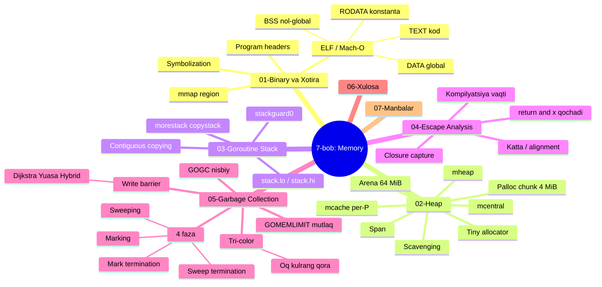
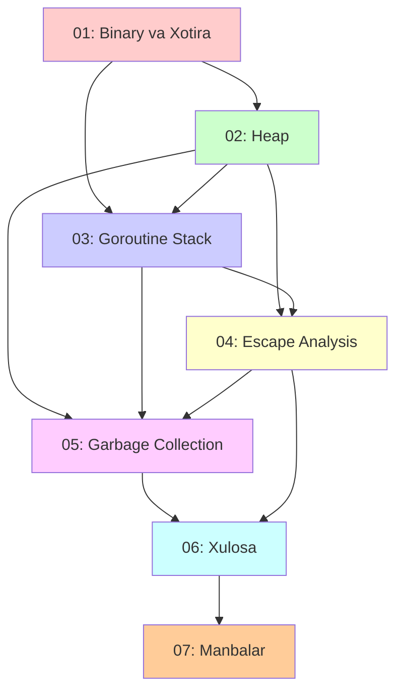

# 7-bob: Memory (Xotira)

> **The Anatomy of Go** kitobining 7-bobi — o'zbek tilidagi to'liq o'quv qo'llanma.
> Bu materiallar asl kitobning so'zma-so'z tarjimasi emas, balki o'qilib tushunilgandan keyin **o'z so'zlarim bilan qayta tushuntirilgan** versiyasi.

## Bob haqida

Bu bob Go dasturingizning xotira bilan bog'liq **butun hayotiy siklini** past darajada — binary tuzilishi, virtual xotira, allokator, goroutine steklari, kompilyator qarorlari va garbage collector darajasida o'rgatadi. Ya'ni: **binary diskda qanday saqlanadi**, **heap qanday tashkil etilgan**, **goroutine steki qanday o'sadi**, **kompilyator qiymatni qayerga qo'yadi**, va **GC keraksiz xotirani qanday qaytaradi**.

Bobni o'qib chiqib, siz quyidagi savollarga javob bera olasiz:

- Bajariladigan fayl (ELF/Mach-O) qanday bo'limlardan iborat? `TEXT`, `RODATA`, `DATA`, `BSS` nima?
- Go heap'i xotirada qayerda yashaydi? Nega `brk` emas, `mmap`?
- Arena, palloc chunk, span, obyekt — bular qanday ierarxiya hosil qiladi?
- Nima uchun kichik allokatsiyalar lock'siz va tez? (`mcache` per-P)
- Goroutine steki qanday o'sadi — segmented'mi yoki contiguous? `morestack` qachon chaqiriladi?
- Kompilyator qiymatni stek yoki heap'ga qayerga qo'yishni qanday hal qiladi? (escape analysis)
- `return &x` nima uchun heap'ga qochadi?
- Go GC qanday ishlaydi — u dasturimni to'xtatadimi? (tri-color, concurrent)
- Write barrier nima uchun kerak va hybrid barrier qanday ishlaydi?
- `GOGC` va `GOMEMLIMIT` orasidagi farq nima? Qachon qaysi birini ishlataman?
- GC qachon ishga tushadi va uning to'rt fazasi qanday?

## Mundarija

| # | Mavzu | Asosiy tushunchalar |
|---|-------|---------------------|
| [01](01_binary_memory.md) | **Binary va Xotira** | ELF/Mach-O, `TEXT`/`RODATA`/`DATA`/`BSS`, program headers, symbolization |
| [02](02_heap.md) | **Heap** | Virtual memory, arena/palloc/span, `mcache`/`mcentral`/`mheap`, tiny/large allocation, scavenging |
| [03](03_goroutine_stack.md) | **Goroutine Stack** | Segmented vs contiguous, stack frame, `morestack`/`copystack`, expansion/shrinking |
| [04](04_escape_analysis.md) | **Escape Analysis** | Qachon heap'ga qochadi, `-gcflags="-m"`, escape naqshlari |
| [05](05_garbage_collection.md) | **Garbage Collection** | Tri-color, write barrier (Dijkstra/Yuasa/hybrid), GOGC, GOMEMLIMIT, 4 faza |
| [06](06_summary.md) | **Xulosa** | Bobning umumiy taqqoslamasi + konsept xaritasi |
| [07](07_references.md) | **Manbalar** | Asl havolalar, rasmiy hujjatlar, runtime source, asboblar |

## Bo'limning umumiy konsept xaritasi

## Mavzular bog'liqligi

**Nima uchun shunday bog'langan?**

- **01 → 02:** binary xotiraga xaritalangach (`mmap` region), Go heap'i aynan shu mintaqada yashaydi.
- **02 → 03:** goroutine steklari ham shu runtime mintaqasidan (stack span) ajratiladi — heap tushunchasi kerak.
- **02 + 03 → 04:** escape analysis "stek'ga yoki heap'ga?" degan savolga javob beradi — ikkalasini ham bilish shart.
- **04 → 05:** escape analysis heap'ga nima tushishini aniqlaydi, GC esa aynan shu heap obyektlarini boshqaradi. GC `mcache`/`mcentral`/span (02) va stek skanerlash (03) ustiga quriladi.

## Boshlash uchun tavsiya

Agar siz Go runtime'da yangi bo'lsangiz — fayllarni **tartib bilan** o'qing:

1. **Birinchi navbatda:** [01_binary_memory.md](01_binary_memory.md) — binary va virtual xotira asoslari
2. **Heap:** [02_heap.md](02_heap.md) — allokatorning yuragi, bu o'zaro asos
3. **Steklar:** [03_goroutine_stack.md](03_goroutine_stack.md) — goroutine xotirasi
4. **Escape Analysis:** [04_escape_analysis.md](04_escape_analysis.md) — stek yoki heap qarori
5. **Garbage Collection:** [05_garbage_collection.md](05_garbage_collection.md) — eng katta va muhim bo'lim
6. **Xulosa:** [06_summary.md](06_summary.md) — hammasini bog'lash
7. **Manbalar:** [07_references.md](07_references.md) — chuqurroq o'rganish

Agar siz allaqachon Go runtime bilan tanish bo'lsangiz — to'g'ridan-to'g'ri [05_garbage_collection.md](05_garbage_collection.md) dan boshlashingiz mumkin, lekin `mcache`/`mcentral`/span atamalari uchun [02_heap.md](02_heap.md) ga qaytib turishga tayyor bo'ling.

## Har bir bo'limda bor

Har bir markdown fayl quyidagi tuzilmaga ega:

- **Nima uchun bu mavzu muhim?** — motivatsiya
- **Asosiy konseptlar** — sodda til bilan tushuntirish
- **Mermaid diagrammalar** — vizualizatsiya (state, flowchart, sequence, mindmap)
- **Real Go kodi misollari** — kitobdagi misollar asosida, o'zbekcha izohlar bilan
- **Eslab qol** — eng asosiy nuqtalar
- **Tez-tez uchraydigan xatolar** — yangi boshlovchilar uchun
- **Amaliyot** — o'zingizni sinash uchun mashqlar

## Manba va kitobning o'zi

Bu o'quv qo'llanma quyidagi manba asosida tayyorlangan:

- **Asl kitob:** *The Anatomy of Go* (Phuong Le)
- **7-bob:** Memory

Kitob rasmlarini ko'chirib bo'lmagani uchun har bir diagramma qaytadan Mermaid formatda chizilgan.

## Mualliflik haqida

- O'zbek tiliga moslashtirish va qayta tushuntirish: Claude (Anthropic AI) yordamida
- Foydalanuvchi: Quvonchbek (`otajonoov@gmail.com`)
- Sana: 2026-07-07

---

**Boshlash:** [01_binary_memory.md](01_binary_memory.md) →
