# 01 — Channel

> Ushbu material — *The Anatomy of Go* (Phuong Le) kitobining 8-bobi (Concurrency) asosida o'zbek tilida tayyorlangan o'quv qo'llanma. Kitob so'zma-so'z tarjima qilinmagan — o'qib tushunilgandan keyin o'z so'zlarim bilan qayta tushuntirilgan.

## Nima uchun bu mavzu muhim?

Go'dan oldin ko'p tillar parallel ishni **shared memory** (umumiy xotira) va **lock**'lar bilan muvofiqlashtirardi. Bu usul ishlaydi, lekin ko'p vazifa bir vaqtda bir xil holatni o'zgartirsa, kodni tushunish va xatosini topish qiyinlashadi.

Go boshqa yo'l tanladi: parallellikni tilning o'zaklariga singdirdi. Bu dizayn **CSP** (Communicating Sequential Processes — Tony Hoare, 1978) g'oyasiga asoslanadi. Asosiy fikr oddiy: parallel vazifalar umumiy xotira uchun "urishish" o'rniga, bir-biriga **qiymat va signal yuborib muloqot qilsin**. Buning uchun ikki asosiy vosita tilga qurilgan: **goroutine** va **channel**.

Go'ning mashhur shiori:

> "Share memory by communicating, don't communicate by sharing memory."
> (Xotirani ulashish orqali muloqot qilmang — muloqot qilib xotirani ulashing.)

Lekin Go an'anaviy vositalarni ham olib tashlamagan. `sync` paketi (`Mutex`, `RWMutex`, `WaitGroup`, `Cond`, `Once`) hamon to'liq mavjud. Amaliy qoida:

- **Channel** ishlating — ma'lumot egaligini uzatganingizda, ishni taqsimlaganingizda yoki asinxron natijalarni yetkazganingizda.
- **`sync.Mutex`** ishlating — umumiy holatni, keshni yoki kichik critical section'ni himoya qilganingizda.

Agar lock qoidalari tushunish qiyinlashsa — bu channel-asosli dizayn oqimni soddalashtirishi mumkinligining belgisi. Real dasturlarda ko'pincha channel, mutex va wait group birga ishlatiladi.

Bu bo'limda quyidagilarga javob beramiz:

- Channel `nil`, buffered, unbuffered va closed holatda o'zini qanday tutadi?
- `make(chan T, n)` ostida xotirada nima yaratiladi? (`hchan` struct)
- `send` / `receive` / `close` amallari runtime ichida qanday yo'llardan o'tadi?
- Goroutine channel ustida qanday "park" bo'ladi (bloklanadi) va qanday uyg'onadi?

---

## Channel asoslari (Channel Basics)

### Aqliy model: quvur va egalik uzatish

Channel'ni ishlatishning asosiy sababi — ma'lumotni **ishlatish/qayta ishlash huquqini** dasturning bir qismidan boshqasiga o'tkazish. Foydali aqliy model: bir goroutine qiymat ishlab chiqaradi, uni channel orqali yuboradi, boshqa goroutine qabul qilib ishni davom ettiradi. Channel bu yerda goroutine'lar orasidagi **quvur** (pipeline) rolini o'ynaydi.

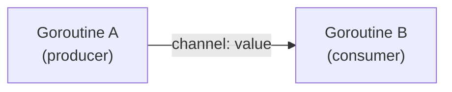

Qiymatni channel'ga yuborganda, uni keyingi bosqichga "topshirasiz". Amaliy tartib: yuboruvchi (sender) yuborgandan keyin bu qiymatni **o'z mas'uliyatidan chiqarilgan** deb hisoblaydi, qabul qiluvchi (receiver) esa uni endi o'zi ishlaydigan qiymat sifatida oladi. Bu "hand-off" uslubi channel'ni egalik uzatish va ish taqsimlash uchun juda qulay qiladi.

### Channel yaratish: nil, buffered, unbuffered

Har bir channel'ning aniq **element turi** (`T`) bor — u faqat shu turdagi qiymatlarni yuborib/qabul qiladi. Yaratish uchun `make(chan T, size)`, bunda `size` (bufer sig'imi) ixtiyoriy:

```go
var a chan int          // nil channel (hali make qilinmagan)
b := make(chan int)     // unbuffered
c := make(chan int, 0)  // unbuffered (size 0)
d := make(chan int, 100)// buffered, sig'im 100
```

- `a` — `chan int` turida, lekin `make` bilan ishga tushirilmagani uchun qiymati `nil`.
- `b` va `c` — **unbuffered channel**. Element navbati yo'q, shuning uchun `send` va `receive` bir-birini **bevosita uchratishi** shart. Bir tomon tayyor bo'lmasa — ikkinchisi bloklanib kutadi.
- `d` — sig'imi 100 bo'lgan **buffered channel**. Ichki navbatda joy bor, shuning uchun bufer to'lmagan bo'lsa sender darhol kutmasdan qiymat qo'ya oladi.

Muhim nozik nuqta: **buffered va unbuffered channel — texnik jihatdan bir xil tur.** Ular boshqacha ishlaydi, lekin tur imzosi (`chan int`) bir xil. Shuning uchun ularni bir-biriga tayinlash mumkin:

```go
c := make(chan int)     // unbuffered
d := make(chan int, 10) // buffered
var r chan int
r = c // ok
r = d // ok
```

Ostki farq faqat bitta — **sig'im (capacity)**. Buffered'da `N` ta slotli ichki navbat bor, unbuffered'da sig'im `0` — umuman element navbati yo'q.

### Unbuffered channel: bir vaqtda "to'liq" ham, "bo'sh" ham

Unbuffered channel qaysi tomondan qaraganingizga qarab har xil ko'rinadi:

- **Sender tomonidan** — u "to'liq" channel kabi: qiymat qo'yib ketadigan bo'sh slot yo'q. Demak send **faqat** tayyor receiver bo'lsa yakunlanadi. (Buffered channel esa shunchaki `N` ta slot qo'shadi — bufer to'lmagunча send bloklanmaydi.)
- **Receiver tomonidan** — u "bo'sh" channel kabi: olishga tayyor navbatdagi qiymat yo'q. Demak receive **faqat** tayyor sender bo'lsa yakunlanadi. (Buffered channel esa buferda qiymat bo'lguncha bloklanmasdan qabul qiladi.)

Ikkalasi ham bitta haqiqatga ishora qiladi: unbuffered channel'da bufer sloti yo'q, shuning uchun send va receive **bevosita uchrashishi** shart.

```go
func main() {
    ch := make(chan int) // unbuffered

    go func() {
        fmt.Println("G1: yuborishga tayyor...")
        v := 25
        ch <- v                       // receiver kelguncha bloklanadi
        fmt.Println("G1: v yuborildi.")
    }()

    fmt.Println("GMain: channeldan v ni kutyapman...")
    val := <-ch                       // sender bilan bevosita uchrashadi
    fmt.Println("GMain: qabul qilindi:", val)
}

// Chiqish:
// GMain: channeldan v ni kutyapman...
// G1: yuborishga tayyor...
// G1: v yuborildi.
// GMain: qabul qilindi: 25
```

Egalik modeli bo'yicha bosqichlar:

1. `ch` main goroutine'da (`GMain`) yaratiladi — faqat `int` yuborib/qabul qiladi.
2. Yuboruvchi goroutine `v` ni yaratib `ch <- v` bilan yuborishga urinadi.
3. Channel unbuffered bo'lgani uchun send faqat receiver bir vaqtda tayyor bo'lsa yakunlanadi — sender va receiver **bevosita sinxronlanadi**.
4. `GMain` `<-ch` bilan qabul qilganda, qiymat shu sinxronizatsiya nuqtasidan o'tadi.

### Copy-value model va egalik "intizom"

Send va receive **qiymatni nusxalaydi**. `int` kabi oddiy qiymatda sender yuborgandan keyin ham o'z lokal `v` o'zgaruvchisiga ega — channel orqali faqat nusxa o'tadi. Shuning uchun "sender endi egasi emas" degani **compiler majburlagan qoida emas**, balki dasturchi intizomi va aqliy model: yuborgandan keyin senderga o'sha qiymatni o'zgartirishda davom etmaslik tavsiya etiladi.

Lekin bu har doim toza emas. Nusxalangan qiymat ichida **pointer** bo'lishi mumkin. Pointer, slice header, map, function value yoki interface value — bularning hammasi hamon **umumiy asosiy xotiraga** ishora qilishi mumkin:

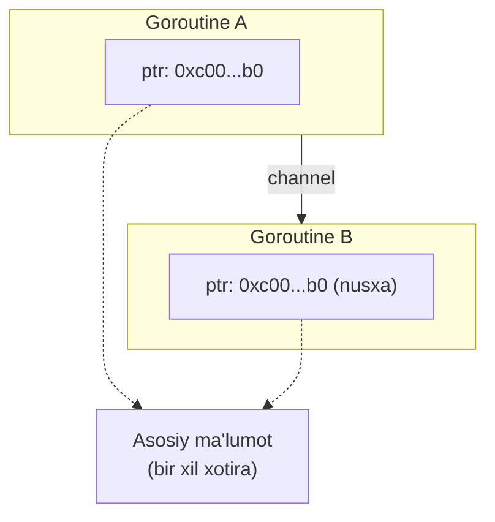

Aynan shuning uchun Go'da channel orqali "reference" yuborish keng tarqalgan — bu arzon, chunki nusxalanadigan narsa ko'pincha kichik header yoki pointer o'lchamidagi qiymat. Lekin agar sender yuborgandan keyin ham o'sha slice/struct'ni ishlatsa, ikkala goroutine bir xil xotiraga tegadi, va biri yozsa — bu **data race** bo'ladi. Shu sababli egalik modeli **intizom**, qat'iy kafolat emas.

### Uchta amal: send, receive, close

```go
ch <- v      // send: v ni ch ga yuborish
v := <-ch    // receive: ch dan qabul qilish
close(ch)    // close: kanalni yopish
```

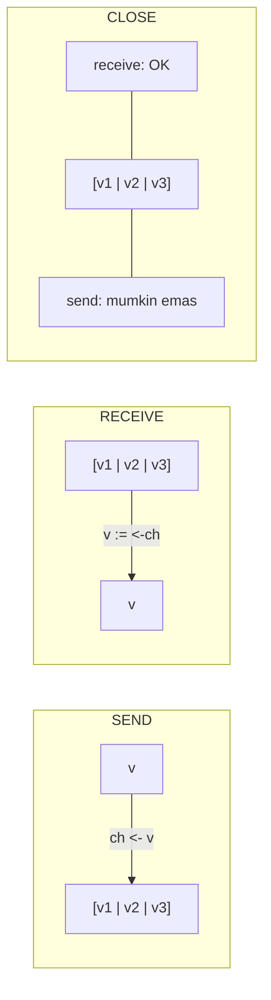

**`close(ch)` buferdagi qiymatlarni o'chirmaydi.** U faqat "endi yangi send mumkin emas" deb belgilaydi. Receiver'lar oldin yuborilgan qiymatlarni (bufer ichidagilar ham) qabul qilishda davom etadi. Bufer bo'shagandan keyin closed channel'dan receive **bloklanmaydi** — element turining **zero value**'sini, ikki qiymatli shaklda esa `false` bilan birga qaytaradi.

### Tartib: FIFO

Til spetsifikatsiyasi channel'ni **FIFO** (first-in-first-out) navbat deb belgilaydi. Bir channel'ga yuborilgan qiymatlar **shu tartibda** chiqadi:

```go
ch := make(chan int, 3)
ch <- 10
ch <- 20
ch <- 30
close(ch)

a := <-ch // 10
b := <-ch // 20
c := <-ch // 30
```

Bu FIFO kafolati asosan **bir channel orqali oqadigan qiymatlar tartibi** haqida (bufer va sender→receiver bevosita hand-off yo'li).

FIFO g'oyasini channel'da **kutayotgan goroutine'larga** ham qo'llash mumkin, lekin bu **runtime xatti-harakati**, kod korrektligi uchun tayanadigan qat'iy til kafolati emas. Joriy runtime'da kutayotgan sender va receiver'lar aniq navbatlarda saqlanadi: yangilar orqaga qo'shiladi, runtime oldindan oladi (FIFO). Lekin real dasturda scheduling, contention, uyg'onish vaqti va `select` ko'rinadigan tartibni navbat ichki tartibidan boshqacha qilib qo'yishi mumkin. Ya'ni bu **fairness kafolati emas**.

### Channel turlari (tasnif)

- **Sized Channel** — buffered va unbuffered'ni qamraydi. Boshqacha ishlaydi, lekin texnik jihatdan bir xil tur.
- **Directional Channel** — faqat yuborish (`chan<- T`) yoki faqat qabul qilish (`<-chan T`) bilan cheklangan.
- **Closed Channel** — yopilgach, hamma goroutine'ga "yangi ma'lumot bo'lmaydi" deb signal beradi. Buferda ma'lumot qolmagan bo'lsa, o'qish zero value qaytaradi.
- **Nil Channel** — send va receive'da **abadiy bloklanadi**. Agar to'g'ri boshqarilmasa, dastur qotib qoladi.

Bularni tushunish uchun asosan buffered channel'ning ichki tuzilishini bilish yetarli — pastda shuni ko'ramiz.

---

## Channelning ichki tuzilishi (Underlying Structure)

### `make` → `runtime.makechan`

`make(chan T, n)` ni compiler runtime yordamchi funksiyasiga aylantiradi. Sig'im `int`ga sig'sa `runtime.makechan`, aks holda `runtime.makechan64` chaqiriladi. Assembly (soddalashtirilgan):

```
ch := make(chan int, 4)
    MOVD  $type:chan int(SB), R0   // R0 = tur deskriptori
    MOVD  $4, R1                   // R1 = so'ralgan sig'im
    CALL  runtime.makechan(SB)
    MOVD  R0, main.ch-56(SP)       // natija: *hchan
```

`makechan` ikkita muhim ma'lumot oladi: `R0` — channel turining runtime tur deskriptori, `R1` — so'ralgan bufer sig'imi. Undan runtime ichki channel obyektini yaratadi:

```go
func makechan(t *chantype, size int) *hchan {
    elem := t.Elem
    ...
    var c *hchan
    switch {
    case mem == 0:
        // Navbat yoki element o'lchami nol.
        c = (*hchan)(mallocgc(hchanSize, nil, true))
        c.buf = c.raceaddr()
    case !elem.Pointers():
        // Elementlar pointer o'z ichiga olmaydi.
        // hchan va buf ni bitta chaqiruvda ajratamiz.
        c = (*hchan)(mallocgc(hchanSize+mem, nil, true))
        c.buf = add(unsafe.Pointer(c), hchanSize)
    default:
        // Elementlar pointer o'z ichiga oladi.
        c = new(hchan)
        c.buf = mallocgc(mem, elem, true)
    }
    c.elemsize = uint16(elem.Size_)
    c.elemtype = elem
    c.dataqsiz = uint(size)
    lockInit(&c.lock, lockRankHchan)
    ...
    return c
}
```

Funksiya `*hchan` qaytaradi. Ya'ni `make(chan T, n)` yozganda runtime `hchan` bilan ifodalangan **ichki obyekt** yaratadi, va sizning channel o'zgaruvchingiz shu obyektga **havola** (pointer) saqlaydi.

Uchta ajratish (allocation) holati bor:

1. **`mem == 0`** — bufer xotirasi nol. Bu unbuffered channel'da (sig'im 0) yoki element o'lchami nol bo'lganda (masalan `struct{}`) sodir bo'ladi. Faqat `hchan` header ajratiladi. 64-bit qurilishda bu header **104 bayt**.
2. **Element pointer'siz** — runtime `hchan` header va buferni **bitta uzluksiz blok** qilib ajratadi (tejamli).
3. **Element pointer'li** — `hchan` header va bufer **alohida** ajratiladi.

Ya'ni runtime shunchaki "channel" yaratmaydi — element turi va sig'imga qarab **xotira joylashuvini** ham tanlaydi.

### `hchan` struct

```go
type hchan struct {
    qcount   uint           // buferdagi elementlarning joriy soni
    dataqsiz uint           // bufer o'lchami (sig'im)
    buf      unsafe.Pointer // dataqsiz elementli massivga pointer
    elemsize uint16         // element o'lchami (bayt)
    closed   uint32         // yopilganmi
    timer    *timer         // shu channelni oziqlantiruvchi timer
    elemtype *_type         // element turi
    sendx    uint           // keyingi qiymat qayerga qo'yiladi
    recvx    uint           // keyingi qiymat qayerdan o'qiladi
    recvq    waitq          // qabul qilishni kutayotgan goroutine'lar
    sendq    waitq          // yuborishni kutayotgan goroutine'lar
    lock     mutex          // hchan'ning barcha maydonlarini himoya qiladi
}

type waitq struct {
    first *sudog
    last  *sudog
}
```

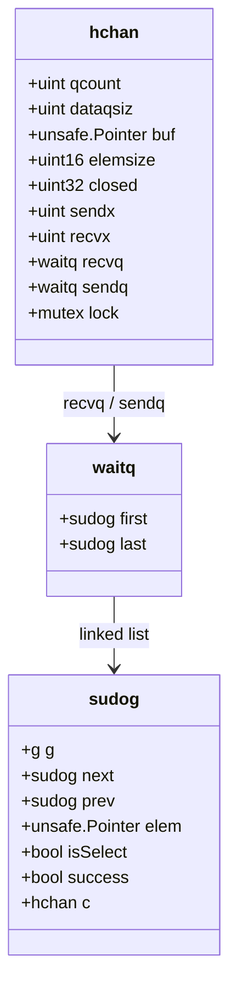

Uchta muhim qismga alohida e'tibor beramiz.

**1. Ichki bufer (`buf`)** — faqat buffered channel uchun muhim. Elementlar receiver olguncha shu yerda vaqtincha saqlanadi. Sig'im `dataqsiz`, joriy element soni `qcount` bilan kuzatiladi. Bu bufer **aylanma navbat** (circular queue) kabi ishlaydi:

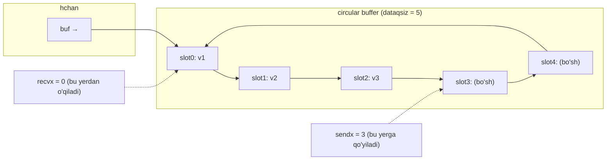

- **Send** (bufer to'la emas, receiver kutmayapti): runtime qiymatni `sendx` slotiga nusxalaydi, so'ng `sendx`'ni oldinga suradi. Oxiriga yetsa boshiga qaytadi (wrap-around).
- **Receive**: runtime `recvx` slotidagi qiymatni o'qiydi, slotni tozalaydi, `recvx`'ni oldinga suradi.

**2 va 3. Kutish navbatlari (`sendq`, `recvq`)** — channel darhol yura olmasa bloklangan goroutine'larni saqlaydi. Ular `waitq` — **sudog** tugunlaridan iborat bog'langan ro'yxat.

### sudog — pseudo-goroutine

`sudog` — goroutine (`g`) ni channel yoki semafor kabi sinxronizatsiya obyektiga bog'lovchi kichik yordamchi yozuv:

```go
type sudog struct {
    g        *g
    next     *sudog
    prev     *sudog
    elem     unsafe.Pointer // ma'lumot elementi (stekga ishora qilishi mumkin)
    isSelect bool
    success  bool
    c        *hchan         // channel
    // ... (acquiretime, releasetime, ticket, waiters, parent, waitlink, waittail)
}
```

Goroutine channel'ga send/receive qilib **darhol davom eta olmasa**, runtime shu kutish uchun `sudog` yaratadi (yoki qayta ishlatadi) va uni mos navbatga (`sendq` yoki `recvq`) qo'yadi:

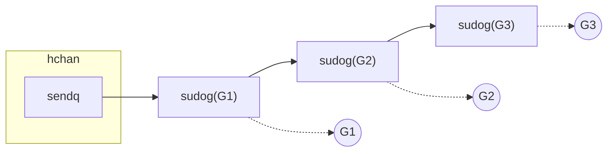

Nega bu qo'shimcha qatlam kerak? Chunki munosabat **ko'p-ko'pga**: bitta goroutine bir nechta `sudog` bilan bog'liq bo'lishi mumkin, bitta channel'da esa ko'p goroutine kutishi mumkin. Eng aniq misol — `select`: bitta goroutine bir vaqtda bir nechta channel amalini sinaydi, shuning uchun runtime har bir case uchun bitta `sudog` yaratib, har birini mos `sendq`/`recvq`'ga bog'laydi.

Xulosa: `sendq` va `recvq` goroutine'ni **bevosita** saqlamaydi — ular bloklangan goroutine'ni ifodalovchi `sudog` obyektlarini saqlaydi.

### Directional channel — faqat tur tizimida

Runtime darajasida **alohida** send-only yoki receive-only channel obyekti **yo'q**. Barcha yo'nalishlar bir xil `hchan` header'ga ishora qiladi. Yo'nalish — bu compiler'ning **tur tekshiruvi** (type checking) tomonidan qo'llaniladigan cheklov:

```go
func main() {
    var sendOnly chan<- int = make(chan int)
    var recvOnly <-chan int = make(chan int)

    sendOnly <- 10  // OK
    // _ = <-sendOnly  // xato: send-only channeldan qabul qilib bo'lmaydi
    _ = <-recvOnly    // OK
    // recvOnly <- 20  // xato: receive-only channelga yuborib bo'lmaydi
}
```

Shuning uchun bidirectional channel'ni cheklangan turga tayinlash **mumkin**, teskarisi esa **mumkin emas** — compiler statik tur ruxsat bermagan imkoniyatni "orqaga qaytarib olishimizga" yo'l qo'ymaydi:

```go
func main() {
    ch := make(chan int)
    var sendOnly chan<- int = ch   // OK
    var recvOnly <-chan int = ch   // OK
    // ch = sendOnly  // xato
    // ch = recvOnly  // xato
}
```

Runtime channel qiymati baribir bir xil `hchan`'ga ishora qiladi. Hatto `unsafe.Pointer` bilan send-only'ni yana bidirectional qilib "aldash" mumkin:

```go
func main() {
    ch := make(chan int)
    var sendOnly chan<- int = ch
    bidiCh := *(*chan int)(unsafe.Pointer(&sendOnly)) // compiler cheklovini chetlab o'tish
    go func() { bidiCh <- 42 }()
    fmt.Println(<-ch) // 42
}
```

> **Eslatma.** Yo'nalish runtime tur metama'lumotida **mavjud**: channel turlari `direction` maydonini saqlaydi, va reflection qatlami (`ChanDir`, `Send`, `Recv`) shuni tekshiradi. Ya'ni yo'nalish alohida channel obyekti tuzilishi emas, lekin tur metama'lumotida qayd etilib, compiler va reflection orqali majburlanadi.

---

## Channel amallari (Channel Operations)

### Send amali

Oddiy `ch <- v` compiler tomonidan `chansend1` orqali runtime'ga kiradi, u esa **blocking rejim yoqilgan** holda umumiy `chansend`'ni chaqiradi. Blocking rejim = send goroutine'ni park qilib, amal yakunlanguncha kutishga ruxsat berilgan:

```go
func chansend1(c *hchan, elem unsafe.Pointer) {
    chansend(c, elem, true, getcallerpc())
}
func chansend(c *hchan, ep unsafe.Pointer, block bool, callerpc uintptr) bool { ... }
```

Ikkita chekka holat:

- **`nil` channel** — `ch <- 42` **abadiy bloklanadi**. Nil channel — shunchaki nol pointer: `hchan` ham, bufer ham, navbat ham yo'q, shuning uchun bu send hech qachon yura olmaydi.
- **closed channel** — `close`'dan keyin send **panic** qiladi. `chansend` lock ostida `closed` holatni tekshiradi va `send on closed channel` bilan panic qiladi. Bu buffered va unbuffered'ga baravar taalluqli.

Chekka holatlardan keyin asosiy mantiq boshlanadi. Channel doim **copy-value** modeli bilan ishlaydi, lekin nusxa qanday bo'lishi vaziyatga bog'liq.

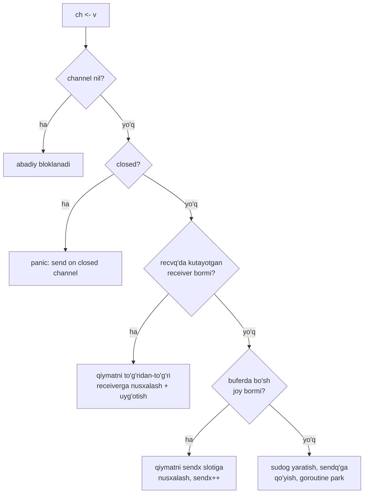

**Bo'sh joyli channelga send.** Bufer to'la emas va kutayotgan receiver yo'q bo'lsa: runtime keyingi bo'sh slotni topadi, qiymat baytlarini nusxalaydi, sender darhol davom etadi. Endi channel shu nusxaning "egasi" — sender o'z asl o'zgaruvchisini bemalol qayta ishlatishi mumkin. Keyin kimdir receive qilganda, runtime qiymatni bufer slotidan receiver o'zgaruvchisiga qayta nusxalaydi.

**To'la channelga (yoki unbuffered'ga) send.** Sender uchun unbuffered = "doim to'la" buffered. Hozir bo'sh slotga qo'yib bo'lmaydi. Shu payt **hali hech narsa bufer xotirasiga nusxalanmagan** — runtime sender qiymati qayerdaligini eslab qoladi va receiver'ni kutadi. Buni `sudog.elem` orqali eslaydi:

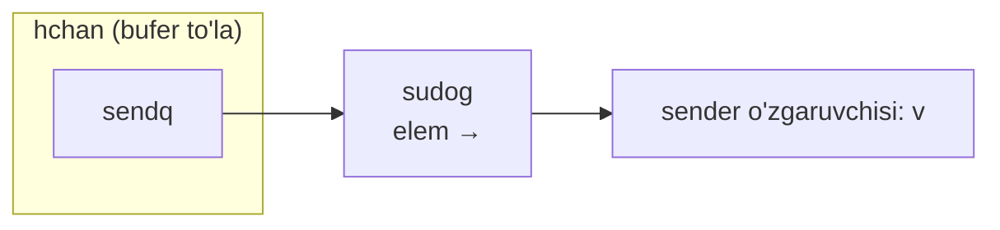

Keyin nima bo'lishi channel turiga bog'liq:

- **Unbuffered** — receiver kelganda runtime qiymatni to'g'ridan-to'g'ri sender'ning `sudog.elem`'idan receiver manziliga nusxalaydi va sender'ni uyg'otadi. Bufer sloti ishtirok etmaydi.
- **To'la buffered** — receiver kelib, ham to'la bufer, ham bloklangan sender topsa: runtime avval **eng eski** buferli elementni receiver'ga nusxalaydi (bitta slot bo'shaydi), so'ng darhol bloklangan sender'ning qiymatini `sudog.elem`'dan o'sha bo'shagan slotga nusxalaydi va sender'ni uyg'otadi.

Ya'ni sender uchun bu doim oddiy "qiymat yuborish" bo'lib ko'rinadi, lekin ichki tomondan bufer to'la bo'lsa, buferga nusxalash receiver kelguncha **kechiktiriladi**.

> **Eslatma: sudog va escape analysis qoidasi.** 7-bobda "heap obyektlar ko'chishi mumkin bo'lgan stek slotlariga xom pointer ushlab turmasin" degan qoida bor edi. Lekin bloklangan send/receive vaqtida `sudog.elem` aynan stekdagi o'zgaruvchiga ishora qilishi mumkin — bu qoidaga istisnodek ko'rinadi. Buni runtime maxsus qo'llab-quvvatlaydi: u `sudog.elem` stekka ishora qilishi mumkinligini biladi va stek ko'chganda bu pointer'larni **to'g'rilaydi**. Goroutine hali to'liq park bo'lmagan bo'lsa — pointerlarni to'g'ridan-to'g'ri yangilaydi; to'liq park bo'lgan bo'lsa — tegishli channel lock'lari bilan muvofiqlashib, `sudog.elem`'ni yangilaydi va stekning tegishli qismini ehtiyotkorlik bilan ko'chiradi. Aynan shuning uchun goroutine `parkingOnChan` va `activeStackChans` bayroqlaridan foydalanadi.

**Lock narxi.** Har bir haqiqiy send/receive channel'ning ichki **lock**'ini oladi. Demak unumdorlik faqat qancha qiymat uzatishga emas, bir vaqtda bir channel uchun **raqobatlashayotgan goroutine soniga** ham bog'liq. Kam ishlatiladigan channel'da lock ko'pincha kurashsiz — arzon. Lekin bitta channel'ni "issiq global navbat" qilib ko'p producer/consumer bilan ishlatsangiz, lock **bottleneck**'ga aylanadi. Shuning uchun yuqori o'tkazuvchanlik dizaynlarida ish bir nechta channel'ga **shard** qilinadi (masalan har bir worker'ga alohida navbat).

**Sender qanday uyg'onadi?** Ikki asosiy yo'l:

1. Boshqa goroutine shu channel'dan **receive** qiladi: lock ostida runtime `sendq`'dagi kutayotgan sender'ni topadi, navbatdan oladi, muloqotni yakunlaydi, sender'ni runnable qiladi.
2. Kimdir channel'ni **close** qiladi: runtime `sendq`'dagi har bir sender'ni "send muvaffaqiyatsiz — channel yopilgan" ma'lumoti bilan uyg'otadi. Bu goroutine'lar `send on closed channel` bilan **panic** qiladi.

> **Non-blocking send.** Compiler `select` + `default` uchun send'ni **blocking rejimsiz** chaqiradi. Bunda goroutine park bo'lmaydi — send "hozir yura olmadim" deb qaytadi. Batafsil `select` bo'limida.

### Receive amali

Receive ham ikki rejimda (blocking/non-blocking) va ikki shaklda keladi: bir qiymatli (`chanrecv1`) va "ok" shakli (`chanrecv2`):

```go
// v := <-ch
func chanrecv1(c *hchan, elem unsafe.Pointer) { chanrecv(c, elem, true) }

// v, ok := <-ch
func chanrecv2(c *hchan, elem unsafe.Pointer) (received bool) {
    _, received = chanrecv(c, elem, true)
    return
}
func chanrecv(c *hchan, ep unsafe.Pointer, block bool) (selected, received bool) { ... }
```

Ikkita chekka holat:

- **`nil` channel** — `<-ch` **abadiy bloklanadi**. Nil channel send ham, receive ham, close ham qila olmaydi.
- **closed channel** — receive **hech qachon panic qilmaydi**. Buferda qiymat bo'lsa, har receive keyingi qiymatni normal qaytaradi, va `v, ok := <-ch`'da `ok == true`. Faqat bufer **to'liq bo'shagach** keyingi receive'lar zero value'ni **darhol** qaytaradi, `ok == false` bo'ladi. `ok == false` = channel **ham yopilgan, ham bo'sh**.

> **Eslatma: keng tarqalgan xato tushuncha.** "Closed channel doim `ok == false` qaytaradi" — noto'g'ri. Bu faqat channel **yopilgan VA bo'sh** bo'lganda ro'y beradi. Buferda qiymat qolgan bo'lsa, receive ularni `ok == true` bilan normal qaytaradi.

Closed channelga send va yopilgan channelni yana yopish — panic; lekin closed channeldan receive — ruxsat. Aynan shuning uchun odatda **sender tomon channel'ni yopadi** (u qachon ko'proq qiymat bo'lmasligini biladi), receiver tomon esa yopilgandan keyin ham qabul qilishda davom etaveradi.

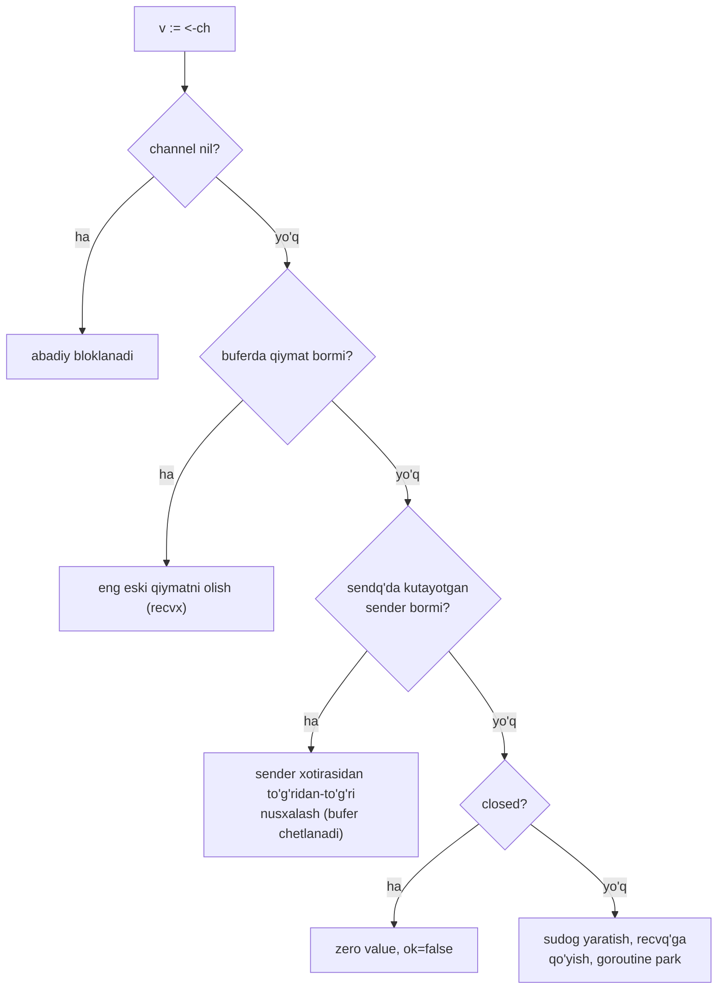

**Bufer bo'sh emas** — receiver eng eski qiymatni oladi va davom etadi (closed bo'lsa ham buferdagi qiymatlar drenaj qilinadi).

**Buferda qiymat yo'q** — receiver darhol davom eta olmaydi, bloklanadi. Uning uchun `sudog` yaratilib `recvq`'ga qo'yiladi, `elem` esa qiymatni qabul qiladigan **manzil o'zgaruvchisiga** ishora qiladi:


Keyin kimdir shu channel'ga yuborsa, runtime `recvq`'dan kutayotgan receiver'ni oladi, qiymat baytlarini **to'g'ridan-to'g'ri** sender xotirasidan receiver manziliga nusxalaydi va receiver'ni uyg'otadi. Bu **direct handoff** unbuffered'da doim, buffered'da esa sender kelганда receiver allaqachon kutayotgan bo'lsa sodir bo'ladi — ikkalasida ham bufer ishlatilmaydi.

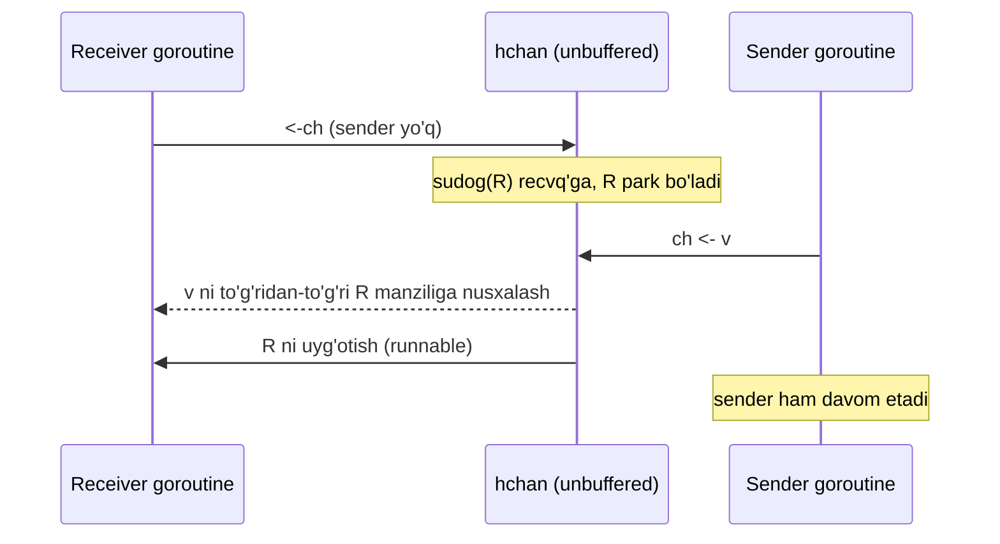

### Close amali

`nil` channel'ni yopib bo'lmaydi, allaqachon yopilgan channel'ni ham — ikkisi ham **panic**. Close'dan oldin runtime channel'ni **lock** qiladi (send/receive kabi), toki close davomida boshqa goroutine holatni o'zgartira olmasin.

Close paytida send yoki receive'da bloklangan har bir goroutine navbatdan olinib, **muvaffaqiyatsiz natija** bilan uyg'otiladi (`sudog.success = false`):

- **Kutayotgan receiver'lar** — spec bo'yicha yopilgan channeldan receive (bufer bo'sh bo'lsa) zero value qaytaradi. Aslida hech qanday qiymat qabul qilinmaydi — runtime shunchaki `sudog.elem` ko'rsatgan **manzilni tozalaydi** (zero qiladi).
- **Kutayotgan sender'lar** — uyg'ongach `sudog.success == false` ekanini ko'radi (channel yopildi) va **panic** qiladi.

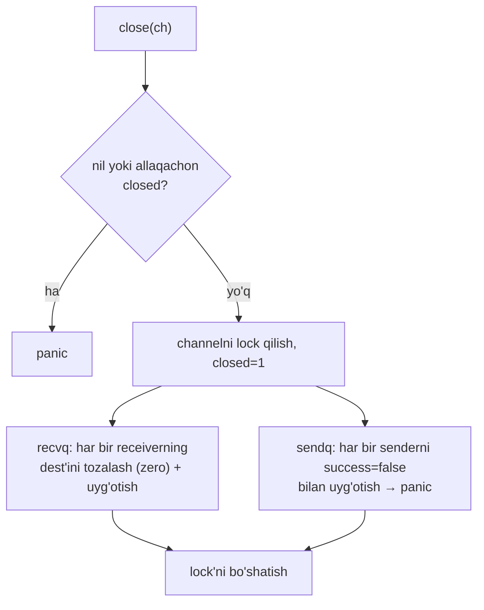

---

## Eslab qol

- **Channel = CSP.** Goroutine'lar xotirani ulashib emas, qiymat yuborib muloqot qiladi. Egalik uzatish — intizom, compiler kafolati emas.
- **Buffered vs unbuffered — bir xil tur.** Farqi faqat sig'im: buffered `N` slot, unbuffered `0`. Unbuffered'da send/receive bevosita uchrashadi.
- **Channel = `*hchan`.** O'zgaruvchi runtime obyektiga pointer. `nil` channel — shunchaki nol pointer (abadiy bloklanadi).
- **`hchan` tarkibi:** aylanma `buf` (+ `sendx`/`recvx`/`qcount`/`dataqsiz`), `sendq`/`recvq` (sudog navbatlari), `lock`.
- **sudog** — goroutine'ni channelga bog'lovchi kutish yozuvi. `sudog.elem` bloklangan amaldagi qiymat/manzilga ishora qiladi (stekka ham).
- **Send:** joy bor → buferga nusxa; joy yo'q → sudog + park; closed → panic; nil → abadiy blok.
- **Receive:** buferda qiymat bor → oladi; sender kutmoqda → direct handoff; closed+bo'sh → zero+`false`; closed'dan receive **hech qachon panic qilmaydi**.
- **Close:** `nil`/qayta close → panic. Yopishni **sender** qiladi.
- **`ok == false` faqat closed VA bo'sh bo'lganda.**

## Tez-tez uchraydigan xatolar

- **Nil channel'ni unutish.** `var ch chan int` yaratib `make` qilmaslik — send/receive abadiy bloklanadi va dastur qotib qoladi.
- **Closed channelga yuborish** yoki uni **qayta yopish** — panic. Yopishni faqat sender tomon qilsin.
- **`ok`'ni tekshirmasdan closed'dan o'qish.** `for v := range ch` yopilgach to'xtaydi, lekin oddiy `<-ch` loop'da zero value'larni cheksiz "aylantiradi".
- **Reference yuborib, keyin ham o'zgartirish.** Slice/map/pointer yuborgandan keyin senderning ularni yozishi — **data race**.
- **Bitta "issiq" channel'ga hamma yukni tashlash.** Lock contention bottleneck bo'ladi — ishни shard qiling.

## Amaliyot

1. **Unbuffered vs buffered.** `make(chan int)` va `make(chan int, 1)` bilan bir xil dasturni yozing: sender va receiver qachon bloklanishini `fmt.Println` bilan kuzating. Chiqish tartibini tushuntiring.
2. **Direct handoff'ni ko'rsating.** Buffered channel'ga (sig'im 2) sender kelishidan **oldin** receiver'ni bloklab qo'ying (goroutine), so'ng yuboring. Bufer ishlatilmasligini isbotlash uchun `len(ch)` va `cap(ch)` chop eting.
3. **Closed channel semantikasi.** Sig'imi 3 bo'lgan channel'ga 2 ta qiymat qo'ying, `close` qiling, so'ng `v, ok := <-ch` bilan 4 marta o'qing. Har safar `v` va `ok` qiymatini yozing va nega shundayligini izohlang.
4. **`sudog.elem` intuitsiyasi.** 100 ta goroutine bir unbuffered channelga yuborishga urinsin, main esa ularni birma-bir qabul qilsin. Tartib qanday? FIFO kafolatiga tayanmaslik kerakligini tushuntiring.

---

[← README](README.md) | [Keyingi: 02 Select →](02_select.md)
