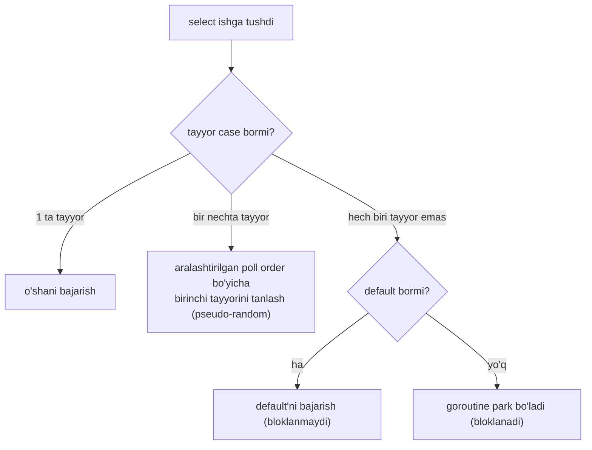
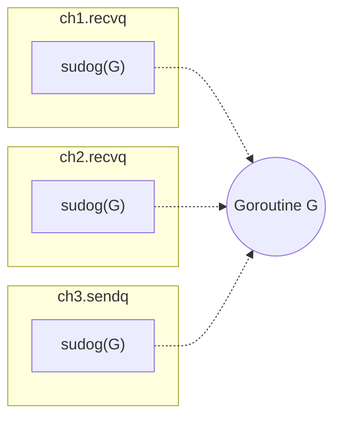
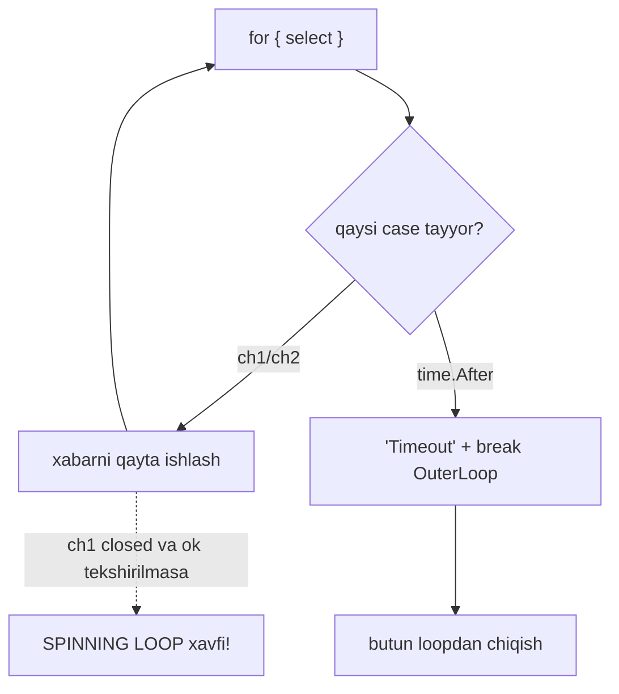
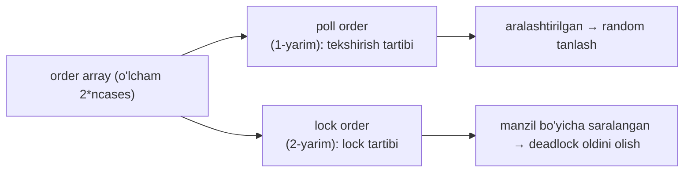
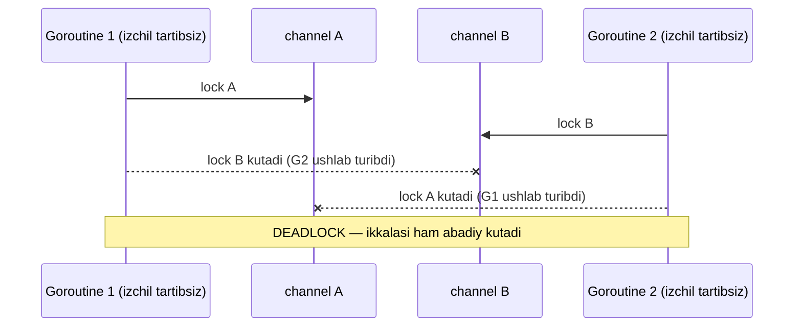
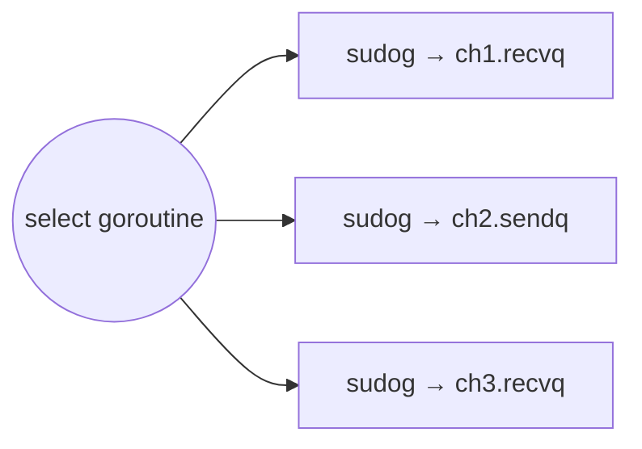
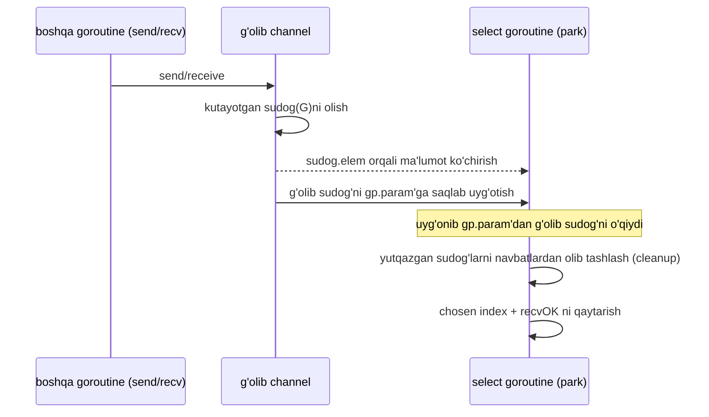
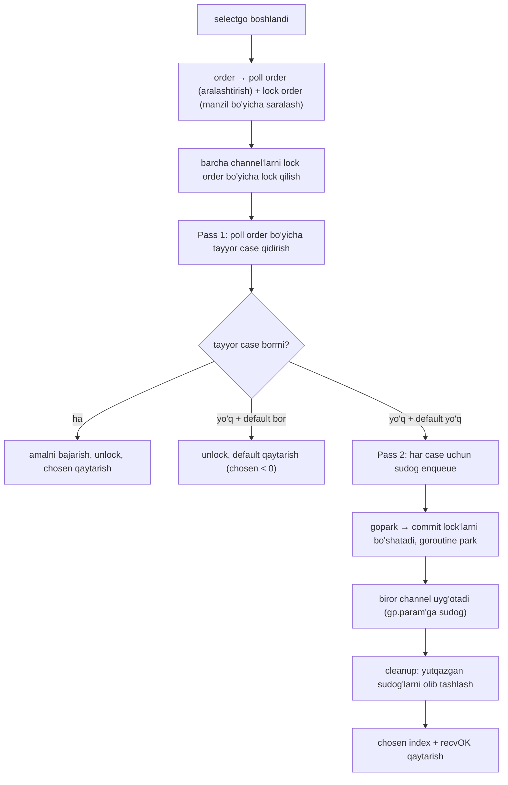

# 02 — Select Statement

> *The Anatomy of Go* (Phuong Le), 8-bob (Concurrency) asosida o'zbek tilida tayyorlangan o'quv qo'llanma. So'zma-so'z tarjima emas — o'qib tushunilgach o'z so'zlarim bilan qayta tushuntirilgan.

## Nima uchun bu mavzu muhim?

[Oldingi bo'limda](01_channel.md) ko'rdikki, bitta channel ustidagi `send`/`receive` bir vaqtda faqat bitta amalni kutadi. Lekin real dasturda goroutine ko'pincha **bir nechta channel'dan qaysi biri tayyor bo'lsa, o'shani** ishlatishni xohlaydi: bir channel'dan xabar, ikkinchisidan to'xtatish signali, uchinchisidan timeout.

`select` — aynan shu uchun. U `switch`'ga o'xshaydi, lekin faqat channel muloqoti uchun: bir nechta channel amalidan (send yoki receive) qaysi biri **davom eta olsa**, o'shani tanlaydi va bajaradi.

Bu bo'limda quyidagilarga javob beramiz:

- Bir nechta case bir vaqtda tayyor bo'lsa, `select` qaysi birini tanlaydi? (random tanlash)
- `default` case nima uchun `select`'ni **non-blocking** qiladi?
- Yopilgan channel `select` ichida qanday "spinning loop" xavfini tug'diradi?
- `selectgo` ichida `scase`, poll order, lock order qanday ishlaydi?

---

## Select asoslari

```go
select {
case ch1 <- 10:
    fmt.Println("10 yuborildi")
case x := <-ch2:
    fmt.Println("qabul qilindi:", x)
}
```

Bu `select` `ch1`'ga 10 yuborilishini **yoki** `ch2`'dan qiymat kelishini kutadi. Qaysi biri bloklamasa, Go o'sha case'ni tanlaydi va uning tanasini bajaradi.

### Random tanlash

Agar bir nechta case **bir vaqtda tayyor** bo'lsa, spec quyidagini aytadi:

> "If one or more of the communications can proceed, a single one that can proceed is chosen via a uniform pseudo-random selection."
> (Bir nechta case davom eta olsa, ular orasidan bittasi **bir tekis pseudo-tasodifiy** tanlanadi.)

Ya'ni `select` **manba kodidagi birinchi case'ni afzal ko'rmaydi** — tayyor case'lar orasidan tasodifiy tanlaydi. Buni runtime **poll order'ni aralashtirish** orqali amalga oshiradi (pastda batafsil).



### Bloklangan select va bir nechta sudog

Goroutine `select`'ni bajarganda va **hech bir** case darhol yura olmasa, runtime **har bir case uchun alohida `sudog`** yaratib, uni mos channel navbatiga (`sendq`/`recvq`) qo'yadi. Bu `sudog`'larning hammasi **bir xil goroutine**'ga ishora qiladi:



Bu shuni anglatadiki, agar bir necha channel bir vaqtga yaqin tayyor bo'lsa, har biri **o'z lock'i ostida** shu bir goroutine uchun `sudog` topib, uni uyg'otishga urinishi mumkin. Faqat **bitta** case g'olib chiqishi kerak. Buni ta'minlash uchun goroutine (`g`) strukturasida **atomik `g.selectDone` bayrog'i** bor:

- Channel `select`'dan kelgan `sudog`'ni navbatdan olganда, uning `isSelect` bayrog'ini tekshiradi.
- So'ng `g.selectDone`'ni **CAS** (compare-and-swap) bilan 0 dan 1 ga o'girishga urinadi.
- **Birinchi muvaffaqiyatli** channel uyg'onish poygasida g'olib bo'ladi va amalini yakunlaydi.
- Keyingi channel `g.selectDone` allaqachon 1 ekanini ko'rsa — boshqa case yutganini biladi va o'sha `sudog`'ni tashlab ketadi.

> **Muhim.** Bu **uyg'onish poygasi** spec'dagi "random tanlash" mantig'i EMAS. Bu yerda g'olib real vaqt va scheduling bilan aniqlanadi. Spec'ning random tanlashi esa `select` **birinchi tekshiruv o'tishida** (goroutine hali park bo'lmasidan) bir nechta case allaqachon tayyor bo'lgan holatga taalluqli.

### Poll order — random qanday amalga oshadi

`select` ishga tushganda Go avval barcha **nil bo'lmagan** case'larni oladi va ularning **poll order**'ini aralashtiradi. So'ng shu aralashtirilgan tartibda tekshirib, **darhol yura oladigan** birinchisini tanlaydi. Bir nechta case tayyor bo'lsa, g'olib aynan shu tasodifiy tartib bo'yicha aniqlanadi — manba kodidagi birinchi case emas. `for` loop ichida bir xil `select` har safar **yangi poll order** quradi, shuning uchun tartib har gal boshqacha bo'lishi mumkin.

### Nil channel case'ni "o'chiradi"

`select` **nil channel'larni e'tiborsiz qoldiradi**. Bundan foydali fokus: case'ni keyingi iteratsiyalarda o'chirish uchun uning channel o'zgaruvchisini `nil` qilib qo'yish:

```go
for {
    select {
    case v := <-ch1:
        if shouldDisable {
            ch1 = nil // bundan keyin bu case e'tiborsiz qoladi
        }
    case v := <-ch2:
        // hali faol
    }
}
```

Qo'shimcha bayroq yoki shart yozmasdan case'ni "o'chirib qo'yamiz".

### default: non-blocking select

- `default` **yo'q** bo'lsa — `select` kamida bitta case yura olguncha **bloklanadi**.
- `select {}` (umuman case yo'q) — **abadiy** bloklanadi.
- `default` **bor** bo'lsa — `select` **non-blocking** bo'ladi: tayyor case bo'lmasa, darhol `default`'ni bajaradi.

Kam ma'lum fakt: channel **to'la** bo'lsa ham, `default` bilan **non-blocking send** urinib ko'rish mumkin — u umuman bloklamaydi, yo darhol muvaffaqiyatli, yo darhol muvaffaqiyatsiz:

```go
select {
case ch <- v:
    println("yuborildi")
default:
    println("default case")
}
```

- Send avval channel hozir qiymat qabul qila oladimi tekshiradi (buferda joy bor yoki receiver kutmoqda). Bo'lsa — normal yuboriladi.
- Aks holda (bufer to'la, receiver yo'q) — bloklanmaydi, `default`'ga o'tadi, `v` yuborilmaydi.

Bu bizga **try-send / polling** uslubini beradi: back-pressure, fallback yoki timeout-simon mantiqni senderni bloklashsiz qurish mumkin. Xuddi shu g'oya **non-blocking receive**'ga ham amal qiladi.

---

## Select yopilgan channel'lar bilan

Yopilgan channel bilan xatti-harakat case send yoki receive ekaniga bog'liq:

- **Send case** yopilgan channelga — oddiy send kabi **panic**.
- **Receive case** yopilgan channeldan — **hech qachon bloklanmaydi**. Buferda qiymat bo'lsa, ularni normal qaytaradi. Bufer bo'shagach har receive zero value'ni `ok == false` bilan **darhol** qaytaradi.

### Xavf: spinning loop

Aynan shu "darhol tayyor" xususiyati `for` + `select` ichida **xavfli**. Agar `ch1` yoki `ch2` yopilsa va biz to'xtashni unutsak, o'sha receive case **doim darhol tayyor** bo'ladi — loop **cheksiz aylanib**, qayta-qayta zero value oladi:

```go
for {
    select {
    case msg := <-ch1: // ch1 yopilsa — doim darhol tayyor, zero value!
    case msg := <-ch2:
    case <-done:
        return
    }
}
```

**Yechim 1 — `ok` shakli + `nil`.** Receive'ni `ok` shakliga o'tkazib, yopilishini aniqlab, channel'ni `nil` qilamiz (yoki `return`):

```go
for {
    select {
    case msg, ok := <-ch1:
        if !ok {
            ch1 = nil // bundan keyin bu case e'tiborsiz qoladi
        }
    case msg := <-ch2:
        // ...
    case <-done:
        return
    }
}
```

**Yechim 2 — timeout.** Uzoq vaqt hech qanday faollik bo'lmasa loop to'xtasin:

```go
OuterLoop:
for {
    select {
    case msg := <-ch1:
        // ch1 xabari
    case msg := <-ch2:
        // ch2 xabari
    case <-time.After(10 * time.Second):
        fmt.Println("Timeout")
        break OuterLoop // MUHIM: label kerak!
    }
}
```

> **Nozik nuqta.** Oddiy `break` faqat `select`'dan chiqadi, `for`'dan emas. Butun loop'dan chiqish uchun **loop label** (`OuterLoop:`) ishlatish shart.



---

## Select ichki mexanizmi (Internals)

`select`'ni tushunish uchun compiler va runtime ko'rinishini birga ko'rish kerak — ular mahkam bog'langan. Compiler `select`'ni runtime uchun metama'lumot + dispatch mantiqiga aylantiradi. Runtime tayyorlikni tekshiradi, kerak bo'lsagina bloklaydi va qaysi case tanlanganini qaytaradi.

### Compiler Lowering — scase

Runtime `select`'dagi channel case'larni ichki deskriptor bilan ifodalaydi. Compiler har bir **default bo'lmagan** case uchun bittadan deskriptor massivini quradi va runtime'ni chaqiradi. Har bir case ikki ma'lumotga aylantiriladi: channel obyektiga pointer va shu amal ishlatadigan **data slot**'ga pointer. Bular `scase` structiga joylanadi:

```go
type scase struct {
    c    *hchan         // channel
    elem unsafe.Pointer // data element
}
```

`elem` pointer amalga qarab har xil:

- **Send** (`ch <- v`) — `elem` **yuboriladigan qiymat** manzilini saqlaydi.
- **Receive** (`v := <-ch`) — `elem` **qabul qiluvchi (dest) o'zgaruvchi** manzilini saqlaydi.

Masalan:

```go
select {
case ch1 <- v:
    // ...
case x := <-ch2:
    // ...
default:
    // ...
}
```

Compiler default bo'lmagan case sonini **compile-time'da** biladi, shuning uchun **stekda** kichik deskriptorlarning **belgilangan o'lchamli massivini** tayyorlaydi:

```go
scases[0] = scase{c: ch1, elem: &v} // send: ma'lumot v dan keladi
scases[1] = scase{c: ch2, elem: &x} // receive: ma'lumot x ga yoziladi
```

> **Eslatma.** `scases` massividan tashqari compiler **`order` massivini** ham tayyorlaydi va runtime'ga uzatadi. Compiler uni to'ldirmaydi — runtime uni **poll order** va **lock order** qurish uchun ishlatadi.

Umumiy oqim (pseudokod):

```go
func pseudoCompiledSelect(ch1 chan T1, ch2 chan T2, v T1) {
    var x T2
    cases := []caseDesc{
        {ch: ch1, elem: unsafe.Pointer(&v), d: send}, // case ch1 <- v
        {ch: ch2, elem: unsafe.Pointer(&x), d: recv}, // case x := <-ch2
    }
    order := make([]int, 2*len(cases))
    chosen, recvOK := runtime.selectgo(cases, order)
    if chosen < 0 { // default
    } else if chosen == 0 { // ch1 <- v
    } else if chosen == 1 { // x := <-ch2
        _ = recvOK // qiymat kelsa true, channel closed bo'lsa false
    }
}
```

Runtime qaytargach, compiler **dispatch** bosqichiga o'tadi: tanlangan case'ga sakraydi va uning tanasini bajaradi.

### Runtime Execution — selectgo

Compiler barcha default bo'lmagan case'lar massivini uzatadi. Qiziq fakt: bitta `select` umumiy runtime yo'lida **65 536 tagacha** case'ni kuzata oladi — bu runtime cheg'arasi.

`order` massivi runtime uchun **ikki vazifali vaqtinchalik ish maydoni** (scratch): case'larni tekshirish tartibi va channel'larni lock qilish tartibini hal qilish. Compiler `select`'ni `runtime.selectgo` chaqiruviga aylantiradi. Ichida `order` **ikki bo'lakka** bo'linadi (shuning uchun o'lchami `2 * ncases`): birinchi yarmi — **poll order**, ikkinchi yarmi — **lock order**:



**Poll order** — runtime bu yerda case'lar uchun **tasodifiy tashrif tartibini** quradi: `selectgo` case'lar ustidan yurib, har bir nil bo'lmagan case indeksini poll order'ga tasodifiy pozitsiyaga qo'yadi. So'ng shu tartib bo'yicha darhol yura oladigan case'ni qidiradi — g'olib effektiv ravishda shu random tartib bo'yicha aniqlanadi.

**Lock order** — aksincha, **izchil** (barqaror) saqlanadi. Har bir channel'ning o'z ichki lock'i bor. `select` holatini xavfsiz tekshirish uchun ishtirok etayotgan barcha channel'larni qisqa vaqtga **lock** qiladi, so'ng lock'larni bo'shatib goroutine'ni park qiladi. Bu yerda **deadlock xavfi** bor.

### Deadlock nega paydo bo'ladi va qanday oldi olinadi

Ikki goroutine har xil `select` bajarsin, lekin ikkalasi ham bir xil `A` va `B` channel'larни o'z ichiga olsin. Izchil lock tartibisiz xavfli holat: G1 A'ni lock qilib B'ni kutadi, G2 B'ni lock qilib A'ni kutadi — bu klassik **lock-order deadlock**.



Buning oldini olish uchun runtime channel'larni **xotira manzillari bo'yicha saralaydi** va shu tartibda lock qiladi (kichik manzil oldin), keyin **teskari tartibda** unlock qiladi. Har bir goroutine bir xil qoidaga bo'ysunadi — shuning uchun deadlock bo'lmaydi.

### Pass 1 — har bir case'ni tekshirish

Barcha channel lock qilingach, runtime case'lar bo'ylab **poll order** bilan yuradi. Maqsad: biror case **darhol** (bloklamasdan) yura oladimi.

**Receive case uchun:**

- `sendq`'da kutayotgan sender bormi — bo'lsa darhol moslashtiradi.
- Buferda ma'lumot bormi — bo'lsa buferdan qabul qiladi.
- Channel closed'mi — bo'lsa darhol zero value + `ok == false` bilan yakunlanadi.

**Send case uchun:**

- `recvq`'da kutayotgan receiver bormi — bo'lsa qiymatni darhol topshiradi.
- Buferda bo'sh joy bormi — bo'lsa buferga nusxalaydi.
- Channel closed'mi — bo'lsa **panic** (`send on closed channel`).

Biror case tayyor bo'lsa: runtime lock'larni hali ushlab turgan holda o'sha amalni bajaradi, g'olib case'ni qayd etadi, channel'larni unlock qiladi va koddan qaytadi. Hech biri tayyor bo'lmasa va `default` bo'lmasa — enqueue-and-sleep bosqichiga o'tadi.

### Pass 2 — sudog'larni navbatga qo'yish

Hech bir case tayyor bo'lmasa va bloklashga ruxsat bo'lsa, runtime **har bir case uchun `sudog`** yaratadi. Har bir `sudog` goroutine'ni bitta aniq channel amaliga bog'laydi va case turiga qarab `sendq` yoki `recvq`'ga qo'shiladi:



Goroutine barcha tegishli channel'larга navbatga qo'yilgach, uxlashga tayyorlanadi: "channel'larda park bo'layapman" deb belgilaydi, so'ng `gopark`'ni chaqiradi. `gopark` kichik **commit funksiyasini** ishga tushiradi — u nihoyat channel lock'larini bo'shatadi. Shu tariqa `select` oddiy channel amali kabi bloklanadi: goroutine endi park bo'lgan, biror channel faolligini kutmoqda.

### Uyg'onish va tozalash

Shu channel'lardan birida mos send/receive sodir bo'lganda, o'sha channel kutayotgan `sudog`'lardan birini oladi, `sudog.elem` manzili orqali kerakli ma'lumot ko'chirishni bajaradi, so'ng g'olib `sudog`'ni **`gp.param`**'ga saqlab goroutine'ni uyg'otadi:



Goroutine uyg'ongach `gp.param`'dan g'olib `sudog`'ni o'qiydi — u qaysi case uyg'otganini va amal muvaffaqiyatli bo'lganini aytadi. Qolgan ish — **tozalash**: runtime oldin navbatga qo'ygan `sudog`'lar ro'yxati bo'ylab yuradi, **yutqazgan**larini channel navbatlaridan olib tashlaydi, `sudog` obyektlarini bo'shatadi va nihoyat tanlangan case indeksini `recvOK` bayrog'i bilan compile qilingan kodga qaytaradi.

### selectgo bosqichlari — umumiy oqim



---

## Eslab qol

- **`select` = channel uchun `switch`.** Qaysi case yura olsa, o'shani bajaradi.
- **Bir nechta case tayyor → random tanlash.** Runtime **poll order'ni aralashtirib** buni ta'minlaydi. `for` loop'da har safar yangi tartib.
- **`default` → non-blocking.** Tayyor case yo'q bo'lsa darhol `default`. Try-send/receive, back-pressure uchun ideal.
- **`select {}` va nil case** — abadiy bloklanadi / e'tiborsiz qolinadi. `ch = nil` — case'ni "o'chirish" fokusi.
- **Yopilgan channel receive case doim darhol tayyor** → `for` ichida spinning loop xavfi. `ok` shakli + `nil` yoki `return` bilan hal qiling.
- **Ichida:** `scase{c, elem}` deskriptorlari + `order` massivi (poll order + lock order).
- **Lock order manzil bo'yicha saralanadi** → deadlock oldini oladi. Poll order aralashtiriladi → random tanlash.
- **Bloklangan select har case uchun bitta sudog** enqueue qiladi; `g.selectDone` CAS bilan faqat bitta g'olib bo'ladi.

## Tez-tez uchraydigan xatolar

- **Yopilgan channel'ni `ok`'siz o'qish** `for`+`select` ichida — spinning loop, CPU 100%.
- **`break` bilan loop'dan chiqishni kutish** — `break` faqat `select`'dan chiqadi. Label ishlating.
- **`default`'ni keraksiz qo'yish** — bloklanishi kerak bo'lgan `select`'ni busy-loop qilib qo'yadi.
- **`select`'ning tartibiga tayanish** — case tartibi kafolat emas, tanlash random.
- **`time.After`'ni loop ichida ishlatish** (Go 1.23'gacha) — har iteratsiyada yangi timer to'planishi mumkin (batafsil [Timer](03_timer.md) bo'limida).

## Amaliyot

1. **Random tanlashni ko'rsating.** Ikkita buffered channel'ga qiymat qo'ying (ikkalasi tayyor), `select`'ni `for` bilan 1000 marta bajaring va har case necha marta tanlanganini sanang. Taqsimot taxminan teng bo'lishini kuzating.
2. **Non-blocking send.** Sig'imi 1 bo'lgan channel'ga `default`li `select` bilan 3 marta yuborishga urining. Nechta muvaffaqiyatli bo'ladi va nega? `default` necha marta ishlaydi?
3. **Spinning loop tuzog'i.** `ch1`'ni yopib, `ok` tekshirmasdan `for`+`select` yozing (qisqa muddat). CPU yuklanishini kuzating, so'ng `ch1 = nil` yechimini qo'llab tuzating.
4. **Graceful shutdown.** `done` channel + `time.After` timeout bilan worker loop yozing. `break OuterLoop` bilan to'g'ri chiqishni va label'siz `break`'ning farqini ko'rsating.

---

[← 01 Channel](01_channel.md) | [Keyingi: 03 Timer →](03_timer.md)
