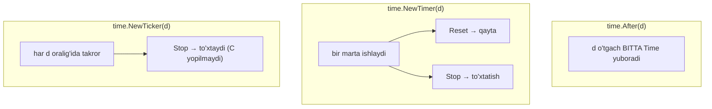
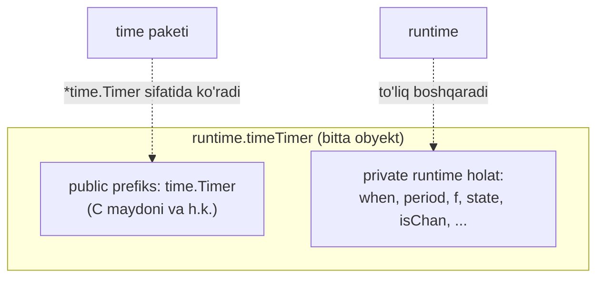
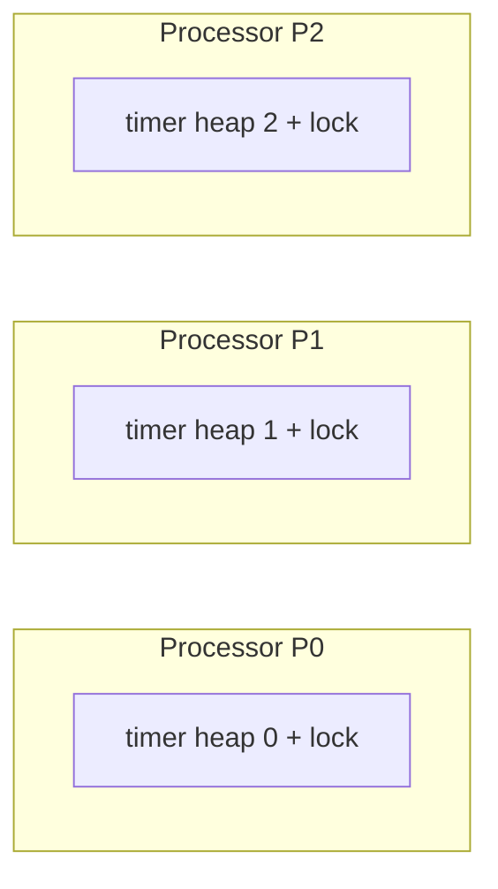
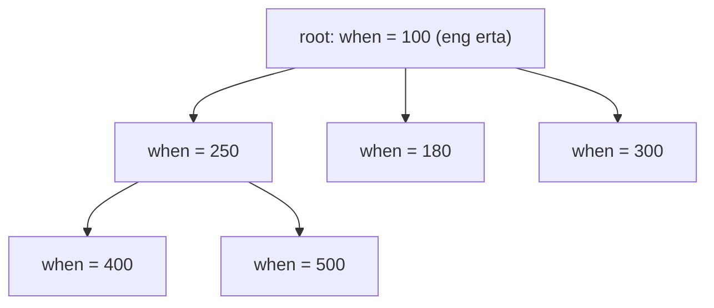
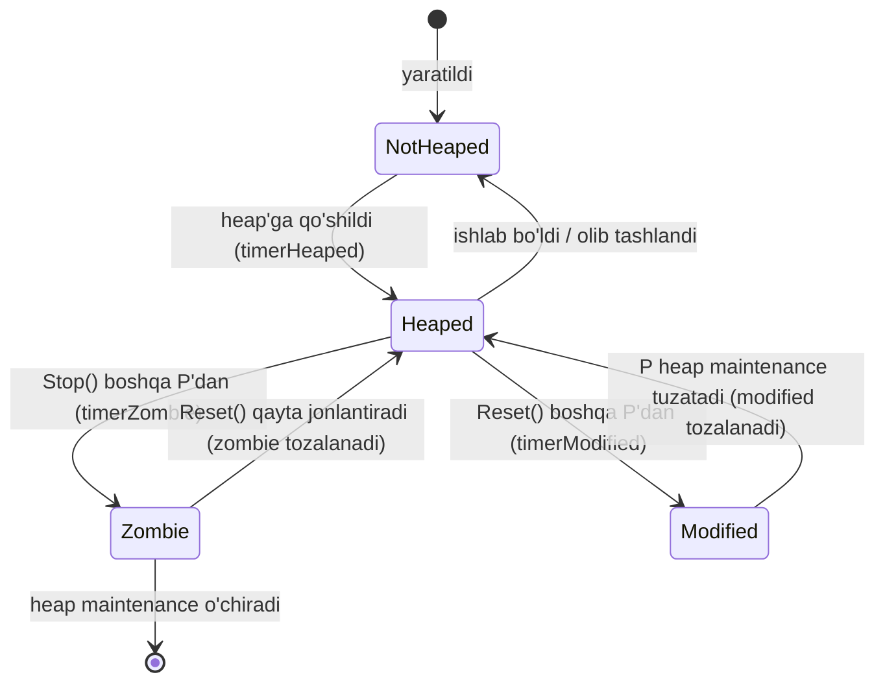
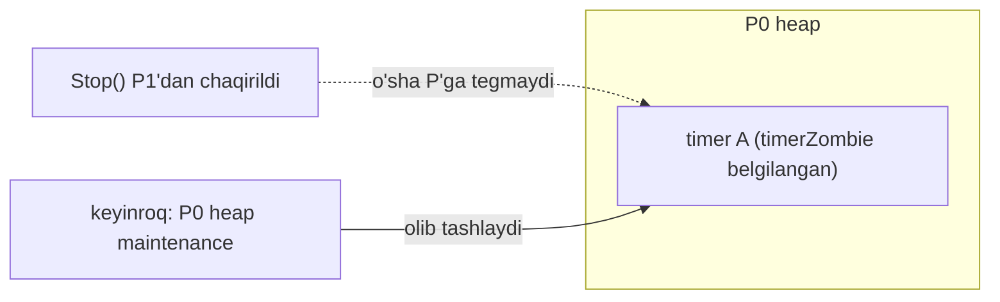
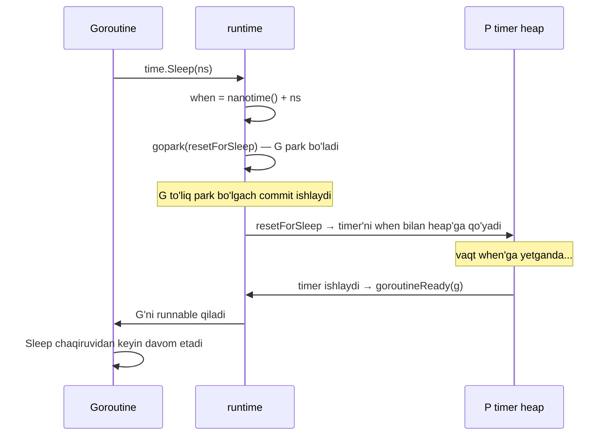
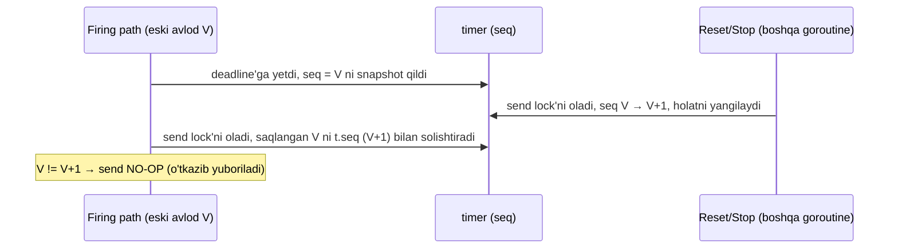
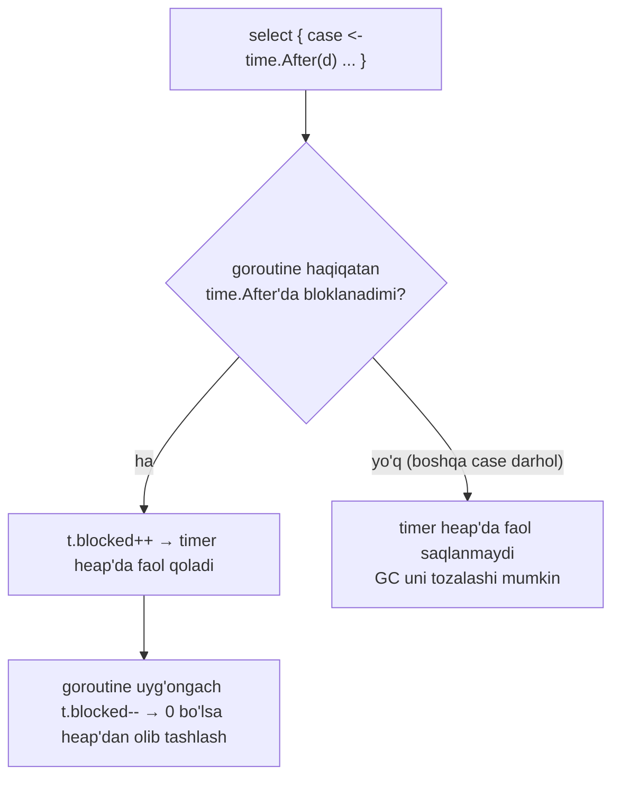

# 03 — Timer

> *The Anatomy of Go* (Phuong Le), 8-bob (Concurrency) asosida o'zbek tilida tayyorlangan o'quv qo'llanma. So'zma-so'z tarjima emas — o'qib tushunilgach o'z so'zlarim bilan qayta tushuntirilgan.

## Nima uchun bu mavzu muhim?

Go'da **timer** — biror vaqt kutib, so'ng hodisa sodir qilish usuli. `time.Sleep`, `time.After`, `time.NewTimer`, `time.NewTicker` — bularning hammasi ostida bitta runtime mexanizmi turadi. Va eng qizig'i: ular vaqt o'tganini **channel orqali** signal beradi. Shuning uchun timer [channel](01_channel.md) va [select](02_select.md) bilan tabiiy birlashadi (masalan timeout).

Bu bo'limda quyidagilarga javob beramiz:

- `time.After`, `NewTimer`, `NewTicker` orasidagi farq nima?
- Timer runtime ichida qanday saqlanadi? (per-P timer heap, min-heap)
- `timerHeaped`, `timerModified`, `timerZombie` holatlari nima uchun kerak?
- `time.Sleep` ostida nima sodir bo'ladi?
- Go 1.23 timer channel'lardagi "stale value" muammosini qanday hal qildi?

---

## Timer asoslari: After, NewTimer, NewTicker

### `time.After(d)`

`d` vaqt o'tgach **aynan bitta** `time.Time` qiymatini yetkazadigan channel qaytaradi:

```go
<-time.After(2 * time.Second) // taxminan 2 soniya kutadi
```

Bu `select` ichida pauza qilish yoki boshqa amalga vaqt chegarasi qo'yishning tez usuli.

### `time.NewTimer(d)`

`*time.Timer` yaratadi, uning `C` maydoni — `chan time.Time`. Timer bir marta ishlaganda joriy vaqtni `t.C`'ga yuboradi. `time.After`'dan farqi — biz **Timer obyektining o'zini** ushlab qolamiz, shuning uchun uni boshqarish mumkin:

```go
t := time.NewTimer(2 * time.Second)
<-t.C                  // ishlaguncha bloklanadi
t.Reset(3 * time.Second) // qayta ishlatish
<-t.C
t.Stop()               // to'xtatish
```

Timer **har sozlashda bir marta** ishlaydi. Yana ishlatish uchun `Reset` chaqiriladi.

### `time.NewTicker(d)`

**Takrorlanuvchi** timer. Uning ham `C` channel'i bor, lekin bir marta emas — `d` interval bilan **doimiy** vaqt qiymatlarini yetkazadi:

```go
ticker := time.NewTicker(time.Second)
defer ticker.Stop()
for t := range ticker.C {
    fmt.Println("tick at", t)
    if shouldStop() {
        break
    }
}
```

> **Nozik nuqta.** `ticker.Stop()` kelgusi tick'larni to'xtatadi, lekin `ticker.C`'ni **yopmaydi**. Shuning uchun kod odatda channel yopilishini kutmasdan, `break` bilan loop'dan aniq chiqadi.



### Go 1.23'gacha: stale value muammosi

Go 1.23'gacha channel-asosli timer'ning `t.C`'si amalda **sig'imi 1 bo'lgan buffered** channel edi. Agar timer ishlab, uning vaqt qiymati hali `t.C`'da tursa, `Stop` yoki `Reset` chaqirish o'sha navbatdagi qiymatni **avtomatik olib tashlamas edi**.

Natijada `t.C`'dan keyingi receive **eski** (oldingi ishlashdan qolgan) vaqt qiymatini qaytarishi mumkin edi. Shuning uchun 1.23'gacha xavfsiz shablon — `Stop`, kerak bo'lsa `t.C`'ni **drenaj** qilish, keyin `Reset`:

```go
t := time.NewTimer(1 * time.Second)
// ... birozdan keyin ...
if !t.Stop() {
    <-t.C // eski qiymatni drenaj qilish
}
```

### Go 1.23 va keyin: sodda

Endi channel-asosli timer'da `Stop` yoki `Reset` **qaytgandan keyin** `t.C`'dan receive **hech qachon eski qiymatni ko'rmaydi**. `Reset`'dan keyin kelajakdagi receive'lar **yangi** timer sozlamasiga mos keladi:

- Timer hali faol bo'lsa, `t.Reset(d)` **`true`** qaytaradi (mavjud timer qayta rejalashtirildi).
- `Reset` **`false`** qaytarsa — timer allaqachon ishlagan yoki to'xtatilgan edi. Lekin **bu holatda ham** `Reset`'dan keyingi receive eski qiymatni ko'rmaydi.

Runtime bu stale-value muammosini endi ichki hal qiladi (lekin oddiy kod kabi channeldan receive qilib emas — mexanizmni pastda ko'ramiz).

### `time.After` "leak" muammosi

`time.After`'ning yana bir mashhur tuzog'i — uni `select` ichida ishlatish. `select` timer ishlashidan **oldin** boshqa case bilan tugasa, `time.After` yaratgan timer tanlanmaydi, lekin **ishlaguncha yoki erishib bo'lmas holga kelguncha** mavjud bo'lib qoladi:

```go
for {
    select {
    case <-time.After(1 * time.Minute):
        // timeout
    case <-someOtherChannel:
        // boshqa hodisa
    }
}
```

Agar `select` doim `someOtherChannel`'ni tanlasa, har iteratsiyada yangi timer yaratiladi — loop'da vaqtincha **ko'p kutayotgan timer to'planishi** mumkin. Bu doimiy leak emas, lekin eski Go versiyalarida qisqa muddatli resurs to'planishiga o'xshardi.

**Go 1.23'dan boshlab bu ancha xavfsiz:** garbage collector endi **ishlashidan oldin ham** havolasi qolmagan timer'larni tozalay oladi (`time.After` yaratgan timer ham, agar qaytarilgan channel dasturdan erishib bo'lmas bo'lsa). Shu tariqa `select` loop ichida to'g'ridan-to'g'ri `time.After` ishlatilib, channel hech qayerda saqlanmasa — endi tashlab ketilgan timer'lar haqida tashvishlanmaymiz.

---

## Timer ichki tuzilishi (Internal Structure)

`time.Sleep(duration)` chaqirilganda ostida nima bo'ladi? Runtime shu goroutine uchun **timer** ishlatadi. Goroutine birinchi marta `time.Sleep` chaqirsa, runtime unga timer ajratib, goroutine'da saqlaydi. Keyingi sleep'lar shu timer'ni qayta ishlatadi.

Goroutine'ni uxlatish (`time.Sleep`), kelajakda bir marta ishlash (`time.Timer`) va belgilangan interval bilan takror ishlash (`time.Ticker`) — hammasi runtime'dagi **`timer`** strukturasi bilan boshqariladi:

```go
type timer struct {
    mu     mutex        // barcha maydonlarni himoya qiladi
    astate atomic.Uint8 // state bitlarining atomik snapshot'i
    state  uint8        // holat bitlari
    isChan bool         // channel-asosli timer'mi
    // ...
    when   int64        // qachon ishlashi (nanosekund)
    period int64        // > 0 bo'lsa shu interval bilan takrorlanadi
    f      func(arg any, seq uintptr, delay int64) // ishlaganда chaqiriladigan funksiya
    // ...
}
```

Asosiy maydonlar:

- **`when`** — timer qachon ishlashi (nanosekundda).
- **`period`** — noldan katta bo'lsa, timer bir marta emas, shu interval bilan **takrorlanadi**.
- **`f`** — timer ishlaganda runtime chaqiradigan funksiya. Masalan uxlayotgan goroutine'ni uyg'otish yoki channel-timer uchun vaqt qiymatini yuborish.
- **`isChan`** — channel-asosli timer bo'lsa `true`.
- **`state`** — ichki holat bitlari (heap'dami, o'chirishga belgilanganmi va h.k.).
- **`astate`** — shu bitlarning atomik snapshot'i, lock bo'shatilganda yangilanadi, ba'zi tezkor yo'llar lock olmasdan holatni ko'rishi uchun.

Timer o'tgach runtime uning `f(arg any, seq uintptr, delay int64)` funksiyasini chaqiradi. `arg` timer turiga bog'liq: `time.Sleep` uchun — uxlayotgan **goroutine** (keyin uni uyg'otish uchun); channel-asosli timer (`NewTimer`, `After`, `NewTicker`) uchun — vaqt qiymatini oladigan **channel**.

### `time.Timer` (public) vs `timer` (runtime)

`time.Timer` — biz Go kodda ishlatadigan **public** tur; `timer` — asl rejalashtirish/ishlash mantiqini amalga oshiruvchi **ichki runtime** turi. `time.NewTimer` runtime'ga bog'langan `newTimer`'ni chaqiradi:

```go
func NewTimer(d Duration) *Timer {
    c := make(chan Time, 1)
    t := newTimer(when(d), 0, sendTime, c, syncTimer(c))
    t.C = c
    return t
}

// sendTime — c ga joriy vaqtni NON-BLOCKING yuboradi.
func sendTime(c any, seq uintptr, delta int64) {
    select {
    case c.(chan Time) <- Now().Add(Duration(-delta)):
    default:
    }
}
```

Runtime bitta timer-asosli obyektni ajratadi. Uning **boshi** public `time.Timer` bilan bir xil joylashuvga ega — shuning uchun `time` paketi uni `*time.Timer` sifatida ishlatadi. Shu public prefiksdan keyin obyektda faqat runtime uchun qo'shimcha holat (ichki timer maydonlari) turadi:



### Per-P timer heap

Timer'larni oddiy goroutine'lar yaratadi, lekin ularni **runtime** boshqaradi. Barcha timer'larni bitta global strukturaga tashlash o'rniga, runtime ularni **processor'lar (P)** bo'ylab tarqatadi. Har bir P o'zining **timer heap**'iga (`p.timers`) va **o'z lock**'iga ega. Shuning uchun timer qo'shish, yangilash, tekshirish ko'pincha turli P'larda **parallel** bo'lishi mumkin — bitta markaziy timer lock'ga majburlanmaydi:



`time.Sleep`, `NewTimer`, `NewTicker` chaqirilganда runtime `when` maydonli timer yaratadi (yoki qayta ishlatadi) va uni biror P boshqaradigan timer heap'ga joylaydi.

> **Eslatma.** `time.Sleep` maxsus holatida har bir goroutine o'zining qayta ishlatiladigan `g.timer` maydoniga ega. Bu sleep timer ham boshqa timer'lar kabi rejalashtiriladi: goroutine uxlaganда runtime uning `when` qiymatini yangilab, uni P timer heap'iga qo'yadi.

Timer'lar `when` bo'yicha tartiblangan:

```go
type timers struct {
    mu   mutex        // per-P, lekin scheduler boshqa P timer'iga tegishi mumkin
    heap []timerWhen  // heap[i].when bo'yicha tartiblangan
    // ...
    zombies         atomic.Int32 // o'chirishga belgilangan timer'lar soni
    minWhenHeap     atomic.Int64 // heap'dagi eng erta 'when'
    minWhenModified atomic.Int64 // hali heap'da to'liq tuzatilmagan eng erta modified 'when'
}

type timerWhen struct {
    timer *timer
    when  int64
}
```

Har bir per-P timer to'plami **min-heap** (priority queue) sifatida `when` bo'yicha tashkil qilingan. Joriy runtime'da har bir tugun **4 tagacha bola**ga ega bo'lishi mumkin. Eng kichik `when`li timer tepada turadi, va har bir ota tugunning `when`'i bolalarinikidan **kichik yoki teng**. Shuning uchun keyingi ishlaydigan timer'ni topish odatda faqat **root**'ni tekshirish:



> Bu **xotira-ajratish** ma'nosidagi heap emas — bu **priority queue** sifatida ishlatiladigan heap ma'lumot tuzilmasi. Eng erta timer tepada turgani turli P'larга o'z heap'larini mustaqil boshqarishga yordam beradi.

---

## Timer holatlari (Timer States)

Runtime timer xatti-harakatini boshqarish uchun **uch holat biti** ishlatadi: **heaped** (`timerHeaped`), **modified** (`timerModified`), **zombie** (`timerZombie`). Bular **mustaqil** bayroqlar — bir vaqtda bir nechtasi yoqilgan bo'lishi mumkin.



### Heaped

`timerHeaped` yoqilgan bo'lsa — timer hozir biror P'ning timer heap'ida saqlanmoqda, ya'ni runtime timer tizimi uni faol kuzatmoqda. Yoqilmagan bo'lsa — timer hozir hech qanday heap'da yo'q: hali qo'shilmagan, ishlagach olib tashlangan yoki hozircha kuzatilishi shart emas. Ya'ni bu bayroq "bu timer hozir P timer heap'ida turibdimi?" degan savolga javob beradi.

### Zombie

Faraz qilaylik, `A` timer yaratildi va runtime uni `P0` heap'iga qo'ydi. Keyin `t.Stop()` **butunlay boshqa joydan** chaqirilishi mumkin: boshqa goroutine'dan yoki hatto boshqa processor'ga (`P1`) ko'chirilgan o'sha goroutine'dan. Ya'ni timer'ni to'xtatayotgan kod **timer turgan P'da ishlashi shart emas**.

Timer boshqa P heap'ida bo'lgani uchun runtime uni ixtiyoriy chaqiruvchidan **darhol o'sha heap'dan sug'urib olmaydi**. Buning o'rniga, timer heap'da bo'lsa, `Stop` uni **`timerZombie`** bilan belgilaydi — bu "timer o'lik deb hisoblansin, keyinroq heap maintenance vaqtida olib tashlansin" degani. Ya'ni **zombie timer** — hali fizik jihatdan biror heap'da turgan, lekin mantiqan endi ishlamasligi kerak bo'lgan timer.



### Modified

Modified — zombie'ga o'xshash, lekin **hali faol** va shunchaki **qayta rejalashtirilgan** timer uchun. Bu ko'pincha `Reset()`'da bo'ladi. `Reset()` timer'ning `when` qiymatini o'zgartirgach, heap `when` bo'yicha tartiblangani uchun tartibni **tuzatish** kerak bo'lishi mumkin.

Muammo zombie'nikiga o'xshash: `Reset()` chaqirayotgan goroutine `P1`'da bo'lishi mumkin, timer esa `P0` heap'ida. Boshqa P heap'ini darhol qayta tartiblash — runtime chetlaydigan ish. Shuning uchun `Reset()` heap yozuvini joyida qayta joylashtirmaydi. Buning o'rniga u timer'ning `when` maydonini o'z lock'i ostida yangilaydi va **`timerModified`** bitini qo'yadi: "bu timer'ning rejalashtirilgan vaqti o'zgardi, uning heap yozuvi endi eskirgan bo'lishi mumkin."

Timer heap'da qoladi, lekin saqlangan heap pozitsiyasi tuzatilishi kerakligi ma'lum. Keyinroq **egalik qiluvchi P** timer-heap maintenance ishlaganда, `timerModified` belgilangan timer'larni qidiradi, heap yozuvining saqlangan `when`'ini timer'ning yangi `t.when`'iga moslaydi, kerak bo'lsa heap tartibini tuzatadi va `timerModified` bayrog'ini tozalaydi.

> **Umumiy foydali pattern.** Ko'p goroutine lock bilan himoyalangan umumiy strukturaga tegsa, har bir yangilanishni **darhol chaqiruv joyida** bajarish ko'pincha xavfsiz yoki amaliy emas. Xavfsizroq yondashuv — o'zgarishni **bayroq bilan qayd etish**, so'ng keyinroq to'g'ri lock'ni ushlab turgan **maintenance bosqichi** tozalash/qayta tartiblashni bajarsin.

---

## Timer xatti-harakati (Behavior)

### `time.Sleep` ostida

`time.Sleep(ns int64)` chaqirilganda, agar davomiylik nol yoki manfiy bo'lsa — darhol qaytadi. Musbat bo'lsa, runtime joriy goroutine `g`'ni oladi. Chaqiruvchiga `Sleep` oddiy "kut-va-qayt" ko'rinadi, lekin ichki tomondan runtime **keshlangan sleep timer** (`g.timer`)dan foydalanadi:

```go
func timeSleep(ns int64) {
    if ns <= 0 {
        return
    }
    gp := getg()
    t := gp.timer
    if t == nil {
        t = new(timer)
        t.init(goroutineReady, gp) // g'ni uyg'otishni biladigan callback
        gp.timer = t
    }
    when := nanotime() + ns
    if when < 0 { // overflow tekshiruvi
        when = maxWhen
    }
    gp.sleepWhen = when
    gopark(resetForSleep, nil, waitReasonSleep, traceBlockSleep, 1)
}

func goroutineReady(arg any, _ uintptr, _ int64) {
    goready(arg.(*g), 0)
}

func resetForSleep(gp *g, _ unsafe.Pointer) bool {
    gp.timer.reset(gp.sleepWhen, 0)
    return true
}
```

Timer allaqachon bo'lsa — runtime uni qayta ishlatadi. So'ng goroutine `gopark()` bilan CPU'ni bo'shatadi. Goroutine haqiqatan park bo'lgach, kichik commit funksiyasi `resetForSleep` ishlaydi — u goroutine timer'ini hisoblangan uyg'onish vaqti bilan rejalashtiradi.



> **Tartib muhim.** Runtime timer'ni park bo'lishdan **oldin** qurollamaydi. Chunki juda qisqa sleep uchun timer callback'i goroutine to'liq uxlashidan **oldin** ishlab, uni uyg'otishga urinishi mumkin edi. Shuning uchun avval park, keyin timer'ni rejalashtirish.

### Timer o'zgarishi: uch xususiyat

Timer asosan uch xususiyatda o'zgaradi: **`when`** (qachon ishlashi), **`period`** (qanchalik tez-tez takrorlanishi), **`f`** (ishlaganда qaysi funksiyani chaqirishi).

- Timer **allaqachon heap'da** bo'lsa (faol yoki zombie) — runtime `timerModified` bitini qo'yadi. Zombie bo'lsa, zombie holatini tozalab **qayta jonlantiriladi**.
- Timer **hech qanday heap'da bo'lmasa** — runtime uni P timer heap'iga qo'shadi va min-heap tartibini tiklaydi.

### Timer'ni ertaroqqa surish

Timer avvalgidan **ertaroq** (yoki hatto hozir) ishlaydigan qilib o'zgartirilsa nima bo'ladi? Bu holatda runtime faqat lazy heap tozalashga tayana olmaydi — bu uyg'onishni juda kechiktirar edi.

Sabab: timer'ni ertaroq deadline'ga surish faqat heap-maintenance muammosi emas. U runtime'ning o'zi **keyingi safar qachon uyg'onishi** kerakligini ham o'zgartiradi. O'sha payt biror runtime yo'li eski eng-erta deadline asosida **kechroq** vaqtgacha uxlashga tayyorlanayotgan bo'lishi mumkin. Timer endi ertaroqqa ko'chsa, o'sha eski uyg'onish nishoni noto'g'ri.

Shuning uchun timer ertaroqqa surilganda runtime:

- Yangi deadline'ni timer'ga yozadi va timer'ni **heap tuzatishga muhtoj** deb belgilaydi.
- Bu yangi deadline runtime allaqachon ishlatmoqchi bo'lgan uyg'onish vaqtidan **ertaroqmi** tekshiradi. Ertaroq bo'lsa, o'sha kutish yo'lida uxlayotgan thread'ni **uyg'otadi**, toki u keyingi deadline'ni qayta hisoblasin (juda uzoq uxlab qolmasin).
- Agar timer-wait yo'lida hech qanday thread uxlamayotgan bo'lsa — runtime oddiy scheduling yo'liga qaytadi, unда biror ishlayotgan worker (thread) keyinroq timer'larni qayta tekshiradi.

Shundan keyin oddiy scheduler va timer yo'llari qayta ishlaydi: timer'larni qayta tekshiradi, modified heap yozuvlarini tuzatadi, deadline'i yetgan har qanday timer'ni **ishlatadi**. Timer ishlashi — yo uning callback'ini bajarish, yo shu timer'ni kutayotgan ishni uyg'otish.

> **Eslatma: netpoller bilan umumiy kutish yo'li.** Runtime timer'lar va network I/O uchun **umumiy kutish yo'li**ga ega. Timer uchun bitta, network hodisasi uchun boshqa kutish thread'i ishlatish o'rniga, runtime bir xil OS thread'ni **yo network hodisasi tayyor bo'lguncha, yo keyingi timer deadline'i kelguncha** uxlatishi mumkin. Ya'ni bu thread aslida `timers[0]` yetguncha yoki kamida bitta network hodisasi tayyor bo'lguncha kutadi.

---

## Go 1.23 dagi channel-asosli timer'lar

Channel-asosli timer `time.Sleep` bilan **bir xil** timer mexanizmasidan foydalanadi. Asosiy muammo: timer o'zgartirilganда (`Reset`/`Stop`) timer channel'i `t.C` **eski (stale) qiymat** yetkazmasligini ta'minlash — send o'zgarish bilan poyga qilishi mumkin. Uch stsenariyni ajratamiz:

- `Stop`/`Reset` timer **ishlashidan oldin** chaqiriladi — hali `t.C`'ga send boshlanmagan.
- `Stop`/`Reset` timer **ishlash paytida** chaqiriladi — send API chaqiruvi bilan poyga qilishi mumkin.
- `Stop`/`Reset` timer **ishlagach** chaqiriladi — eski qiymat allaqachon channel'da o'tirgan bo'lishi mumkin.

### 1) Ishlashdan oldin Stop/Reset

Eng sodda holat. Timer hali kelajakdagi deadline'ga ishora qiladi, `t.C`'ga send boshlanmagan.

- **`Stop`** — runtime timer'ni tozalaydi, endi ishlamaydi. Heap'da bo'lsa, `timerZombie` bilan belgilanadi (heap egasi keyinroq olib tashlasin).
- **`Reset`** — runtime yangi `when` yozadi va `timerModified` bilan belgilaydi (keyingi maintenance heap tartibini tuzatsin).

Bularning hammasi eski ishlash nuqtasi tugashiga **ruxsat berilmasdan oldin** bo'ladi. `t.C`'ga hech narsa qo'yilmagan, shuning uchun drenaj qilinadigan **stale qiymat yo'q**.

### 2) Ishlash paytida Stop/Reset — nozik poyga

Timer allaqachon "yuborish vaqti keldi" nuqtasiga yetgan, ayni paytda boshqa goroutine `Stop`/`Reset` chaqiradi. Buni runtime **generation** (avlod) qiymati bilan hal qiladi: har bir channel-timer konfiguratsiyasi `timer.seq`da avlod raqamini saqlaydi. Har `Stop`/`Reset` timer'ni o'zgartirganда `timer.seq` **oshiriladi** (V → V+1).

Timer deadline'ga yetganda ishlashga tayyorlanadi va **joriy seq'ni snapshot** qiladi. Lekin hali channelga yubormaydi. Haqiqiy send birozdan keyin, ishlash yo'li timer'ning **send lock**'ini olgach bo'ladi. Bu "yuborishга qaror qildim" va "hozir yuborayapman" orasida kichik **poyga oynasi** yaratadi. Xavfsiz hal qilish uchun runtime send'dan **darhol oldin** seq raqamlarini solishtiradi va oralig'da timer yangilangan bo'lsa send'ni **o'tkazib yuboradi**.



Manba kod (soddalashtirilgan):

```go
func (t *timer) unlockAndRun(now int64) {
    // ...
    // timer versiyasini snapshot bilan solishtirish;
    // modified bo'lsa send'ni tashlaymiz
    if !async && t.isChan {
        lock(&t.sendLock)
        if t.seq != seq {
            f = func(any, uintptr, int64) {} // no-op
        }
    }
    // channel-asosli bo'lsa channelga yuborish;
    // time.Sleep bo'lsa goroutine'ni uyg'otish
    f(arg, seq, delay)
    if !async && t.isChan {
        t.isSending.And(^isSendingClear)
        unlock(&t.sendLock)
    }
    // ...
}
```

Shu tariqa Go 1.23 default xatti-harakatida `Stop`/`Reset`'dan keyingi receive **eski avloddan** stale send'ni tasodifan ko'rmaydi.

### 3) Ishlagach Stop/Reset

Teskari tartib: timer avval send bosqichiga yetadi va `Stop`/`Reset` kelishidan **oldin** channel send'ni **yakunlaydi**. U eski ishlash allaqachon bo'lib bo'lgan. Keyingi `Stop`/`Reset` faqat kelajak uchun timer holatini o'zgartira oladi — **yakunlangan send'ni orqaga qaytara olmaydi**. Ya'ni seq yangilanishi tugagan send'ni bekor qilmaydi; u faqat hali yubormagan **in-flight** eski ishlashlarni stale qiymat yetkazishdan to'xtatadi.

Foydalanuvchi nuqtai nazaridan yangi semantika kuchliroq narsani xohlaydi: `Stop`/`Reset` **qaytgach**, o'sha eski timer qiymatini **umuman ko'rmaslik**. Bu 1.23'gacha odamlar ishlatgan qo'lda drenaj patterniga o'xshab ishlashi kerak:

```go
t := time.NewTimer(1 * time.Second)
if !t.Stop() {
    <-t.C
}
```

Go 1.23 xuddi shu **semantik natijani** beradi, lekin boshqacha usulda.

### "Fake unbuffered" channel

1.23'gacha timer channel'i oddiy sig'imi 1 buffered channel edi — eski qiymat buferda o'tirib, kod uni qo'lda drenaj qilishi kerak edi. 1.23'dan keyin timer channel'i **ostida hamon bir-elementli buffered** implementatsiyani ishlatadi, lekin runtime uni foydalanuvchiga **"soxta" unbuffered** channel qilib ko'rsatadi:

```go
func NewTimer(d Duration) *Timer {
    c := make(chan Time, 1) // ichki: sig'imi 1
    t := (*Timer)(newTimer(when(d), 0, sendTime, c, syncTimer(c)))
    t.C = c
    return t
}
```

Sig'imga qaraylik:

```go
func main() {
    t := time.NewTimer(10 * time.Second)
    println(cap(t.C))
}
// Chiqish:
// 0
```

Manba `make(chan Time, 1)` yaratadi, lekin kod `cap(t.C) == 0` ko'radi! Aynan shuning uchun bunga **fake unbuffered channel** deyiladi. Ichki tomondan bir slotli bufer, lekin runtime timer channel'larini maxsus hollaydi — `len` va `cap` ularni foydalanuvchiga **unbuffered kabi** ko'rsatadi.

**Nega bunday dizayn?** Amaliy sabab:

- Agar `Timer.C` haqiqiy unbuffered bo'lsa, timer ishlaganda runtime **aynan o'sha payt biror goroutine receive qilayotganini** kutishi kerak edi. Runtime timer ishlashini bunday bloklab qo'ya olmaydi — bitta bloklangan timer send boshqa timer'larni va runtime ishini kechiktiradi. Shuning uchun ichki tomondan buffered ishlatiladi.
- Agar `Timer.C` oddiy buffered channel bo'lsa, eski qiymat buferda **ko'rinib** turib, kod uni `len`/`cap` orqali sezib, o'sha buferlashga tayana boshlashi mumkin edi. 1.23 dizayni buni **ataylab yashiradi**.

Foydalanuvchiga ko'rinadigan unbuffered model yangi semantikaga yaxshiroq mos keladi:

- Unbuffered model — "keyinroq olinadigan eski navbatdagi qiymat yo'q" degan taassurot beradi.
- `Stop()`/`Reset()` send yo'li bilan sinxronlanib, eski holatning stale send'i chaqiruvdan keyin ko'rinmasligini ta'minlaydi.
- Aqliy model soddalashadi: `Stop` = keyinroq eski qiymat yo'q; `Reset` = keyingi qiymat yangi timer holatiga mos.

### `timer.blocked` — timer'ni kerakligicha heap'da saqlash

Eski `time.After` muammosi (timer ishlaguncha "osilib" turishi)ni 1.23 boshqacha hal qiladi. Channel-asosli timer (`timer.isChan`) faqat **biror goroutine haqiqatan o'sha timer channel'ida bloklangan** paytda P timer heap'ida turishi kerak. Hech kim `<-timer.C`'da bloklanmagan bo'lsa, runtime o'qilmagan buferli qiymatni saqlash uchun timer'ni heap'da tutib turishi shart emas.

Buning uchun timer **bloklangan-receiver sonini** (`timer.blocked`) yuritadi:

```go
type timer struct {
    // ...
    blocked uint32 // timer channelida bloklangan goroutine'lar soni
}
```

- Runtime goroutine haqiqatan timer channel'ida **bloklanishga tayyor** deb qaror qilганда (masalan `<-time.After(d)`'ni haqiqatan kutadigan `select` case), `t.blocked`'ni **oshiradi**.
- Simmetrik ravishda, bloklangan goroutine **endi bloklanmasa**, runtime `t.blocked`'ni **kamaytiradi**:

```go
func unblockTimerChan(c *hchan) {
    t := c.timer
    t.lock()
    // ...
    t.blocked--
    if t.blocked == 0 && t.state&timerHeaped != 0 && t.state&timerZombie == 0 {
        // Bu timer'da bloklangan oxirgi goroutine edi.
        // Heap'dan o'chirishga belgilaymiz, lekin t.when'ni
        // tozalamaymiz — u qachon ishlashi kerakligini bilamiz.
        // ...
    }
}
```

Shu tariqa `select { case <-time.After(1*time.Minute): default: ... }` da default darhol ishlasa, goroutine timer channel'ida **hech qachon bloklanmaydi** — timer obyekt yaratilsa ham, faqat channel mavjudligi uchun P heap'ida faol qolib ketmaydi.



---

## Eslab qol

- **`time.After`** — bir martalik channel; **`NewTimer`** — boshqariladigan bir martalik (Reset/Stop); **`NewTicker`** — takrorlanuvchi (`Stop` `C`'ni yopmaydi).
- **Hammasi channel orqali signal beradi** → `select` + timeout bilan tabiiy birlashadi.
- **Timer'lar per-P heap'da** min-heap (priority queue) sifatida `when` bo'yicha saqlanadi. Har P o'z lock'i bilan — parallel.
- **Uch holat biti:** `timerHeaped` (heap'da), `timerModified` (Reset qayta rejalashtirdi), `timerZombie` (Stop o'lik qildi). Mustaqil, keyinroq maintenance tozalaydi.
- **Pattern:** boshqa P heap'iga darhol tegmay — bayroq qo'yib, keyin egasi P maintenance vaqtida tuzatadi.
- **`time.Sleep`** avval park, keyin timer'ni rejalashtiradi (`resetForSleep` commit) — juda qisqa sleep'da erta uyg'onishning oldini oladi.
- **Go 1.23:** stale value yo'q. `timer.seq` avlod bilan poyga hal qilinadi (send'dan oldin seq solishtiriladi).
- **Fake unbuffered:** ichida `make(chan Time, 1)`, lekin `cap(t.C) == 0`. Ichki bufer — ish qulayligi; foydalanuvchiga unbuffered — toza semantika.
- **`timer.blocked`** — channel timer faqat kimdir `<-t.C`'da bloklanganda heap'da faol qoladi; GC 1.23'da tashlab ketilgan timer'ni tozalaydi.

## Tez-tez uchraydigan xatolar

- **`ticker.Stop()` `C`'ni yopadi deb o'ylash** — yo'q, yopmaydi. Loop'dan `break` bilan aniq chiqing.
- **`time.After`'ni issiq loop ichida ishlatish** (Go 1.23'gacha) — timer'lar to'planishi mumkin. 1.23'da xavfsizroq, lekin `NewTimer` + `Reset` ko'pincha aniqroq.
- **1.23'gacha `Stop`/`Reset`'dan keyin drenaj qilmaslik** — `t.C`'dan stale qiymat kelishi mumkin. `if !t.Stop() { <-t.C }` patternini eslang.
- **`Ticker`'ni `Stop` qilmaslik** — resurs sarfi. `defer ticker.Stop()`.
- **`NewTimer` o'rniga `time.After`'ni takror ishlatish** — har chaqiruvda yangi timer; boshqarish kerak bo'lsa `NewTimer`.

## Amaliyot

1. **Fake unbuffered isboti.** `t := time.NewTimer(...)` yaratib `cap(t.C)` va `len(t.C)`'ni chop eting. Manba `make(chan Time, 1)` bo'lsa ham nega `cap == 0` ekanini o'z so'zingiz bilan tushuntiring.
2. **Ticker vs Timer.** Bir dasturда 3 marta ishlaydigan `Ticker` va `Reset` bilan 3 marta ishlaydigan `Timer` yozing. Ikkalasining ish oqimini `fmt.Println` bilan solishtiring.
3. **Timeout pattern.** `select` bilan `resultCh` yoki `time.After(500ms)`'dan qaysi biri oldin kelsa o'shani qayta ishlaydigan funksiya yozing. Ba'zan ishni ataylab sekinlatib, timeout case'ni ishlatib ko'ring.
4. **Stale value (tarixiy).** Go 1.23'gacha `Stop`/`Reset`'da stale qiymat qanday paydo bo'lishini diagramma bilan tasvirlang, so'ng `timer.seq` mexanizmi buni qanday to'xtatishini tushuntiring.

---

[← 02 Select](02_select.md) | [README →](README.md)
