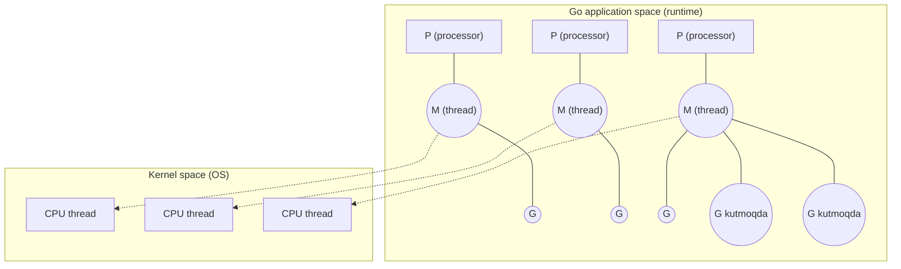
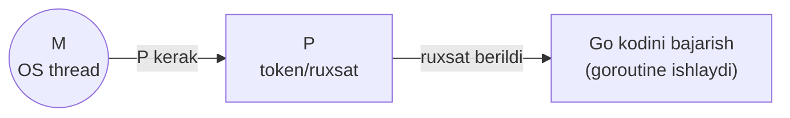
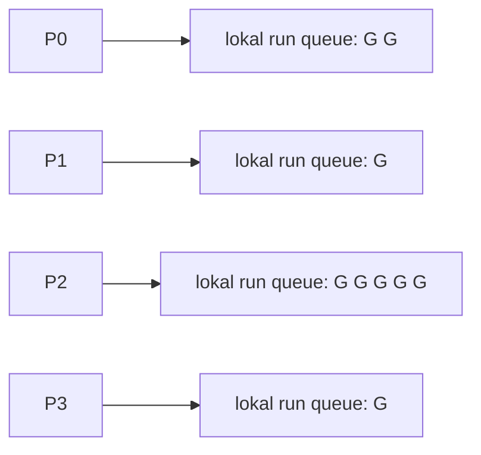
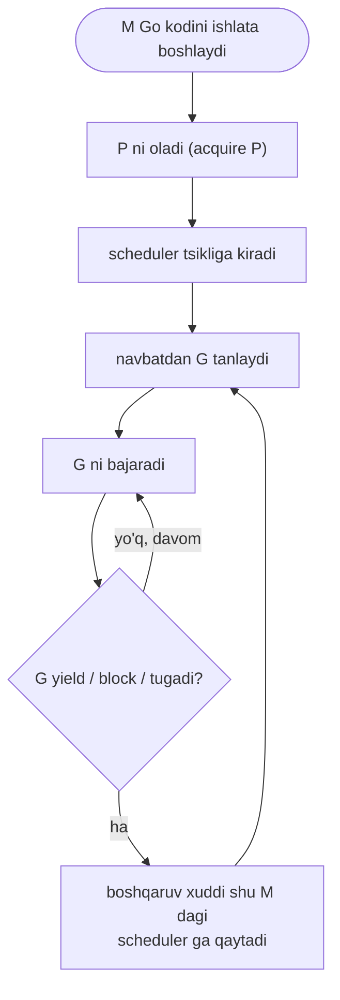
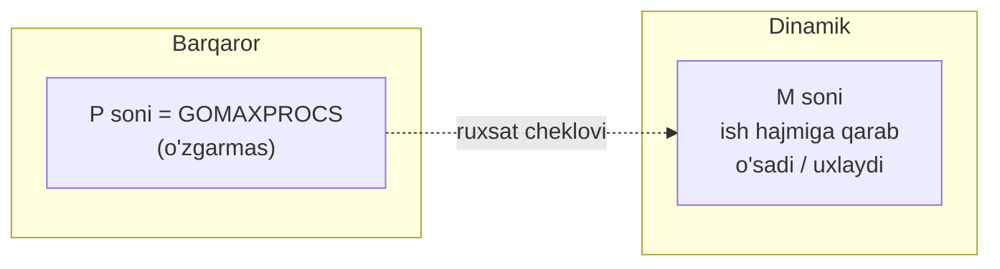

# 04 — M-P-G Model

> Ushbu material — **The Anatomy of Go** (Phuong Le) kitobining 8-bobi (Concurrency) asosida o'zbek tilida tayyorlangan o'quv qo'llanma. Bu yerda mavzu asl matndan so'zma-so'z ko'chirilmagan, balki o'qib tushunilgandan keyin **o'z so'zlarim bilan** qayta tushuntirilgan.

## Nima uchun bu mavzu muhim?

Go'da siz shunchaki `go f()` yozasiz va minglab goroutine yaratasiz. Lekin savol tug'iladi: OS (operatsion tizim) sizga hammasi bo'lib 8 yoki 16 ta CPU yadro bergan bo'lsa, Go qanday qilib **yuz minglab** goroutine'ni shu yadrolarda ishlatadi?

Javob — **M-P-G modeli**. Bu Go runtime'ining eng markaziy abstraktsiyasi. Uni tushunmasangiz, keyingi bo'limlar (scheduler, syscall handoff, work stealing) qorong'u qoladi. Bu bo'lim quyidagi savollarga javob beradi:

- Nega Go har bir goroutine'ni to'g'ridan-to'g'ri OS thread'iga bog'lamaydi?
- `GOMAXPROCS` aslida nimani boshqaradi?
- Nega goroutine arzon, lekin thread qimmat?
- Go kodini ishlatish uchun aynan nima kerak?

## Umumiy tasavvur: uchta qatlam

Go har bir goroutine'ni to'g'ridan-to'g'ri bitta OS thread'iga moslashtirmaydi. Buning o'rniga u **uchta qatlam** kiritadi:

| Belgi | To'liq nomi | Nima u? |
|-------|-------------|---------|
| **G** | Goroutine | Bajarilishi kerak bo'lgan **ish** (funksiya + stack + holat) |
| **P** | Processor | Go kodini ishlatishga ruxsat beruvchi runtime **tokeni** |
| **M** | Machine (OS thread) | CPU yadroda haqiqatan ishlaydigan **OS thread** |

Bu uchta qatlam Go'ga imkon beradi: nisbatan kichik va boshqariladigan OS thread'lar to'plamida yuz minglab goroutine'ni ishlatish, shu bilan birga bir nechta CPU yadrodan foydalanish.



Diagrammada ko'rinib turibdi: goroutine'lar ko'p (G), lekin ular kichikroq thread'lar to'plamiga (M) "ko'paytirilib" (multiplex) beriladi. Har bir M ishlashi uchun bitta P kerak.

## G — Goroutine (ish birligi)

Goroutine — **yengil, foydalanuvchi-fazosidagi (user-space) ijro konteksti**. Uning o'z narsalari bor:

- o'z **stack**'i (o'suvchi/kichrayuvchi),
- o'z **program counter** (PC — hozir qayerda turgani),
- o'z runtime hisob-kitobi (bookkeeping).

Ammo goroutine OS thread bilan **bir-birga-bir (1:1)** mos kelmaydi. Runtime nuqtai nazaridan **G — bajarilishi kerak bo'lgan ish**: bu funksiya chaqiruvi, uning steki va runtime holatidan iborat.

Goroutine'lar `go` kalit so'zi bilan **juda arzon** yaratiladi (boshlang'ich stek atigi 2 KiB). Shuning uchun ularni yuz minglab yaratish mumkin. Scheduler'ning vazifasi — bu ulkan miqdordagi goroutine'larni ancha kichikroq thread hovuziga taqsimlash (multiplex qilish).

> **Analogiya:** G — bu bajariladigan "topshiriq varaqasi". Uni yozib qo'yish arzon. Kim uni bajaradi — bu keyingi savol.

## P — Processor (ruxsat tokeni)

Goroutine'lar va OS thread'lar orasida **P** turadi. P — bu Go runtime ichidagi **mantiqiy rejalashtirish resursi**.

Muhim: **P — bu fizik CPU yadro EMAS.** U hardware ma'nosida yadro emas. U — OS thread (M) Go kodini bajarish uchun **ushlab turishi shart bo'lgan runtime tokeni**.



### P soni parallellikni boshqaradi

P'lar soni — bir vaqtda **parallel** Go kodi bajara oladigan goroutine'lar sonini belgilaydi. Shuning uchun:

- **CPU-bound** (hisob-og'ir) ish uchun P sonini mavjud CPU soniga yaqin qo'yish odatda eng yaxshi tanlov. Aynan shuning uchun **`GOMAXPROCS` odatda mavjud CPU soni yaqinida boshlanadi**.
- Agar P'ni **kamroq** qo'ysangiz — parallel ishlaydigan Go kodi kamayadi.
- Agar P'ni **ko'proq** qo'ysangiz — odatda CPU o'tkazuvchanligi oshmaydi, chunki OS'da baribir shuncha yadro bor. Ortiqcha P faqat rejalashtirish yukini (scheduling overhead) oshiradi.

### Har bir P — o'z lokal navbatiga ega

Har bir P o'zining kichik **lokal run queue**'siga (ishga tayyor goroutine'lar navbati) ega. Undan tashqari P bir qator **per-P keshlarni** olib yuradi:

- memory-allocation keshlar (`mcache`),
- `sudog` keshlar,
- boshqa scheduler-lokal ma'lumotlar.



Bu **dizayn tanlovi juda muhim**: barcha ishga tayyor goroutine'larni bitta global navbat orqali o'tkazish o'rniga, har bir P ko'p vaqt o'z lokal navbati bilan ishlaydi. Buning ikki foydasi bor:

1. **Contention** (bir resurs uchun kurash) keskin kamayadi — global qulf kamroq kerak bo'ladi.
2. **Cache locality** yaxshilanadi — bog'liq ish bir xil P'da qoladi.

## M — Machine / OS thread (haqiqiy ijrochi)

Eng pastda **M** — OS thread turadi. Aynan **OS** thread'larni CPU yadrolarga rejalashtiradi va ularga ijro vaqtini beradi.

Muhim nuqta: **M o'zi yolg'iz Go kodini bajara olmaydi.** Kernel nuqtai nazaridan aynan M fizik ravishda ko'rsatmalarni bajaradi, lekin Go runtime undan avval **P bilan juftlashishni** talab qiladi.

Xuddi shu tarzda, **P ham yolg'iz oldinga siljiy olmaydi** — unga hozir biriktirilgan va scheduler tsiklini ishlatayotgan M kerak. Ya'ni:

- **M** — OS haqiqatan CPU yadroda rejalashtiradigan narsa.
- **P** va **G** — shuning ustiga qurilgan runtime abstraktsiyalari.

## Asosiy invariant: M + P → Go kodi

Modelning asosiy qoidasi oddiy:

> **Go kodini ishlatish uchun runtime'ga bitta M bitta P'ga biriktirilgan bo'lishi kerak.**

Bu **M-P juftligi** keyin P'ning lokal navbatidan (va ba'zan boshqa joylardan) goroutine'larni oladi va bajaradi. Jarayon quyidagicha:



Bu **qattiq tsikl** (tight loop) — Go'ning ko'plab goroutine'ni oz sonli thread'da ko'paytirishining qalbi. G yield qilsa, bloklansa yoki tugasa, boshqaruv xuddi shu M'dagi scheduler'ga qaytadi, u esa xuddi shu P'da keyingi goroutine'ni tanlaydi. P bu yerda har-CPU navbatlar va keshlarni ta'minlab, lokal rejalashtirishni tez qiladi.

## Thread'lar dinamik, P'lar barqaror

Dastur ishlayotganda runtime **M'larni dinamik** boshqaradi:

- Agar runtime ishga tayyor ish borligini, lekin uni bajarishga thread yetishmayotganini sezsa (masalan, ba'zi thread'lar syscall'da bloklangan) — u yangi M **yaratadi** yoki uxlab yotgan M'ni **uyg'otadi (unpark)**.
- Ish kamaysa — resursni tejash uchun M'larni **uxlatadi (park)**.

Lekin bularning barchasi davomida **P'lar soni o'zgarmaydi** — `GOMAXPROCS` o'zgartirilmaguncha.



## Tashvishlarni ajratish (separation of concerns)

Konseptual jihatdan M-P-G modeli mas'uliyatlarni toza ajratadi:

- **G (goroutine)** — dastur bajarmoqchi bo'lgan **mantiqiy vazifalar**.
- **P (processor)** — runtime'ning "qancha Go kodi parallel ishlashi mumkin" degan **nuqtai nazari**; per-CPU navbatlar va keshlarni olib yuradi.
- **M (thread)** — hardware'da ko'rsatmalarni haqiqatan bajaradigan **OS thread'lari**.

Bu uch qatlamni bir-biridan ajratib, Go quyidagilarga erishadi:

- juda yuqori concurrency,
- yaxshi CPU utilizatsiyasi,
- bloklovchi amallar (syscall va h.k.) atrofida oqilona xatti-harakat —

va bularning hammasi dasturchini to'g'ridan-to'g'ri OS thread'lar bilan o'ylashga majburlamasdan.

## GOMAXPROCS bilan amaliy tajriba

`runtime.GOMAXPROCS(n)` P sonini o'qish yoki o'zgartirish uchun ishlatiladi. Quyidagi misol shuni ko'rsatadi:

```go
package main

import (
    "fmt"
    "runtime"
)

func main() {
    // Mavjud CPU soni (osinit tomonidan aniqlangan ncpu)
    fmt.Println("NumCPU:", runtime.NumCPU())

    // Joriy GOMAXPROCS (P soni). GOMAXPROCS(-1) faqat o'qiydi, o'zgartirmaydi.
    fmt.Println("GOMAXPROCS (P soni):", runtime.GOMAXPROCS(-1))

    // Nechta OS thread borligini bilvosita ko'rsatuvchi son emas,
    // lekin goroutine soni — istagancha ko'p bo'lishi mumkin.
    fmt.Println("Goroutine soni:", runtime.NumGoroutine())
}
```

Odatiy chiqish (mashinaga qarab farq qiladi, masalan 8 yadroli mashinada):

```
NumCPU: 8
GOMAXPROCS (P soni): 8
Goroutine soni: 1
```

Bu yerda `NumCPU` — mavjud yadrolar, `GOMAXPROCS` — P soni (odatda ncpu'ga teng), `NumGoroutine` esa hozir tirik goroutine'lar (main goroutine). E'tibor bering: OS thread'lar (M) soni bevosita ko'rsatilmaydi, chunki u dinamik.

## Eslab qol

- **G** — bajariladigan ish (funksiya + stack + holat), OS thread bilan 1:1 emas, juda arzon yaratiladi.
- **P** — Go kodini bajarish uchun kerak bo'lgan **runtime tokeni**, fizik yadro emas. P soni parallellikni belgilaydi.
- **M** — haqiqiy OS thread, CPU yadroda ishlaydi, lekin P'siz Go kodini bajara olmaydi.
- **Asosiy invariant:** Go kodini ishlatish uchun **M + P** kerak. Bu juftlik navbatdan G tanlaydi.
- Har bir P o'z **lokal run queue** va per-P keshlariga ega — bu contention'ni kamaytiradi va cache locality'ni yaxshilaydi.
- **M'lar dinamik** (yaratiladi/uxlaydi), **P'lar barqaror** (`GOMAXPROCS`).
- `GOMAXPROCS` odatda mavjud CPU soniga yaqin — CPU-bound ish uchun eng yaxshi standart.

## Tez-tez uchraydigan xatolar

### 1. "GOMAXPROCS = thread soni" deb o'ylash

`GOMAXPROCS` — bu **P** soni (parallel Go kodi chegarasi), OS thread (M) soni emas. Thread'lar bundan ko'p ham, kam ham bo'lishi mumkin (masalan, ko'p thread syscall'da bloklangan bo'lsa, thread ko'p bo'ladi).

### 2. "Ko'proq P = tezroq" deb o'ylash

Yadrolardan ko'p P qo'yish odatda tezlik bermaydi, faqat scheduling overhead qo'shadi. CPU-bound ish uchun P ≈ NumCPU eng yaxshi.

### 3. "Goroutine = thread" deb o'ylash

Goroutine juda yengil (2 KiB stack). Thread esa OS resursi (odatda MB'larda stack). Yuz minglab goroutine — normal; yuz minglab thread — muammo.

### 4. Blocking syscall P'ni "yeb qo'yadi" deb qo'rqish

Aksincha — Go syscall paytida P'ni M'dan ajratib, boshqa M'ga beradi (buni keyingi bo'limlarda ko'ramiz). Shuning uchun bitta bloklangan thread butun parallellikni to'xtatib qo'ymaydi.

## Amaliyot

### 1-mashq: GOMAXPROCS ta'sirini o'lchash

CPU-bound ish (masalan, katta sondagi kvadrat ildizlarni hisoblash) yozing va uni `runtime.GOMAXPROCS(1)`, keyin `runtime.GOMAXPROCS(4)` bilan ishga tushirib, vaqtni `time.Since` bilan solishtiring. Nega farq bor (yoki yo'q)?

### 2-mashq: Goroutine va thread nisbati

100 000 ta goroutine yarating (har biri `time.Sleep` qilib turadigan), `runtime.NumGoroutine()` chiqaring. Keyin o'ylang: nega 100 000 ta OS thread yaratilmadi?

### 3-mashq: M-P-G'ni chizib bering

`GOMAXPROCS = 2` bo'lganda, 5 ta CPU-bound goroutine ishga tushsa — qancha G bir vaqtda **haqiqatan** ishlaydi, qanchasi navbatda kutadi? O'z so'zlaringiz bilan diagramma chizing.

### 4-mashq: Invariantni tekshiring

"Go kodini ishlatish uchun M+P kerak" degan invariantdan kelib chiqib: agar barcha P'lar band bo'lsa, yangi `go f()` bilan yaratilgan goroutine darhol ishlaydimi yoki navbatga tushadimi? Nega?

---

[← 03 Timer](03_timer.md) | [Keyingi: 05 Runtime Startup →](05_runtime_startup.md)
