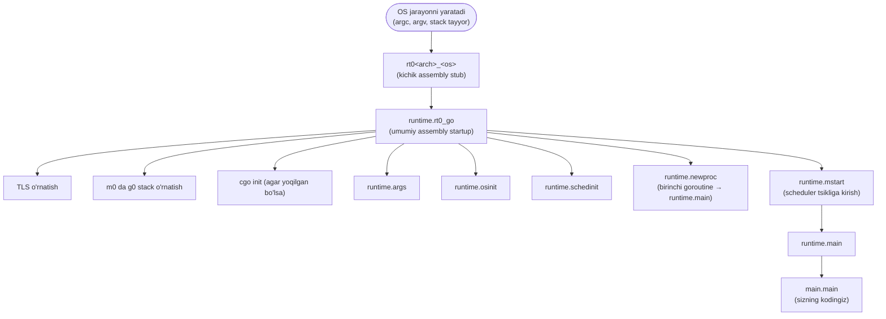
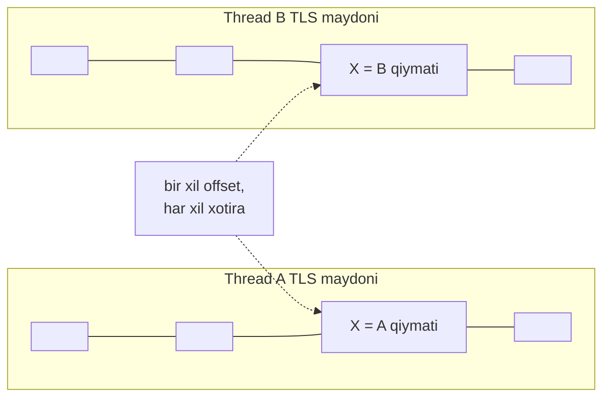
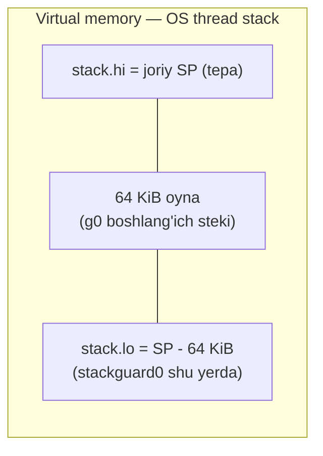
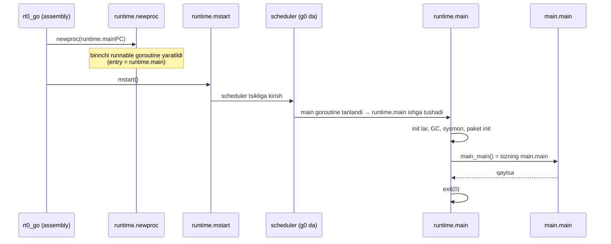

# 05 — Runtime Startup Sequence (Runtime'ning ishga tushishi)

> Ushbu material — **The Anatomy of Go** (Phuong Le) kitobining 8-bobi asosida o'zbek tilida tayyorlangan o'quv qo'llanma. Asl matn so'zma-so'z tarjima qilinmagan, balki tushunilib **o'z so'zlarim bilan** qayta bayon qilingan.

## Nima uchun bu mavzu muhim?

Ko'p dasturchi `main()` — dasturning birinchi kodi deb o'ylaydi. Aslida bu **noto'g'ri**. `main()`gacha runtime ulkan tayyorgarlik ishini bajaradi: OS'dan boshqaruvni oladi, thread holatini quradi, TLS o'rnatadi, heap allocator'ni ishga tushiradi, GC'ni yoqadi va faqat shundan keyin sizning `main.main`'ingizni chaqiradi.

Bu bo'limda biz **butun yo'lni** kuzatamiz: OS jarayonni yaratgan lahzadan to birinchi goroutine `main.main`'ni ishga tushirgunicha. Bu quyidagilarni tushunishga yordam beradi:

- `os.Args` qayerdan keladi?
- `runtime.NumCPU()` qiymatini qaysi bosqichda oladi?
- `g0` (system goroutine) nima va u qachon quriladi?
- Nega `main.main` `g0`da emas, oddiy goroutine'da ishlaydi?

## Umumiy manzara: startup yo'li



## 1-bosqich: `rt0<arch>_<os>` — haqiqiy kirish nuqtasi

Go'da `main` funksiyamiz dastur boshlanganida **birinchi ishlaydigan kod emas**. Haqiqiy kirish nuqtasi runtime ichida bo'lib, jarayonni Go kodi ishlay oladigan holatga keltiruvchi past-darajali ishni bajaradi.

Bu kirish nuqtasi — maqsad OS va arxitektura uchun tanlangan **kichik assembly funksiya**, odatda `rt0<arch>_<os>` deb nomlanadi. Masalan:

- AMD64 Linux'da — `_rt0_amd64_linux`
- ARM64 macOS'da — `_rt0_arm64_darwin`

Bu stub'lar platformalar bo'yicha biroz farq qiladi, lekin barchasi bir xil asosiy ishni bajaradi:

1. boshlang'ich OS thread'da boshlanadi,
2. OS bergan startup holatini (`argc`, `argv`) meros oladi,
3. boshqaruvni umumiy startup yo'li — `rt0_go`'ga topshiradi.

```go
// Pseudo-kod (darwin/arm64 stub'i)
func _rt0_arm64_darwin() {
    f := runtime.rt0_go
    f()          // odatda bu yerdan qaytmaydi
exit:
    R0 = 0       // chiqish kodi
    R16 = 1      // syscall raqami (sys_exit)
    trap_to_kernel() // to'g'ridan-to'g'ri sys_exit(0)
    goto exit
}
```

Boshqaruv bu stub'ga yetganda, OS **allaqachon** boshlang'ich thread yaratgan, uning stekini o'rnatgan va platforma ABI'siga ko'ra `argc`, `argv` va boshqa holatni joylashtirgan. Ya'ni bu kodning vazifasi — **xom OS jarayon dunyosidan Go runtime dunyosiga o'tish**.

> **NOTE — argc va argv nima?**
> C uslubidagi dasturlarda startup kodi buyruq qatori argumentlarini shu tarzda oladi:
> - `argc` — argumentlar sonini bildiruvchi butun son.
> - `argv` — C string'lar (`char*`) massivi.
> Kelishuvga ko'ra `argv[0]` — dastur nomi/yo'li, `argv[1]`, `argv[2]` esa — undan keyingi argumentlar.
> `./app hello world` → `argc = 3`, `argv = ["./app", "hello", "world"]`. Go'ning `os.Args`'i ham aynan shu startup ma'lumotidan quriladi.

### ARM64 va AMD64 farqi

**ARM64 (darwin)'da** stub juda kichik: `rt0_go` manzilini registrga yuklaydi va o'tadi. Bu ishlaydi, chunki platforma ABI'si dasturga argumentlarni `rt0_go` kutgan registrlarda beradi — `R0` da `argc`, `R1` da `argv`.

**AMD64'da** boshqacha. Boshlang'ich stek `argc`'ni `0(SP)`'da, `argv`'ni `8(SP)`'dan boshlab ushlaydi. Shuning uchun stub avval ularni registrlarga ko'chiradi:

```asm
// _rt0_amd64 — ko'p amd64 tizimlar uchun umumiy startup kod.
// Stek argument sonini va C-uslubdagi argv ni ushlab turadi.
TEXT _rt0_amd64(SB),NOSPLIT,$-8
    MOVQ    0(SP), DI   // argc ni DI ga
    LEAQ    8(SP), SI   // argv manzilini (SP+8) SI ga
    JMP     runtime·rt0_go(SB)
```

Aytaylik `SP = 1000` va buyruq qatori `./prog one two`. U holda boshlang'ich stek xotirada taxminan quyidagicha:

```
Virtual xotira        Boshlang'ich stek (manzil)
  "two\0"                 5020
  "one\0"                 5010
  "./prog\0"              5000
   ...
argv[2] = 5020            1024
argv[1] = 5010            1016
argv[0] = 5000            1008
argc    = 3               1000 (SP)
```

`_rt0_amd64` ishlagach: `DI = 3` (argument soni), `SI = 1008` (argv massivining boshi). Agar `rt0_go` SI orqali xotirani o'qisa, `argv[0]`'ni 1008'da, `argv[1]`'ni 1016'da, `argv[2]`'ni 1024'da ko'radi. Ularning har biri — haqiqiy string baytlariga ko'rsatkich.

Odatda `rt0_go` **hech qachon** stub'ga qaytmaydi; stub'dagi `exit:` yorlig'i faqat **xavfsizlik to'ri** — agar `rt0_go` negadir qaytib qolsa, jarayonni `sys_exit` bilan majburan tugatadi.

## 2-bosqich: `runtime.rt0_go` — argc/argv'ni saqlash

`runtime.rt0_go` ham assembly'da yozilgan. Aynan shu yerda runtime o'zining haqiqiy initsializatsiyasini boshlaydi.

`rt0_go` boshlanganda argumentlar registrlarda (ARM64: R0/R1, AMD64: DI/SI). Lekin **registrlar — vaqtinchalik ishchi joy**: keyingi ko'rsatmalar va funksiya chaqiruvlari ularni qayta ishlatadi. Runtime esa `argc`/`argv`'ga keyin ham muhtoj. Shuning uchun `rt0_go` ularni **stekka** ko'chiradi:

```asm
TEXT runtime·rt0_go(SB),NOSPLIT|TOPFRAME,$0
    // SP = stack; R0 = argc; R1 = argv
    SUB     $32, RSP
    MOVW    R0, 8(RSP)   // argc ni stekka saqlash
    MOVD    R1, 16(RSP)  // argv ni stekka saqlash
```

## 3-bosqich: Thread-Local Storage (TLS)

Keyingi qadam — **Thread-local Storage (TLS)** o'rnatish.

### TLS nima?

Oddiy dasturda **global o'zgaruvchi** butun jarayon uchun **bitta umumiy** nusxaga ega. Barcha thread'lar bir xil xotira joyini o'qiydi/yozadi — bir thread yozgan qiymatni boshqasi ko'radi.

**TLS boshqacha ishlaydi.** O'zgaruvchi nomi kodda bir xil ko'rinsa ham, **har bir OS thread shu qiymat uchun o'zining alohida saqlash joyini** oladi:

- Thread A `X`'ni o'qisa — A'ning shaxsiy qiymatini oladi.
- Thread B **aynan shu** `X`'ni o'qisa — B'ning boshqa xotiradagi shaxsiy qiymatini oladi.



Buning uchun OS har bir thread'ga o'z TLS maydonini beradi. Kod TLS qiymatiga murojaat qilganda: **joriy thread'ning TLS base manzilidan** boshlab, o'zgaruvchining **fiksatsiyalangan offset**'ini qo'shib, o'sha joydagi xotiraga kiradi. Bir xil TLS o'zgaruvchisi barcha thread'lar uchun bir xil offset ishlatadi, lekin base har xil.

### TLS'ni kim yaratadi? (crash course)

Agar Go dasturi **cgo'siz**, sof Go bo'lib Linux'da ishlasa, runtime OS thread'larni o'zi `clone` syscall bilan yaratadi va TLS'ni ham o'zi sozlaydi. Linux x86-64'da ikkita muhim lahza:

- **Boshlang'ich thread** uchun — `arch_prctl(ARCH_SET_FS, addr)` bilan kernel'ga qaysi manzil TLS base bo'lishini aytadi.
- **Yangi thread'lar** uchun — `clone`'ga `CLONE_SETTLS` bayrog'i orqali TLS ko'rsatkichini uzatadi.

Mas'uliyat taqsimoti:

- **runtime** — per-thread holat uchun xotira tartibini (layout) tayyorlaydi.
- **kernel** — o'sha thread uchun qaysi manzil TLS base ekanini eslab qoladi (Linux x86-64'da `FS.base`).
- **CPU** — thread-local murojaat bo'lganda o'sha base'dan foydalanadi.

Kernel Go'ning TLS mazmunini o'zi qurmaydi — u faqat past-darajali mexanizmni (base registrni eslab qolish) beradi. Xotirani esa user-space (runtime yoki C'da pthread+libc) tayyorlaydi.

### Go TLS'ni nima uchun ishlatadi?

Go kodi OS thread'da ishlaganda, runtime **hozir shu thread'da qaysi goroutine ishlayotganini** (uning `g` strukturasiga ko'rsatkichni) TLS'da saqlaydi. Bu joriy `g`'ni funksiya argumentlari orqali uzatmasdan **juda tez topish** yo'lini beradi.

```asm
TEXT runtime·rt0_go(SB),NOSPLIT|TOPFRAME,$0
    ...
#ifdef TLS_darwin
    MOVD    ZR, g          // g ni tozalash (junk emasligiga ishonch)
    SUB     $32, RSP
    MRS_TPIDR_R0            // joriy thread TLS base ini o'qish
    AND     $~7, R0
    MOVD    R0, 16(RSP)     // arg2: TLS base
    MOVD    $runtime·tls_g(SB), R2
    MOVD    R2, 8(RSP)      // arg1: &tls_g
    BL      ·tlsinit(SB)
    ADD     $32, RSP
#endif
```

`tlsinit` funksiyasi `g`'ni o'zi saqlamaydi. Uning vazifasi — Go `g`'ni TLS maydonining qayeriga qo'yishini **aniqlash** va o'sha bayt-offsetni global `runtime.tls_g` o'zgaruvchisiga yozish. Darwin'da u aniq shunday qiladi:

1. `pthread_setspecific` bilan **sehrli qiymat** (magic value) yozadi,
2. thread TLS maydonini skanerlab, o'sha qiymat qayerda paydo bo'lganini topadi,
3. o'sha offsetni `runtime.tls_g`'ga yozadi.

Natijada: **TLS base + tls_g offset** = Go joriy goroutine ko'rsatkichini saqlaydigan va o'qiydigan slot.

### save_g, load_g, getg

TLS mexanizmi atrofida uch kichik yordamchi bor:

| Funksiya | Vazifasi |
|----------|----------|
| `runtime.save_g` | Joriy `g`'ni shu thread'ning TLS slotiga **saqlaydi** (goroutine almashgach sinxron tursin) |
| `runtime.load_g` | Joriy `g`'ni TLS slotidan `g` registriga **qayta yuklaydi** |
| `runtime.getg` | "Joriy goroutine ko'rsatkichini ol" degani |

AMD64 va ARM64 kabi platformalarda Go joriy `g`'ni **maxsus registrda** (`R14`) saqlaydi. Shuning uchun `getg()` odatda shunchaki o'sha registrni o'qish — juda tez. TLS nusxasi esa **fallback** sifatida qoladi: Go kodiga registr to'g'ri o'rnatilmagan kontekstdan kirilganda, registrni TLS'dan tiklash/sinxronlash uchun ishlatiladi.

## 4-bosqich: `m0` da `g0` o'rnatish

Go runtime boshqaradigan **har bir OS thread**'ga maxsus **system goroutine** — `g0` biriktirilgan. `g0` runtime ichida past-darajali ish uchun ishlatiladi:

- bootstrapping,
- scheduling,
- syscall'lar,
- boshqa goroutine'larni boshqarish.

`g0` **oddiy o'suvchi stack**'da emas, o'sha thread'ning **system stack**'ida ishlaydi.

> **NOTE:** `g0` — system goroutine. Scheduling va runtime ishida katta rol o'ynagani uchun uni ba'zan norasmiy **scheduling goroutine** deb ham atashadi.

Shu paytgacha ijro hali boshlang'ich OS thread'da (`m0`) va uning oddiy startup stekida ketmoqda. `g0`'ni o'rnatish — boshlang'ich thread uchun runtime holatini qurishning **birinchi asosiy qadamlaridan biri**:

```asm
TEXT runtime·rt0_go(SB),NOSPLIT|TOPFRAME,$0
    ...
    // berilgan OS stekidan istack yasash
    MOVD    $runtime·g0(SB), g
    MOVD    RSP, R7
    MOVD    $(-64*1024)(R7), R0        // SP dan 64 KiB past
    MOVD    R0, g_stackguard0(g)
    MOVD    R0, g_stackguard1(g)
    MOVD    R0, (g_stack+stack_lo)(g)  // stack.lo
    MOVD    R7, (g_stack+stack_hi)(g)  // stack.hi = joriy SP
```

`g0` ham oddiy goroutine kabi bir xil `g` strukturasi bilan ifodalanadi:

```go
type g struct {
    stack       stack    // stack chegaralari (lo, hi)
    stackguard0 uintptr  // stack overflow tekshiruvi uchun
    stackguard1 uintptr
    ...
}

type stack struct {
    lo uintptr  // pastki chegara
    hi uintptr  // yuqori chegara
}
```

`rt0_go` boshlang'ich OS stekining bir qismini olib, uni `g0`'ning boshlang'ich steki deb qayd etadi:

- `stack.hi` = joriy SP (stek tepasi),
- `stack.lo` = undan **64 KiB past** (vaqtinchalik pastki chegara).



Runtime `stackguard`'ni ana shu 64 KiB oralig'ining pastiga qo'yadi — bu shunchaki **bootstrap qiymati**, erta startup kodi xavfsiz ishlashi uchun. Keyinroq, ko'proq sozlash tugagach, Go guard'ni yakuniy `stack.lo`'ga qarab qayta hisoblaydi.

> **NOTE:** 64 KiB oyna — **konservativ bootstrap** oralig'i. Oddiy tizimlarda OS bergan haqiqiy boshlang'ich thread steki bundan ancha katta, shuning uchun bu oyna uning ichiga sig'adi deb kutiladi.

## 5-bosqich: cgo startup va stack sozlash

**cgo** — Go kodiga C kodini to'g'ridan-to'g'ri chaqirish imkonini beruvchi xususiyat. U Go va C o'rtasidagi ko'prik.

Startup paytida cgo qo'shimcha sozlash qilishi mumkin. Avvalo runtime **dastur cgo ishlatyaptimi** deb tekshiradi:

```asm
    // agar _cgo_init bo'lsa, uni gcc ABI orqali chaqirish
    MOVD    _cgo_init(SB), R12
    CBZ     R12, nocgo          // _cgo_init == nil bo'lsa, cgo yo'q → o'tkazib yuborish
    ...
    MOVD    $setg_gcc<>(SB), R1  // arg1: setg funksiyasi
    MOVD    g, R0                // arg0: g0
    SUB     $16, RSP
    BL      (R12)                // x_cgo_init ni chaqirish
    ADD     $16, RSP
```

cgo yoqilganida yakuniy dasturga ham runtime, ham `runtime/cgo` support paketi kiradi. Bu paket C kirish nuqtalarini (`x_cgo_init`) va thread yordamchilarini (`x_cgo_sys_thread_create`) beradi. `_cgo_init` kabi runtime o'zgaruvchilariga bog'langan simvollarni ham eksport qiladi. cgo ishlatilmasa `_cgo_init = nil`.

`x_cgo_init` ichida cgo runtime'dan **ikki muhim narsa** oladi:

1. **joriy thread'ning `g0`'siga ko'rsatkich** — u startup thread'ning runtime holati bilan ishlashi uchun.
2. runtime bergan **`setg` funksiyasi** — cgo uni keyinroq ishlatish uchun saqlab qo'yadi.

### Nega `setg` kerak?

Oddiy Go ijrosida runtime OS thread'larni **o'zi** yaratadi, har biriga `g0` biriktiradi, TLS sozlaydi va joriy `g`'ni o'rnatishni biladi. cgo bilan esa **teskari yo'nalish** ham bor: ijro C tomonidan, Go thread holati hali o'rnatilmagan thread'da Go'ga kirishi mumkin. Agar hech kim o'sha thread'da `g`'ni o'rnatmasa, `getg()` `nil` yoki noto'g'ri qiymat ko'radi. `setg` aynan shu bo'shliqni to'ldiradi — cgo tomoni runtime'ga "shu OS thread'da joriy deb hisoblanadigan goroutine holati mana bu" deb aytadi.

### Haqiqiy stack chegaralarini aniqlash

cgo'ning yana bir ishi — startup thread'ning **haqiqiy** stack chegaralarini aniqlash. cgo aralashguncha runtime boshlang'ich thread stekining haqiqiy pastki chegarasini bilmaydi (faqat 64 KiB taxminiy oyna bor).

`_cgo_init` C va pthread muhitida ishlaydi, shuning uchun thread kutubxonasidan haqiqiy stack xaritasini so'ray oladi. darwin/arm64'da `_cgo_set_stacklo` pthread stack API'lari orqali haqiqiy chegaralarni topadi va haqiqiy pastki chegarani `g0.stack.lo`'ga yozadi. Shundan keyin runtime `m0`'ning `g0` steki uchun taxminiy 64 KiB pastki chegaradan foydalanmaydi.

`_cgo_init` qaytgach, runtime `g0` stack guard qiymatlarini tuzatilgan `g0.stack.lo`'ga qarab qayta hisoblaydi va `m0`↔`g0` bog'lanishini mustahkamlaydi:

```asm
    BL      runtime·save_g(SB)
    // _cgo_init dan keyin stackguard ni yangilash
    MOVD    (g_stack+stack_lo)(g), R0
    ADD     $const_stackGuard, R0
    MOVD    R0, g_stackguard0(g)
    MOVD    R0, g_stackguard1(g)
    // per-goroutine va per-mach "registrlar"
    MOVD    $runtime·m0(SB), R0
    MOVD    g, m_g0(R0)    // m0.g0 = g0
    MOVD    R0, g_m(g)     // g0.m = m0
```

Bu yerda:

- `m0.g0 = g0` — m0 thread'ning system goroutine'i g0,
- `g0.m = m0` — g0 aynan m0'ga tegishli.

`save_g` allaqachon undan avval chaqirilgan, shuning uchun joriy thread'ning TLS'i bu `g0` ko'rsatkichini yozib bo'lgan.

## 6-bosqich: Final Assembly Handoff

Assembly sayohatimizning yakuniy qadami — past-darajali bootstrap'dan `main()`'ni bajarishga tayyorlaydigan Go runtime funksiyalariga **topshiruv**:

```asm
TEXT runtime·rt0_go(SB),NOSPLIT|TOPFRAME,$0
    ...
    MOVW    8(RSP), R0    // argc nusxasi
    MOVW    R0, -8(RSP)
    MOVD    16(RSP), R0   // argv nusxasi
    MOVD    R0, 0(RSP)
    BL      runtime·args(SB)
    BL      runtime·osinit(SB)
    BL      runtime·schedinit(SB)

    // dasturni boshlash uchun yangi goroutine yaratish
    MOVD    $runtime·mainPC(SB), R0   // entry = runtime.main
    SUB     $16, RSP
    MOVD    R0, 8(RSP)                // arg
    MOVD    $0, 0(RSP)                // dummy LR
    BL      runtime·newproc(SB)
    ADD     $16, RSP

    // bu M ni ishga tushirish
    BL      runtime·mstart(SB)
```

### runtime.args

Bu funksiya `argc` va `argv`'ni runtime global o'zgaruvchilariga saqlaydi — keyinchalik tanish `os.Args`'ning asosi:

```go
func args(c int32, v **byte) {
    argc = c
    argv = v
    sysargs(c, v)
}

var (
    argc int32
    argv **byte
)
```

> **NOTE:** Bu bootstrap yo'lida `runtime.args` **ABI0** kirishi orqali chaqiriladi — argumentlarni oddiy registr-orqali Go-chaqiruv shaklida emas, **stek slotlarida** kutadi. Shuning uchun `rt0_go` `argc`/`argv`'ni avval o'sha aniq stek pozitsiyalariga ko'chiradi.

### runtime.osinit

OS'ga xos funksiya. Asosan erta machine-darajali qiymatlarni topadi: CPU soni (`ncpu`) va fizik sahifa o'lchami (`physPageSize`). `runtime.NumCPU()` aynan shu `ncpu`'ni qaytaradi:

```go
func osinit() {
    ncpu = getncpu()
    physPageSize = getPageSize()
    ...
}

func NumCPU() int {
    return int(ncpu)
}
```

Aniq tanasi OS'ga bog'liq (Linux'da `getproccount()`, huge-page ma'lumoti va h.k.), lekin roli bir xil: runtime tayanadigan erta machine/OS ma'lumotini yig'ish.

### runtime.schedinit

Nomiga qaramay, bu funksiya **faqat scheduler'ni emas**, runtime yadrosining katta qismini ishga tushiradi:

```go
func schedinit() {
    sched.maxmcount = 10000
    ...
    worldStopped()       // dunyo to'xtatilgan holda boshlanadi

    stackinit()          // stack boshqaruvini ishga tushirish
    mallocinit()         // heap allocator + asosiy strukturalar
    cpuinit(godebug)     // CPU xususiyatlari
    randinit()           // tasodifiy sonlar
    alginit()            // hash algoritmlari
    mcommoninit(gp.m, -1) // m0 uchun machine-thread holati
    modulesinit()        // modul metadata
    typelinksinit()      // tur havolalari (type links)
    itabsinit()          // interfeys jadvallari (itab)
    stkobjinit()
    ...
    goargs()             // buyruq qatori argumentlari (argslice)
    goenvs()             // muhit o'zgaruvchilari
    secure()
    checkfds()
    parsedebugvars()
    gcinit()             // garbage collector ni ishga tushirish
    ...
    worldStarted()
}
```

Bu yerda runtime avvalgi boblarda ko'rilgan ko'p ishni bajaradi: stack boshqaruvi, heap allocator, m0 machine-thread holati, modul/type-link metadata, itab holati, argument/muhit o'zgaruvchilari va GC'ni onlayn qilish. `schedinit` tugaganda **runtime birinchi goroutine'ni yaratish uchun hamma narsaga ega**.

### os.Args qanday ulanadi?

Qiziq detal — `runtime.argslice`. `goargs` buni to'ldiradi:

```go
func goargs() {
    ...
    argslice = make([]string, argc)
    for i := int32(0); i < argc; i++ {
        argslice[i] = gostringnocopy(argv_index(argv, i))
    }
}
```

`os` paketida `os.Args` — oddiy o'zgaruvchi, lekin qiymati runtime va linker orqali ulanadi:

```go
// paket os
var Args []string

func init() {
    ...
    Args = runtime_args()
}

// paket runtime
//go:linkname os_runtime_args os.runtime_args
func os_runtime_args() []string { return append([]string{}, argslice...) }
```

`//go:linkname` direktivasi linker'ga `os.runtime_args` va `runtime.os_runtime_args`'ni **bitta simvol** deb qarashni buyuradi. Shuning uchun `os` paket `runtime_args()`'ni chaqirganda, aslida runtime'ga kiradi va `runtime.argslice`'ning nusxasini qaytaradi — bu esa `os.Args` bo'ladi.

## 7-bosqich: Birinchi goroutine — `runtime.main`

Startup kod hali `g0`da ishlamoqda. Lekin `g0` **runtime ishi uchun** ajratilgan — u dastur goroutine'iga aylanib, to'g'ridan-to'g'ri user kodga sakramaydi. Runtime dastur **oddiy goroutine**da boshlanishini xohlaydi, chunki:

- scheduler aynan oddiy goroutine'larni boshqaradi,
- GC ularni kutadi,
- oddiy Go kod ularda ishlaydi.

Birinchi oddiy goroutine'ning kirish nuqtasi — `main.main` **to'g'ridan-to'g'ri emas**, balki `runtime.main`. `runtime.mainPC` — `runtime.main`'ni ko'rsatuvchi kichik funksiya qiymati; startup kod uni `runtime.newproc`'ga uzatadi.

```go
package runtime

func main() {
    mp := getg().m
    // runtime yangi M yarata oladigan darajada ishga tushdi
    mainStarted = true

    // platforma ishlatsa, sysmon (fon monitor thread) ni boshlash
    if haveSysmon {
        systemstack(func() {
            newm(sysmon, nil, -1)
        })
    }

    // init davomida asosiy OS thread da qolish
    lockOSThread()

    // erta runtime init ishlarini bajarish
    doInit(runtime_inittasks)

    // muhim runtime sozlashni tugatish
    gcenable()

    main_init_done = make(chan bool)
    if iscgo {
        ...
    }

    // barcha paket init funksiyalarini bajarish
    for m := &firstmoduledata; m != nil; m = m.next {
        doInit(m.inittasks)
    }
    close(main_init_done)
    unlockOSThread()

    // foydalanuvchi dasturini bilvosita chaqirish.
    // bu bilvositalik muhim, chunki linker runtime ni
    // main.main ning yakuniy manzilini bilishdan oldin joylaydi.
    fn := main_main
    fn()

    // agar main.main qaytsa, jarayondan chiqish
    exit(0)
}
```

`runtime.main` — birinchi oddiy goroutine'ning runtime'ga tegishli startup funksiyasi. U:

1. qolgan runtime init'ini yakunlaydi,
2. kerak bo'lsa fon runtime ishini (`sysmon`) boshlaydi,
3. init davomida main goroutine'ni asosiy OS thread'ga bog'laydi (`lockOSThread`),
4. runtime va paket `init` funksiyalarini bajaradi,
5. GC'ni yoqadi,
6. cgo yoqilganida cgo startup'ini yakunlaydi,
7. va **faqat shundan keyin** `main.main`'ni chaqiradi.

> **Muhim:** `runtime.newproc` — bu aynan oddiy `go f()` ortida ishlaydigan yordamchi. Bu yerda u dasturning **eng birinchi** runnable goroutine'ini yaratadi, ijroni `runtime.main`dan boshlaydigan qilib. Ya'ni `g0` `main.main`'ni **ishlatmaydi** — bu birinchi oddiy goroutine'ga qoldirilgan.

### mstart bilan tsiklga kirish

Yaratilgan runnable goroutine haqiqatan ishlashi uchun uni thread'ga rejalashtirish kerak. Buni `runtime.mstart` qiladi — u joriy OS thread'ni oladi va unda **scheduler tsiklini** boshlaydi.



Shundan so'ng scheduler oxir-oqibat `newproc` yaratgan main goroutine'ni tanlaydi va `main.main`'ga olib boradigan yo'lni boshlaydi. Startup jarayonining mohiyati shu.

## Eslab qol

- `main()` — birinchi kod **emas**. Haqiqiy kirish nuqtasi — assembly stub `rt0<arch>_<os>` → `runtime.rt0_go`.
- `rt0_go` argc/argv'ni registrlardan stekka saqlaydi, so'ng TLS, g0, cgo, args, osinit, schedinit va newproc/mstart'ni chaqiradi.
- **TLS** — har bir thread joriy goroutine (`g`) ko'rsatkichini o'z shaxsiy slotida saqlaydi. AMD64/ARM64'da `g` `R14` registrida; TLS — fallback.
- **g0** — har bir OS thread'ning system goroutine'i, system stack'da ishlaydi. `m0.g0`↔`g0.m` bog'lanadi. Boshlang'ich stek — 64 KiB bootstrap oyna.
- **cgo** yoqilsa: `_cgo_init` chaqiriladi, haqiqiy stack chegaralari aniqlanadi, `setg` funksiyasi C tomonga beriladi.
- `runtime.args` → `os.Args`, `runtime.osinit` → `ncpu`/`physPageSize`, `runtime.schedinit` → runtime yadrosi + scheduler.
- Dastur **oddiy goroutine**da boshlanadi. Kirish nuqtasi — `runtime.main`, u init/GC/sysmon'ni bajarib, so'ng `main.main`'ni chaqiradi.
- `g0` `main.main`'ni ishlatmaydi — bu birinchi oddiy goroutine'ga qoldirilgan.

## Tez-tez uchraydigan xatolar

### 1. "main.main birinchi ishlaydi" deb o'ylash

Yo'q. Undan avval `rt0_go`, `schedinit`, barcha paket `init()` funksiyalari va `runtime.main` ishlaydi.

### 2. os.Args'ni "sehr" deb o'ylash

`os.Args` — oddiy o'zgaruvchi. U `//go:linkname` orqali `runtime.argslice`'ga ulangan; qiymati esa startup paytida `goargs` tomonidan `argv`'dan quriladi.

### 3. g0'ni oddiy goroutine deb tushunish

`g0` — system goroutine, system stack'da ishlaydi, `main.main`'ni ishlatmaydi. Har bir M o'z `g0`'siga ega; `m0.g0` — noyob.

### 4. TLS'ni "global o'zgaruvchi" deb tushunish

TLS o'zgaruvchisi kodda global ko'rinsa ham, har bir thread uchun **alohida** xotira. Aynan shuning uchun har xil thread'da har xil `g` saqlanadi.

## Amaliyot

### 1-mashq: init tartibini kuzating

Bir nechta paketda `init()` funksiyalari yozing (har biri o'z nomini chop etadi) va `main()`'ni ham. Ishga tushirib, `main.main`dan **oldin** qaysi `init`'lar ishlaganini kuzating. `runtime.main` ushbu tartibni qanday ta'minlaydi?

### 2-mashq: os.Args manbasini toping

`fmt.Println(os.Args)` yozing, dasturni `go run main.go a b c` bilan ishga tushiring. Chiqishni tahlil qiling: `argv[0]` nima bo'ldi? Bu qiymat startup'ning qaysi bosqichida (`goargs`) o'rnatilganini tushuntiring.

### 3-mashq: NumCPU va GOMAXPROCS

`runtime.NumCPU()` va `runtime.GOMAXPROCS(-1)`'ni chop eting. `NumCPU` qaysi startup funksiyasida (`osinit` ichida `ncpu`) o'rnatilganini eslang. Ular teng chiqdimi? Nega?

### 4-mashq: Startup ketma-ketligini chizing

O'z so'zlaringiz bilan `OS → rt0 → rt0_go → schedinit → newproc → mstart → runtime.main → main.main` yo'lini flowchart qilib chizing va har bir qadamda nima sodir bo'lishini bir jumla bilan yozing.

---

[← 04 M-P-G Model](04_mpg_model.md) | [Keyingi: 06 Goroutine Creation →](06_goroutine_creation.md)
