# 06 — Goroutine Creation and Scheduling (Goroutine yaratish va uning hayot tsikli)

> Ushbu material — **The Anatomy of Go** (Phuong Le) kitobining 8-bobi asosida o'zbek tilida tayyorlangan o'quv qo'llanma. Asl matn so'zma-so'z tarjima qilinmagan, balki tushunilib **o'z so'zlarim bilan** qayta bayon qilingan.

## Nima uchun bu mavzu muhim?

Siz `go f()` yozasiz — bir qatorda. Lekin bu qatorning ortida runtime katta ish qiladi: dead goroutine'ni qayta ishlatadi yoki yangisini ajratadi, uni to'g'ri holatga o'tkazadi, ID beradi, run queue'ga qo'yadi. Va bundan tashqari, har bir goroutine o'z **hayot tsikli** (lifecycle) bo'ylab bir necha holatdan o'tadi: `_Gidle`, `_Grunnable`, `_Grunning`, `_Gwaiting`, `_Gsyscall`, `_Gdead` va boshqalar.

Bu bo'lim quyidagilarga javob beradi:

- `go f()` aslida nima chaqiradi va nima uchun `g0` stekida ishlaydi?
- Nega Go dead goroutine'larni "qayta ishlatadi"?
- `runnext` slot nima va nima uchun latency'ni kamaytiradi?
- Goroutine qanday holatlardan o'tadi va bu holatlar nimani anglatadi?

Bu bo'lim [04 M-P-G Model](04_mpg_model.md)'dagi P, lokal run queue tushunchalariga va [05 Runtime Startup](05_runtime_startup.md)'dagi `newproc`'ga bevosita bog'lanadi.

## `go f()` nima qiladi?

`go f()` ifodasini kompilyator `runtime.newproc` chaqiruviga aylantiradi (lowering). Oddiy Go koddan boshlansa ham, muhim yaratish yo'li **`systemstack` orqali system stack'da** ishlaydi — ya'ni sozlash ishi `g0` stek kontekstida sodir bo'ladi:

```go
func newproc(fn *funcval) {
    gp := getg()
    pc := getcallerpc()
    systemstack(func() {
        newg := newproc1(fn, gp, pc, false, waitReasonZero)
        pp := getg().m.p.ptr()
        runqput(pp, newg, true)   // yangi goroutine ni run queue ga qo'yish
        ...
    })
}

func newproc1(fn *funcval, callergp *g, callerpc uintptr, parked bool, waitreason waitReason) *g {
    if fn == nil {
        fatal("go of nil func value")
    }
    // M va P ni lokal o'zgaruvchilarda ushlab turganimiz uchun
    // preemption ni o'chiramiz.
    mp := acquirem()
    pp := mp.p.ptr()
    newg := gfget(pp)   // dead goroutine ni qayta ishlatishga urinish
    ...
}
```

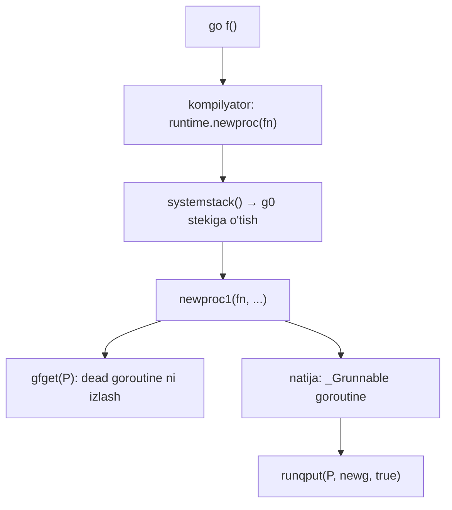

## Dead goroutine'ni qayta ishlatish (gfget / gfput)

Runtime avval **yangi ajratish o'rniga**, joriy P'ning lokal bo'sh ro'yxatidan (`gFree`) **dead goroutine'ni qayta ishlatishga** urinadi. Bu lokal ro'yxat **aralash**: unda ham steki biriktirilgan, ham steki allaqachon bo'shatilgan goroutine'lar bo'lishi mumkin.

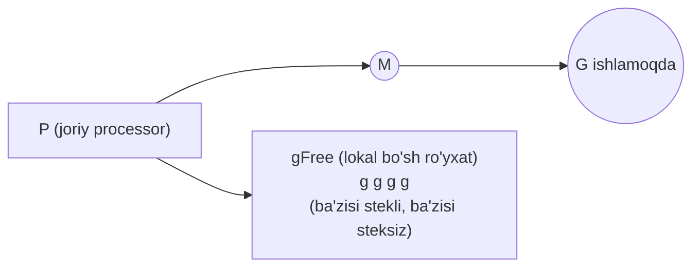

### Ikki darajali kesh

Go bo'sh (dead) goroutine'larni **ikki darajada** saqlaydi:

- **Lokal per-P kesh** (`p.gFree`) — yumshoq limit **64** yozuv.
- **Global scheduler kesh** (`sched.gFree`) — qulf bilan himoyalangan.

Mexanizm:

- Lokal kesh 64'ga yetsa — runtime yozuvlarni global keshga qaytaradi, **taxminan yarmi (32)** qolguncha. Bu bitta P'ning juda ko'p dead goroutine to'plab qo'yishini oldini oladi.
- Lokal kesh **bo'sh** bo'lsa — runtime global keshni qulflaydi va lokalni to'ldiradi (**32 tagacha**, agar global tugab qolsa — kamroq).

Global kesh **ikkita alohida ro'yxatga** bo'lingan:

- **stekli** goroutine'lar ro'yxati (allaqachon ajratilgan stack bor),
- **steksiz** (stackless) goroutine'lar ro'yxati.

Go **stekli** goroutine'larni qayta ishlatishni afzal ko'radi, chunki mavjud stekni qayta ishlatish yangisini ajratishdan **arzonroq**. Shuning uchun P lokal keshni global keshdan to'ldirganda avval **stekli** ro'yxatdan, faqat kerak bo'lsa **steksiz** ro'yxatdan tortadi.

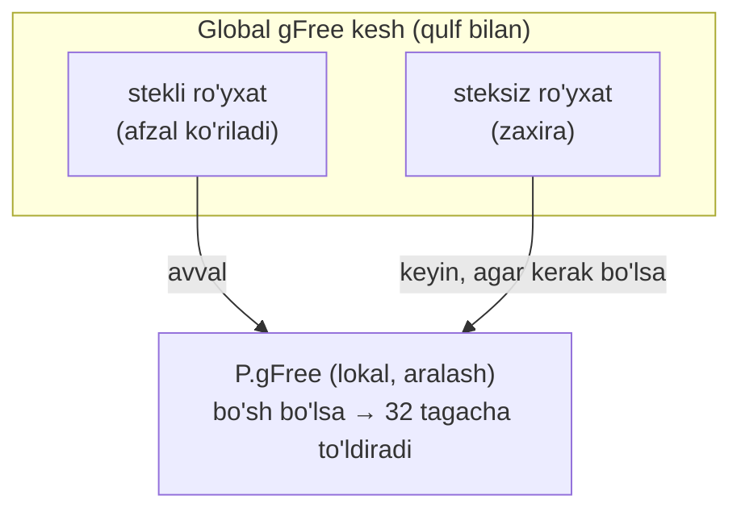

Agar qayta ishlatiladigan goroutine topilsa, lekin uning mavjud stack o'lchami joriy `startingStackSize`'ga **mos kelmasa**, runtime eski stekni bo'shatib, joriy maqsad o'lchamda yangisini ajratadi.

### Umuman topilmasa — yangi goroutine

Agar hech qanday qayta ishlatiladigan goroutine bo'lmasa, runtime **butunlay yangi** goroutine ajratadi: `malg(stackMin)`. Ko'p Unix-ga o'xshash tizimlarda `stackMin` = **2 KiB**.

Ajratishdan keyin goroutine holatlari:

1. **`_Gidle`** (bo'sh) — endigina ajratilgan.
2. **`_Gdead`** (o'lik) — keyin bunga o'tkaziladi.
3. va faqat shundan keyin global `allgs` ro'yxatida **nashr etiladi** (publish).

Qayta ishlatilgan goroutine'lar allaqachon `_Gdead` holatida bo'ladi.

> **Muhim:** `_Gdead` faqat "abadiy tugagan" degani emas. U:
> - bo'sh ro'yxatlarda turgan goroutine'lar uchun **qayta ishlatiladigan park holati**,
> - va endigina yaratilgan, hali runnable bo'lmagan goroutine'lar uchun **vaqtinchalik boshlang'ich holat** hamdir.

> **NOTE — nega yangi goroutine `_Gdead` sifatida nashr etiladi?**
> Endigina ajratilgan goroutine'ni `allg`'da nashr etishdan oldin `_Gdead` deb belgilash — GC va traceback kodiga "bu hali haqiqiy runnable goroutine emas, uning stekini skanerlama, tirik deb hisoblama" deb aytadi. Bu goroutine'ni global ro'yxatga qo'yish bilan uning stack/scheduler holatini sozlashni tugatish orasidagi **kichik, lekin xavfli oyna**ni himoya qiladi.

Nihoyat `newproc1` goroutine'ni **`_Grunnable`** holatiga o'tkazish, unga yangi ID berish va rejalashtirishga tayyorlash bilan yakunlanadi.

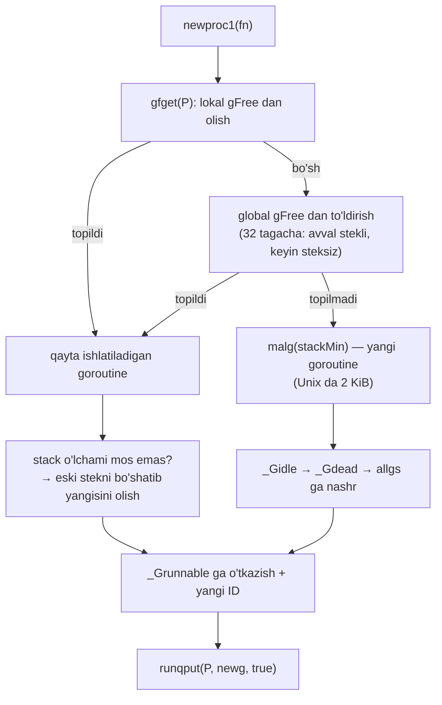

## Run Queue'lar va Runnext Slot

`newproc1` qaytgach, `newproc` runnable goroutine'ni **`runqput`**'ga topshiradi. `runqput` — goroutine'ni scheduler'ga runnable ish sifatida e'lon qiluvchi yordamchi, keyin biror worker thread uni olib bajaradi.

### Lokal run queue

Har bir P o'zining kichik **lokal run queue**'siga ega; barcha P'lar esa scheduler qulfi bilan himoyalangan **bitta global run queue**'ni bo'lishadi.

`p` strukturasidagi asosiy maydonlar:

```go
type p struct {
    ...
    // Runnable goroutine'lar navbati. Qulfsiz kiriladi.
    runqhead uint32
    runqtail uint32
    runq     [256]guintptr
}
```

Lokal navbat — **256 slotli qat'iy o'lchamli aylanma bufer** (circular buffer). Ya'ni 256 tagacha runnable goroutine sig'adi. `runqhead` — keyingisi qayerdan **olinadi**, `runqtail` — keyingisi qayerga **qo'yiladi**.

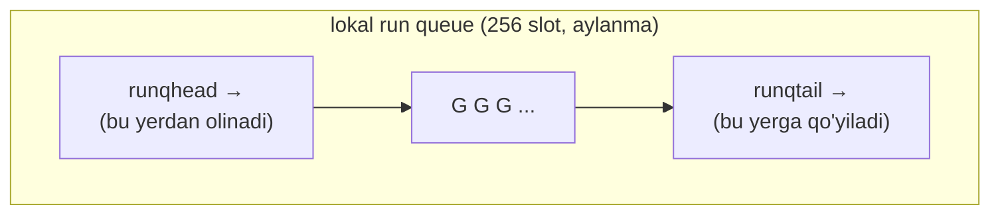

Konseptual jihatdan bu — **chegaralangan FIFO navbat**: tail'ga qo'yiladi (enqueue), head'dan olinadi (dequeue). Odatiy holatda P bu navbatga **global scheduler qulfini olmasdan** kiradi — bu scheduling tezligining katta sababi. Boshqa P'lar work-stealing paytida undan ish o'g'irlashi mumkin, lekin oddiy lokal push/pop global qulf uchun kurashdan qochadi.

### Ikki chekka holat: to'liq va bo'sh

**Navbat to'liq bo'lsa** — runtime ring bufer'ga yana bitta goroutine qo'sha olmaydi. U holda **yarim partiyani** (aynan **128** yozuv) global navbatga ko'chiradi va yangi kelayotgan goroutine ham shu partiyaga qo'shilib global navbatga e'lon qilinadi. Bu lokal navbatda joy ochadi va chiqarilgan ishni bo'sh yoki ishi kam boshqa P'larga ko'rsatadi.

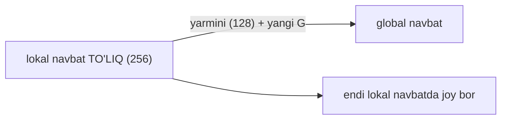

**Navbat bo'sh bo'lsa** — bu P'da darhol lokal ish yo'q. Scheduler global navbatga qaytadi: **bitta** goroutine'ni hozir ishlatish uchun oladi va shu bilan birga kichik partiyani lokal navbatga tortishi mumkin. Partiya o'lchami global yukdan hisoblanadi: `sched.runqsize/gomaxprocs + 1`, so'ng juda katta bo'lib ketmasligi uchun cheklanadi (maksimum **128**). Agar bu ham runnable goroutine bermasa — scheduler **work stealing**'ga o'tadi (buni Scheduler bo'limida ko'ramiz).

### Runnext slot — ustuvorlik yuvasi

Lokal navbatdan tashqari, har bir P **`runnext`** deb nomlangan maxsus **bitta-slotli** maydonga ega. U — oddiy lokal navbat yozuvlaridan **oldin** ishlanishi kerak bo'lgan bitta goroutine uchun ustuvorlik slotidir.

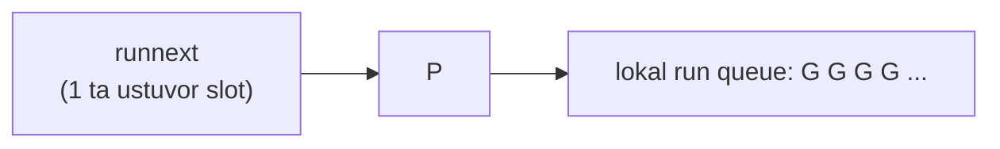

Lokal navbat baribir oddiy aylanma bufer bo'lib qoladi; `runnext` — bitta qo'shimcha, yuqori ustuvorlikdagi slot. `runqput(pp, gp, true)`'da oxirgi argument (`next=true`) runtime'dan avval shu ustuvor slotni sinashni so'raydi:

```go
func runqput(pp *p, gp *g, next bool) {
    ...
    if next {
    retryNext:
        oldnext := pp.runnext
        if !pp.runnext.cas(oldnext, guintptr(unsafe.Pointer(gp))) {
            goto retryNext
        }
        if oldnext == 0 {
            return
        }
        // Eski runnext ni oddiy run queue ga surib chiqarish.
        gp = oldnext.ptr()
    }
    ...
}
```

Ya'ni yangi goroutine joriy goroutine'dan keyin **darhol keyingi** bo'lib ishlashi mumkin. Agar `runnext` allaqachon band bo'lsa — oldingi egasi **surib chiqariladi** va oddiy lokal navbat yo'lidan (odatda tail'ga, agar navbat to'liq bo'lsa — global'ga spill orqali) yuboriladi. Ya'ni `next=true` yangi goroutine'ga darhol ustuvorlik beradi, eski runnext esa runnable bo'lib qoladi, faqat runnext slotini egallamaydi.

### Nega runnext kerak?

`runnext` slot — **handoff-og'ir** (bir goroutine boshqasini uyg'otadigan) ish yuklamalarida keraksiz kechikishni oldini olish uchun mavjud.

Agar scheduler'da faqat FIFO navbat bo'lganda, bir goroutine boshqasini uyg'otsa, uni navbat **oxiriga** qo'yardi. Bufersiz kanal handoff'ida A jo'natuvchi B qabul qiluvchini uyg'otadi, lekin B boshqa runnable goroutine'lar ortida kutishi mumkin. Xuddi shu holat contention ostidagi mutex/semaphore handoff'ida ham uchraydi. Bu ish tez-tez uzatiladigan qisqa o'zaro ta'sirlarda latency'ni oshiradi.

`runnext` aynan shu holat uchun maqsadli optimizatsiya. U shuni bildiradi: "bu goroutine joriysidan keyin darhol ishlashi kerak". Scheduler `runnext`'ni oddiy lokal navbatdan **oldin** tekshiradi.

**Adolat (fairness) baribir saqlanadi:**

- Runtime taxminan **10 ms** preemption oynasidan foydalanadi — goroutine bir scheduling bo'lagida abadiy ishlab tura olmaydi.
- `runnext`'dan olingan goroutine yangi to'liq vaqt bo'lagini **boshlamaydi**, balki xuddi shu P'da endigina ishlagan goroutine'dan **qolgan vaqtni meros oladi**. Bu handoff zanjirlarining CPU vaqtini cheksiz cho'zishini oldini oladi.
- Agar `runnext` band bo'lsa, oldingi egasi oddiy runnable navbatga qaytariladi (lokal to'liq bo'lsa — global'ga spill). Ya'ni goroutine kechikishi mumkin, lekin **yo'qolmaydi**.

Qisqasi: `runnext` handoff latency'ni kamaytiradi, oddiy navbat, global navbat tekshiruvi va preemption esa scheduling'ni adolatli tutadi.

## Goroutine Lifecycle (hayot tsikli)

Endi goroutine o'tadigan **barcha holatlarni** ko'rib chiqamiz. Umumiy holat diagrammasi:

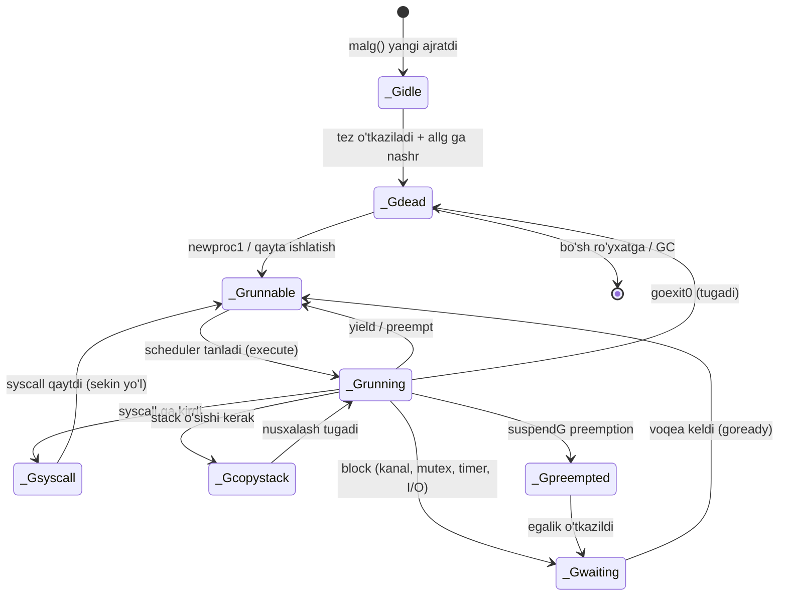

### _Gidle — bo'sh holat

`_Gidle` — goroutine obyekti **endigina ajratilgan, lekin hali initsializatsiya qilinmagan**. Bu holatning statusi nol (`0`) — bu `_Gidle`. Bu qisqa ichki fazada goroutine runnable emas, hech qanday navbatda emas va (yangi ajratilgan bo'lsa) hali `allg`'da nashr qilinmagan. Shuning uchun scheduler, GC va tracing uni faol goroutine deb hisoblamaydi.

Ajratishdan darhol keyin runtime goroutine'ni `_Gidle`'dan `_Gdead`'ga tez o'tkazadi, `allg` slice'ga nashr etadi va initsializatsiyani davom ettiradi. Bu qadam qisqa va ichki bo'lgani uchun foydalanuvchi kodi va vositalar `_Gidle`'ni deyarli hech qachon **to'g'ridan-to'g'ri ko'rmaydi**.

### _Grunnable — ishga tayyor holat

`_Grunnable` — goroutine **bajarishga tayyor** va run queue'da kutmoqda. U hali user kodni bajarmayapti, va uning steki hozir ishlayotgan goroutine tomonidan egallanmagan.

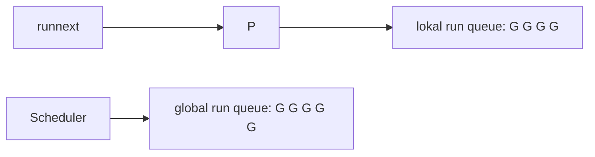

`_Grunnable` — scheduler'ning **handoff holati**, unda juda turli voqealar bitta ijro quvuriga normallanadi. Goroutine yangi yaratilgan bo'ladimi, bloklanishdan uyg'ongan bo'ladimi, syscall'dan qaytayotgan bo'ladimi yoki ishlayotgan koddan yield qilgan bo'ladimi — u `_Grunnable` orqali o'tadi, shunda scheduler uni run queue'larga qo'yib, barcha P'lar bo'ylab bir xil dispatch, adolat va yuk-balansi siyosatini qo'llaydi.

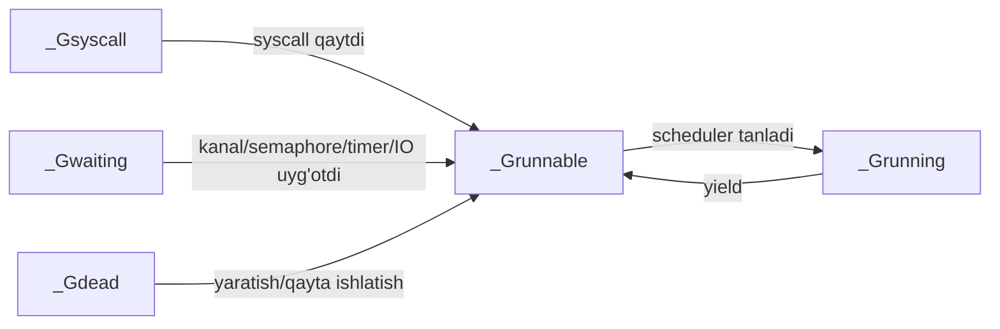

Scheduler uni tanlaganda, goroutine **`_Grunning`**'ga o'tadi: user kodni bajarishni boshlaydi, endi run queue'da emas, ishlayotganida M va P'ga biriktirilgan. Shu paytda u ijro uchun **stack ownership** (stek egaligi)ga ega.

> **Stack ownership nima?** Runtime'da bu — kim qo'shimcha muvofiqlashtirishsiz o'sha goroutine stekida ish qila oladi. Stek mantiqan har doim shu goroutine'ga tegishli, lekin **operatsion nazorat** holatga qarab o'zgaradi. `_Grunning`'da goroutine o'z stekini ijro uchun egallaydi. `_Grunnable` kabi ishlamaydigan holatlarda esa bu egalik hozir ishlayotgan goroutine'da emas, shuning uchun scheduling va GC kabi mexanizmlar stek bilan bog'liq ishni xavfsiz muvofiqlashtira oladi.

### _Gwaiting — kutish holati

`_Gwaiting` — goroutine **runtime ichida bloklangan** va muayyan voqea sodir bo'lmaguncha davom eta olmaydi. Goroutine bunga quyidagilarni kutayotganda kiradi:

- kanal amaliyoti,
- mutex yoki semaphore handoff,
- `sync.Cond` signali,
- timer,
- I/O tayyorlik voqeasi.

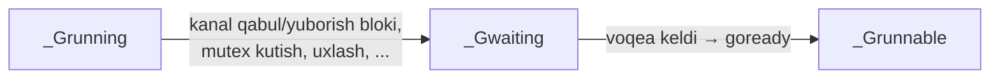

Goroutine bloklanganda, runtime uni o'sha amaliyotning **kutish strukturasi**da yozib qo'yadi. Masalan: kanal yo'llari kanal kutish navbatlaridan, semaphore yo'llari semaphore kutish strukturalaridan foydalanadi; timer'ga asoslangan uyqu timer subsystem tomonidan, tarmoq I/O kutishi esa poller tomonidan kuzatiladi. Voqea kelganda runtime goroutine'ni kutish strukturasidan olib chiqadi va yana runnable deb belgilaydi.

Kutayotgan goroutine **tirik**, lekin u paytda hech qanday thread uning stekida ishlamaydi — shuning uchun GC stek skanerlashni xavfsiz muvofiqlashtira oladi. Dasturchi nuqtai nazaridan `_Gwaiting` — **bloklangan, lekin tugamagan**: goroutine keyin davom etadi, lekin shart bajarilmaguncha rejalashtirmaydi va CPU sarflamaydi.

Kutish holatidan uyg'onib runnable bo'lganda, runtime ko'pincha unga **yuqori lokal ustuvorlik** beradi. Ko'p uyg'onish yo'llari (kanallar, semaphore'lar, timer'lar, tarmoq I/O) `goready` orqali o'tadi, u esa `ready(..., true)`'ni chaqirib scheduler'dan joriy P'ning `runnext` slotini afzal ko'rishni so'raydi. Bu — oldingi bo'limdagi `runnext` motivatsiyasiga mos keladi. Bu baribir "best-effort" optimizatsiya, shuning uchun goroutine oddiy navbat yo'liga qaytishi ham mumkin.

### _Gsyscall — syscall holati

`_Gsyscall`'da goroutine Go user kodini **vaqtincha tark etib**, operatsion tizim syscall'iga kirgan. Bu holatda u Go kodini emas, OS-darajali ishni (fayl amallari, qurilma bilan ishlash, boshqa kernel xizmatlari) kutmoqda.

`_Gsyscall`'dagi goroutine hech qanday run queue'da emas, shuning uchun scheduler uni Go kodi ishlatishga tanlamaydi. Uning steki **hali ham** shu goroutine'ga tegishli va u hali ham OS thread (M) bilan bog'langan, chunki syscall aynan o'sha thread'da kechmoqda.

`_Gwaiting`'dan asosiy farqi — **blok qayerda sodir bo'ladi**: `_Gwaiting` runtime boshqaradigan kutish mexanizmlari ichida, `_Gsyscall` esa OS syscall yo'lida bloklanadi.

**Muhim muammo:** runtime butun syscall davomida **P'ni yo'qotib qo'yishni** xohlamaydi. Agar Go P'ni thread'ga biriktirilgan holda qoldirsa va thread kernel'da qotib qolsa, runtime nuqtai nazaridan bitta mantiqiy processor band va foydalanib bo'lmaydigan bo'lib qoladi — hatto ko'p runnable goroutine tayyor tursa ham. Buni oldini olish uchun Go **handoff** mexanizmidan foydalanadi: OS thread'ning umrini P'ning umridan **ajratadi**.

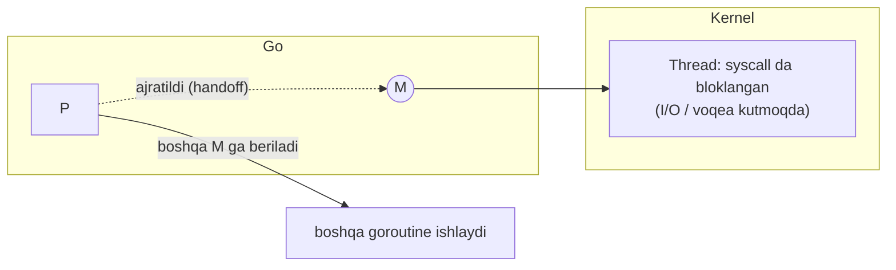

Handoff turlicha strategiya ishlatadi:

- **Aniq bloklovchi** deb belgilangan chaqiruvlar uchun — handoff **darhol**: P joriy thread'dan ajratilib scheduler'ga qaytariladi, boshqa thread uni olib boshqa goroutine'larni ishlatadi.
- **Oddiy syscall'lar** (`runtime.entersyscall`) uchun — runtime avval goroutine `_Gsyscall`'ga kirganini yozadi va joriy P'ni thread'dan maxsus **`_Psyscall`** holatiga ajratadi. Bu syscall'ga tez tugash imkonini beradi va `exitsyscall`'ga qaytishda eski P'ni tez qayta olishga urinish imkonini beradi.
- Agar syscall **uzoq davom** etsa, runtime P'ni boshqa goroutine'lar ishlashi uchun uzatib yuborishi mumkin. Va agar syscall goroutine eski P'ni allaqachon yo'qotgandan keyin qaytsa, sekin exit yo'li goroutine'ni yana `_Grunnable`'ga aylantirib, oddiy scheduler navbatlari orqali yuboradi.

### _Gcopystack — stack nusxalash holati

Goroutine steki o'sishi kerak bo'lganda, goroutine **allaqachon ishlayotgan** bo'ladi va runtime o'sishni **xavfsiz nuqtada** boshqaradi. O'sha lahzada goroutine o'z stekini egallaydi, shuning uchun runtime uni xavfsiz ko'chira oladi.

`_Gcopystack` — runtime stekni ko'chirayotgan paytda ishlatiladigan **vaqtinchalik ichki holat**. Bu fazada goroutine user kodini bajarmaydi va hech qanday navbatda emas:

```go
func newstack() {
    // ...
    // newstack ni chaqirish uchun goroutine ishlayotgan bo'lishi kerak.
    casgstatus(gp, _Grunning, _Gcopystack)

    // gp _Gcopystack da bo'lganda, parallel GC uning stekini skanerlamaydi.
    copystack(gp, newsize)

    // nusxalash tugagach, ishlashga qaytish.
    casgstatus(gp, _Gcopystack, _Grunning)
    gogo(&gp.sched)
}
```

Parallel garbage collector ham stek ko'chirilayotganini biladi va uni oddiy stack kabi skanerlamaydi. Nusxalash tugagach, goroutine **to'g'ridan-to'g'ri `_Grunning`'ga qaytadi** va to'xtagan joyidan davom etadi — u avval runnable bo'lmaydi va run queue'dan qayta o'tmaydi.

Stack **kichrayishi** boshqacha egalik modelidan foydalanadi: runtime faqat stekni allaqachon xavfsiz egallaganida kichraytiradi (goroutine to'xtagan va GC scan biti ushlab turgan, yoki goroutine sinxron o'z-safe-point'iga yetgan). Bunday yo'llarda runtime `_Gcopystack`'ga o'tmasdan to'g'ridan-to'g'ri `copystack`'ni chaqirib kichikroq stekka ko'chadi. Agar kichraytirish o'sha lahzada xavfsiz bo'lmasa, runtime uni majburlamaydi — `preemptShrink` bayrog'ini o'rnatib, keyingi sinxron safe-point'gacha kechiktiradi.

### _Gpreempted — preempt qilingan holat

`_Gpreempted` — goroutine `suspendG` preemption'i uchun runtime so'rovi bilan **o'zini xavfsiz nuqtada to'xtatgani**ni anglatadi. Bu — suspend egaligi oddiy waiting yo'liga o'tkazilishidan oldingi **vaqtinchalik ichki holat**.

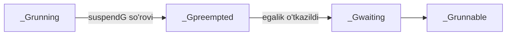

`_Gpreempted`'ga kirgan goroutine user kodini bajarmaydi. U runtime xavfsiz deb hisoblagan nuqtada to'xtab qoladi, shunda runtime kodi oddiy ijro bilan poyga qilmasdan uni tekshirishi/muvofiqlashtirishi mumkin.

`_Gpreempted` `_Gwaiting`'ga o'xshaydi (ikkalasi ham ishlamaydi), lekin semantikasi farq qiladi:

- `_Gwaiting`'da goroutine **muayyan kutish shartida** bloklangan va o'sha shart uchun aniq belgilangan **uyg'onish mexanizmi** bor.
- `_Gpreempted`'da goroutine runtime suspension uchun to'xtatilgan va hali oddiy kutish-uyg'onish egalik oqimida **emas** — hali hech qanday uyg'onish egasi tayinlanmagan.

Runtime ichki ish tugagach, avval goroutine'ni `_Gpreempted`'dan `_Gwaiting`'ga ko'chirib **da'vo qiladi**, va faqat shundan keyin mos vaqtda uni yana runnable qila oladi.

> **Nuans:** Go bir nechta preemption yo'lidan foydalanadi. Ba'zi preemption faqat scheduler adolatiga qaratilgan (CPU vaqtini goroutine'lar orasida aylantirish). Bunday yo'lda goroutine `_Gpreempted`'ga kirmasdan yield qilib oddiy scheduling'ga qaytishi mumkin. Ya'ni `_Gpreempted` aynan **suspend-uslubidagi** preemption uchun — runtime goroutine'ning to'xtab, ichki muvofiqlashtirish uchun barqaror turishini talab qilganda.

### _Gscan — GC skan holatlari

GC goroutine stekini ildiz ko'rsatkichlari (root pointers) uchun skanerlashi kerak bo'lganda, u **scan bitini** (`_Gscan`) o'rnatadi. `_Gscan`'ni "GC hozir shu goroutine uchun stek-skanerlash huquqiga ega" degan vaqtinchalik marker deb o'qish mumkin.

Muhim: GC skanerlash — mavjud holatning **o'rniga emas**, uning **ustiga qo'yiladigan qulf** sifatida ishlatiladi. Goroutine baribir o'zining asosiy holatini (runnable, waiting, syscall, running) eslab qolishi kerak, chunki scheduler xatti-harakati o'sha asosiy ma'noga bog'liq. Shuning uchun bit dizayni ishlatiladi:

```
_Gscan          = 0x1000
_Gscanrunnable  = _Gscan + _Grunnable  // 0x1001
_Gscanrunning   = _Gscan + _Grunning   // 0x1002
_Gscansyscall   = _Gscan + _Gsyscall   // 0x1003
_Gscanwaiting   = _Gscan + _Gwaiting   // 0x1004
_Gscanpreempted = _Gscan + _Gpreempted // 0x1009
```

Runtime `old | _Gscan` bilan goroutine'ni skanerlashga **da'vo qiladi**, `old &^ _Gscan` bilan aniq asl holatni **tiklaydi**. Masalan, waiting'dagi goroutine `_Gscanwaiting`, syscall'dagisi `_Gscansyscall`, navbatdagisi `_Gscanrunnable` bo'ladi. Agar goroutine allaqachon `_Gpreempted` bo'lsa, suspend mantiqi avval uni `_Gwaiting`'ga ko'chiradi va keyin shu holat ustiga `_Gscan`'ni qo'yadi.

**`_Grunning` — maxsus holat.** Ishlayotgan goroutine steki faol o'zgarayapti, shuning uchun GC uni to'g'ridan-to'g'ri `_Grunning`'da skanerlay olmaydi. Runtime qisqa vaqt `_Gscanrunning`'dan foydalanib holat o'tishlarini bloklaydi, preemption so'rovini o'rnatadi, keyin goroutine'ni `_Grunning`'ga qaytaradi va u xavfsiz nuqtada to'xtaguncha kutadi. Goroutine ishlamaydigan holatda to'xtagach, runtime shu holat ustiga `_Gscan`'ni qo'yib stekni skanerlaydi.

### _Gdead — o'lik holat

`_Gdead`'dagi goroutine hozirda **foydalanilmayapti**. Ko'pincha bu u ishni tugatganini anglatadi, lekin runtime `_Gdead`'ni **qayta ishlatiladigan** goroutine obyektlari va **initsializatsiya qilinayotgan** yangi `g` obyektlari uchun ham ishlatadi (yuqorida ko'rganimizdek).

Runtime dead goroutine'larni bo'sh ro'yxatlar orqali qayta ishlatadi:

- har bir P — lokal kesh `p.gFree`,
- scheduler — global bo'sh ro'yxatlar `sched.gFree` (qulf bilan), **stekli** va **steksiz** ikki guruhga bo'lingan.

Lokal `p.gFree` ikkalasining aralashmasini ushlab turishi mumkin. Goroutine bo'sh ro'yxatga qo'yilganda, uning stack o'lchami joriy `startingStackSize`'ga mos kelmasa, runtime stekni darhol bo'shatishi mumkin. Joriy standart o'lchamdagi stack'lar odatda tez qayta ishlatilish uchun saqlanadi.

GC root marking paytida runtime maxsus root job ishlatadi: u global **stekli** bo'sh ro'yxatdagi dead goroutine'larning stack'larini bo'shatadi va ularni global **steksiz** ro'yxatga ko'chiradi. Per-P lokal bo'sh ro'yxatlardagi dead goroutine'lar bu qadamda bo'shatilmaydi — ba'zi keshlangan stack'larni saqlab qolish **ataylab** qilingan (tez qayta ishlatish uchun).

## Eslab qol

- `go f()` → `runtime.newproc` → `systemstack`da (g0 kontekstida) `newproc1`.
- Runtime avval **dead goroutine'ni qayta ishlatadi** (`gfget`), faqat kerak bo'lsa yangisini ajratadi (`malg`, 2 KiB).
- `gFree` ikki darajali: lokal per-P (limit 64, 32'gacha) va global (stekli/steksiz). Stekli afzal ko'riladi.
- Yangi goroutine: `_Gidle → _Gdead → allg ga nashr → _Grunnable`. `_Gdead` — faqat "tugadi" emas, qayta ishlatiladigan park holati ham.
- Lokal run queue — 256 slotli FIFO aylanma bufer, qulfsiz. To'liq bo'lsa 128 ta global'ga spill, bo'sh bo'lsa global'dan tortadi.
- **`runnext`** — bitta ustuvor slot, handoff latency'ni kamaytiradi. U qolgan vaqt bo'lagini meros oladi, adolat 10 ms preemption bilan saqlanadi.
- Holatlar: `_Gidle`, `_Grunnable`, `_Grunning`, `_Gwaiting`, `_Gsyscall`, `_Gcopystack`, `_Gpreempted`, `_Gdead` + `_Gscan` (holat ustiga qulf).
- `_Gsyscall`'da P handoff qilinadi, `_Gwaiting`'da GC xavfsiz skanerlaydi, `_Gcopystack`'da GC stekni skanerlamaydi.

## Tez-tez uchraydigan xatolar

### 1. "go f() darhol ishlaydi" deb o'ylash

`go f()` goroutine'ni **runnable** qiladi va run queue'ga qo'yadi. U scheduler tanlagandagina `_Grunning`'ga o'tadi — bu keyinroq bo'lishi mumkin.

### 2. `_Gdead`'ni faqat "tugagan" deb tushunish

`_Gdead` uch ma'noga ega: tugagan, qayta ishlatishga tayyor (park), va yangi initsializatsiya qilinayotgan. Shuning uchun goroutine'lar keshlanadi va qayta ishlatiladi.

### 3. `_Gwaiting` va `_Gsyscall`'ni bir xil deb o'ylash

Ikkalasi ham "bloklangan", lekin `_Gwaiting` — runtime ichida, `_Gsyscall` — OS syscall'da. Farqi P handoff mexanizmiga ta'sir qiladi.

### 4. runnext'ni "cheksiz ustuvorlik" deb tushunish

`runnext` faqat qolgan vaqt bo'lagini oladi va 10 ms preemption oynasiga bo'ysunadi. Handoff zanjiri CPU'ni cheksiz egallay olmaydi.

## Amaliyot

### 1-mashq: Goroutine holatini kuzatish

`GODEBUG=schedtrace=1000` bilan ko'p goroutine yaratadigan dasturni ishga tushiring. Chiqishdagi run queue hajmlari va idle P/M sonlarini tahlil qiling. Qaysi goroutine'lar `_Grunnable`, qaysilari `_Gwaiting`?

### 2-mashq: runnext effektini his qiling

Bufersiz kanal orqali "ping-pong" qiladigan ikki goroutine yozing (biri jo'natadi, boshqasi qabul qiladi, navbat bilan). O'ylang: `runnext` bo'lmaganda bu naqsh nega sekinroq bo'lardi?

### 3-mashq: Lokal navbat to'lishi

`GOMAXPROCS=1` qo'yib, tez ketma-ket 300 ta `go func(){}()` yarating. Lokal navbat (256) to'lganda nima bo'ladi? 128 ta goroutine qayerga ketadi?

### 4-mashq: Holat diagrammasini chizing

O'z so'zlaringiz bilan bitta goroutine'ning "yaratilishdan tugashigacha" bo'lgan yo'lini chizing, agar u bir marta kanalda bloklanib, keyin uyg'onib, bir marta stack o'sib, so'ng tugasa. Qaysi holatlardan o'tadi?

---

[← 05 Runtime Startup](05_runtime_startup.md) | [Keyingi: 07 Scheduler →](07_scheduler.md)
