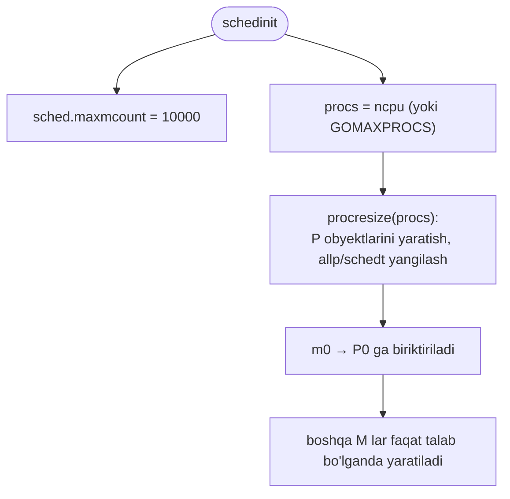
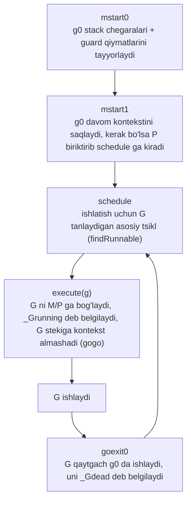
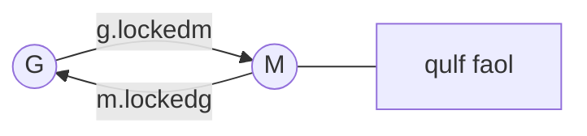
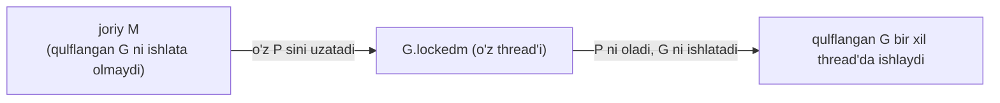
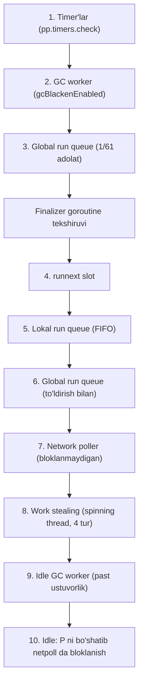
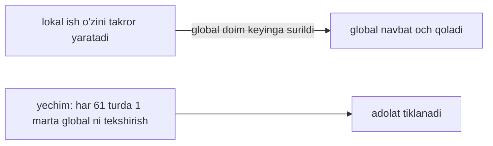
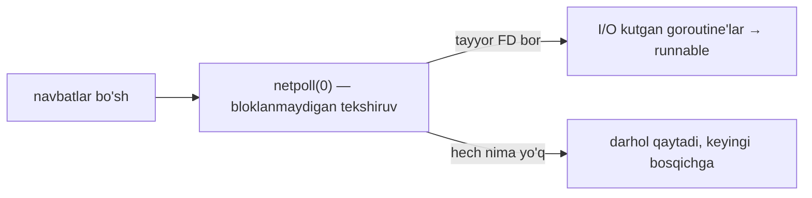
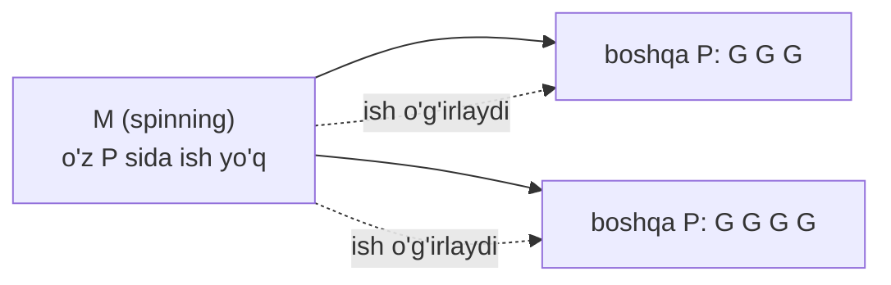
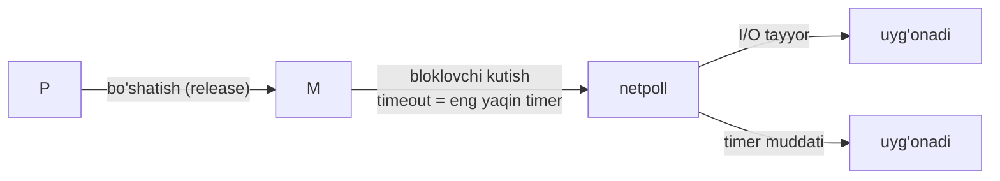

# 07 — Scheduler (Rejalashtiruvchi)

> Ushbu material — **The Anatomy of Go** (Phuong Le) kitobining 8-bobi asosida o'zbek tilida tayyorlangan o'quv qo'llanma. Asl matn so'zma-so'z tarjima qilinmagan, balki tushunilib **o'z so'zlarim bilan** qayta bayon qilingan.

## Nima uchun bu mavzu muhim?

Go'ning eng katta kuchli tomoni — siz **thread'larni o'zingiz boshqarmaysiz**. Boshqa tillarda thread pool, thread affinity, kontekst almashish bilan ovora bo'lasiz. Go'da esa buni **scheduler** avtomatik qiladi: cheklangan sondagi OS thread ustida minglab goroutine'ni samarali taqsimlaydi.

Bu bo'lim [04 M-P-G Model](04_mpg_model.md), [05 Runtime Startup](05_runtime_startup.md) va [06 Goroutine Creation](06_goroutine_creation.md)'da qurgan asosimizni birlashtiradi va quyidagi savollarga javob beradi:

- Scheduler qanday ishga tushadi (`schedinit`, `procresize`)?
- `schedule()` tsikli qanday ishlaydi — thread G'ni qanday tanlaydi va ishlatadi?
- `LockOSThread` nima qiladi va nega kerak?
- `findRunnable` ishni **qaysi tartibda** qidiradi: runnext → local → global → netpoll → work stealing?

## Scheduler nima?

Go scheduler'i — runtime ichidagi mexanizm bo'lib, goroutine'larni cheklangan sondagi OS thread ustida **taqsimlaydi**. Maqsadi — goroutine'larni samarali va avtomatik ishlatish, shunda Go dasturchisi boshqa tillardagidek thread'larni qo'lda boshqarmasin.

Muhim: scheduler — **bitta global `for` tsikl EMAS**. U turli OS thread'lardagi ko'plab hamkorlashuvchi tsikllar va uyg'onish yo'llaridan iborat bo'lib, G'lar, M'lar va P'larni birgalikda muvofiqlashtiradi.

## Initialization (schedinit)

Go ishga tushganda scheduler'ni initsializatsiya qiladi va bir vaqtda nechta mantiqiy P Go kodini ishlatishi mumkinligini hal qiladi. Startup ketma-ketligi bilan biz `schedinit`'ni [05-bo'lim](05_runtime_startup.md)da ko'rgan edik. Mana thread limitini va boshlang'ich P sonini o'rnatadigan asosiy qism:

```go
func schedinit() {
    ...
    sched.maxmcount = 10000
    ...
    procs := ncpu
    if n, ok := atoi32(gogetenv("GOMAXPROCS")); ok && n > 0 {
        procs = n
    }
    if procresize(procs) != nil {
        throw("unknown runnable goroutine during bootstrap")
    }
    ...
}
```

Bu yerda ikki muhim qaror qabul qilinadi:

1. **Maksimal OS thread (M) soni** — standart holatda **10 000**. Runtime bundan oshsa `throw` qiladi. Buni `runtime/debug.SetMaxThreads(int)` bilan o'zgartirish mumkin.
2. **Boshlang'ich P soni** — `ncpu`'dan boshlanadi; agar `GOMAXPROCS` musbat qiymatga o'rnatilgan bo'lsa, o'sha ishlatiladi. Bu P soni — **parallel** Go kodi ishlata oladigan goroutine'lar maksimumi.

> Agar ishlash vaqtida `runtime.GOMAXPROCS(n)`'ni yangi musbat `n` bilan chaqirsangiz, runtime scheduler holatini qayta sozlash uchun **stop-the-world resize** qiladi. Agar `n <= 0` yoki o'zgarmasa — hech nima qilmay qaytadi.

### procresize va global holat

Sonni tanlagach, `procresize` P obyektlarini yaratadi/qayta ishlatadi va global scheduler holatini yangilaydi — masalan scheduler holati (`schedt`) va barcha-P'lar slice'i (`allp`):

```go
// len(allp) == gomaxprocs; safe point'larda o'zgarishi mumkin,
// aks holda o'zgarmas.
var allp []*p

type schedt struct {
    lock mutex
    pidle puintptr // bo'sh (idle) P lar
    // Global runnable navbat.
    runq     gQueue
    runqsize int32
}
```

### Thread'lar oldindan yaratilmaydi

Runtime **har bir P uchun oldindan bitta OS thread yaratmaydi**. Bootstrap paytida boshlang'ich OS thread (`m0`) initsializatsiyani davom ettirishga yetarli; qo'shimcha thread'lar faqat rejalashtirish talabi bo'lganda yaratiladi. Odatiy bootstrap holatida `procresize` boshlang'ich `GOMAXPROCS`'ni qo'llaganda `m0` boshlang'ich P'ga (odatda `P0`) biriktiriladi.



> **NOTE — bootstrap istisnolari.** Umumiy qoida: Go OS thread'larni **talabga qarab** o'stiradi. Lekin startup boshida bir necha istisno bor:
> - Jarayon boshida bitta OS thread runtime bootstrap'ni ishlatadi (`m0`).
> - `runtime.main` boshida Go maxsus fon monitor thread'i **`sysmon`**'ni boshlashi mumkin (wasm bundan mustasno).
> - `mstartm0`'da, agar cgo yoqilgan bo'lsa yoki Windows callback yo'llarida, runtime qo'shimcha callback M'ni **oldindan yaratadi**, shunda Go bo'lmagan thread'lardan kelgan callback'lar xavfsiz ishlansin.

Scheduler yoqilgach va goroutine'lar runnable bo'lgach, Go bo'sh (idle) P'larni OS thread'lar bilan **faqat haqiqiy ish bo'lganda** juftlaydi. Agar biror P'da runnable ish bor, lekin faol M yo'q bo'lsa — scheduler avval bo'sh (idle) M'ni uyg'otishga urinadi; bo'sh M bo'lmasa, yangisini yaratishi mumkin.

Shuning uchun `GOMAXPROCS` katta bo'lsa ham, P'dan **kamroq** OS thread ko'rish mutlaqo normal: **P** — ruxsat etilgan parallel Go ijro sig'imi, **M** esa runnable ish va bloklanishga qarab dinamik yaratiladi, uxlaydi va uyg'onadi.

## Scheduling (schedule tsikli)

Scheduler mantiqiy P'larini initsializatsiya qilgach, kamida bitta OS thread scheduler ishini boshlashi kerak. Birinchisi — bizga tanish `m0`.

### mstart0 — thread'ni tayyorlash

`mstart0` — Go thread (M)'da ishlaydigan **birinchi Go runtime funksiyasi**. Uning vazifasi:

1. thread'ni Go runtime kodini ishlatishga xavfsiz qilish,
2. thread'ning o'z boshlang'ich goroutine'i (`g0`) stack maydonlari to'g'ri ekaniga ishonch hosil qilish,
3. berilgan bo'lsa startup callback'ni ishlatish,
4. va scheduler oqimiga o'tish.

```go
func mstart0() {
    gp := getg()
    osStack := gp.stack.lo == 0
    if osStack {
        size := gp.stack.hi
        if size == 0 {
            size = 16384 * sys.StackGuardMultiplier
        }
        gp.stack.hi = uintptr(noescape(unsafe.Pointer(&size)))
        gp.stack.lo = gp.stack.hi - size + 1024
    }
    gp.stackguard0 = gp.stack.lo + stackGuard
    gp.stackguard1 = gp.stackguard0
    mstart1()
    ...
}
```

Har bir OS thread'da thread-lokal holat bor, u `getg()` orqali o'sha thread'ning joriy goroutine ko'rsatkichini (`g`, odatda scheduler/runtime kodi ishlaganda `g0`) tez topish imkonini beradi.

> **NOTE:** `g0` — **per-thread**, global emas. Har bir M o'z `g0`'siga ega. `m0` noyob, shuning uchun `m0.g0` ham noyob.

### g0 stack chegaralari qayerdan keladi?

- **`m0.g0`** uchun: runtime stack chegaralarini juda erta, `rt0_go`da bootstrap taxmini bilan yozadi — `stack.hi` = joriy SP, `stack.lo` ≈ 64 KiB past ([05-bo'lim](05_runtime_startup.md)da ko'rilgan).
- **Boshqa thread'lar** uchun `g0` stack sozlash **ikki yo'ldan** boradi:
  1. **native OS-thread-stack yo'li**,
  2. **runtime-ajratgan Go-stack yo'li**.

Qaysi yo'l ishlatilishi ikki narsaga bog'liq: **OS platformasi** va **cgo yoqilganmi**. Agar cgo yoqilgan bo'lsa, Go har bir thread'ning `g0`'si uchun native OS thread stack modelidan foydalanadi. Cgo'siz ham ba'zi platformalar shu native modelni ishlatadi: **Windows, Darwin, iOS, Solaris, illumos, Plan 9, AIX va ko'p OpenBSD portlari**.

| Yo'l | Stack chegaralari qayerdan |
|------|----------------------------|
| **Native OS stack** | OS thread stekini beradi; `mstart0` undan foydali `g0` chegaralarini keltirib chiqaradi. Ma'lumot bo'lmasa, `16 KiB * StackGuardMultiplier`'ga fallback (odatiy non-race build'da ≈ 16 KiB). |
| **Runtime-managed** | Go `g0` stekini `malg` bilan o'zi ajratadi (musbat o'lcham), shuning uchun chegaralar ajratishning o'zidan **darhol ma'lum**. Linux'da cgo o'chirilganida odatiy yo'l. |

### mstart1 — g0 kontekstini saqlash

`g0` foydali stack chegaralari va guard'larga ega bo'lgach, `mstart1` `g0`'ning **saqlangan kontekstini** o'rnatadi. Shunda runtime vaqtincha `g0`'ni tark etib oddiy goroutine ishlatganda, keyin saqlangan davom nuqtasini tiklab `g0`'ga aynan qolgan joyidan qaytadi:

```go
func mstart1() {
    gp := getg()
    if gp != gp.m.g0 {
        throw("bad runtime·mstart")
    }
    // g0 uchun ma'lum-yaxshi qayta-boshlash nuqtasini saqlash:
    gp.sched.g  = guintptr(unsafe.Pointer(gp))  // g0 ga qaytadi
    gp.sched.pc = getcallerpc()                 // qayerdan davom etish
    gp.sched.sp = getcallersp()                 // qaysi SP bilan
    ...
    if gp.m != &m0 {
        acquirep(gp.m.nextp.ptr())  // tayinlangan P ni olish
        gp.m.nextp = 0
    }
    schedule()
}
```

Bu yerdagi uch maydon — `g0` uchun qaytish koordinatalari:

- `g0.sched.g` → `g0`'ning o'ziga ko'rsatadi,
- `g0.sched.pc` → `g0` qayerda davom etishi kerakligini saqlaydi,
- `g0.sched.sp` → `g0` qaysi stack pointer bilan davom etishini saqlaydi.

Agar bu **`m0` bo'lmasa**, thread `m.nextp`'dan tayinlangan P'ni egallaydi va scheduling'ga kiradi.

### schedule() — asosiy boshqaruv oqimi

`schedule()` — thread (M) o'zining biriktirilgan P'si (`m.p`) bilan runnable goroutine'larni tanlash va ishlatishning **uzluksiz tsiklini** boshlaydigan nuqta.



Boshqaruv oqimi:

1. M runtime startup (`mstart0`)dan kiradi, `g0`da `schedule()`'ga yetadi.
2. `schedule()` runnable goroutine `g`ni tanlaydi va **`execute(g)`** uni ishlatadi. `execute` G'ni joriy M/P'ga bog'laydi, `_Grunning` deb belgilaydi va **`gogo`** orqali G stekiga kontekst almashadi.
3. Goroutine tugaganda u **o'z stekidan `schedule()`'ni chaqirmaydi**. Buning o'rniga `mcall(goexit0)` bilan `g0`'ga qaytadi. `goexit0` uni `_Gdead` deb belgilaydi, so'ng `schedule()` yana ishlab keyingi goroutine'ni tanlaydi.

Xuddi shu boshqaruv oqimi **chiqishdan boshqa** yo'llarda ham uchraydi. Goroutine bloklanishi, yield qilishi, preempt bo'lishi yoki syscall'ga kirib-chiqishi mumkin — bunday paytda scheduling qarorlari thread'ning **system kontekstida (`g0`)** qabul qilinadi:

- **Preemption:** ishlayotgan goroutine majburan to'xtatiladi, ishlash yo'lidan chiqariladi, scheduling boshqa runnable ishni tanlaydi.
- **Parking:** runtime goroutine'ni `_Gwaiting`'ga o'zgartiradi, uni joriy M'dan ajratadi va `schedule()`'ni chaqiradi — shu M+P boshqa goroutine ishlatishi uchun.
- **Semaphore wait:** goroutine semaphore'ni ololmasa, park qiladi, CPU'ni beradi, scheduling boshqa ish tanlaydi.
- **Syscall:** syscall'ga kirganda goroutine `_Gsyscall`'ga o'tadi; bloklovchi syscall yo'llarida P **darhol** handoff qilinadi, oddiy syscall yo'llari esa syscall qancha davom etishiga qarab P'ni saqlashi yoki keyin yo'qotishi mumkin.

`schedule()`'ning vazifasi oddiy tuyuladi — **keyingi runnable G'ni topish**. Amalda esa u ko'p runtime cheklovlari va maxsus holatlarni hisobga olishi kerak:

```go
func schedule() {
    mp := getg().m
    ...
    if mp.lockedg != 0 {
        stoplockedm()
        execute(mp.lockedg.ptr(), false) // Hech qachon qaytmaydi.
    }
    ...
top:
    pp := mp.p.ptr()
    pp.preempt = false
    ...
    gp, inheritTime, tryWakeP := findRunnable() // ish topilguncha bloklanadi
    ...
}
```

## Locked Goroutines (LockOSThread)

**Qulflangan goroutine** — qulf faol bo'lgan davrda bitta muayyan OS thread (M)'ga bog'langan goroutine. Bu davrda runtime **ikki narsani kafolatlaydi**:

1. o'sha goroutine bir xil thread'da qoladi,
2. o'sha thread begona goroutine'lar uchun oddiy bo'sh worker bo'lmaydi.



Aynan shuning uchun `schedule()` boshida `m.lockedg`'ni tekshiradi:

```go
func schedule() {
    mp := getg().m
    ...
    if mp.lockedg != 0 {
        stoplockedm()
        execute(mp.lockedg.ptr(), false) // Hech qachon qaytmaydi.
    }
    ...
}
```

Agar `m.lockedg` o'rnatilgan bo'lsa, bu M endi oddiy bo'sh worker deb qaralmaydi. Runtime avval `stoplockedm`'ni chaqiradi — u boshqa M'lar ishlashi uchun P'sini handoff qilishi mumkin, keyin qulflangan goroutine yana runnable bo'lguncha bu qulflangan M'ni park qiladi. Goroutine runnable bo'lgach, thread uyg'otiladi va o'sha goroutine'ni ishlatadi.

### Nega LockOSThread kerak?

Goroutine'lar odatda vaqt o'tishi bilan OS thread'lar orasida **ko'chib yuradi**. Lekin ba'zi kod **per-thread OS holatiga** bog'liq — bunday ko'chish xavfli. Qulflash goroutine'ni bitta thread'da ushlab bu muammoni hal qiladi (to `UnlockOSThread` qulfni to'liq bo'shatguncha yoki goroutine chiqib ketguncha).

Bu thread identifikatsiyasiga bog'liq kod uchun foydali. Ko'p tizimlar muhim holatni goroutine'da emas, aynan **joriy OS thread'da** saqlaydi. Keng tarqalgan misollar:

- thread-local o'zgaruvchilardan foydalanadigan **C kutubxonalari**,
- barcha UI chaqiruvlarini bitta asosiy thread'da talab qiladigan **GUI toolkit'lar**,
- joriy thread'ga biriktirilgan **COM** yoki **OpenGL** kontekstlari.

```go
func main() {
    runtime.LockOSThread()
    defer runtime.UnlockOSThread()

    fmt.Println("Bu goroutine bitta OS thread'da qoladi.")
    // Bu yerdagi chaqiruvlar thread affinity'ga tayanishi mumkin
    // (GUI / COM / OpenGL / cgo TLS va h.k.)
}
```

### lockedExt hisoblagichi

Thread holati (`m`) tashqi qulf chuqurligini `lockedExt` bilan kuzatadi. Har `LockOSThread` uni **oshiradi**, har `UnlockOSThread` uni **kamaytiradi**. Qulf faol bo'lganda runtime **ikki tomonlama bog'lanish** ushlaydi:

- `m.lockedg` → qulflangan goroutine'ga,
- `g.lockedm` → o'sha thread'ga.

> **NOTE:** `lockedExt` — joriy goroutine `LockOSThread`'ni necha marta chaqirgan-u, hali `UnlockOSThread` bilan muvozanatlanmaganini sanaydi. Bir goroutine `LockOSThread`'ni yana chaqirsa, hisoblagich yana oshadi. Thread o'sha goroutine `UnlockOSThread`'ni **shuncha marta** chaqirgunicha qulflangan qoladi. Bu hisoblagich goroutine'lar orasida bo'linmaydi — istalgan lahzada bog'lanish baribir **bitta M — bitta G**.

### findRunnable boshqa thread'ga qulflangan G qaytarsa

`findRunnable` ba'zan **boshqa** thread'ga qulflangan goroutine qaytarishi mumkin. Joriy thread uni o'zi ishlata **olmaydi**:

```go
func schedule() {
    mp := getg().m
    ...
    gp, inheritTime, tryWakeP := findRunnable()
    ...
    if gp.lockedm != 0 {
        // O'z P sini qulflangan M ga uzatib, yangi P kutib bloklanadi.
        startlockedm(gp)
        goto top
    }
}
```



Ya'ni joriy thread o'z P'sini goroutine'ning qulflangan thread'iga (`gp.lockedm` orqali topilgan) **uzatadi** va o'sha thread'ni uyg'otadi. Keyin qulflangan thread P'ni oladi va goroutine'ni **bir xil OS thread'da** ishlatadi — `LockOSThread` kafolatiga mos.

## findRunnable — ish qidirish tartibi

`findRunnable`'ning vazifasi — keyingi runnable goroutine'ni topish. Amalda u qat'iy **tartib** bo'yicha bir necha manbani tekshiradi. Umumiy tartib:



### 1. Timer'lar va GC

Scheduler avval **timer'larni** tekshiradi, chunki ba'zi ish aniq vaqtda bo'lishi kerak:

```go
func findRunnable() (gp *g, inheritTime, tryWakeP bool) {
    mp := getg().m
    pp := mp.p.ptr()
    ...
    now, pollUntil, _ := pp.timers.check(0)
}
```

Agar joriy P'ning timer to'plamidagi timer muddati o'tgan bo'lsa, runtime o'sha timer'ning callback funksiyasini (`timer.f`) ishlatadi. Timer o'zi to'g'ridan-to'g'ri goroutine qaytarmaydi — callback goroutine'ni uyg'otib runnable qilishi mumkin. Masalan, uyqu timer'i oxir-oqibat `goready(gp, 0)`'ni chaqiradigan callback ishlatadi — bu goroutine'ni runnable qiladi va (odatda avval **`runnext`** slotini sinab) scheduler'ga kiritadi.

**GC** ham scheduling'ga ta'sir qiladi. Parallel mark fazasi boshlanganda runtime `gcBlackenEnabled` global bayrog'ini yoqadi. Bu scheduler'ga parallel GC marking faol ekanini bildiradi, shuning uchun u marking ishi qolgan bo'lsa GC mark worker goroutine'larini rejalashtirishi mumkin:

```go
    // GC worker ni rejalashtirishga urinish.
    if gcBlackenEnabled != 0 {
        gp, tnow := gcController.findRunnableGCWorker(pp, now)
        if gp != nil {
            return gp, false, true
        }
        now = tnow
    }
```

Bu fazada scheduler GC worker goroutine'ni tanlab, uni mavjud P'da ishlatishi mumkin — marking normal dastur ijrosi bilan birga oldinga siljiydi. Agar oddiy runnable ish topilmasa, scheduler **idle GC worker**'ni ham tanlashi mumkin, lekin bu **eng past ustuvorlik** (pastda ko'ramiz).

### 2. Global run queue — 1/61 adolat tekshiruvi

Runtime odatda joriy P'ning **lokal** run queue'sini afzal ko'radi, chunki bu yo'l tez, global qulfdan qochadi va bog'liq ishni bir xil P'da tutadi.

Muammo: yangi runnable goroutine'lar odatda joriy P'ning lokal navbatiga (yoki avval `runnext`'ga) boradi. Lokal ish yana lokal ish yaratishi mumkin — masalan, ikki goroutine bir xil P'da bir-birini takror uyg'otadi. Bunda **global run queue och qolishi** mumkin: undagi goroutine'lar kutadi, lekin lokal ish har doim birinchi tanlanadi.



Adolatsizlikni oldini olish uchun scheduler global run queue'ni **vaqti-vaqti bilan**, aniqrog'i `p.schedtick % 61 == 0` bo'lganda tekshiradi. `61` — shunchaki qat'iy **adolat oralig'i**: runtime har taxminan 61 normal scheduling turidan keyin global navbatga bir imkoniyat beradi.

Har bir P'da **`schedtick`** hisoblagichi bor. U wall-clock vaqtga bog'liq emas — shunchaki o'sha P'dagi normal scheduling turlarini sanaydi (P yangi scheduling bo'lagi bilan goroutine ishlata boshlaganda oshadi). Ya'ni diagrammadagi "1/61" aynan shu erta global-navbat adolat tekshiruvi.

> `61` soni nima uchun aynan tanlanganini joriy source izohlamaydi. Uni chuqur ma'noli emas, **heuristic "vaqti-vaqti bilan" adolat oralig'i** deb qabul qilgan xavfsizroq.

> **NOTE — Finalizer goroutine.** 1/61 tekshiruvi bilan lokal navbat orasida scheduler bitta kichik maxsus qadam qiladi: maxsus **finalizer goroutine** hozir uxlab yotgan-u, bajarilishi kerak bo'lgan finalizer ishi bor-yo'qligini tekshiradi. Agar shunday bo'lsa, runtime uni uyg'otib runnable qiladi (odatda avval `runnext` slotini sinab). Bu scheduler'ni darhol to'xtatib finalizer'ni ishlatmaydi — u shunchaki oddiy scheduling oqimiga qaytariladi.

### 3. runnext va lokal run queue

Lokal navbatdan avval scheduler maxsus **`runnext`** slotini tekshiradi. Bu — oddiy navbatdan oldin ishlashi kerak bo'lgan goroutine uchun tez yo'l (ko'pincha uni joriy goroutine endigina runnable qilgani uchun, ba'zan endigina yaratilgani uchun).

Agar `runnext` bo'sh bo'lsa, scheduler **lokal run queue**'ga qaytadi — u FIFO tartibda ishlaydi (tail'ga qo'yiladi, head'dan olinadi). Agar lokal navbat ham bo'sh bo'lsa, scheduler bir qadam oldinga o'tib global run queue'ni tekshiradi.

### 4. Global run queue — to'ldirish bilan

Bu **1/61 tekshiruvidan farq qiladi**. 1/61 holatida scheduler global navbatga faqat **bitta** goroutine berish uchun tez imkoniyat beradi. Bu yerda esa lokal navbat allaqachon bo'sh, shuning uchun scheduler global navbatdan **bitta**ni darhol ishlash uchun oladi va **kichik partiyani** lokal navbatga ko'chiradi — bu P'ga zaxira ish beradi:

```
n = min(globalGoroutines / GOMAXPROCS + 1, globalGoroutines, localQueueCapacity / 2)
```

Keyin runtime ulardan bittasini darhol qaytaradi, qolganini joriy P'ning lokal navbatiga qo'yadi. Tenglamadagi har bir had:

- `globalGoroutines / GOMAXPROCS + 1` — grab hajmini kichik va taxminan proporsional tutadi, shunda bitta P butun global navbatni birdaniga bo'shatib qo'ymaydi (boshqa P'lar ham ish kutayotgan bo'lishi mumkin).
- `globalGoroutines` — ravshan yuqori chegara: navbatda bor bo'lganidan ko'p ololmaysiz.
- `localQueueCapacity / 2` — bir qadamda lokal navbatning qanchasi to'ldirilishini cheklaydi. Bu odatda global qulfsiz **lokal qo'shiladigan** yangi runnable goroutine'lar uchun joy qoldiradi va qulf uchun kurashni kamaytiradi.

### 5. Network poller (netpoll)

Global navbatda hech nima topmasa, scheduler poller'ni (**netpoller** / **netpoll**) **bloklanmaydigan** tekshiruv qilishi mumkin — I/O kutayotgan goroutine'lar endi runnable bo'lganini ko'rish uchun:



Netpoller — runtime'ning OS I/O tayyorlik voqealarini kuzatuvchi qismi. U goroutine OS'dan file descriptor tayyor (o'qishga/yozishga tayyor) degan xabarni kutib bloklanganda ishlatiladi. Voqea kelganda netpoller I/O tayyor bo'lgani uchun yana ishlashi mumkin bo'lgan goroutine'lar ro'yxatini qaytaradi. "netpoll" deb ataladi, chunki tarmoq eng keng tarqalgan holat, lekin mexanizm undan kengroq — u **file-descriptor tayyorligi** haqida, shuning uchun FD sifatida ifodalangan boshqa OS obyektlariga ham qo'llanishi mumkin.

**Bloklanmaydigan tekshiruv** — runtime poller'dan bir marta so'raydi va hech nima tayyor bo'lmasa darhol qaytadi; u yerda I/O kutib uxlamaydi.

### 6. Work stealing va spinning thread'lar

Agar shu nuqtada ham goroutine topilmasa, scheduler **work-stealing** yo'liga kiradi. Bu yerda ikki bog'liq g'oya birga keladi: **spinning thread'lar** va **boshqa P'lardan ish o'g'irlash**.

**Spinning thread** (`m.spinning`) — park qilish o'rniga **faol ish qidirayotgan** thread. Odatiy yo'lda u allaqachon o'z oson manbalaridan ish ololmagan: o'z P'sida runnable goroutine yo'q, global navbat ish bermadi, va tez bloklanmaydigan poller tekshiruvi ham hech nima chiqarmadi. Darhol uxlash o'rniga thread yana bir oz qidiradi.



Sababi amaliy: agar runtime thread'ni darhol park qilsa-yu, undan keyin yangi ish runnable bo'lsa, runtime boshqa thread'ni uyg'otib P biriktirishga qo'shimcha vaqt sarflardi. Spinning thread faol qolib bu kechikishni kamaytiradi. Spinning — **agressiv** tanlov: javob berish tezligini yaxshilaydi, lekin thread ish topmasa ham ishlab turgani uchun CPU sarflaydi.

Go bir vaqtda nechta thread spinning bo'lishini **cheklaydi** — bu sonni konservativ tutadi (taxminan band P'larning **yarmidan ko'p emas**), shunda parallel ish kam bo'lganda spinning juda ko'p CPU yoqmasin.

Thread spinning bo'lgach, u park qilishdan avval bir necha **stealing turi** sinaydi. Joriy runtime'da bu son — **4**. Bu turlarda u boshqa P'larning lokal run queue'lariga qaraydi va ulardan runnable goroutine o'g'irlashga urinadi.

**Oxirgi stealing turi farq qiladi** — u agressivroq bo'ladi:

- oddiy lokal-navbat ishidan tashqari, boshqa P'dagi **timer ishini** ham tekshirishi mumkin. U yerda muddati o'tgan timer ishlasa, uning callback'i goroutine'larni uyg'otib runnable ish paydo qilishi mumkin.
- va oxirgi chora sifatida o'sha P'ning **`runnext`** goroutine'ini o'g'irlashga urinishi mumkin — bu spinning thread taslim bo'lishidan oldingi **so'nggi urinish**.

### 7. Boshqa yo'llar va idle path

Yuqoridagilar scheduler ish qidiradigan asosiy joylar edi. Thread nihoyat P'sini bo'shatib park qilishidan oldin yana bir muhim fallback bor.

Agar parallel GC marking faol va hali mark ishi bor bo'lsa, runtime P'ni bo'sh qoldirish o'rniga **idle GC worker** ishlatishi mumkin. Bu **past ustuvorlikli** yo'l — faqat oddiy runnable ish topilmagach ishlatiladi va GC'ga bo'sh CPU vaqtida oldinga siljish imkonini beradi.

Agar shundan keyin ham ishlatadigan narsa qolmasa, thread P'sini **bo'shatadi** va **idle path**'ga kiradi. Bu kontekstda idle path — runtime hozircha faol scheduling'dan voz kechgani: thread endi goroutine ishlatishga urinmaydi va yangi ish paydo bo'lguncha kutishga tayyor.

Savol: thread'ni qaysi voqea uyg'otishi mumkin? Amalda ikki muhim manba — **I/O tayyorligi** va **timer'lar**:

- goroutine I/O'da bloklangan bo'lib, OS FD tayyor deganda runnable bo'lishi mumkin,
- goroutine vaqtga qarab kutayotgan bo'lib, timer muddati kelganda runnable bo'lishi mumkin.

Lekin runtime bu ikkisini **ikki alohida joyda kutmaydi**. Buning o'rniga, P'ni bo'shatgach, thread bitta **bloklovchi netpoll** kutishiga kiradi va bu kutish **eng yaqin timer muddatini timeout** sifatida ishlatadi.



Ya'ni thread **bir marta** uxlaydi, ikki marta emas. U ikki narsadan biri avval sodir bo'lganda uyg'onadi: biror I/O tayyor bo'lganda, yoki keyingi timer muddati kelib timeout tugaganda. Agar bu bloklovchi poll tayyor goroutine'larni qaytarsa, runtime yana bo'sh P olishga urinib scheduling'ni davom ettiradi. Agar bloklovchi netpoll kutishi yo'q bo'lsa yoki kutadigan timer muddati bo'lmasa, thread shunchaki `stopm()` bilan park qiladi va keyin uyg'otilishini kutadi.

> **NOTE:** Odatda bir vaqtda **faqat bitta thread** netpoll'da bloklanishga ruxsat etiladi. Agar boshqa thread shu nuqtaga yetib, allaqachon biror thread bloklovchi netpoll waiter sifatida xizmat qilayotganini ko'rsa, u qayta netpoll'da bloklanmaydi — qolgan idle path orqali o'tib, oxir-oqibat park qiladi va yangi ish paydo bo'lganda scheduler tomonidan uyg'otiladi. (Nega faqat bitta thread bloklanishi — bu keyingi "Go Network Poller" bo'limida tushuntiriladi.)

`findRunnable`'ning haqiqiy yo'li ko'p detal va poyga (race) holatlariga ega, lekin asosiy g'oya oddiy: avval **oddiy goroutine'lar**, idle GC ishini faqat arziganda, va tizim haqiqatan bo'sh bo'lganda — I/O tayyorligi yoki keyingi timer voqeasi uchun uyg'ona oladigan tarzda kutish.

## Eslab qol

- **schedinit**: `maxmcount = 10000`, `procs = ncpu` (yoki `GOMAXPROCS`), `procresize` P'larni yaratadi. `m0` → `P0`.
- Thread'lar **oldindan yaratilmaydi** — talabga qarab o'sadi. P = parallel sig'im, M = dinamik.
- **mstart0 → mstart1 → schedule**: thread'ni tayyorlaydi, `g0` kontekstini saqlaydi, scheduler tsikliga kiradi.
- **schedule → execute (gogo) → G ishlaydi → goexit0 (_Gdead) → schedule** — asosiy boshqaruv oqimi. Scheduling qarorlari doim `g0`da qabul qilinadi.
- **LockOSThread**: goroutine'ni bitta M'ga bog'laydi (`m.lockedg` ↔ `g.lockedm`, `lockedExt` hisoblagichi). C TLS, GUI, COM/OpenGL uchun kerak.
- **findRunnable tartibi:** timer → GC worker → global (1/61) → finalizer → runnext → lokal → global (to'ldirish) → netpoll → work stealing (4 tur) → idle GC → idle netpoll.
- **1/61** — global navbat och qolmasligi uchun adolat tekshiruvi (`p.schedtick % 61`).
- **Work stealing**: spinning thread (band P'larning yarmidan ko'p emas) 4 tur boshqa P'lardan o'g'irlaydi; oxirgi tur timer va `runnext`'ni ham oladi.
- **Idle**: P bo'shatiladi, eng yaqin timer'ni timeout qilib **bitta** bloklovchi netpoll'da kutadi. Faqat bitta thread netpoll'da bloklanadi.

## Tez-tez uchraydigan xatolar

### 1. "GOMAXPROCS = OS thread soni" deb o'ylash

`GOMAXPROCS` — **P** soni (parallel sig'im). OS thread (M) undan ko'p ham, kam ham bo'lishi mumkin, chunki M dinamik yaratiladi/park qilinadi.

### 2. LockOSThread'ni Unlock qilmaslik

`LockOSThread`'dan keyin `defer runtime.UnlockOSThread()` qo'ymasangiz, thread band qoladi va goroutine tugaganda ham thread to'g'ri bo'shamasligi mumkin. `lockedExt` muvozanatli bo'lishi shart.

### 3. "scheduler bitta global tsikl" deb tasavvur qilish

Scheduler — ko'p thread'dagi ko'p hamkorlashuvchi yo'llar. `findRunnable` har M'da o'z P'si bilan mustaqil ishlaydi.

### 4. Netpoll'da "har thread bloklanadi" deb o'ylash

Odatda faqat bitta thread netpoll'da bloklanadi; qolganlari `stopm()` bilan park qiladi.

## Amaliyot

### 1-mashq: schedtrace bilan kuzatish

`GODEBUG=schedtrace=1000,scheddetail=1` bilan ko'p goroutine yaratadigan dasturni ishga tushiring. Chiqishda `runqueue` (global) va har P'ning lokal navbat hajmini, idle M/P sonini tahlil qiling. 1/61 adolat tekshiruvi global navbatni qanday bo'shatishini kuzating.

### 2-mashq: LockOSThread ta'sirini o'lchash

Bir goroutine'da `runtime.LockOSThread()` chaqirib, `unix.Gettid()` (yoki platformaga mos thread ID) bilan thread ID'ni bir necha marta chop eting. Qulfsiz variant bilan solishtiring — qulflangan goroutine thread'i o'zgaradimi?

### 3-mashq: Work stealing'ni majburlash

`GOMAXPROCS=4` qo'yib, faqat bitta goroutine katta ish yaratib (ko'p sub-goroutine spawn qilib) qolgan P'larni bo'sh qoldiring. Spinning thread'lar boshqa P'lardan qanday o'g'irlashini `schedtrace` orqali kuzating.

### 4-mashq: findRunnable tartibini chizing

O'z so'zlaringiz bilan `findRunnable`'ning to'liq flowchart'ini qayta chizing va har bosqichda "nega aynan shu tartibda" degan savolga bir jumla bilan javob yozing (masalan, nega runnext lokal navbatdan oldin, nega global 1/61 bilan).

---

[← 06 Goroutine Creation](06_goroutine_creation.md) | [Keyingi: 08 Preemption →](08_preemption.md)
