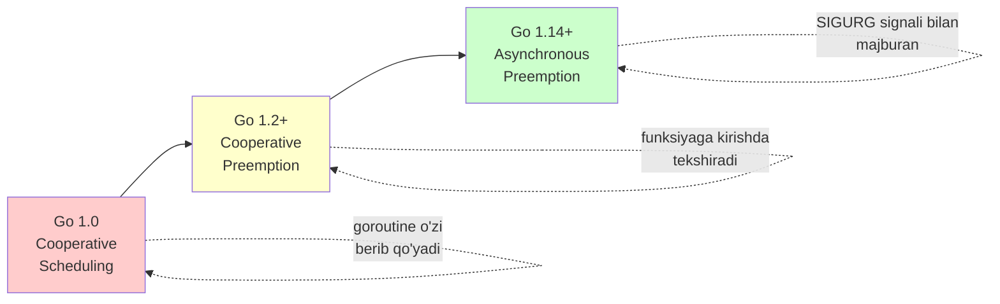
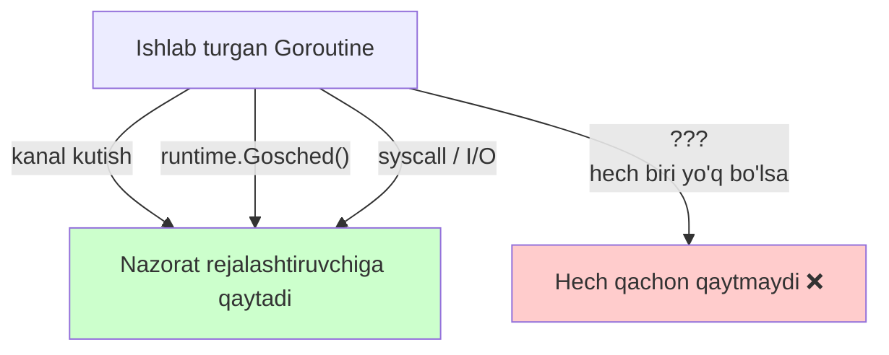
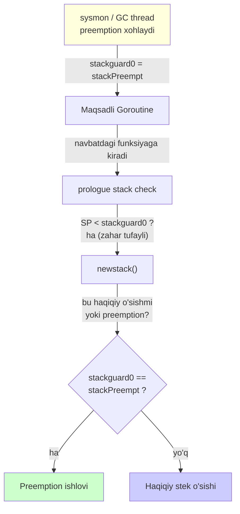
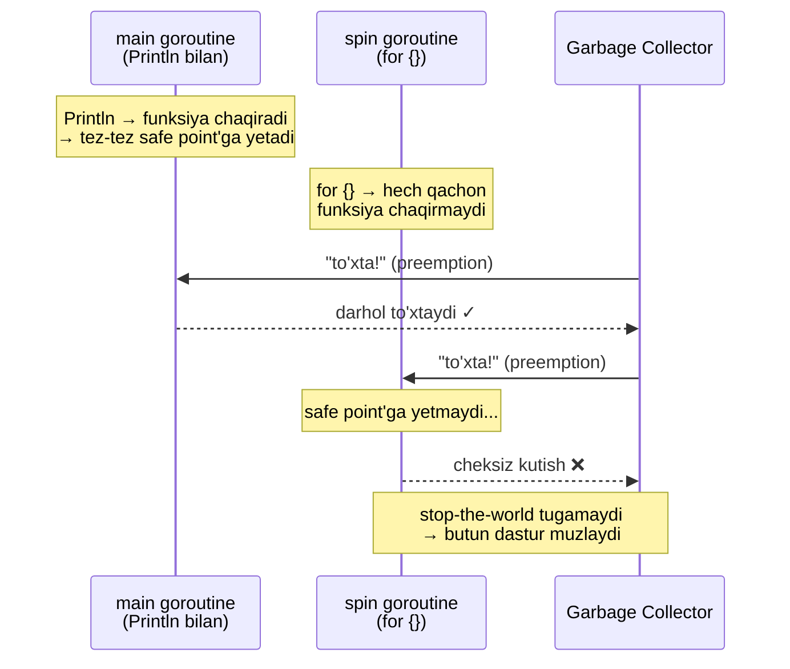
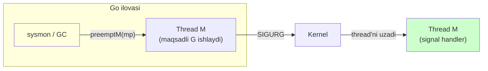
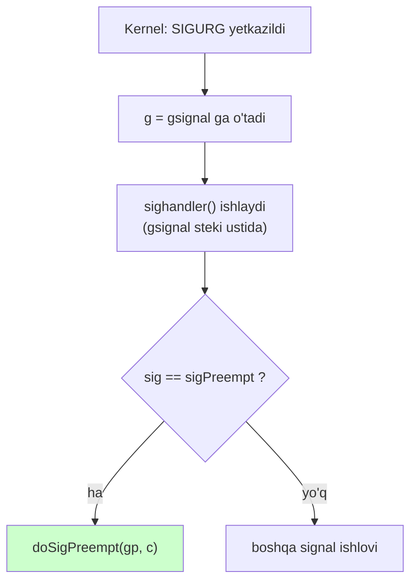
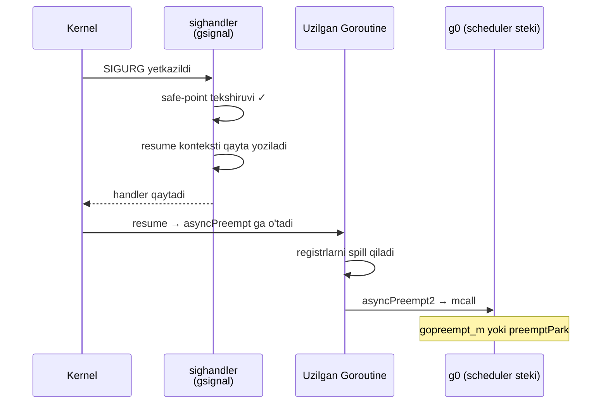
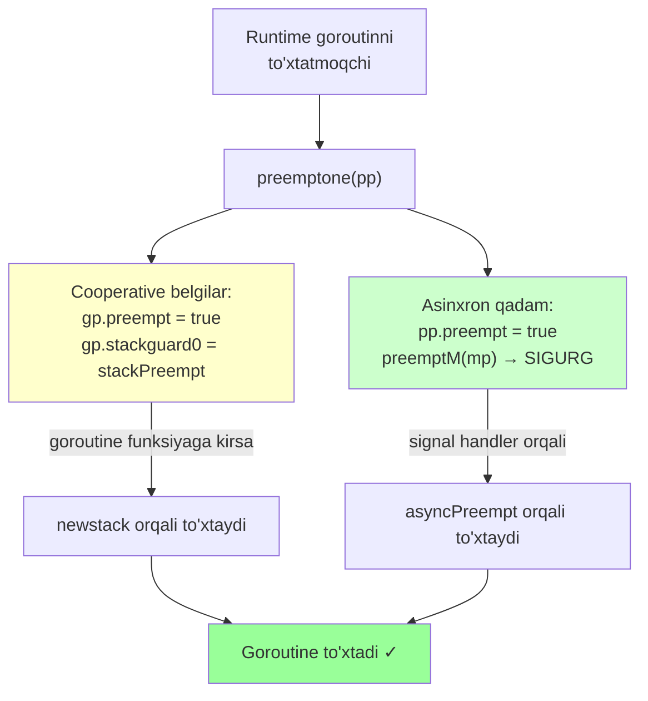

# 08 — Preemption (Preempsiya)

> Ushbu material — **The Anatomy of Go** (Phuong Le) kitobining 8-bobi asosida o'zbek tilida tayyorlangan o'quv qo'llanma. Mavzular so'zma-so'z tarjima emas — o'qib tushunilgach, o'z so'zlarim bilan qayta tushuntirilgan.

## Nima uchun bu mavzu muhim?

Oldingi bo'limlarda ([07 Scheduler](07_scheduler.md)) biz **rejalashtiruvchi kimni ishga tushirishini** ko'rdik. Lekin bitta muammo hal qilinmagan qoldi: **ishlab turgan goroutine CPU'ni o'z ixtiyori bilan qaytarmasa, nima bo'ladi?**

Tasavvur qiling: bitta goroutine `for {}` ichida cheksiz aylanmoqda. U kanal kutmaydi, syscall qilmaydi, funksiya chaqirmaydi. Rejalashtiruvchi qanchalik adolatli bo'lmasin, bu goroutine boshqa hech kimga navbat bermaydi. Yomoni — **Garbage Collector** stop-the-world qilmoqchi bo'lganda, hamma goroutine to'xtashi kerak, lekin bu bitta o'jar goroutine hech qayerda to'xtamaydi. Natijada butun dastur muzlab qoladi.

**Preemption** — bu ana shu muammoning yechimi. Runtime goroutinni **tashqaridan majburan to'xtatish** mexanizmi.

Bu bo'limda quyidagi savollarga javob beramiz:

- Nima uchun eski Go'da bitta cheksiz sikl butun dasturni muzlatib qo'yishi mumkin edi?
- `stackPreempt` — bu qanday "zahar qiymat" va u qanday ishlaydi?
- Nima uchun Go funksiya prologue'dagi **stack check**'dan preemption uchun ham foydalanadi?
- `SIGURG` signali nima uchun tanlangan va u goroutinni qanday to'xtatadi?
- `gsignal`, `asyncPreempt`, `preemptPark` — bular kim?

---

## Preemption evolyutsiyasi: uch bosqich

Go'da preemption bir kunda paydo bo'lgani yo'q. U uch bosqichda rivojlandi:



Keling, har birini alohida ko'rib chiqamiz.

---

## 1. Cooperative Scheduling (Kooperativ rejalashtirish)

**Kooperativ** so'zi "hamkorlik" degani. Bu modelda goroutine CPU'ni **o'z ixtiyori bilan** qaytaradi. Runtime uni tashqaridan majburlamaydi — goroutine o'zi "men to'xtayapman" deydi.

Goroutine qachon CPU'ni qaytaradi?

- **Bloklanganda** — kanal, `select`, taymer yoki I/O voqeasini kutganda tabiiy ravishda to'xtaydi.
- **Aniq topshiriq bilan** — `runtime.Gosched()` chaqirilganda, "boshqalarga navbat ber" deydi.
- **Runtime vositachilik nuqtalarida** — ma'lum runtime funksiyalari ichida rejalashtirish sodir bo'lishi mumkin.

Bu Go 1.0'dagi asosiy model edi.



### Muammo shu yerda

Agar bitta goroutine **bloklanmasa** va **funksiya chaqirmasa**, u CPU'ni cheksiz ushlab turadi:

```go
go func() {
    for {
    }
}()
```

Bu goroutine hech qachon rejalashtiruvchiga qaytmaydi. Bir xil `M` (thread) va `P` (processor) ustidagi boshqa goroutine'lar cheksiz kutib qoladi.

---

## 2. Cooperative Preemption (Kooperativ preempsiya)

Go bu muammoga **qisman yechim** topdi. G'oya oddiy: runtime allaqachon mavjud bo'lgan bir mexanizmdan foydalandi — **funksiya prologue'dagi stack check**.

### Function prologue va stack check nima?

Har safar goroutine **inline qilinmagan** funksiyaga kirganda, kompilyator avtomatik ravishda qisqa bir tekshiruv kodini qo'yadi (buni "prologue" deyiladi). Bu tekshiruv **stek yetarli joyga egami?** degan savolga javob beradi. Agar stek yetmasa, `morestack()` chaqiriladi va stek kattalashadi.

> Function prologue va stek o'sishi 7-bob (Memory)'da batafsil tushuntirilgan.

Soddalashtirilgan holda prologue mana shunday ko'rinadi:

```go
func someFunction() {
    if SP < gp.stackguard0 {   // stack pointer guard'dan pastdami?
        morestack()             // ha bo'lsa, stekni kattalashtir
    }
    // ... funksiya tanasi
}
```

`stackguard0` — bu odatda steksning quyi chegarasi (guard) qiymatini saqlaydi.

### Aqlli hiyla: guard'ni "zaharlash"

Runtime shu tayyor mexanizmdan foydalanib, ustiga bir hiyla o'ynadi. Goroutinni to'xtatmoqchi bo'lganda, u `stackguard0`'ga **maxsus zahar qiymat** — `stackPreempt` yozadi:

```go
const (
    stackPreempt = uintptrMask & -1314
    uintptrMask  = 1<<(8*goarch.PtrSize) - 1
)
```

Bu qiymat **har qanday haqiqiy stack pointer'dan kattaroq** qilib tanlangan. 64-bit tizimda u `0xFFFFFFFFFFFFFADE` ga teng bo'ladi. Aniq raqamning o'zi muhim emas — muhimi shuki, keyingi stek tekshiruvi **maqsadli ravishda muvaffaqiyatsiz** bo'ladi.

Natijada goroutine navbatdagi funksiyaga kirganda, `SP < gp.stackguard0` sharti **yolg'ondan** rost bo'lib chiqadi va goroutine `newstack()` ga kiradi — go'yo stek o'sishi kerakday.



### newstack ichida nima bo'ladi?

`newstack()` ichida runtime bu haqiqiy stek o'sishi emas, balki preemption so'rovi ekanligini aniqlaydi:

```go
func newstack() {
    thisg := getg()
    // ...
    stackguard0 := atomic.Loaduintptr(&gp.stackguard0)
    preempt := stackguard0 == stackPreempt

    if preempt {
        if !canPreemptM(thisg.m) {
            // hozir to'xtatish xavfsiz emas — guard'ni tiklaymiz
            gp.stackguard0 = gp.stack.lo + stackGuard
            gogo(&gp.sched) // ishlashda davom et, qaytmaydi
        }
    }
    // ...
    if preempt {
        if gp.preemptShrink {
            // sinxron xavfsiz nuqtadamiz — stekni qisqartir
            gp.preemptShrink = false
            shrinkstack(gp)
        }
        if gp.preemptStop {
            preemptPark(gp) // to'xtatib turadi, qaytmaydi
        }
        // go'yo goroutine Gosched() chaqirgan kabi
        gopreempt_m(gp) // qaytmaydi
    }
    // ... haqiqiy stek o'sishi va nusxalash
}
```

Bu yerda ikkita muhim `if preempt` bloki bor.

**Birinchi `if preempt` — xavfsizlik tekshiruvi.** "Hozir bu goroutinni to'xtatishga ruxsat bormi?" degan savol. `canPreemptM` javob beradi:

```go
func canPreemptM(mp *m) bool {
    return mp.locks == 0 &&
           mp.mallocing == 0 &&
           mp.preemptoff == "" &&
           mp.p.ptr().status == _Prunning
}
```

Ya'ni goroutinni to'xtatib bo'lmaydi, agar thread `M`:
- runtime **lock**'larini ushlab tursa (`locks != 0`),
- xotira **ajratish** o'rtasida bo'lsa (`mallocing != 0`),
- preemption **aniq o'chirilgan** bo'lsa (`preemptoff != ""`).

Bunday paytda noto'g'ri nuqtada to'xtash **deadlock** yoki buzilishga olib kelishi mumkin. Shuning uchun runtime guard'ni tiklaydi va goroutinni hozircha ishlashda davom ettiradi.

### Muhim: so'rov yo'qolmaydi

Guard vaqtincha tiklansa ham, preemption so'rovi **unutilmaydi**. Goroutine ikkita belgini olib yuradi:

- `gp.stackguard0 = stackPreempt` — sinxron trap hali armlangan;
- `gp.preempt = true` — preemption kutilayotgani eslab qolingan bayroq.

Go 1.13'dagi `preemptone()` mana shuni qiladi:

```go
func preemptone(_p_ *p) bool {
    mp := _p_.m.ptr()
    if mp == nil || mp == getg().m {
        return false
    }
    gp := mp.curg
    if gp == nil || gp == mp.g0 {
        return false
    }
    gp.preempt = true          // bayroqni yoqamiz
    gp.stackguard0 = stackPreempt  // trap'ni armlaymiz
    return true
}
```

Runtime avval `P`'ga ulangan thread `M`'ni topadi, keyin unda ishlab turgan `curg` goroutinni topadi va ikkala belgini ham qo'yadi. Bir joyda guard tiklansa ham, `gp.preempt` bayrog'i saqlanib qolgani uchun runtime keyinroq trap'ni yana armlashi mumkin.

### Cooperative preemption'ning cheklovi

Bu yechim yaxshi, lekin **yetarli emas**. Chunki u faqat funksiyaga kirganda ishlaydi. Ikkita holatda ishlamaydi:

1. **Inline qilingan funksiyalar** — ularning alohida prologue'i yo'q, shuning uchun preemption nuqtasi ham yo'q.
2. **Funksiya chaqirmaydigan sikllar** — `for {}` kabi.

### Klassik muzlash misoli

Mana kitobdagi mashhur misol:

```go
func main() {
    go func() {
        // band sikl — funksiya chaqiruvisiz
        for {}
    }()

    // bu ham band sikl, lekin Println bor
    for i := 0; ; i++ {
        fmt.Println(i)
    }
}
```

Go 1.13 yoki undan oldingi versiyada, ayniqsa `GOMAXPROCS=1` bilan ishga tushirsangiz — dastur **muzlab qolishi** mumkin. Nima bo'ladi?



1. `main` goroutine `Println` chaqiradi — funksiya chaqiruvlari va allocation'lar tufayli tez-tez safe point'ga yetadi.
2. Runtime GC siklini boshlaydi va hamma goroutine to'xtashini so'raydi.
3. `main` darhol to'xtaydi (funksiyaga tez-tez kiradi).
4. `for {}` goroutine esa — hech qachon funksiya chaqirmaydi, safe point'ga yetmaydi.
5. GC **cheksiz kutadi** → butun dastur muzlaydi.

Bu ilova mantig'idagi xato emas — bu eski Go'dagi preemption cheklovi edi. Yomoni, muammoli sikl uchinchi tomon kutubxonasida bo'lsa, uni tuzatish ham qiyin.

Bu **Asynchronous Preemption** ning kelib chiqish sababi.

---

## 3. Asynchronous Preemption (Asinxron preempsiya)

Go 1.14 **asinxron preempsiya**ni qo'shdi. Bu shuni anglatadiki, runtime endi goroutinni **hatto funksiya chaqirmaydigan cheksiz siklda ham** to'xtata oladi.

Buning kaliti — **operatsion tizim signali**.

### preemptone endi ikki qadam qiladi

Go 1.14'da (v1.23.0 kodida ham) `preemptone` cooperative belgilarni qo'yadi va ustiga **asinxron qadam**ni qo'shadi:

```go
func preemptone(pp *p) bool {
    // ...
    gp.preempt = true
    gp.stackguard0 = stackPreempt

    // Bu P uchun asinxron preemption so'raymiz
    if preemptMSupported && debug.asyncpreemptoff == 0 {
        pp.preempt = true    // P ni ham belgilaymiz
        preemptM(mp)         // signal yuboramiz!
    }
    return true
}
```

`preemptM(mp)` — bu **thread `M`'ga signal yuboradigan** ko'prik. Unix tizimlarda bu maxsus preemption signali — **`SIGURG`** — ni maqsadli goroutinni ishlatayotgan OS thread'iga jo'natadi.



### Signal nima?

**Signal** — operatsion tizimning jarayonga "biror voqea sodir bo'ldi, reaksiya bildir" deb xabar berish mexanizmi. Signal yetkazilganda, OS jarayondagi ma'lum bir thread'ni tanlaydi, uning ishini **uzadi** va ro'yxatga olingan **signal handler** kodini ishga tushiradi.

Signal turli voqealar uchun ishlatiladi:
- taymer tugadi,
- foydalanuvchi `Ctrl+C` bosdi,
- jarayon to'xtashi kerak,
- dastur noto'g'ri xotiraga tegdi (`SIGSEGV`),
- runtime ichki sabab bilan thread'ni uzmoqchi.

Unix'da signallar nomlari bor: `SIGINT`, `SIGTERM`, `SIGSEGV`, `SIGURG` va h.k. Handler tugagach, uzilgan thread odatda o'zi to'xtagan joydan davom etadi.

### Nima uchun aynan SIGURG?

Bu qiziq savol. `SIGURG` tarixan **shoshilinch soket ma'lumotlari** (urgent socket data) bilan bog'liq, lekin bu xususiyat bugungi kunda deyarli ishlatilmaydi. Shuning uchun `SIGURG` oddiy ilovalar uchun **kam to'qnashuvli** signal.

Go runtime uni tanlashning amaliy sabablari:
- **debugger**'lar odatda uni o'tkazib yuboradi (block qilmaydi),
- aralash Go/C binary'larda **libc** uni ichki ehtiyoj uchun band qilmaydi,
- u **tasodifan** (spurious) kelib qolsa ham jiddiy oqibat bo'lmaydi,
- ilovalar uning asl ma'nosini deyarli ishlatmaydi, ishlatsa ham spurious `SIGURG`'ga tayyor bo'lishi kerak.

### gsignal — signal uchun maxsus goroutine

Har bir thread `M`'da **`gsignal`** deb nomlangan maxsus goroutine bor. Uning **o'z signal steki** mavjud (runtime tomonidan yaratilgan). Signal kelganda, runtime signal yo'li oddiy user goroutine steki emas, balki **`gsignal` steki** ustida ishlaydi.

Bu muhim: uzilgan goroutinning steki handler kodini ishlatishga tayyor bo'lmasa ham, `gsignal`'ning alohida steki xavfsiz ishlashni ta'minlaydi.



### sighandler'ning argumentlari

```go
func sighandler(sig uint32, info *siginfo, ctxt unsafe.Pointer, gp *g) {
    gsignal := getg()
    mp := gsignal.m
    c := &sigctxt{info, ctxt}
    // ...
    if sig == sigPreempt && debug.asyncpreemptoff == 0 && !delayedSignal {
        doSigPreempt(gp, c)
    }
    // ...
}
```

- **`sig`** — signal raqami (`SIGURG` bo'lsa `sigPreempt`).
- **`info`** — kernel to'ldirgan qo'shimcha ma'lumot (fault signallar uchun xato manzili va h.k.).
- **`ctxt`** — signal kelgandagi thread'ning **saqlangan CPU konteksti**: program counter, stack pointer, registrlar. Keyin ijro shu kontekstdan davom etadi.
- **`gp`** — signal kelgan paytda thread'da ishlab turgan goroutine. `sighandler` ishlayotganda `g = gsignal` bo'lgani uchun, **qaysi goroutine uzilganini** alohida bilishi kerak.

### Eng qiyin qism: asinxron safe-point tekshiruvi

Handler har qanday goroutinni to'xtata olmaydi. Avval u ikkita shartni tekshiradi:
1. Uzilgan goroutine haqiqatan ham shu thread'da ishlab turgan goroutinemi?
2. Haqiqiy preemption so'rovi kutilayaptimi? (`g.preempt` va `p.preempt`)

Keyin **asinxron safe-point tekshiruvi** keladi. Bu yerda "safe point" — shunchaki "qulay joy" emas. Bu shuni anglatadiki, agar runtime goroutinni **aynan shu mashina komandasida** to'xtatsa, u:
- stekni to'g'ri tushuna oladi,
- registr qiymatlarini to'g'ri o'qiy oladi,
- garbage collection holatini buzmaydi,
- ijroni runtime kodiga xavfsiz yo'naltira oladi.

Bu cooperative modeldan **ancha qattiqroq**. Handler quyidagilarni **rad etadi**:
- ko'p **assembly** hududlarini (runtime stek/registr ma'lumotini ishonchli o'qiy olmaydi),
- kompilyator/runtime metadata "asinxron uzishga xavfsiz emas" deb belgilagan joylarni,
- **runtime ichki** yo'llarini (uzish deadlock yoki nomuvofiqlikka olib kelishi mumkin),
- thread `M`'ning o'zi preemptible bo'lmagan holatni (lock ushlab turgan, allocation'da, preemption o'chirilgan).

Xulosa: asinxron preemption **faqat** uzilgan kod joyi **ham**, thread holati **ham** yetarlicha xavfsiz bo'lgandagina sodir bo'ladi.

### Scheduler Context: nega snapshot yetarli emas?

Aytaylik, hamma shart bajarildi. Endi goroutinni "waiting" qilib run queue'ga qo'ysak bo'ladimi? **Yo'q, bunday ishlamaydi.**

Saqlangan signal konteksti faqat **snapshot** beradi: PC, SP, registrlar. Bu uzilgan holatni tekshirish uchun yetarli, lekin scheduler uchun **kam**. Ikki sabab bor:

1. **Register spilling** — asinxron safe point'da ba'zi pointer qiymatlar faqat **registrlarda** yashaydi. Runtime va GC ular bilan xavfsiz ishlashi uchun bu qiymatlar oddiy runtime kirish yo'lida **xotiraga ko'chirilishi** (spill) kerak.
2. **Signal yo'lida turibmiz** — handler ishlayotganda thread hali OS'ning signal yetkazish yo'lida. Go bu yerda oddiy scheduler ishini boshlashni istamaydi.

### Yechim: resume yo'lini qayta yozish

Runtime saqlangan CPU kontekstini shunday **qayta yozadi**ki, signal handler tugagach, thread go'yo goroutine **`asyncPreempt`** nomli runtime funksiyasini chaqirgandek davom etadi.



### asyncPreempt uch ish qiladi

`asyncPreempt` — kichik assembly stub. Yuqori darajada u:
1. Uzilgan goroutinning **registr holatini** runtime xavfsiz ishlay oladigan shaklda saqlaydi (goroutine ixtiyoriy komandada to'xtagan).
2. `asyncPreempt2` Go yordamchisini chaqirib, nazoratni **oddiy runtime preemption yo'liga** o'tkazadi.
3. Bu to'xtashni **asinxron safe point** deb belgilaydi (keyingi runtime/GC mantig'i buni biladi).

```go
func asyncPreempt2() {
    gp := getg()
    gp.asyncSafePoint = true
    if gp.preemptStop {
        mcall(preemptPark)   // to'xtatib turadi
    } else {
        mcall(gopreempt_m)   // yield qiladi
    }
    gp.asyncSafePoint = false
}
```

### Ikki yo'l: gopreempt_m va preemptPark

`mcall` orqali runtime joriy goroutine stekidan **`g0` scheduler stekiga** o'tadi va ikkita yo'ldan birini tanlaydi:

| Yo'l | Nima qiladi | Qachon |
|------|-------------|--------|
| **`gopreempt_m`** | Goroutinni `_Grunning` → `_Grunnable` qilib, run queue'ga qaytaradi. Scheduler keyingi ishni tanlaydi. | Oddiy yield — boshqa nimadir ishlashi uchun navbat berish |
| **`preemptPark`** | Goroutinni `_Gpreempted` holatiga o'tkazadi, thread `M`'dan **uzadi**, keyin scheduler'ni chaqiradi. | Kuchli to'xtatish — goroutinni bir muddat to'xtatilgan holatda **ushlab turish** |

`preemptPark` ayniqsa **stop-the-world GC** bilan chambarchas bog'liq, chunki garbage collector root scanning oldidan yoki paytida goroutine steklarining **barqaror** bo'lishini talab qiladi.

---

## Umumiy manzara: cooperative + asynchronous birga

Zamonaviy Go **ikkala yo'lni ham** saqlaydi:



Cooperative yo'l "yumshoq" — goroutine tabiiy nuqtaga yetganda ishlaydi. Asinxron yo'l "qat'iy" — cheksiz sikldagi goroutinni ham to'xtata oladi. Ular bir-birini to'ldiradi.

---

## Eslab qol

- **Cooperative Scheduling** (Go 1.0): goroutine CPU'ni **o'zi** qaytaradi — bloklanganda yoki `Gosched()` chaqirganda. Cheksiz sikl butun dasturni muzlatadi.
- **Cooperative Preemption** (Go 1.2+): runtime **function prologue stack check**'dan foydalanadi. `stackguard0`'ga `stackPreempt` "zahar qiymati" yoziladi → keyingi funksiyaga kirishda `newstack` ga tushadi → preemption aniqlanadi.
- `stackPreempt` **har qanday haqiqiy stack pointer'dan katta** qilib tanlangan, shuning uchun stek tekshiruvi maqsadli ravishda "yiqiladi".
- Cooperative preemption **cheklangan**: inline funksiyalar va `for {}` sikllarida ishlamaydi.
- **Asynchronous Preemption** (Go 1.14+): runtime OS thread'iga **`SIGURG`** signali yuboradi. Bu cheksiz sikldagi goroutinni ham to'xtatadi.
- Signal `gsignal` steki ustida ishlaydi. `sighandler` **asinxron safe-point tekshiruvi**ni bajaradi — u cooperative'dan ancha qattiq.
- Runtime scheduler'ni signal handler ichida ishlatmaydi. U resume kontekstini **`asyncPreempt`** ga qayta yozadi → registrlar spill qilinadi → `gopreempt_m` (yield) yoki `preemptPark` (to'xtatib turish).
- `canPreemptM`: goroutinni to'xtatib bo'lmaydi, agar `M` lock ushlasa, allocation'da bo'lsa yoki preemption o'chirilgan bo'lsa.

---

## Tez-tez uchraydigan xatolar

- **"Preemption Go 1.0'dan beri bor"** — yo'q. Go 1.0'da faqat cooperative scheduling bor edi. Cheksiz sikl chindan ham dasturni muzlatib qo'yardi.
- **"SIGURG'ni men ushlashim mumkin"** — Agar ilovangizda `SIGURG` uchun handler o'rnatsangiz, Go runtime bilan to'qnashishingiz mumkin. Uni tinch qo'ying.
- **"Async preemption istalgan joyda ishlaydi"** — Yo'q. Asinxron safe-point tekshiruvi ko'p joyni (assembly, runtime ichki kodi, lock ushlagan thread) rad etadi.
- **`gp.preempt = true` qo'yish yetarli deb o'ylash** — Cooperative yo'lda bu goroutine funksiyaga kirmasa hech qachon sezilmaydi. Aynan shuning uchun `preemptM` (signal) qo'shilgan.
- **`stackPreempt` bilan haqiqiy stek o'sishini adashtirmaslik** — `newstack` ikkalasini `stackguard0 == stackPreempt` tekshiruvi bilan ajratadi.

---

## Amaliyot

1. **Muzlash tajribasi (tarixiy):** Quyidagi kodni tasavvur qiling (real ishga tushirmang, faqat mulohaza qiling):
   ```go
   func main() {
       runtime.GOMAXPROCS(1)
       go func() { for {} }()
       time.Sleep(time.Millisecond)
       runtime.GC()  // Go 1.13'da bu muzlaydi
       fmt.Println("GC tugadi")
   }
   ```
   Nima uchun Go 1.13'da bu kod `"GC tugadi"`ga yetmasdi, lekin Go 1.14+'da normal ishlaydi? Javobni `SIGURG` orqali tushuntiring.

2. **`GODEBUG=asyncpreemptoff=1`** muhit o'zgaruvchisini o'rnatib, yuqoridagi holat qaytishini kutish mumkinmi? Bu bayroq nimani o'chiradi?

3. **Solishtiring:** `gopreempt_m` va `preemptPark` — bir goroutinni to'xtatadi, lekin farqi nima? Qaysi biri GC uchun kerak va nima uchun?

4. **Chizib ko'ring:** `canPreemptM` `false` qaytargan holatni tasvirlab bering. Runtime bu holatda nima qiladi va preemption so'rovi yo'qoladi-mi?

---

[← 07 Scheduler](07_scheduler.md) | [Keyingi: 09 I/O Handling →](09_io_handling.md)
