# 09 — I/O Handling (I/O boshqaruvi)

> Ushbu material — **The Anatomy of Go** (Phuong Le) kitobining 8-bobi asosida o'zbek tilida tayyorlangan o'quv qo'llanma. Mavzular so'zma-so'z tarjima emas — o'qib tushunilgach, o'z so'zlarim bilan qayta tushuntirilgan.

## Nima uchun bu mavzu muhim?

Siz `http.Get()` yozasiz, u tarmoqdan javob kutadi. Ayni paytda dasturingizda **million goroutine** ishlashi mumkin. Savol: agar har bir tarmoq kutishi bitta OS thread'ni band qilsa, million thread kerak bo'lardi. Bu esa OS uchun halokat.

Go **10 000 ta parallel tarmoq ulanishini** bir nechta thread bilan boshqara oladi. Qanday? Sirning kaliti — **network poller** (netpoller) va uning ostidagi **epoll** (Linux'da).

Bu bo'lim eng "past darajali" mavzulardan biri — biz kernel bilan gaplashamiz. Lekin aynan shu yerda Go'ning concurrency modeli o'zining haqiqiy kuchini ko'rsatadi. Preemption ([08](08_preemption.md)) goroutinni **majburan to'xtatgani** kabi, netpoller goroutinni **I/O kutayotganda oqilona to'xtatadi** — lekin thread'ni band qilmasdan.

Bu bo'limda quyidagi savollarga javob beramiz:

- **File descriptor** nima va nima uchun u shunchaki bir raqam?
- **Blocking I/O** nima uchun ko'p ulanishlarda qimmatga tushadi?
- **epoll** qanday qilib bitta thread bilan minglab soketni kuzatadi?
- Go **netpoller** goroutinni qanday to'xtatadi va uyg'otadi (`gopark`/`goready`)?
- `poll.FD`, `pollDesc`, `rg`/`wg` — bular kim va qanday bog'langan?

---

## Fayl deskriptorlari (File Descriptors)

**File descriptor** (FD) — operatsion tizim jarayonga ochiq I/O resursi uchun beradigan **kichik, manfiy bo'lmagan son**. Bu resurs fayl, **socket**, quvur (pipe), terminal yoki qurilma bo'lishi mumkin.

Dastur o'zi fayl yoki socket'ni ocholmaydi. U kernel'dan `open`, `openat` kabi **syscall** orqali so'raydi. Bu so'rov **user space**'dan **kernel space**'ga o'tadi. Kernel tekshiradi (yo'l to'g'rimi, ruxsat bormi) va muvaffaqiyatli bo'lsa, jarayonga bir raqam qaytaradi.

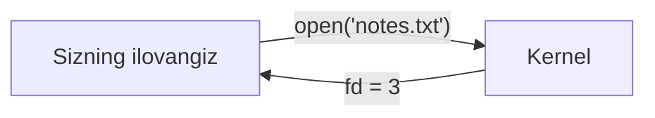

Aniq raqam muhim emas — u 3, 10, 30 bo'lishi mumkin. Muhimi shuki, bu raqam keyingi `read`, `write`, `close` amallarida **handle** (dastak) bo'lib xizmat qiladi.

### "Everything is a file"

Unix'da bir xil FD modeli faqat oddiy fayllar uchun emas — u **socket, pipe, terminal** va boshqa I/O obyektlari uchun ham ishlaydi. Shuning uchun Unix'da "everything is a file" deyiladi: ko'p resurslar **bir xil FD asosidagi interfeys** orqali ishlanadi (har bir resurs diskda fayl demagan).

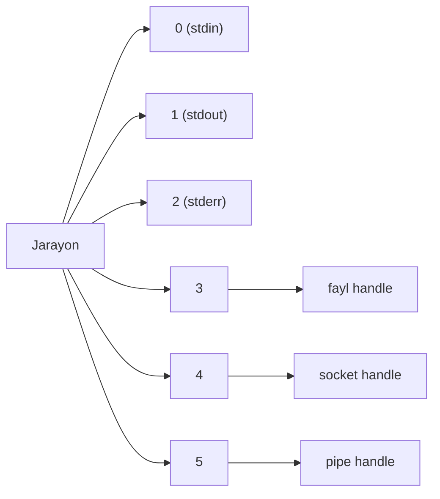

`0`, `1`, `2` — jarayon odatda boshlaydigan standart deskriptorlar: **stdin**, **stdout**, **stderr**.

### FD raqamlari jarayonga lokal

`10` raqami faqat **bitta jarayon ichida** ma'noga ega. Boshqa jarayon ham o'z `10` FD'siga ega bo'lishi mumkin — bu normal. Kernel har bir jarayon uchun **file descriptor table** saqlaydi.

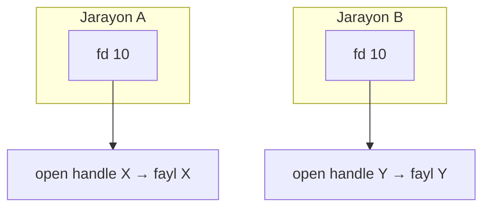

### FD ostida nima yashiringan?

FD `3` — bu diskdagi faylga **to'g'ridan-to'g'ri** ko'rsatmaydi. U jarayonning FD table'idagi **indeks** bo'lib, kernel boshqaradigan **open file description** obyektiga ishora qiladi. Bu obyekt:
- joriy fayl **offset**'i (`f_pos`),
- fayl holat **bayroqlari** (`f_flags`),
- asosiy resursga havolani (`inode`)

saqlaydi.

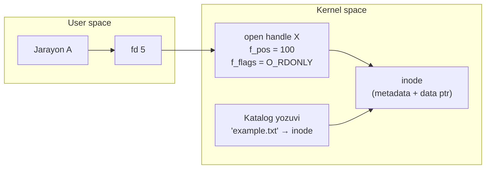

Unix fayl tizimlarida asosiy fayl odatda **inode** orqali ifodalanadi. Inode fayl **metadata**'sini saqlaydi: turi, hajmi, ruxsatlar, vaqt tamg'alari, data bloklariga ko'rsatkichlar.

**Muhim nozik nuqta:** inode **fayl nomini saqlamaydi**. Fayl nomlari **katalog (directory) yozuvlarida** yashaydi — ular nomni (`example.txt`) inode raqamiga bog'laydi. Shuning uchun faylni **rename** qilish odatda katalog yozuvini o'zgartiradi, inode'ni emas.

### close(fd) nima qiladi?

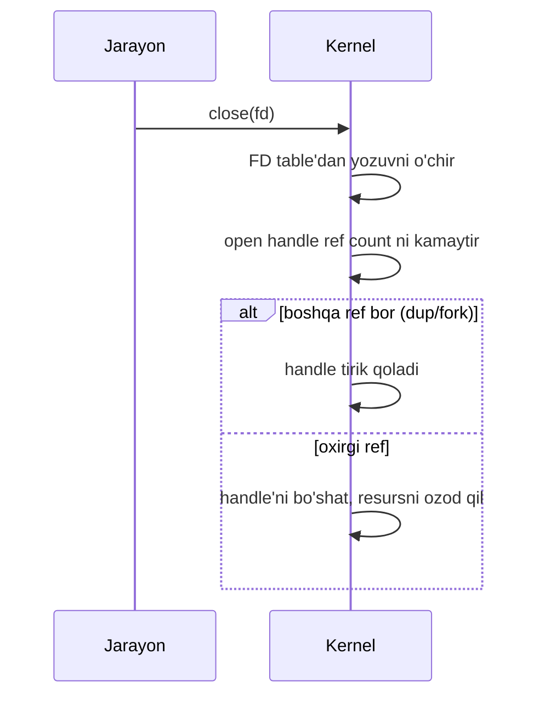

`close(fd)` avval **FD table yozuvini** o'chiradi. Keyin open handle'ning **reference count**'ini kamaytiradi. Agar boshqa deskriptorlar (`dup` yoki `fork` orqali) hali shu handle'ga ishora qilsa, handle tirik qoladi. Oxirgi havola o'chsa — kernel handle'ni bo'shatadi.

---

## Go File Descriptor Management (Go'da FD boshqaruvi)

Go xom OS deskriptori bilan **hamma joyda to'g'ridan-to'g'ri** ishlamaydi. Buning o'rniga, u deskriptorni **Go-boshqariladigan wrapper** ichiga joylaydi.

`net` paketida bu wrapper **`netFD`** ichida, deskriptorni bevosita boshqaradigan qism esa `internal/poll` dan **`poll.FD`**:

```go
type netFD struct {
    pfd poll.FD
    // ...
}

// package internal/poll
type FD struct {
    Sysfd      int       // haqiqiy OS deskriptori raqami
    pd         pollDesc  // poller holati
    isBlocking uint32    // blocking rejimdami?
    isFile     bool      // oddiy faylmi yoki socket?
    // ...
}
```

`poll.FD` — haqiqiy OS deskriptori atrofidagi kichik wrapper. U `net` va `os` paketlari uchun **bitta umumiy joy** beradi, bunda:
- parallel I/O koordinatsiyasi (bir necha goroutine bir vaqtda `Read`/`Write` qilishi),
- `Close` boshqaruvi (bir goroutine yopmoqchi, boshqasi I/O'da bloklanган),
- runtime poller bilan integratsiya (deskriptor pollable bo'lsa),
- **deadline** mexanizmi

markazlashtiriladi.

`os` paketidagi `*os.File` ham **bir xil** wrapper oilasidan foydalanadi:

```go
package os

type file struct {
    pfd  poll.FD
    name string
    // ...
}
```

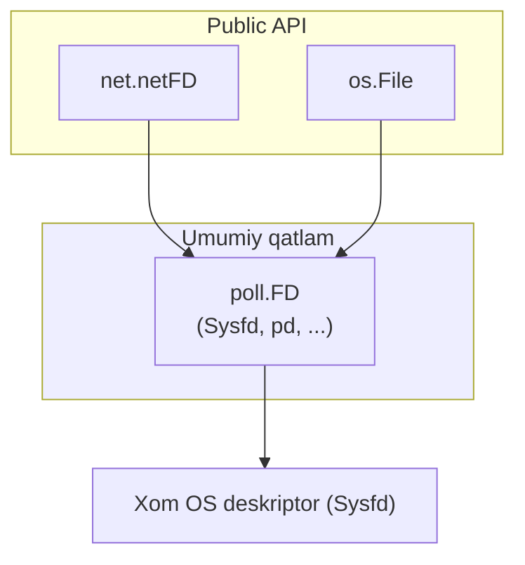

Ya'ni `net` va `os` — **turli public API**'lar, lekin ostida ikkalasi ham bir xil deskriptor-boshqaruv qatlamiga tayanadi.

### Nima uchun flexible wrapper kerak?

I/O chaqiruvining narxi deskriptor **turiga** bog'liq. Lokal disk deskriptori orqali I/O ko'pincha socket deskriptori orqali I/O'dan **arzonroq**, chunki tarmoq ma'lumoti network stack orqali o'tishi, hatto boshqa mashinalarga borishi kerak. Aynan shu farq uchun Go'ga turli I/O'ni **bitta model** ostida boshqaradigan moslashuvchan wrapper kerak.

Keng ma'noda Go'ning I/O'si ikkita uslubga bo'linadi: **Blocking I/O** va **Poller-Based I/O**.

---

## Blocking I/O Model (Blokirovkalovchi I/O modeli)

Birinchi model — oddiyroq. Poller orqali readiness kutish yo'q, shunchaki oddiy **blocking OS chaqiruvi**. Blocking I/O demak — thread operatsion tizimga kiradi va amal **ilgarilash mumkin bo'lgunga**, tugagunga yoki xato bergunga qadar u yerda qoladi.

- Agar `read`'da hali ma'lumot yo'q bo'lsa — chaqiruv darhol qaytmaydi.
- Agar `write` hali ilgarilay olmasa — chaqiruv ham kutadi.

Ilova kodidan bu tabiiy his qilinadi: goroutine `Read`/`Write` chaqiradi va natijani kutadi.

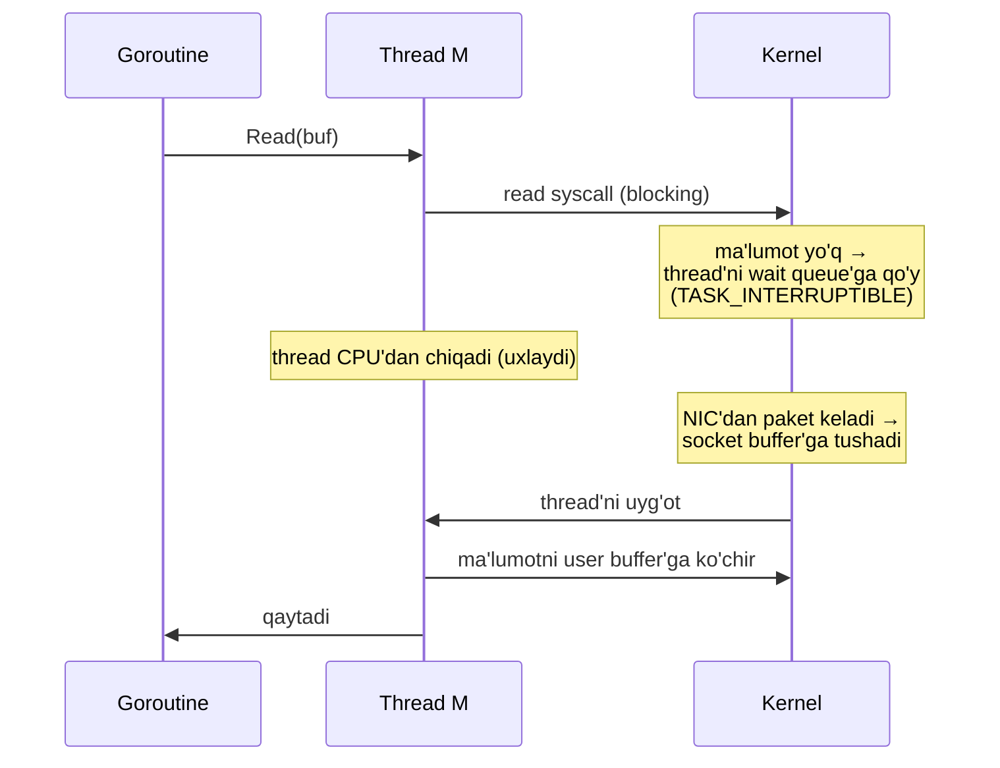

Bu modelda **kutish kernel ichida** sodir bo'ladi. Linux'da kernel thread'ni `TASK_INTERRUPTIBLE` yoki `TASK_UNINTERRUPTIBLE` deb belgilaydi, uni socket yoki fayl voqeasiga bog'langan **wait queue**'ga qo'yadi va CPU'dan chiqaradi. Ma'lumot tayyor bo'lganda kernel wait queue'dagi thread'larni uyg'otadi.

**Tradeoff:** Bitta bloklangan I/O butun dasturni muzlatmaydi (Go boshqa thread yaratishi mumkin), lekin u **bitta OS thread'ni** kutish davomida band qiladi. Ko'p ulanishda bu qimmatga tushadi — ko'p thread, ko'p thread-management va kernel-scheduling xarajati.

### Go qaysi syscall yo'lini tanlaydi?

Runtime kernel'dan "bu syscall uzoq bloklanadimi?" deb **oldindan so'ray olmaydi**. Shuning uchun Go bitta chaqiruvning natijasini bashorat qilmaydi — u **amal turiga** qarab yo'l tanlaydi:

1. **`runtime.entersyscallblock`** — amal qonuniy ravishda uzoq uxlashi mumkin bo'lsa (masalan, past darajali sleep yoki lock-wait primitivlari).
2. **`runtime.entersyscall`** — oddiy syscall bo'lsa, kernel chaqiruvi **tez qaytishi** kutilsa.

Bu yerda "tez qaytadi" — syscall darhol **yakuniy ma'lumotni** beradi degani emas. Bu kernel chaqiruvining tez **nazoratni qaytarishi** — muvaffaqiyat, xato yoki `EAGAIN` ("hozir bo'lmaydi, boshqa joyda kut") bilan — degani.

### Ikkala yo'lda ham umumiy: M va P ajraladi

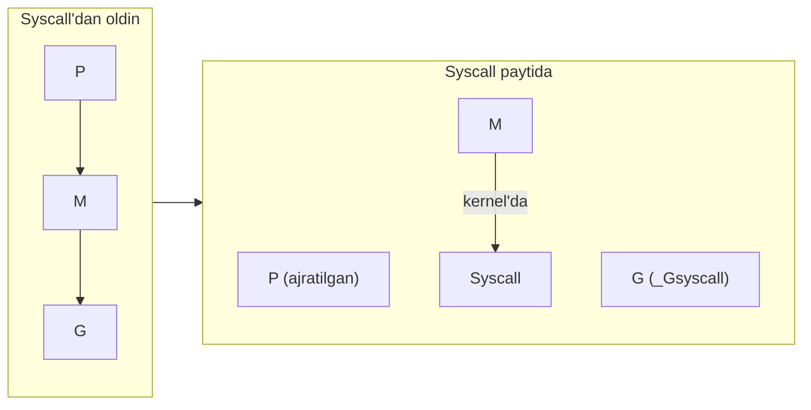

Ikkala yo'lda ham:
- Goroutine **`_Gsyscall`** holatida belgilanadi (u hozir Go kodi ishlatmayapti).
- Thread `M` o'z processor `P`'sidan **ajraladi**.

### Farq: handoff qachon sodir bo'ladi?

Bu eng muhim farq.

| | `entersyscallblock` | `entersyscall` |
|---|---|---|
| **P handoff** | **Darhol** boshqa goroutine'ga topshiriladi | **Kechiktiriladi** — P `_Psyscall` holatida qoladi |
| **Sabab** | Kernel kutishi uzoq bo'lishi kutiladi | Syscall tez qaytishi kutiladi |
| **Foyda** | Ijro quvvati bekor turmaydi | Tez qaytsa, eski P'ni qayta olish — scheduler ishisiz |

`entersyscall` yo'lida P darhol topshirilmaydi — u **`_Psyscall`** maxsus holatida qoladi. Bu P Go kodi ishlatmaydi, lekin goroutinning **oldingi P**'si sifatida saqlanadi (tez qaytish uchun). Ikkita natija bo'lishi mumkin:

- **Tez yo'l:** syscall tez qaytsa, goroutine syscall holatidan chiqib, **eski P'sini qaytarib oladi**. Scheduler ishisiz.
- **Sekin yo'l:** syscall uzoq cho'zilsa, runtime keyinroq P'ni `_Psyscall`'dan boshqalarga topshiradi. Keyin syscall qaytganda, goroutine yangi P'ni sekinroq scheduler yo'li orqali oladi.

### sysmon — _Psyscall qorovuli

Kim P'ni "juda uzoq turibdi" deb hal qiladi? Bu **sysmon** (system monitor) — taymer asosidagi qorovul thread. U qayta-qayta uyg'onadi va `_Psyscall`'dagi P'larni tekshiradi:

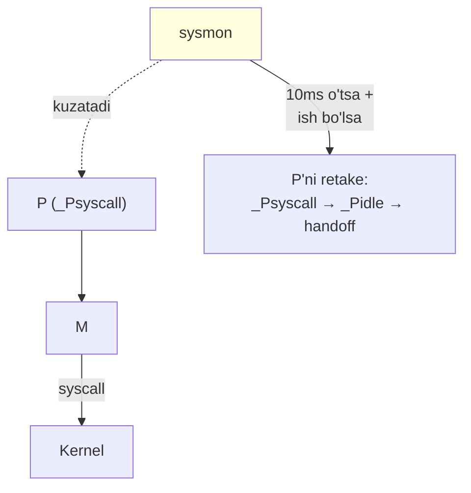

`sysmon` P'ni birinchi marta `_Psyscall`'da ko'rganda, joriy `syscalltick` va vaqtni **yozib qo'yadi** (bookkeeping). Agar syscall keyingi tekshiruvdan oldin qaytsa — tez yo'l ishlaydi, handoff kerak emas.

Keyingi o'tishda P hali `_Psyscall`'da bo'lsa, runtime bilardiki bu qisqa syscall emas. Lekin u hali **grace rule** qo'llaydi:
- Agar P'ning lokal run queue **bo'sh** bo'lsa va runtime'da zaxira quvvat bo'lsa — `sysmon` P'ni ~**10  millisekund**gacha `_Psyscall`'da qoldiradi. Bu sekinroq syscall'lar uchun keraksiz "churn"'ni oldini oladi.
- Agar ishga tayyor ish CPU talab qilsa yoki grace davri tugagan bo'lsa — `sysmon` P'ni retake qiladi, `_Pidle`'ga o'tkazadi va topshiradi.

> `sysmon` haqida to'liqroq [10 Sysmon](10_sysmon.md) bo'limida.

---

## Poller-Based I/O Model (Poller asosidagi I/O modeli)

Ikkinchi model — **poller asosidagi**. Bu Go'ning **OS thread'ni kernel'da bloklanган holda qoldirmaslik** usuli.

Bu ikki model OS **nima taklif qila olishini** aks ettiradi:

- Agar OS berilgan deskriptor turi uchun **foydali readiness mexanizmi** taklif qila olmasa — Go haqiqiy blocking syscall'ga majbur bo'lishi mumkin. Bunda OS thread kernel'da bloklanadi, runtime esa bu blokning **scheduling narxini** kamaytiradi (yuqoridagi `_Psyscall` mexanizmi).
- Agar OS readiness'ni **to'g'ri xabar qila olsa** — Go deskriptorni **non-blocking** rejimga qo'yadi, syscall'ni sinaydi va amal bloklanishi kerak bo'lganda pollerdan foydalanadi. Bunda **faqat goroutine** bloklanadi, OS thread emas.

**Muhim:** poller modeli butunlay boshqa I/O turi emas. U OS chegarasida **bir xil oddiy syscall**'dan foydalanadi. O'zgaradigan narsa — **kutish strategiyasi**: avval non-blocking syscall'ni sina, tayyor bo'lmasa runtime poller readiness'ni kutsin va goroutinni keyinroq uyg'otsin.

Buni to'liq tushunish uchun bitta oxirgi tushuncha kerak: **I/O multiplexing**.

---

## I/O Multiplexing (I/O multipleksatsiya)

OS bizga har bir deskriptor uchun "shu socket'dan o'qi" yoki "shu socket'ga yoz" amallarini beradi va bular chaqiruvchini bloklashi mumkin. Muammo: **bitta thread ko'p deskriptorni bir vaqtda samarali kuta olmaydi**, agar faqat blocking `read`/`write` ishlatilsa.

Agar bitta thread ko'p ulanishga javobgar bo'lib, ulardan birida blocking `read` qilsa — u **o'sha bitta** ulanish tayyor bo'lguncha qotib qoladi. Bu vaqtda boshqa ulanishlarda ma'lumot tayyor bo'lsa ham, thread reaksiya bildira olmaydi.

Ikkita klassik yechim (ikkalasi ham kamchilikli):

1. **Har ulanishga bitta thread** — har biri mustaqil bloklaydi. Ishlaydi, lekin thread soni ulanishlar bilan o'sadi (OS'ga xarajat).
2. **Non-blocking + tsiklda polling** — deskriptorlarni non-blocking qilib, tsiklda takror sinash:
   - juda tez-tez tekshirsang — CPU'ni behuda sarflaysan ("hech narsa tayyor emas" degan javobni takror olib),
   - kamroq tekshirsang yoki sleep qo'ysang — CPU tejaladi, lekin **latency** oshadi.

**I/O multiplexing** aynan shu muammoni hal qiladi. Bu **OS xususiyati**: bitta kutish amali **ko'p deskriptorni bir vaqtda** qamrab oladi. Dastur OS'ga qaysi deskriptorlarga qiziqishini aytadi, keyin ulardan **kamida bittasi tayyor bo'lguncha** kutadi.

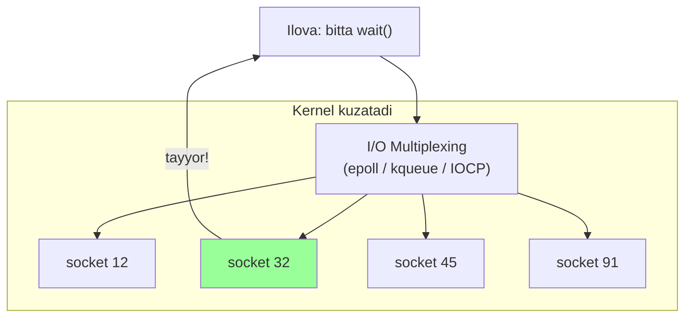

Har bir OS oilasi buni turli API orqali beradi:
- **Unix**: `select`, `poll`, `epoll` (Linux), `kqueue` (BSD/macOS) — **readiness** asosidagi.
- **Windows**: I/O completion ports (IOCP) — **completion** asosidagi (asinxron I/O tugaganda xabar beradi).

Yuqori darajadagi maqsad o'xshash, lekin API va event modeli farq qiladi: Unix — readiness-based, Windows IOCP — completion-based.

### Faqat "pollable" deskriptorlar

Multiplexing faqat OS **kuzata oladigan** deskriptorlar uchun ishlaydi — ya'ni **pollable** deskriptorlar.

| Deskriptor | Pollable? | Nima uchun |
|---|---|---|
| **socket** | Ha | Ma'lumot keyin keladi — readiness o'zgaradi |
| **pipe** | Ha | Xuddi shunday jonli oqim |
| **terminal** | Ko'pincha | Foydalanuvchi kiritishi keyin keladi |
| **oddiy disk fayl** | Amalda **yo'q** | Ma'lumot allaqachon fayl tizimida |

Oddiy disk fayl **jonli oqim emas** — ma'lumot allaqachon fayl tizimida, keyin kelmaydi. Shuning uchun readiness API'lar oddiy faylni ko'pincha **darhol "tayyor"** deb hisoblaydi:
- `read` uchun — bu yangi ma'lumot kelgani emas, faqat `read` hozir ilgarilashi mumkin (EOF bo'lsa ham darhol qaytadi).
- `write` uchun — baytlar hali diskda emas, faqat kernel yozuvni hozir qabul qila oladi.

Oddiy fayl uchun javob deyarli har doim "hozir tayyor" bo'lgani uchun, bu signal **kelajakdagi voqeani kutish** uchun foydasiz. Socket va pipe uchun readiness ancha ma'noli — holat vaqt o'tishi bilan "tayyor emas" → "tayyor" ga o'zgaradi. Aynan shu o'zgaruvchi holat event-driven I/O uchun kerak.

---

## Linux epoll

Go netpoller'ni tushunish uchun **epoll**'ni qisqacha ko'rib chiqamiz (bu Linux'da readiness-based I/O multiplexing'ning soddalashtirilgan ko'rinishi).

Linux'ga bir usul kerak: dastur bitta socket'da bir thread'ni bloklamasdan I/O kutsin. Server minglab socket ochishi mumkin va u **ulardan biror biri** o'qiladigan/yoziladigan bo'lguncha uxlashi, keyin uyg'onib holat o'zgarganlarini boshqarishi kerak. `epoll` — Linux'ning aynan shu muammoni hal qiladigan kernel interfeysi.

### epoll instance

Kernel'ga qaysi FD'lar kuzatilayotganini, har biri uchun qaysi voqealar muhimligini va qaysi qiymat qaytishini eslab qolish uchun **joy** kerak. Bu holat **kernel ichida** yashaydi (chunki kernel deskriptor holatini ko'radi va thread'larni uyg'otadi). Bu holatni saqlaydigan kernel obyekti — **epoll instance**. Har bir instance'ning o'z **interest list**'i va **ready list**'i bor.

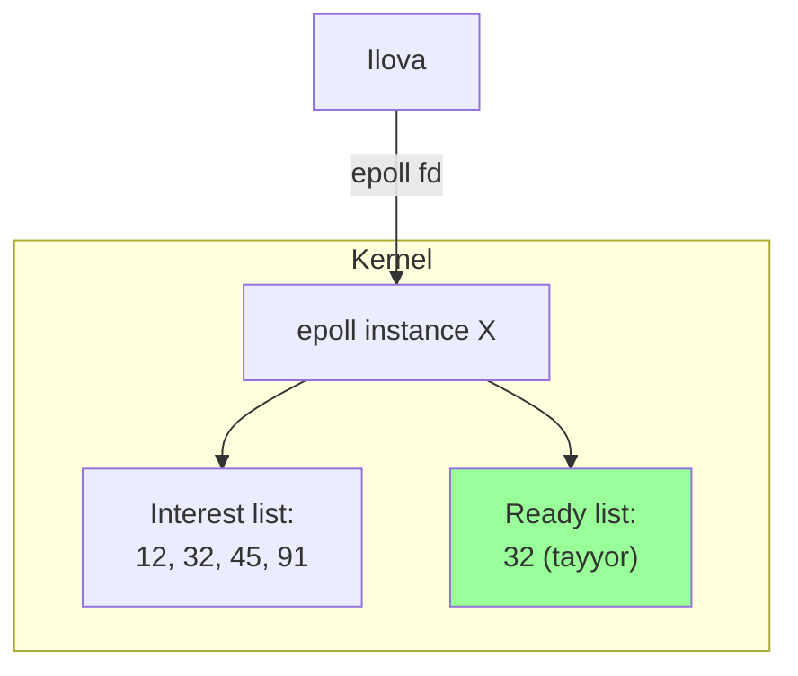

epoll instance — user-space ma'lumot tuzilmasi **emas**. U kernel-resident obyekt va user-space unga `epoll_create1` qaytargan **fayl deskriptori** (epoll fd) orqali murojaat qiladi.

> **Diqqat:** Unix'da FD ko'p turdagi kernel obyektiga handle bo'ladi — nafaqat fayl/socket/pipe, balki **epoll instance**, eventfd, signalfd, timerfd, inotify, pidfd va h.k. Obyekt turi qaysi amal to'g'ri ekanini hal qiladi: epoll fd'da `read` qilinmaydi, `epoll_wait` qilinadi.

### epoll uch qadamda

**1-qadam: instance yaratish** — `epoll_create1`:

```go
epfd, err := unix.EpollCreate1(unix.EPOLL_CLOEXEC)
if err != nil {
    panic(err)
}
```

Kernel epoll instance obyektini ajratadi va uning FD'sini (`epfd`) qaytaradi.

**2-qadam: interest list'ni to'ldirish** — `epoll_ctl`:

```go
sockfd := 42 // bizda socket fd bor deylik

ev := &unix.EpollEvent{
    Events: unix.EPOLLIN | unix.EPOLLOUT | unix.EPOLLRDHUP | unix.EPOLLET,
    Fd:     int32(sockfd),
}

err = unix.EpollCtl(epfd, unix.EPOLL_CTL_ADD, sockfd, ev)
if err != nil {
    panic(err)
}
```

Har bir `epoll_ctl` kernel'ga aytadi: "shu target deskriptor uchun **bu voqealarni** kuzat va **bu user data** qiymatini registratsiya bilan saqla". `EpollEvent`'da ikki narsa bor:
- **event mask** — qiziqadigan voqealar: `EPOLLIN` (o'qish mumkin), `EPOLLOUT` (yozish mumkin), `EPOLLET` (edge-triggered);
- **event data** — voqea qaytganda kernel bizga **o'zgartirmasdan** qaytaradigan qiymat (bu misolda socket fd o'zi).

> **Level-triggered vs Edge-triggered:** `EPOLLET`siz (default) — **level-triggered**: deskriptor tayyor bo'lib turgan ekan, har `epoll_wait` uni qayta xabar qiladi. `EPOLLET` bilan — **edge-triggered**: faqat holat **o'zgargan** paytda (masalan, yangi ma'lumot kelganda) bir marta xabar qiladi. Edge-triggered odatda socket'ni non-blocking rejimda talab qiladi. Go netpoller **edge-triggered**'dan foydalanadi.

**3-qadam: kutish** — `epoll_wait`:

```go
events := make([]unix.EpollEvent, 16)
n, err := unix.EpollWait(epfd, events, -1) // -1 = tayyor bo'lguncha bloklaydi
if err != nil {
    panic(err)
}
// n > 0 → events[0:n] kernel tomonidan to'ldirildi
```

`epoll_wait`'ning xatti-harakati **timeout** argumenti bilan boshqariladi:

| timeout | Xatti-harakat |
|---|---|
| **-1** | Kamida bitta voqea kelgunga qadar **bloklaydi** |
| **0** | **Non-blocking** — hozir tayyorini qaytaradi (balki hech narsa) |
| **n > 0** | Ko'pi bilan `n` millisekund bloklaydi, keyin qaytadi |

Go runtime uchala uslubdan ham foydalanadi:
- **blocking wait** (`-1`) — ish paydo bo'lguncha uxlash;
- **timed wait** (`n`) — faqat keyingi taymer muddatiga qadar uxlash;
- **non-blocking poll** (`0`) — tayyor voqealarni darhol tekshirish.

### eventfd — bloklangan thread'ni uyg'otish

Savol: thread `epoll_wait`'da bloklangan bo'lsa, boshqa thread uni uyg'ota oladimi? **Ha** — Linux'da buning uchun **eventfd** ishlatiladi.

`eventfd` — **engil kernel hisoblagichi**. Uni `eventfd` syscall bilan yaratamiz, kernel FD qaytaradi:

```go
efd, err := unix.Eventfd(0, unix.EFD_CLOEXEC|unix.EFD_NONBLOCK)
if err != nil {
    panic(err)
}
```

Hisoblagich boshlang'ich qiymatdan (odatda 0) boshlanadi. 8-baytli son yozish hisoblagichga qo'shadi. O'qish hisoblagichni qaytaradi va (normal rejimda) **0 ga qayta o'rnatadi**:

```go
buf := make([]byte, 8)
binary.LittleEndian.PutUint64(buf, 2)
unix.Write(efd, buf) // counter += 2
binary.LittleEndian.PutUint64(buf, 3)
unix.Write(efd, buf) // counter += 3
unix.Read(efd, buf)  // 5 o'qiladi, counter 0 ga tushadi
```

Eng muhimi — `eventfd`'ning **readiness** xatti-harakati epoll bilan mos:
- Hisoblagich **> 0** bo'lsa — deskriptor **o'qiladigan** (epoll uni tayyor deb xabar qiladi).
- Hisoblagich **= 0** bo'lsa — o'qilmaydi.

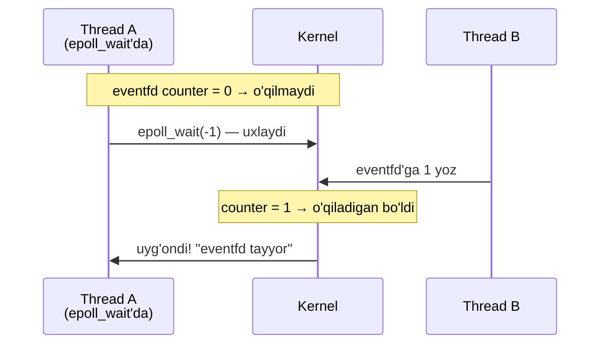

Thread B `eventfd`'ga 1 yozsa, counter > 0 bo'ladi, deskriptor o'qiladigan bo'ladi. U epoll interest list'da bo'lgani uchun, bloklangan `epoll_wait` uyg'onadi. **Go runtime aynan shu mexanizmni** poller'ni uyg'otish uchun ishlatadi (`netpollBreak`).

---

## Go Network Poller (netpoller)

Har bir OS o'z readiness API'sini beradi:
- **Linux**: `epoll` + `eventfd`,
- **BSD/macOS**: `kqueue` + o'z filtrlari,
- **Solaris/illumos**: event ports,
- **AIX**: poll-based backend,
- **Windows**: IOCP (completion modeli).

Go bu farqlarni **`netpoll`** deb nomlangan **bitta runtime interfeys** ortida yashiradi. Shuning uchun `net`, `net/http` kabi yuqori qatlamlar har bir OS uchun turli mantiq yozmaydi. Ostida esa runtime'da har platforma uchun alohida backend fayllari bor:

```go
// Integrallashgan network poller (platformadan mustaqil qism).
// Har bir implementatsiya (epoll/kqueue/port/AIX/Windows) quyidagilarni belgilaydi:

func netpollinit()                              // Pollerni ishga tushirish (bir marta)
func netpollopen(fd uintptr, pd *pollDesc) int32 // fd uchun edge-triggered notification arm
func netpollclose(fd uintptr) int32              // fd uchun notification'ni o'chirish
func netpoll(delta int64) (gList, int32)         // Tarmoqni poll qilish, tayyor G'lar ro'yxati
func netpollBreak()                              // Pollerni uyg'otish (eventfd orqali)
func netpollIsPollDescriptor(fd uintptr) bool    // fd poller deskriptorimi?
```

Har OS o'z kernel-maxsus backend'ini shu shartnomaga ulaydi. Linux'da: `netpollopen` → `epoll_ctl(EPOLL_CTL_ADD)`, `netpoll` → `epoll_wait`.

### To'liq oqim: http.Get() misolida

Keling, `net/http` orqali web sahifa olishni kuzataylik:

```go
resp, err := http.Get("https://example.com/")
body, err := io.ReadAll(resp.Body)
```

`http.Get` — yuqori darajali chaqiruv. Ostida u default HTTP client orqali o'tadi, transport so'rov uchun ulanish topishga urinadi. Pool'da mos bo'sh ulanish yo'q bo'lsa, transport yangi **TCP ulanishi** ochadi. Bu oxir-oqibat OS **socket yaratib**, tizim FD qaytarishiga olib keladi.

**1-qadam: FD'ni o'rash.** Tizim FD `netFD` ichiga, u esa `poll.FD` ichiga o'raladi:

```go
type netFD struct {
    pfd poll.FD
    // ...
}

func newFD(sysfd, family, sotype int, net string) (*netFD, error) {
    ret := &netFD{
        pfd: poll.FD{Sysfd: sysfd /* ... */},
    }
    return ret, nil
}
```

**2-qadam: poller'ga registratsiya.** Go `fd.pfd.Init(fd.net, true)` chaqiradi. Bu internal polling qatlami orqali runtime poller'ga o'tadi va socket'ni OS backend'iga ro'yxatga oladi. Linux'da bu `epoll_ctl(EPOLL_CTL_ADD, ...)` — aynan shu yerda socket kernel epoll set'iga qo'shiladi.

**3-qadam: connect.**

```go
fd := newFD(sysfd, ...)
fd.pfd.Init(fd.net, true)           // Go poller'ga registratsiya
err := connect(fd.pfd.Sysfd, remoteAddr)
switch err {
case nil:
    // darhol ulandi
case EINPROGRESS, EALREADY, EINTR:
    fd.pfd.WaitWrite()              // socket yoziladigan bo'lguncha kut
    check SO_ERROR                  // kernel'dan connect muvaffaqiyatli bo'ldimi so'ra
default:
    // connect muvaffaqiyatsiz
}
```

`connect` — masofaviy host tomon **birinchi haqiqiy tarmoq qadami**. Non-blocking socket'da `connect` odatda butun TCP ulanishi tugagunga qadar kutmaydi — u **`EINPROGRESS`** bilan tez qaytadi ("ulanish boshlandi, hali tugamadi"). Keyin Go `WaitWrite()` bilan socket yoziladigan bo'lguncha kutadi.

### pollDesc va runtimeCtx — ko'prik qanday qurilgan?

Registratsiya muvaffaqiyatli bo'lsa, Go **runtime-boshqariladigan polling handle**'ni wrapper ichida saqlaydi. Bu qism nozik:

```go
// package internal/poll
type FD struct {
    Sysfd int
    pd    pollDesc  // ← e'tibor bering
    // ...
}

type pollDesc struct {
    runtimeCtx uintptr
}
```

`poll.FD.pd` — bu runtime'ning **asosiy** polling obyekti **emas** va kernel obyekti ham **emas**. Bu deskriptorni runtime poller'ga bog'laydigan `internal/poll` **tomondagi wrapper holati**.

`pd pollDesc` ichida Go **`runtimeCtx`** maydonini saqlaydi — runtime poller qaytargan **opaque handle** (noaniq dastak). U shu deskriptor uchun runtime-boshqariladigan polling holatiga ishora qiladi:

```go
func (pd *pollDesc) init(fd *FD) error {
    serverInit.Do(runtime_pollServerInit)
    ctx, errno := runtime_pollOpen(uintptr(fd.Sysfd))
    if errno != 0 {
        return errnoErr(syscall.Errno(errno))
    }
    pd.runtimeCtx = ctx  // opaque handle'ni saqlaymiz
    return nil
}
```

Uch bosqichli manzara:

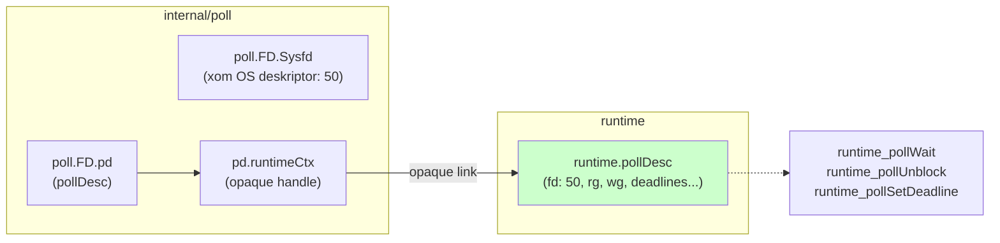

Uchta qatlam:
- **`poll.FD.Sysfd`** — xom OS deskriptori;
- **`poll.FD.pd`** — Go'ning internal poll wrapper holati;
- **`poll.FD.pd.runtimeCtx`** — runtime poll holatiga opaque havola.

### runtime.pollDesc — haqiqiy kutish holati shu yerda

Har bir pollable FD uchun runtime bitta **`runtime.pollDesc`** saqlaydi. U quyidagi savollarga javob beradi:
- Hozir **o'qish** uchun kutayotgan goroutine bormi?
- Hozir **yozish** uchun kutayotgan goroutine bormi?
- **O'qish** deadline'i o'tdimi?
- **Yozish** deadline'i o'tdimi?
- Deskriptor **yopilayaptimi**?
- FD qayta ishlatilgani sababli voqea **eskirganmi** (stale)?

Eng muhim ikkita maydon — **`rg`** (read goroutine slot) va **`wg`** (write goroutine slot):

```go
package runtime

type pollDesc struct {
    rg atomic.Uintptr // read wait slot — o'qishni kutayotgan G
    wg atomic.Uintptr // write wait slot — yozishni kutayotgan G
    // ...
}
```

`rg` va `wg` — shu deskriptorda o'qish/yozish readiness'ini kutib **parked** turgan goroutinni kuzatadi.

### Voqea qaytganda: qaysi goroutinni uyg'otish?

`epoll_ctl` da event data payload bor edi. Soddalashtirilgan misolda u `Fd` maydonida socket raqamini saqladi. Lekin **haqiqiy runtime** unda socket raqamini emas, balki **runtime identity**'ni saqlaydi — `runtime.pollDesc` ga **teglangan ko'rsatkich** (`taggedPointer`) va kichik ketma-ketlik qiymati (`fdseq`):

```go
ev := syscall.EpollEvent{
    Events: EPOLLIN | EPOLLOUT | EPOLLRDHUP | EPOLLET,
    Data:   taggedPointer(&runtimePollDesc, fdseq),  // pointer + tag
}
EpollCtl(epfd, EPOLL_CTL_ADD, sockfd, &ev)
```

`epoll_wait` voqea qaytarganda, runtime saqlangan payload'ni o'qib, **to'g'ri `runtime.pollDesc`**'ni topadi. U yerdan `rg` orqali o'qish kutayotgan yoki `wg` orqali yozish kutayotgan goroutinni uyg'otadi.

**Nima uchun fdseq (sequence tag)?** Go faqat yalang'och ko'rsatkichni saqlamaydi. U ko'rsatkich bilan birga **sequence tag** saqlaydi. Voqea qaytganda tag joriy deskriptor generatsiyasiga mos kelishini tekshiradi. Bu FD yopilib, keyin boshqa obyekt uchun qayta ishlatilgandan keyin **eskirgan (stale) readiness voqealaridan** himoya qiladi.

> **Qanday saqlanadi?** 64-bit tizimlarda ko'rsatkichlar barcha 64 bitni ishlatmaydi va aligned (past bitlar 0). Runtime shu bo'sh joyga kichik tag'ni ko'rsatkich bilan birga joylaydi:
> ```
> pd pointer   = 0x00007abc12345000
> fdseq        = 5
> packed value = [pointer part | tag=5]
> ```

### EAGAIN va parking — asosiy mexanizm

Endi eng muhim qismga keldik. Deskriptor Go poller'iga ro'yxatga olingach, goroutine socket'da `read`/`write` syscall'ga urinadi.

Deskriptor **non-blocking** rejimda bo'lgani uchun, kernel thread'ni uzoq uxlatmaydi. Amal hali bajarilmasa, syscall **`EAGAIN`** ("would block") bilan tez qaytadi.

O'sha nuqtada Go **qattiq tsiklda qayta urinmaydi**. U runtime polling yo'liga o'tadi:
1. Kutayotgan goroutinni deskriptorning kutish slotiga yozadi (`rg` o'qish, `wg` yozish uchun).
2. Goroutinni **park** qiladi (`gopark`).

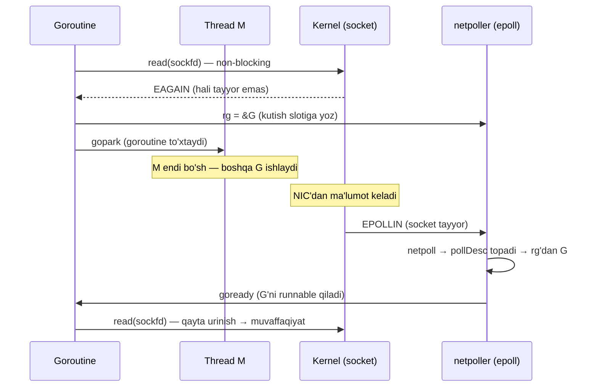

Muhim farq: **haqiqiy blocking syscall'dan** farqli o'laroq, thread `M` butun kutish davomida kernel'da uxlab qolmaydi. Syscall allaqachon qaytgan. Goroutine park qilingach, `M` scheduler ishiga qaytib, boshqa goroutinni ishlatishi mumkin.

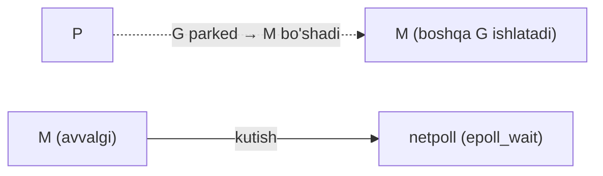

### Kim netpoll'da kutadi?

`netpoll` (Linux'da `epoll_wait`) bir necha muhim joyda chaqiriladi:

1. **`findRunnable` da** — lokal va global runnable yo'llar muvaffaqiyatsiz bo'lgach, work stealing'dan oldin tez **non-blocking** `netpoll(0)` (optimizatsiya).
2. **Scheduler idle yo'lida** — runnable goroutine yo'q bo'lsa, `netpoll(delay)`. Taymer deadline bo'lsa `delay` shundan tanlanadi, bo'lmasa cheksiz bloklaydi.
3. **Stop-the-world tugagach** — world qayta ishga tushganda tez `netpoll(0)`, tayyor tarmoq voqealarini darhol yig'ish uchun.
4. **`sysmon` da** — oxirgi netpoll juda eski bo'lsa, non-blocking `netpoll(0)`.

**Muhim qoida:** ko'p thread turli paytda **non-blocking** `netpoll(0)` chaqirishi mumkin, lekin uzoq **blocking** poll uchun runtime **bir vaqtda ko'pi bilan bitta** thread'ni OS poller'ida uxlatishga harakat qiladi.

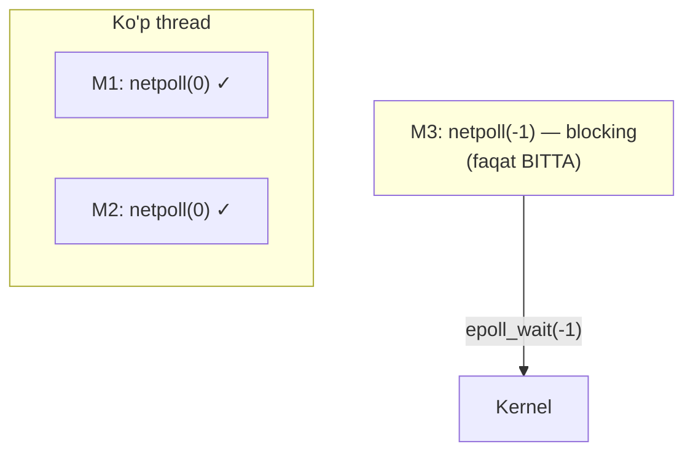

Bu yo'l thread'da lokal, global runnable goroutine **yo'q** va boshqa yaxshi ish **bo'lmaganda** ishlatiladi. Thread P'sini beradi va `netpoll(delay)`'da bloklanadi — tarmoq readiness'i yoki keyingi taymer deadline'ini kutib.

### readiness tsikli va HTTPS fazalari

OS socket tayyor deb xabar qilganda, runtime kutayotgan goroutinni **runnable** qiladi. Scheduler uni qayta tanlab, I/O'ni qayta sinaganda, uchta natijadan biri:
- Amal **muvaffaqiyatli** → protokol ilgarilaydi;
- Amal yana **`EAGAIN`** → goroutine xuddi shu kutish tsiklini takrorlaydi;
- Amal **haqiqiy xato** → so'rov yo'li chiqadi.

HTTPS uchun bu readiness tsikli **bitta `http.Get` ichida bir necha marta** takrorlanadi:

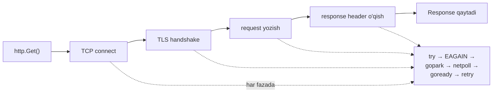

`http.Get` **butun response body**'ni o'qib bo'lgach qaytmaydi — u `Response` hosil bo'lgach (ulanish, request yozildi, header o'qildi) qaytadi. Keyin `io.ReadAll(resp.Body)` **xuddi shu non-blocking pattern** bilan body'ni oxirigacha o'qiydi.

### Kutishning boshqa tugash sabablari: deadline va close

Goroutine socket readiness'ini kutganда, kutish **har doim ham** socket tayyor bo'lgani uchun tugamaydi. Yana ikkita voqea uni **oldinroq** tugatishi mumkin:

**1. Deadline (muddat) o'tishi.** Socket amaliga vaqt chegarasi qo'yilgan va u yetgan. Chegara `SetDeadline`, `SetReadDeadline`, `SetWriteDeadline` dan yoki yuqori darajali HTTP xatti-harakatidan (dial timeout, TLS handshake timeout, `http.Client.Timeout` va h.k.) kelishi mumkin.

Deadline o'rnatilganda, `internal/poll` uni runtime poller'ga uzatadi, runtime uni `runtime.pollDesc`'da saqlaydi. Deadline readiness'dan oldin o'tsa:
- runtime tegishli read/write deadline'ni **o'tgan** deb belgilaydi,
- `rg`/`wg` slotidagi kutayotgan goroutinni **unblock** qiladi,
- goroutinni qayta **runnable** qiladi.

Goroutine uyg'onganda, kutish yo'li o'tgan-deadline holatini ko'radi va socket readiness'ini kutish o'rniga **timeout xatosini** qaytaradi.

```go
conn, _ := net.Dial("tcp", "example.com:80")
defer conn.Close()

_ = conn.SetReadDeadline(time.Now().Add(300 * time.Millisecond))
buf := make([]byte, 1024)
_, err := conn.Read(buf)

if ne, ok := err.(net.Error); ok && ne.Timeout() {
    // timeout bo'ldi — yangi deadline qo'yib, xuddi shu socket'da qayta urinamiz
    _ = conn.SetReadDeadline(time.Now().Add(300 * time.Millisecond))
    _, err = conn.Read(buf)
    if err != nil {
        _ = conn.Close() // bekor qil va yop
    }
}
// aks holda, xuddi shu socket'dan foydalanishda davom et
```

**2. Deskriptorning yopilishi (close).** Bir goroutine I/O'da kutayotganda, boshqasi `Close` chaqirishi mumkin. Bu deskriptorni runtime poller'dan **unregister** qiladi va runtime-tomondagi poll holatini bo'shatadi. Linux'da bu qadam oxirida epoll backend'iga yetib, deskriptorni epoll set'idan olib tashlaydi.

`net/http` da bu qaror `http.Transport` ichida avtomatik: u xato qayerda bo'lganini va ulanishni qayta ishlatish xavfsizmi tekshiradi. Xavfli bo'lsa, transport ulanishni yopadi.

---

## To'liq manzara: netpoller integratsiyasi

```mermaid
flowchart TB
    subgraph App["Ilova kodi"]
        CODE["conn.Read(buf)"]
    end
    subgraph Poll["internal/poll"]
        PFD["poll.FD (Sysfd, pd)"]
    end
    subgraph RT["runtime"]
        RPD["runtime.pollDesc<br/>(rg, wg, deadlines)"]
        SCHED["scheduler<br/>(gopark / goready)"]
    end
    subgraph OS["Kernel"]
        EPOLL["epoll instance"]
        EVFD["eventfd (wakeup)"]
    end

    CODE --> PFD
    PFD -->|"EAGAIN → runtime_pollWait"| RPD
    RPD -->|"gopark"| SCHED
    PFD -.->|"registratsiya: netpollopen"| EPOLL
    EPOLL -->|"EPOLLIN/OUT → netpoll"| RPD
    RPD -->|"goready"| SCHED
    EVFD -.->|"netpollBreak"| EPOLL

    style RPD fill:#cfc
    style EPOLL fill:#eef
```

Butun oqim:
1. Ilova `Read` chaqiradi → `poll.FD` → non-blocking syscall → `EAGAIN`.
2. `runtime_pollWait` → goroutine `gopark` bilan to'xtaydi (`rg` slotiga yoziladi).
3. Thread `M` bo'shaydi, boshqa ish qiladi.
4. Kernel epoll orqali readiness'ni xabar qiladi → `netpoll` → to'g'ri `pollDesc` → `goready`.
5. Goroutine qayta runnable bo'ladi, I/O'ni qayta sinaydi.

---

## Eslab qol

- **File descriptor** — jarayonga lokal, kichik manfiy bo'lmagan son. FD table'dagi indeks → open handle → inode. Fayl nomi inode'da emas, **katalog yozuvida**.
- Go xom deskriptorni **`poll.FD`** wrapper'ida saqlaydi. `net` (`netFD`) va `os` (`os.File`) ikkalasi ham shu umumiy qatlamga tayanadi.
- **Blocking I/O**: thread kernel'da kutadi, `_Gsyscall` + M-P ajraladi. `entersyscallblock` P'ni **darhol** topshiradi; `entersyscall` P'ni `_Psyscall`'da qoldirib, **tez qaytishga imkon** beradi.
- **Poller-based I/O**: deskriptorni **non-blocking** qilib, syscall'ni sinaydi. `EAGAIN` bo'lsa faqat **goroutinni** park qiladi, OS thread'ni emas.
- **I/O multiplexing** — bitta wait ko'p deskriptorni qamraydi. Faqat **pollable** deskriptorlar uchun (socket ✓, pipe ✓, oddiy fayl ✗).
- **epoll**: `epoll_create1` (instance) → `epoll_ctl` (interest list) → `epoll_wait` (kutish). Go **edge-triggered** (`EPOLLET`) ishlatadi. `eventfd` bloklangan poller'ni uyg'otadi.
- **netpoller** OS farqlarini (`epoll`/`kqueue`/IOCP) `netpoll` interfeysi ortida yashiradi.
- **`runtime.pollDesc`** har bir FD uchun kutish holatini saqlaydi. **`rg`**/**`wg`** — o'qish/yozish kutayotgan goroutinni bog'laydi.
- epoll event data'da runtime **`taggedPointer(pollDesc, fdseq)`** saqlaydi — `fdseq` **stale** voqealardan himoya qiladi.
- Uzoq **blocking** netpoll'da bir vaqtda **ko'pi bilan bitta** thread uxlaydi. Kutish deadline yoki close bilan ham tugashi mumkin.

---

## Tez-tez uchraydigan xatolar

- **"FD raqami diskdagi faylni bildiradi"** — Yo'q. FD — FD table'dagi indeks → open handle → inode. Bir xil raqam turli jarayonlarda turli narsani bildiradi.
- **"Har bir tarmoq ulanishi bitta thread'ni band qiladi"** — Bu blocking modelda. Go poller-based model bilan faqat **goroutinni** park qiladi, thread bo'sh qoladi.
- **"epoll oddiy disk faylni ham samarali kuzatadi"** — Yo'q. Oddiy fayl doim "tayyor" deb xabar qiladi — bu event-driven I/O uchun foydasiz.
- **Deadline'siz `conn.Read` cheksiz kutishi mumkin** — Har doim `SetReadDeadline`/`SetWriteDeadline` yoki context ishlating, aks holda goroutine cheksiz park bo'lib qolishi mumkin.
- **Level-triggered'ni edge-triggered deb o'ylash** — Go edge-triggered ishlatadi. Bu socket'ni **non-blocking** talab qiladi va `EAGAIN`gacha o'qish kerak.
- **Bir goroutine `Read`da kutganda boshqasi `Close` qilsa panic bo'ladi deb o'ylash** — `poll.FD` aynan shu koordinatsiyani xavfsiz boshqaradi.

---

## Amaliyot

1. **FD kuzatish:** Kichik Go dasturi yozing, faylni oching va `f.Fd()` bilan FD raqamini chop eting. Keyin ikkinchi faylni oching. Raqamlar ketma-ketmi? `os.Stdin.Fd()`, `os.Stdout.Fd()`, `os.Stderr.Fd()` nechchi qaytaradi?

2. **Blocking vs non-blocking:** `net.Dial` bilan ulaning va `SetReadDeadline` **qo'ymasdan** ma'lumot kelmaydigan server'dan `Read` qiling. Goroutine nima bo'ladi? Keyin deadline qo'shing va farqni tushuntiring.

3. **epoll oqimini chizing:** `http.Get("https://...")` chaqiruvi uchun to'liq sequence diagram chizing: socket yaratish → `epoll_ctl` → `connect` → `EINPROGRESS` → `WaitWrite` → TLS → request → response. Har bir `EAGAIN` nuqtasini belgilang.

4. **rg/wg mantig'i:** Nima uchun `runtime.pollDesc` da **ikkita** alohida slot (`rg` va `wg`) bor? Bir goroutine bir vaqtda o'qish **va** yozishni kuta oladimi? Misol keltiring.

5. **Solishtiring:** `entersyscall` va `entersyscallblock` — qachon qaysi biri ishlatiladi? `sysmon`ning `_Psyscall` P'ni retake qilishdagi **10ms** qoidasini tushuntiring.

---

[← 08 Preemption](08_preemption.md) | [Keyingi: 10 Sysmon →](10_sysmon.md)
