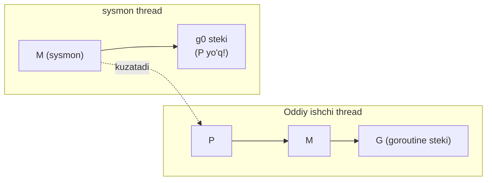
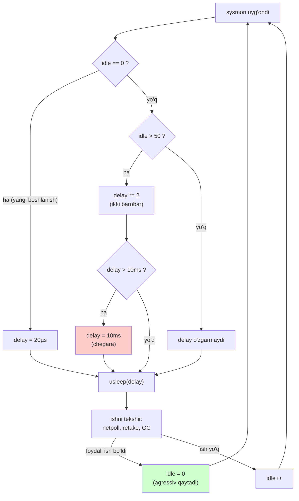
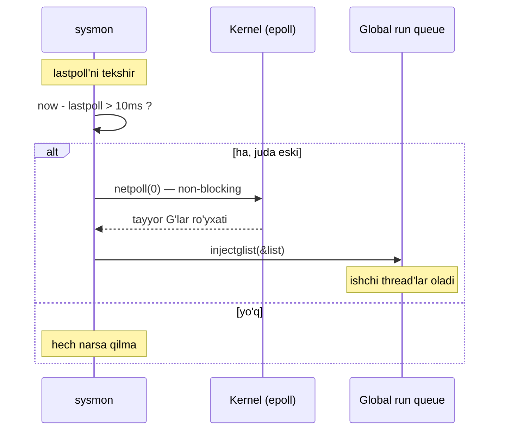
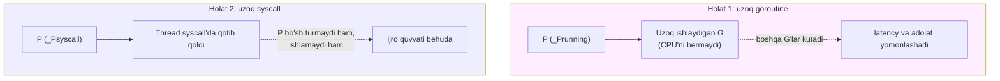
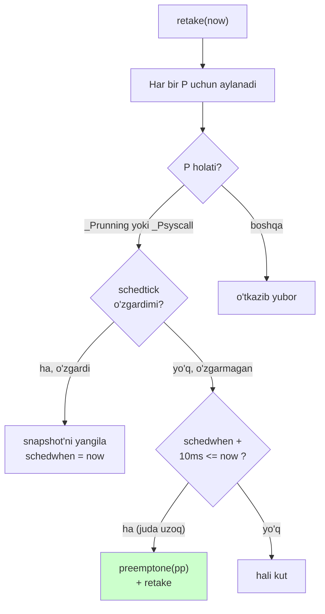
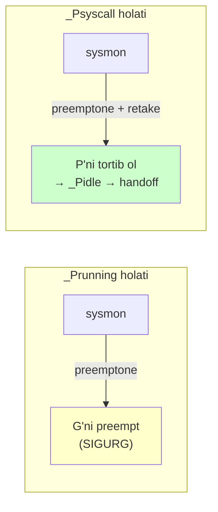
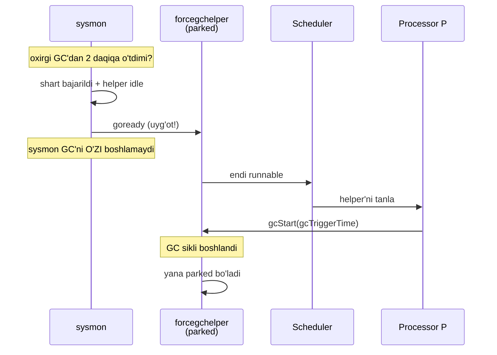
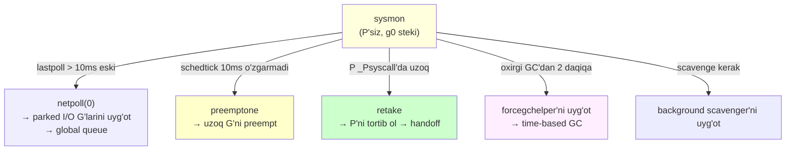

# 10 — System Monitor (sysmon)

> Ushbu material — **The Anatomy of Go** (Phuong Le) kitobining 8-bobi asosida o'zbek tilida tayyorlangan o'quv qo'llanma. Mavzular so'zma-so'z tarjima emas — o'qib tushunilgach, o'z so'zlarim bilan qayta tushuntirilgan.

## Nima uchun bu mavzu muhim?

Oldingi bo'limlarda ([07 Scheduler](07_scheduler.md), [08 Preemption](08_preemption.md), [09 I/O](09_io_handling.md)) biz **ishchi thread'lar** (worker M) qanday goroutine ishlatishini ko'rdik. Lekin bitta savol ochiq qoldi: **kim ishchilarni kuzatadi?**

Tasavvur qiling: bitta goroutine syscall'da 30 soniya osilib qoldi, uning P'si esa `_Psyscall`'da qotib turibdi. Boshqa goroutine cheksiz sikida aylanmoqda. Uchinchisi tarmoq I/O'sini kutmoqda, lekin uni uyg'otadigan hech kim yo'q. Oddiy ishchi thread'lar bu muammolarni **o'zi sezmaydi** — chunki ular ish bilan band.

Ana shu yerda **`sysmon`** (system monitor) kirib keladi. U — runtime'ning **fon qorovuli**. U hech qanday goroutine ishlatmaydi, faqat **kuzatadi va tuzatadi**. U ishchi thread'lar sekinlashib qolganda, "hey, bu P juda uzoq syscall'da, uni tortib olaman" yoki "bu goroutine juda uzoq ishlayapti, uni preempt qilaman" deb aralashadi.

Bu bo'limda quyidagi savollarga javob beramiz:

- Nima uchun `sysmon` **P'siz** (processorsiz) ishlaydi?
- `sysmon` qanday qilib **dinamik uyqu** bilan CPU'ni tejaydi?
- `retake` funksiyasi va **10ms qoidasi** nima?
- `sysmon` qanday qilib uzoq syscall'dan P'ni **tortib oladi**?
- **2 daqiqa** qoidasi va majburiy GC qanday ishlaydi?

---

## sysmon nima?

**`sysmon`** ("system monitor" qisqartmasi) — startup paytida juda erta yaratiladigan **maxsus runtime thread**. U:
- **P (processor) yo'q** — oddiy ishchi thread kabi goroutine ishlatmaydi;
- runtime ichida qoladi va scheduler hamda runtime holati uchun **monitoring va texnik xizmat** ishlarini bajaradi.

`sysmon`ning asosiy vazifalari:

```mermaid
mindmap
  root((sysmon))
    Network Polling
      lastpoll juda eski bo'lsa
      netpoll(0) majburan
      parked G'larni uyg'otish
    Preemption va Retake
      uzoq goroutinni preempt
      uzoq syscall P'sini tortib olish
      10ms qoidasi
    Garbage Collection
      forcegchelper uyg'otish
      2 daqiqa qoidasi
      time-based GC
    Scavenger
      background scavenger uyg'otish
      xotira tozalash
```

### Nima uchun P'siz ishlaydi?

Bu tushunish uchun muhim. Oddiy goroutine ishlashi uchun **P kerak** — P bu Go kodini ishlatish uchun "ruxsatnoma" (token). Lekin `sysmon` Go kodini ishlatmaydi — u faqat **kuzatadi**.

Agar `sysmon` P olsa, u bitta P'ni band qilib, ishchi goroutine'lardan bir P'ni tortib olardi. Bu behuda. Bundan tashqari, `sysmon` **doim ishga tayyor** bo'lishi kerak — u boshqa goroutine'lar bloklab qo'ygan holatlarni kuzatadi. Agar u ham oddiy scheduler'ga bo'ysunsa, bir muammo yuzaga kelganda uni ham bloklab qo'yishi mumkin edi.

Shuning uchun `sysmon` **o'z thread'ining `g0` steki** ustida ishlaydi — oddiy goroutine steki emas, oddiy scheduling yo'li orqali boshqarilmaydi.



> **Qiziq nuqta:** `sysmon` yagona "P'siz yashaydigan" maxsus thread emas. Go'da **template thread** ham bor — u yangi OS thread yaratish uchun mavjud (joriy thread cgo yoki tashqi holatga bog'langan bo'lsa). Boshqa runtime yo'llar ham vaqtincha P'siz ishlashi mumkin, lekin `sysmon` va template thread uchun P'siz ishlash — bu ularning **doimiy ish rejimi**, vaqtinchalik holat emas.

---

## Sysmon Execution Cycle (Bajarilish sikli)

`sysmon` tsiklda ishlaydi: uyg'onadi → runtime holatini tekshiradi → zarur ishlarni bajaradi → yana uxlaydi.

Muammo: qancha uxlashi kerak? Agar juda tez-tez uyg'onsa — CPU'ni behuda sarflaydi (ayniqsa tinch dasturda). Agar juda kam uyg'onsa — muammolarni kech sezadi. Yechim — **dinamik uyqu intervali**.



Kod:

```go
func sysmon() {
    // ...
    for {
        if idle == 0 { // 20µs uyqu bilan boshlaymiz
            delay = 20
        } else if idle > 50 { // 50 bo'sh sikldan keyin ikkilantiramiz
            delay *= 2
        }
        if delay > 10*1000 { // 10ms ga qadar (chegara)
            delay = 10 * 1000
        }
        usleep(delay)

        now := nanotime()
        if debug.schedtrace <= 0 && (sched.gcwaiting.Load() || sched.npidle.Load() == gomaxprocs) {
            // ... tizim bo'sh bo'lsa chuqurroq uyquga kirishi mumkin
        }
        // ... netpoll, retake, GC tekshiruvlari
    }
}
```

Logikaning mohiyati:
- **20 mikrosekund**dan boshlaydi — agressiv, tez-tez tekshiradi.
- **50 bo'sh sikl**dan keyin (foydali ish topmasa) uyqu vaqtini **ikkilantirib** boshlaydi.
- O'sish **10 millisekund** bilan chegaralanadi.
- Foydali ish qilsa (masalan, P'ni retake qilsa), `idle` hisoblagichi **nolga tushadi** va `sysmon` yana agressiv bo'ladi.

Ya'ni **tinch dasturda ham `sysmon` kamida har 10ms'da uyg'onadi**.

### Chuqurroq uyqu

Qisqa uyqular ustiga, `sysmon` **chuqurroq uyqu**ga ham kirishi mumkin. Bu quyidagi shartlarda ishlatiladi:
- scheduler tracing o'chirilgan (`schedtrace <= 0`),
- tizim amalda **bo'sh** — GC kutmoqda yoki barcha P'lar idle (`npidle == gomaxprocs`).

Bu rejimda `sysmon` runtime note'da uzoqroq uxlaydi, lekin bu uyqu ham keyingi muhim uyg'onish nuqtasi (masalan, keyingi taymer momenti) bilan chegaralangan va **force-GC sampling intervali** bilan cheklangan.

Xulosa: `sysmon` odatda qisqa tsikllarda tekshiradi, lekin tizim yetarlicha tinch bo'lsa, uzoqroq uyqu rejimiga o'tadi.

---

## Sysmon va Network Polling

Goroutine tarmoq I/O uchun park qilingan bo'lishi mumkin ([09](09_io_handling.md) dagi `gopark`). Uni uyg'otish uchun **qandaydir runtime yo'li `netpoll`ni chaqirishi** kerak. Ko'pincha oddiy scheduler yo'llari buni yetarlicha tez bajaradi.

Lekin **bo'shliqlar** bo'lishi mumkin — hech qaysi yo'l yetarlicha tez ishlamasa. O'sha paytda socket kernel'da allaqachon tayyor bo'lishi mumkin, lekin hech qanday poll o'tishi bu readiness'ni **iste'mol qilmagan**, shuning uchun goroutine hali uxlab yotibdi.

`sysmon` bu kechikishni kamaytiradi: oxirgi poll vaqti juda eski bo'lsa, u **majburiy non-blocking poll** (`netpoll(0)`) o'tkazadi.



Kod:

```go
func sysmon() {
    // ...
    for {
        // ...
        // 10ms dan ko'proq poll qilinmagan bo'lsa, tarmoqni poll qil
        lastpoll := sched.lastpoll.Load()
        if netpollinited() && lastpoll != 0 && lastpoll+10*1000*1000 < now {
            sched.lastpoll.CompareAndSwap(lastpoll, now)
            list, delta := netpoll(0) // non-blocking → tayyor G'lar
            if !list.empty() {
                injectglist(&list)
                // ...
            }
        }
        // ...
    }
}
```

### Muhim: qaysi navbatga qo'yiladi?

Poll tayyor goroutine'larni qaytarsa, ular **qaysi** navbatga tushadi — lokal yoki global?

`sysmon` **P'siz** ishlagani uchun, uning **lokal run queue'si yo'q**. Shuning uchun bu yo'lda goroutine'lar **global runnable navbatga** (`injectglist`) qo'yiladi. U yerdan ishchi thread'lar ularni olib ishlaydi yoki keyinroq lokal navbatlarga ko'chiradi.

Bu `sysmon`ning P'siz tabiatining bevosita oqibati — u lokal navbatga qo'ya olmaydi, chunki lokal navbat P'ga tegishli.

---

## Sysmon va Preemption

P (processor) ikkita umumiy holatda **juda uzoq vaqt foydali ishga berilib bo'lmay** qolishi mumkin:



1. **Uzoq goroutine** — bitta goroutine `_Prunning` P'da juda uzoq ishlaydi. Boshqa runnable goroutine'lar kerakidan uzoq kutadi (latency va fairness yomonlashadi).
2. **Uzoq syscall** — thread syscall'da juda uzoq qoladi, eski P esa `_Psyscall`'da turadi. P tortib olinmasa, runnable goroutine'lar kutaveradi, holbuki bu ijro quvvatini boshqa thread'ga berish mumkin edi.

Bu ikkalasini biz [08 Preemption](08_preemption.md) va [09 I/O](09_io_handling.md) da ko'rgandik. `sysmon` bu holatlarni **oddiy ishchi oqimidan tashqarida** aniqlaydi va tuzatadi.

### schedtick va syscalltick — kuzatuv hisoblagichlari

Har bir P ikkita "jonli hisoblagich" saqlaydi:

```go
type p struct {
    // ...
    schedtick   uint32 // har bir scheduler chaqiruvida oshadi
    syscalltick uint32 // har bir syscall'da oshadi
}
```

- **`schedtick`** — scheduler progressini aks ettiradi. U P yangi goroutinni **yangi scheduling turi** bilan ishlata boshlaganда oshadi (avvalgi time slice'ni davom ettirish emas).
- **`syscalltick`** — syscall o'tishlariga bog'liq. U P muhim syscall holat o'zgarishlaridan (syscall'ga kirish yoki retake) o'tganda o'zgaradi.

`sysmon` har bir P uchun **o'zining oxirgi snapshot'ini** `sysmontick` yozuvida saqlaydi:

```go
type sysmontick struct {
    schedtick   uint32
    syscalltick uint32
    schedwhen   int64 // schedtick oxirgi marta o'zgargan vaqt
    syscallwhen int64 // syscalltick oxirgi marta o'zgargan vaqt
}
```

### retake — mantiq qanday ishlaydi

Har o'tishda `sysmon` joriy hisoblagichlarni snapshot bilan solishtiradi:



Kod:

```go
const forcePreemptNS = 10 * 1000 * 1000 // 10ms

func retake(now int64) uint32 {
    // Barcha P'lar bo'ylab aylanamiz
    for i := 0; i < len(allp); i++ {
        pp := allp[i]
        // ...
        pd := &pp.sysmontick    // shu P uchun snapshot
        s := pp.status
        sysretake := false
        // ...
        // Faqat ikkita holatga qaraymiz: running va syscall
        if s == _Prunning || s == _Psyscall {
            // Agar bir xil schedtick'da juda uzoq qolsa — preempt
            t := int64(pp.schedtick)
            if int64(pd.schedtick) != t {
                // hisoblagich o'zgardi → P ilgarilagan
                pd.schedtick = uint32(t)
                pd.schedwhen = now
            } else if pd.schedwhen+forcePreemptNS <= now {
                // 10ms davomida o'zgarmagan → preempt qil
                preemptone(pp)
                sysretake = true
            }
        }
        // ...
    }
    // ...
}
```

Logika:
- Agar `schedtick` **o'zgargan** bo'lsa — P oldinga siljigan, snapshot yangilanadi va joriy vaqt yoziladi.
- Agar `schedtick` **10ms davomida o'zgarmasa** — `sysmon` bu P'ni bir xil holatda qotib qolgan deb hisoblaydi va **`preemptone(pp)`** chaqiradi.

### Ikki holat, ikki tuzatish

`sysmon` `preemptone(pp)` chaqirganda:

- **`_Prunning` holatida** — bu P'da hozir ishlab turgan goroutine uchun preemption so'rovi ([08](08_preemption.md) dagi `stackPreempt` + `SIGURG`). Uzoq goroutine to'xtatiladi.
- **`_Psyscall` holatida** — bu yerda bir qadam **ko'proq** kerak. P `_Psyscall`'da Go kodi ishlatmayapti, shuning uchun faqat preemption so'rovi yetarli emas. `sysmon` P'ning **o'zini retake** qilishi mumkin — uni tortib olib, boshqa thread runnable goroutine'lar uchun bu ijro quvvatidan foydalanishi uchun topshiradi.



Bu monitoring bo'lmasa, runnable goroutine'lar dastur ilgarilashi mumkin bo'lgan holatda ham kechikib qolardi.

---

## Sysmon va Garbage Collection

Go GC siklini boshlashning bir necha yo'li bor:
- **Heap o'sishi** — heap yetarlicha kattalashsa.
- **Vaqt** — dastur tinch bo'lsa va heap o'sishi yolg'iz siklni tezda ishga tushirmasa ham, GC baribir ishga tushishi kerak.

Vaqt asosidagi yo'lni qo'llab-quvvatlash uchun runtime startup paytida **bitta maxsus yordamchi goroutine** yaratadi — **`forcegchelper`**. U ko'pincha **parked** (uxlagan) holatda turadi. Uning ishi tor: vaqt asosidagi GC uchun aniq uyg'otilganda, GC siklini boshlaydi va yana uxlaydi.

```go
// forcegc yordamchi goroutinni ishga tushirish
func init() {
    go forcegchelper()
}

func forcegchelper() {
    forcegc.g = getg()
    lockInit(&forcegc.lock, lockRankForcegc)
    for {
        lock(&forcegc.lock)
        if forcegc.idle.Load() {
            throw("forcegc: phase error")
        }
        forcegc.idle.Store(true)
        // bu yerda parked bo'ladi — sysmon uyg'otguncha
        goparkunlock(&forcegc.lock, waitReasonForceGCIdle, traceBlockSystemGoroutine, 1)

        // sysmon tomonidan aniq uyg'otildi
        if debug.gctrace > 0 {
            println("GC forced")
        }
        // Vaqt bilan qo'zg'atilgan, to'liq concurrent GC
        gcStart(gcTrigger{kind: gcTriggerTime, now: nanotime()})
    }
}
```

### 2 daqiqa qoidasi

`sysmon` o'z tsiklida ko'p shartni tekshiradi. Ulardan biri — **oxirgi GC siklidan beri juda ko'p vaqt o'tdimi**. Chegara — **`forcegcperiod`** (majburiy GC davri), odatda taxminan **2 daqiqa**.

Muhim: bu **maksimal bo'shliq qoidasi**, aniq devor-vaqt momentlarida o'chadigan qattiq davriy taymer **emas**.



`sysmon` vaqt sharti bajarilganini va helper goroutine hozir **idle** ekanini ko'rganda, u helper'ni **runnable** qiladi.

**Muhim ajratish:** `sysmon` GC siklini **o'zi boshlamaydi**. U faqat helper goroutinni ishga tayyor qiladi. Keyin **oddiy scheduler** ishni o'z zimmasiga oladi — helper boshqa system goroutine kabi runnable bo'ladi va biror P uni tanlaganda, vaqt bilan qo'zg'atilgan GC siklini boshlaydi. Ishni bajargach, helper yana parked holatga qaytadi.

Nima uchun bu ajratish muhim? Chunki `sysmon` P'siz ishlaydi — u o'zi GC kabi og'ir ishni bajara olmaydi. Uning vazifasi faqat **signal berish**, ishning o'zini oddiy scheduler qiladi.

---

## Umumiy manzara: sysmon — runtime'ning fon tuzatuvchi sikli



Ishchi thread'lar oddiy scheduling'ni bajaradi; `sysmon` esa oddiy yo'llar **yetarlicha tez reaksiya bermayotganini** sezadi va tuzatadi.

---

## Eslab qol

- **`sysmon`** — startup'da erta yaratiladigan maxsus runtime thread. U **P'siz** ishlaydi (goroutine ishlatmaydi, faqat kuzatadi) va o'z thread'ining **`g0` steki** ustida turadi.
- Nima uchun P'siz? Chunki u Go kodi ishlatmaydi, doim ishga tayyor bo'lishi kerak va bir P'ni behuda band qilmasligi lozim.
- **Dinamik uyqu:** 20µs'dan boshlaydi, 50 bo'sh sikldan keyin ikkilantiradi, **10ms** bilan cheklanadi. Foydali ish qilsa `idle`'ni nolga tushiradi.
- **Network polling:** `lastpoll` 10ms'dan eski bo'lsa, `netpoll(0)` qiladi va tayyor goroutine'larni **global** queue'ga (`injectglist`) qo'yadi — lokal queue yo'q, chunki P yo'q.
- **Retake/preemption:** `schedtick`/`syscalltick` hisoblagichlarini kuzatadi. **10ms** (`forcePreemptNS`) davomida o'zgarmasa: `_Prunning` → `preemptone` (goroutinni preempt), `_Psyscall` → P'ni **retake** (tortib olib handoff).
- **Forced GC:** oxirgi GC'dan **~2 daqiqa** (`forcegcperiod`) o'tsa, `sysmon` **`forcegchelper`**'ni uyg'otadi. GC'ni o'zi boshlamaydi — faqat helper'ni runnable qiladi.
- `sysmon` — runtime'ning **fon tuzatuvchi sikli**: stalled netpoll, uzoq syscall, kechikkan preemption, vaqt asosidagi GC.

---

## Tez-tez uchraydigan xatolar

- **"`sysmon` P oladi"** — Yo'q. U ataylab **P'siz** ishlaydi, aks holda ishchi P'lardan birini behuda band qilardi.
- **"`sysmon` GC'ni o'zi bajaradi"** — Yo'q. U faqat `forcegchelper`'ni uyg'otadi; GC'ni oddiy scheduler orqali biror P bajaradi.
- **"forcegcperiod aniq 2 daqiqada GC qiladi"** — Bu **maksimal bo'shliq** qoidasi, aniq taymer emas. Heap o'sishi undan oldin GC'ni ishga tushirishi mumkin.
- **"`sysmon` uzoq syscall'da faqat preempt qiladi"** — `_Psyscall` uchun preempt yetarli emas (P Go kodi ishlatmayapti). U P'ni **retake** qilishi kerak.
- **"`sysmon` doim har 20µs uyg'onadi"** — Faqat agressiv rejimda. Tinch tizimda 10ms'gacha (yoki chuqurroq uyquda undan ham ko'proq) uxlaydi.
- **`schedtick` va `syscalltick`ni aralashtirish** — Birinchisi scheduler progressini, ikkinchisi syscall o'tishlarini kuzatadi.

---

## Amaliyot

1. **GODEBUG bilan kuzatish:** `GODEBUG=schedtrace=1000` bilan dastur ishga tushiring. `sysmon` scheduler holatini har 1000ms'da chop etadi. Chiqishda P'lar holatini (`_Prunning`, `_Psyscall`, `_Pidle`) kuzating.

2. **Forced GC ko'rish:** `GODEBUG=gctrace=1` bilan uzoq (2+ daqiqa) tinch turadigan dastur yozing. Vaqt asosidagi GC ishga tushishini ko'rasizmi? Log'da `"GC forced"` chiqadimi?

3. **Retake mantig'i:** Nima uchun `retake` `_Prunning` va `_Psyscall` uchun **turlicha** harakat qiladi? Chizib tushuntiring: `_Prunning` uchun preempt yetarli, lekin `_Psyscall` uchun nima uchun retake kerak?

4. **P'siz ishlash:** `sysmon`ning P'siz ishlashi uning **network polling** natijalarini qayerga qo'yishiga qanday ta'sir qiladi? Nima uchun `injectglist` (global queue) ishlatiladi, lokal queue emas?

5. **Dinamik uyqu:** `sysmon`ning dinamik uyqu logikasini o'z so'zlaringiz bilan qayta yozing. Nima uchun 20µs'dan boshlaydi va nima uchun 10ms'da chegaralanadi? Ikkala uch qiymatni o'zgartirsak nima bo'ladi?

---

[← 09 I/O Handling](09_io_handling.md) | [Keyingi: 11 Xulosa →](11_summary.md)
