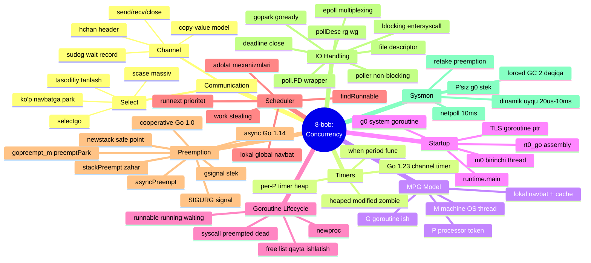
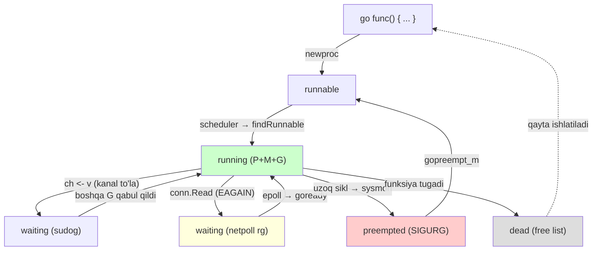

# 11 — Xulosa (Summary)

> **The Anatomy of Go** (Phuong Le) kitobining 8-bobi (Concurrency) — umumiy xulosa. Bu yerda butun bob bir tizim sifatida jamlangan.

## Nima uchun bu xulosa?

8-bob Go'ning concurrency modelini **eng past darajadan** — runtime, kernel, signal, epoll darajasida o'rgatdi. Alohida mavzular oson unutiladi. Bu xulosa ularni **bitta yaxlit manzara**ga bog'laydi: kanaldan tortib sysmon'gача, hamma narsa qanday o'zaro ishlashini ko'rsatadi.

Har bir bo'lim kitobning Summary qismidagi asosiy fikrlarni jamlaydi.

---

## Channels va Select

Go'ning concurrency hikoyasi **umumiy holatni hisoblab yuritish bilan emas, muloqot bilan** boshlanadi. Shuning uchun **channel** ko'pincha konteyner emas, **uzatish nuqtasi** (handoff point) kabi his qilinadi.

- **Bufersiz kanal**da jo'natuvchi va qabul qiluvchi **to'g'ridan-to'g'ri uchrashadi**.
- **Buferlangan kanal**da uzatish kichik qat'iy navbat bilan kechiktiriladi.
- Har ikki holatda muhim ta'sir bir xil: qiymatlar xotira orqali **jimgina bo'lishilmaydi**, balki aniq **sinxronizatsiya chegarasi** orqali o'tadi.

Sintaksis ostida bu chegara **`hchan`** (channel header) + **`sudog`** (kutish yozuvlari) ga aylanadi. Bloklangan amal "shunchaki uxlayotgan goroutine" emas — u bir goroutinni bitta kutilayotgan send/recv'ga bog'laydigan **kichik yozuv** (`sudog`).

Muhim ogohlantirish: kanal send **qiymatni nusxalash** modelini kuzatadi. Nusxa pointer, slice header yoki boshqa havolalarni o'z ichiga olishi mumkin — send **xotira egaligining sehrli chuqur uzatishi emas**. Runtime sinxronizatsiya beradi; intizomli egalik esa dasturchining zimmasida.

**`select`** shu mexanizmni oladi va tanlovni kengaytiradi. Bir nechta case tayyor bo'lsa, runtime **har doim birinchi yozilganini tanlamaydi** (tasodifiy). Hech biri tayyor bo'lmasa, goroutine **bir vaqtda bir necha kanal navbatiga** park qilinadi — har case uchun bitta `sudog` — biror case g'alaba qozonguncha, qolganlari tozalanadi.

> Batafsil: [01 Channel](01_channel.md), [02 Select](02_select.md)

---

## Timers

Foydalanuvchi kodidan taymerlar kichik ko'rinadi: `time.Sleep`, `time.After`, `Timer.Reset`, `Ticker` bo'ylab range. Runtime bularning barchasini **rejalashtirilgan callback'lar** deb ko'radi. Har taymer:
- muddat (`when`),
- ixtiyoriy takrorlanish intervali (`period`),
- muddat yetganda ishlaydigan funksiya

ni o'z ichiga oladi.

Eng qiziq qism — **taymerlar qayerda yashaydi**. Go ularni bitta global vaqt lock'i orqali o'tkazmaydi. Buning o'rniga, taymer to'plamlari processorlarga **per-P timer heap** (`p.timers`) sifatida biriktiriladi. Bu eng yaqin muddatni topishni osonlashtiradi va markaziy raqobatni keskin kamaytiradi.

Shuning uchun runtime'da taymer holati biroz "bilvosita" ko'rinadi — taymer `heaped`, `modified` yoki `zombie` deb belgilanishi mumkin, keyingi maintenance qadami heap tartibini tuzatadi yoki o'lik yozuvlarni olib tashlaydi.

**Kanal asosidagi taymerlar** vaqtlashni kanal semantikasi bilan bog'lashi kerak. **Go 1.23**'da bu ko'prik ancha kam hayratlanarli bo'ldi: taymer kanallari hali bir uyachali buferli implementatsiyaga tayanadi, lekin eskirgan send'lar agressivroq yashiriladi. `Stop`/`Reset` qaytgach, keyingi receive taymerning **joriy generatsiyasiga** tegishli, eski firing'dan qolgan qiymatga emas.

> Batafsil: [03 Timer](03_timer.md)

---

## M-P-G, Startup va Goroutine Lifecycle

Har qanday goroutine ishlashdan oldin, runtime u ishlaydigan **sahnani qurishi** kerak. Dastur `main.main` da emas, **assembly**'da boshlanadi. Bootstrap yo'li (**`rt0_go`**):
- startup argumentlarini saqlaydi,
- joriy goroutine pointeri uchun **thread-local storage** (TLS) o'rnatadi,
- birinchi thread (**`m0`**) da dastlabki system goroutine (**`g0`**) ni tayyorlaydi,
- asosiy runtime initsializatsiyasini bajaradi,
- va faqat shundan keyin **`runtime.main`** uchun birinchi oddiy goroutinni yaratadi.

Bu scheduling modeliga olib keladi:
- **G** (Goroutine) — bajariladigan ish.
- **M** (Machine) — komandalarni fizik ishlatadigan OS thread.
- **P** (Processor) — Go kodini ishlatish uchun kerak bo'lgan runtime token, lokal navbat va cache'lar bilan.

Bu bo'linishning qiymati amaliy: Go **ulkan sonli goroutine**'ni har biriga OS thread yaratmasdan ushlab tura oladi. M syscall'ga "g'oyib bo'lishi", P esa boshqa joyga topshirilishi mumkin; yoki yangi thread bo'sh P'ni olib Go kodini davom ettirishi mumkin.

**Goroutine yaratish** ham shu iqtisodni kuzatadi. `go` bayonoti **`runtime.newproc`** ga aylanadi:
- avval free list'dan **o'lik goroutinni qayta ishlatishga** urinadi,
- system stack'da yangi goroutinni tayyorlaydi,
- runnable deb belgilaydi,
- scheduling'ga e'lon qiladi.

Goroutine tanish holatlar bo'ylab o'tadi: **runnable → running → waiting → syscall → preempted → dead** (keyin qayta ishlatilishi mumkin).

> Batafsil: [04 M-P-G Model](04_mpg_model.md), [05 Runtime Startup](05_runtime_startup.md), [06 Goroutine Creation](06_goroutine_creation.md)

---

## Scheduler va Preemption

Runnable goroutine'lar bo'lgach, savol oddiy: **hozir kim ishlaydi?** Go bunga avval **lokal** javob beradi. Har P'da o'z run queue'si va **`runnext`** (minimal handoff kechikishi bilan keyingi navbatni oladigan) prioritet sloti bor. Arzon lokal yo'llar tugagach, scheduler qidiruvni global navbat, poller yoki boshqa P'dan **o'g'irlangan ish**ga kengaytiradi.

Bu qidiruv tartibi keng tarqalgan holatga tezlik beradi — ko'pchilik scheduling qarorlari bitta katta markaziy navbatsiz sodir bo'ladi, bu raqobatni kamaytiradi va locality'ni saqlaydi. Lekin bu "lokal navbat doim yutadi" degani emas — runtime **global-navbat tekshiruvi, stealing va slice chegaralari** orqali adolatni saqlaydi.

**Preemption** boshqa muammoni hal qiladi. Adolatli scheduler ham yordam bera olmaydi, agar ishlaydigan goroutine **CPU'ni hech qachon qaytarmasa**. Eski Go asosan **cooperative preemption**'ga tayanardi — goroutine so'rovni xavfsiz nuqtada (ko'pincha stack guard "zaharlanган" `stackPreempt`'dan keyin funksiyaga kirishda) sezishi kerak edi. Zamonaviy Go bu yo'lni saqlaydi, lekin **faqat unga tayanmaydi**.

Qo'llab-quvvatlanadigan Unix tizimlarda runtime ishlaydigan thread'ni **preemption signali (`SIGURG`)** bilan uzadi, uzilgan holatni **`gsignal`** da tekshiradi va resume'ni **`asyncPreempt`** orqali yo'naltiradi. Aynan shu scheduler va garbage collector'ga nazoratni **tor sikllardan** ham qaytarib olishga imkon beradi.

> Batafsil: [07 Scheduler](07_scheduler.md), [08 Preemption](08_preemption.md)

---

## Network Poller va Sysmon

**I/O** — bu runtime kernel bilan **bevosita muzokara** olib boradigan joy. Agar amal chindan syscall'da bloklashi kerak bo'lsa, goroutine syscall holatiga o'tadi va runtime u bilan foydali ijro quvvatini yo'qotmaslikka harakat qiladi. Lekin **pollable deskriptorlar** (socket) uchun Go boshqa patternni afzal ko'radi: deskriptorni **non-blocking** qilib, syscall'ni **bir marta** sina, kernel "hali emas" desa — **faqat goroutinni park qil**, thread esa boshqa ish qilsin.

Bu handoff xom raqamlar orqali emas, **deskriptor wrapper**'lar orqali amalga oshadi:
- **`poll.FD`** — OS deskriptori (`Sysfd`) + poller holatini birga saqlaydi.
- Ostida **`runtime.pollDesc`** — kim o'qish/yozish readiness'ini kutayotganini (`rg`/`wg`), deadline o'tганmi, deskriptor yopilayaptimi eslab qoladi.
- Linux **epoll** readiness'ni xabar qilganda, runtime shu poll holatini ishlatib **to'g'ri goroutinni** uyg'otadi — OS thread'ni butun kutish davomida kernel'da uxlatmasdan.

**`sysmon`** — oddiy ishchi faoliyati tizimni toza harakatda saqlash uchun **yetarli bo'lmagan paytlar** uchun. U o'z thread'ida, **P'siz** ishlaydi va davriy ravishda tekshiradi:
- stalled network polling,
- uzoq syscall'lar,
- kechikkan preemption,
- vaqt bilan qo'zg'atilgan GC ishi.

Boshqacha aytganda, u runtime'ning **fon tuzatuvchi sikli**. Ishchi thread'lar oddiy scheduling'ni bajaradi; `sysmon` oddiy yo'llar **endi tez reaksiya bermayotganini** sezadi.

> Batafsil: [09 I/O Handling](09_io_handling.md), [10 Sysmon](10_sysmon.md)

---

## Butun bob bitta mindmap'da

---

## Bir tsiklda: goroutine hayoti (send'dan I/O'gacha)

Butun bobni bitta goroutine sarguzashti sifatida ko'raylik:

Bitta goroutine bu holatlar orasida qanchalik ko'p aylansa — Go concurrency modelining barcha qismlari (channel, scheduler, poller, preemption, sysmon) qanchalik chambarchas ishlashi shuncha yaqqol ko'rinadi.

---

## Eng muhim 10 fikr

1. **Muloqot > umumiy xotira** — kanal uzatish nuqtasi, `hchan` + `sudog` orqali.
2. **`select`** — tayyor case'lar orasida tasodifiy tanlaydi; hech biri tayyor bo'lmasa, ko'p navbatga park qiladi.
3. **Taymerlar per-P heap**'da yashaydi — global lock yo'q. Go 1.23 kanal taymerlarini tuzatdi.
4. **M-P-G** — G ish, M thread, P token. Ko'p goroutinni kam thread'ga moslaydi.
5. **Startup assembly'da** (`rt0_go`) → `g0` → `runtime.main`. `go` → `newproc`.
6. **`findRunnable`** avval lokal (runnext, lokal navbat), keyin global, poller, stealing.
7. **Cooperative preemption** — `stackPreempt` + funksiya prologue. Cheksiz siklda ishlamaydi.
8. **Async preemption** — `SIGURG` + `gsignal` + `asyncPreempt`. Tor sikllarni ham to'xtatadi.
9. **Poller-based I/O** — non-blocking + epoll. `EAGAIN` → `gopark`, readiness → `goready`. Faqat **goroutine** parked, thread emas.
10. **`sysmon`** — P'siz fon qorovuli: netpoll, retake (10ms), forced GC (2 daqiqa).

---

## Amaliyot

1. **Bog'lash mashqi:** Yuqoridagi goroutine hayoti diagrammasini olib, har bir o'tishni tegishli bo'lim (01–10) bilan bog'lang. Masalan, "running → waiting (netpoll)" — bu qaysi bo'lim?

2. **Tizim tafakkuri:** `http.Get()` chaqirilishidan javob qaytishigacha bo'lgan yo'lda quyidagilarning **har biri** qayerda qatnashadi: scheduler, netpoller, epoll, `pollDesc.rg`, `gopark`/`goready`, sysmon? Ketma-ketlik chizing.

3. **Preemption solishtiruvi:** Cooperative va asynchronous preemption — bir jadvalda 5 mezon bo'yicha solishtiring (qachon paydo bo'lgan, qanday trigger, qanday safe point, cheksiz siklda ishlaydimi, qaysi signal).

4. **O'z mindmap'ingiz:** Kitobga qaramasdan, 8-bobning barcha asosiy tushunchalarini eslab, o'zingizning mindmap'ingizni chizing. Keyin yuqoridagi bilan solishtiring — nima esdan chiqdi?

---

[← 10 Sysmon](10_sysmon.md) | [Keyingi: 12 Manbalar →](12_references.md)
