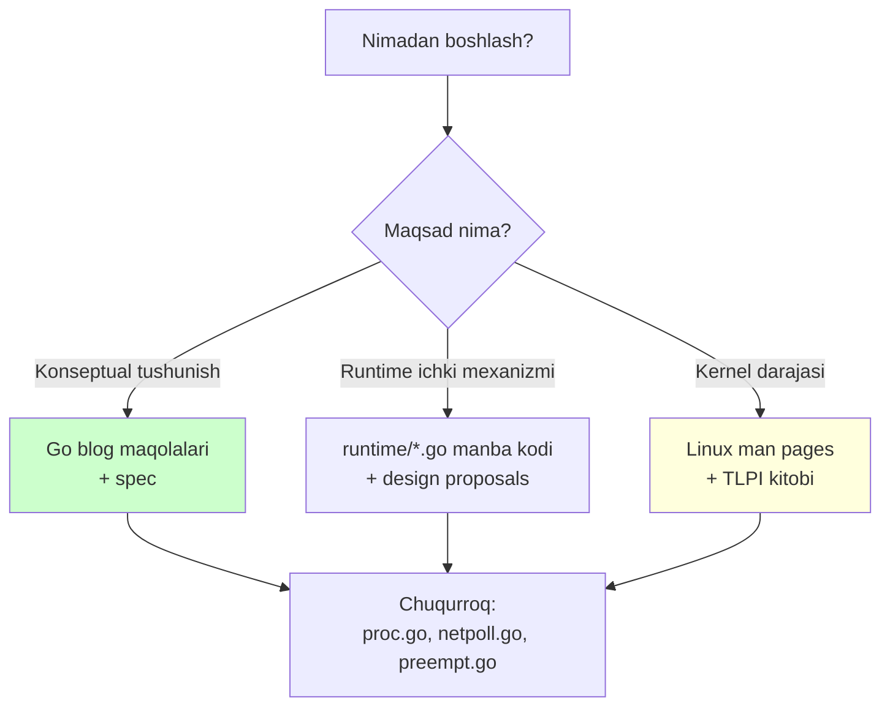

# 12 — Manbalar (References)

> **The Anatomy of Go** (Phuong Le) kitobining 8-bobi (Concurrency) uchun asl manbalar va qo'shimcha foydali havolalar.

## Kitobdagi asosiy manbalar

Bu havolalar kitobning References bo'limida keltirilgan:

| Kod | Manba | Havola |
|-----|-------|--------|
| **[csp78]** | C. A. R. Hoare — *Communicating Sequential Processes* (Go concurrency modelining nazariy asosi) | https://www.cs.ox.ac.uk/publications/publication8253-abstract.html |
| **[sharemem]** | *Share Memory By Communicating* (Go blog — "muloqot orqali xotira bo'lishing") | https://go.dev/blog/share-memory-by-communicating |
| **[mutexorchan]** | Go Wiki — *Use a sync.Mutex or a channel?* | https://go.dev/wiki/MutexOrChannel |
| **[gospec]** | *The Go Programming Language Specification* | https://go.dev/ref/spec |
| **[go123timer]** | Go Wiki — *Go 1.23 Timer Channel Changes* | https://go.dev/wiki/Go123Timer |
| **[go114]** | *Go 1.14 Release Notes* (asynchronous preemption qo'shilgan versiya) | https://go.dev/doc/go1.14 |

---

## Qo'shimcha rasmiy manbalar

Quyidagilar kitobda yo'q, lekin bob mavzularini chuqurroq o'rganish uchun juda foydali. Bular rasmiy Go manbalari — ishonchli va yangilanib turadi.

### Scheduler va M-P-G

- **Go scheduler dizayn hujjati** (Dmitry Vyukov) — scheduler'ning asl dizayn g'oyasi:
  https://golang.org/s/go11sched
- **runtime: proc.go** — `schedule`, `findRunnable`, `newproc`, `sysmon` manba kodi:
  https://github.com/golang/go/blob/master/src/runtime/proc.go
- **Go's work-stealing scheduler** (blog/maqola turkumi) — work stealing tushunchasi.

### Preemption

- **Proposal: Non-cooperative goroutine preemption** — asynchronous preemption'ning asl taklifi (`SIGURG` nima uchun tanlanganini tushuntiradi):
  https://github.com/golang/proposal/blob/master/design/24543-non-cooperative-preemption.md
- **runtime: preempt.go** — `asyncPreempt`, `preemptM`, safe-point mantiqi:
  https://github.com/golang/go/blob/master/src/runtime/preempt.go
- **runtime: signal_unix.go** — `sighandler`, `doSigPreempt`, `gsignal` yo'li:
  https://github.com/golang/go/blob/master/src/runtime/signal_unix.go
- **runtime: stack.go** — `newstack`, `stackPreempt`, function prologue stack check:
  https://github.com/golang/go/blob/master/src/runtime/stack.go

### I/O, netpoller va epoll

- **runtime: netpoll.go** — platformadan mustaqil netpoller, `pollDesc`, `rg`/`wg`, `netpollready`:
  https://github.com/golang/go/blob/master/src/runtime/netpoll.go
- **runtime: netpoll_epoll.go** — Linux epoll backend (`netpollopen`, `netpoll` → `epoll_wait`):
  https://github.com/golang/go/blob/master/src/runtime/netpoll_epoll.go
- **internal/poll: fd_unix.go** — `poll.FD`, `pollDesc`, `runtimeCtx` bog'lanishi:
  https://github.com/golang/go/blob/master/src/internal/poll/fd_unix.go
- **epoll(7) — Linux man page** — `epoll_create1`, `epoll_ctl`, `epoll_wait`, level/edge-triggered:
  https://man7.org/linux/man-pages/man7/epoll.7.html
- **eventfd(2) — Linux man page** — netpoller'ni uyg'otish mexanizmi:
  https://man7.org/linux/man-pages/man2/eventfd.2.html
- **The Linux Programming Interface** (Michael Kerrisk) — file descriptor, inode, epoll bo'yicha eng chuqur kitob.

### Channels va Select

- **Go blog — Go Concurrency Patterns** (Rob Pike) — kanal pattern'lari:
  https://go.dev/blog/pipelines
- **runtime: chan.go** — `hchan`, `chansend`, `chanrecv`, `sudog`:
  https://github.com/golang/go/blob/master/src/runtime/chan.go
- **runtime: select.go** — `selectgo`, `scase`:
  https://github.com/golang/go/blob/master/src/runtime/select.go

### Timers

- **runtime: time.go** — per-P timer heap, timer holatlari:
  https://github.com/golang/go/blob/master/src/runtime/time.go

### Garbage Collection (sysmon bilan bog'liq)

- **Go blog — Getting to Go: The Journey of Go's Garbage Collector**:
  https://go.dev/blog/ismmkeynote
- **runtime: mgc.go** — `gcStart`, `forcegchelper`, forced GC:
  https://github.com/golang/go/blob/master/src/runtime/mgc.go

---

## Manbalar bo'yicha tavsiya

- **Yangi boshlovchi bo'lsangiz** — avval Go blog maqolalari (`share-memory-by-communicating`, `pipelines`) va spec'ni o'qing.
- **Runtime'ni chuqur o'rganmoqchi bo'lsangiz** — `proc.go`, `netpoll.go`, `preempt.go` manba kodini bevosita o'qing. Ular yaxshi izohlangan.
- **Kernel darajasini tushunmoqchi bo'lsangiz** — `epoll(7)`, `eventfd(2)` man page'lari va Michael Kerrisk'ning "The Linux Programming Interface" kitobi eng yaxshi manbalar.

---

## Kitobning o'zi

- **Asl kitob:** *The Anatomy of Go* — Phuong Le
- **8-bob:** Concurrency
- **O'zbek tiliga moslashtirish:** Claude (Anthropic) yordamida, o'qib tushunilgach qayta tushuntirilgan (so'zma-so'z tarjima emas).

---

[← 11 Xulosa](11_summary.md) | [README ga qaytish →](README.md)
