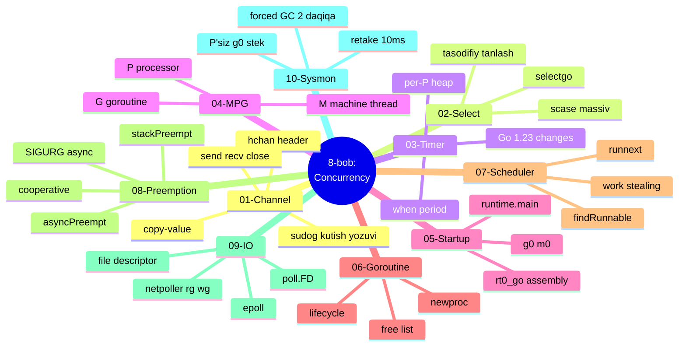
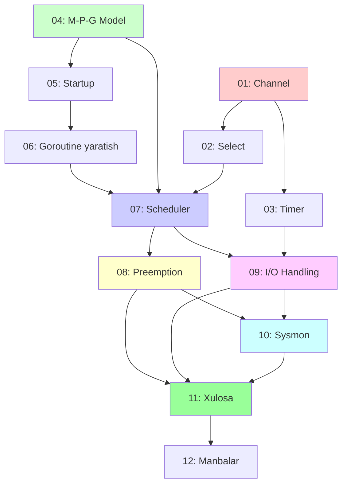

# 8-bob: Concurrency (Parallellik)

> **The Anatomy of Go** kitobining 8-bobi — o'zbek tilidagi to'liq o'quv qo'llanma.
> Bu materiallar asl kitobning so'zma-so'z tarjimasi emas, balki o'qilib tushunilgandan keyin **o'z so'zlarim bilan qayta tushuntirilgan** versiyasi.

## Bob haqida

Bu bob Go tilining eng kuchli xususiyati — **concurrency**ni past darajada, ya'ni **runtime, scheduler, kernel va signal** darajasida o'rgatadi. Ya'ni: `go func()` yozganingizda **aslida nima sodir bo'ladi**, kanal qanday ishlaydi, million goroutine qanday qilib bir nechta thread'ga sig'adi, va Go qanday qilib tarmoq I/O'sini thread'larni bloklamasdan boshqaradi.

Bobni o'qib chiqib, siz quyidagi savollarga javob bera olasiz:

- Kanal aslida qanday ma'lumot tuzilmasi? (`hchan`, `sudog`)
- `select` bir nechta case tayyor bo'lganda qaysi birini tanlaydi va nima uchun?
- Taymerlar qayerda yashaydi va nima uchun global lock yo'q? (per-P heap)
- **M**, **P**, **G** — bular nima va qanday bir-biriga bog'lanadi?
- Go dasturi `main.main`'dan **oldin** nima qiladi? (`rt0_go`, `g0`)
- `go func()` qanday qilib runnable goroutinega aylanadi? (`newproc`)
- Scheduler "hozir kim ishlaydi?" degan savolga qanday javob beradi? (`findRunnable`, work stealing)
- Cheksiz `for {}` sikldagi goroutinni Go qanday to'xtatadi? (`SIGURG`, async preemption)
- 10 000 ta tarmoq ulanishi qanday qilib bir nechta thread bilan boshqariladi? (epoll, netpoller)
- Ishchi thread'lar sekinlashib qolganda kim aralashadi? (`sysmon`)

## Mundarija

| # | Mavzu | Asosiy tushunchalar |
|---|-------|---------------------|
| [01](01_channel.md) | **Channel** | `hchan` header, `sudog`, send/recv/close, copy-value model |
| [02](02_select.md) | **Select** | `scase`, `selectgo`, tasodifiy tanlash, ko'p navbatga park |
| [03](03_timer.md) | **Timer** | per-P timer heap, `when`/`period`, holatlar, Go 1.23 |
| [04](04_mpg_model.md) | **M-P-G Model** | G ish, M thread, P token, lokal navbat va cache |
| [05](05_runtime_startup.md) | **Runtime Startup** | `rt0_go`, TLS, `m0`, `g0`, `runtime.main` |
| [06](06_goroutine_creation.md) | **Goroutine yaratish** | `newproc`, free list, run queue, lifecycle |
| [07](07_scheduler.md) | **Scheduler** | `schedule`, `findRunnable`, `runnext`, work stealing |
| [08](08_preemption.md) | **Preemption** | cooperative, `stackPreempt`, async, `SIGURG`, `gsignal` |
| [09](09_io_handling.md) | **I/O Handling** | file descriptor, `poll.FD`, epoll, netpoller, `rg`/`wg` |
| [10](10_sysmon.md) | **Sysmon** | P'siz monitoring, retake, forced GC |
| [11](11_summary.md) | **Xulosa** | Bobning umumiy jamlanmasi + mindmap |
| [12](12_references.md) | **Manbalar** | Asl havolalar, runtime manba kodi, Linux man pages |

## Bo'limning umumiy konsept xaritasi

## Mavzular bog'liqligi

Bog'liqlik mantig'i:
- **01–03** (Channel, Select, Timer) — bular concurrency'ning **user-darajali qurilma toshlari**. Ular scheduler ustida ishlaydi.
- **04–07** (M-P-G, Startup, Goroutine, Scheduler) — bular **scheduling yadrosi**. Ketma-ket o'qilishi kerak: model → startup → yaratish → scheduling.
- **08–10** (Preemption, I/O, Sysmon) — bular scheduler'ning **ilg'or mexanizmlari**. Ular 07'ga tayanadi.
- **11–12** (Xulosa, Manbalar) — jamlash va chuqurroq o'rganish.

## O'qish tartibi tavsiyasi

Agar Go runtime'ida yangi bo'lsangiz — **tartib bilan** o'qing:

1. **Boshlanish:** [01 Channel](01_channel.md) — concurrency'ning yuragi
2. **Tanlov:** [02 Select](02_select.md) — bir necha kanal bilan ishlash
3. **Vaqt:** [03 Timer](03_timer.md) — taymerlar runtime ostida
4. **Model:** [04 M-P-G](04_mpg_model.md) — **eng muhim** poydevor
5. **Startup:** [05 Runtime Startup](05_runtime_startup.md) — dastur qanday boshlanadi
6. **Yaratish:** [06 Goroutine Creation](06_goroutine_creation.md) — `go` bayonoti ostida
7. **Scheduler:** [07 Scheduler](07_scheduler.md) — kim ishlaydi degan savol
8. **Preemption:** [08 Preemption](08_preemption.md) — majburan to'xtatish
9. **I/O:** [09 I/O Handling](09_io_handling.md) — epoll va netpoller
10. **Sysmon:** [10 Sysmon](10_sysmon.md) — fon qorovuli
11. **Xulosa:** [11 Summary](11_summary.md) — hammasini bog'lash
12. **Manbalar:** [12 References](12_references.md) — chuqurroq o'rganish

Agar allaqachon tajribali bo'lsangiz — **04 (M-P-G)**'dan boshlab, keyin sizni qiziqtirgan ilg'or mavzuga (08, 09 yoki 10) o'ting.

## Muhim bog'lanishlar

Bu bob avvalgi boblar bilan chambarchas bog'liq:

- **6-bob (Functionality)** — u yerdagi **M-P-G modeli**, **stack frame** va **function prologue** tushunchalari bu yerda preemption uchun asos bo'ladi.
- **7-bob (Memory)** — **stack o'sishi** va `stackguard0` mexanizmi cooperative preemption'ning kaliti. **Garbage collector** esa sysmon va preemption bilan bog'liq.

## Har bir bo'limda bor

Har bir markdown fayl quyidagi tuzilmaga ega:

- **Nima uchun bu mavzu muhim?** — motivatsiya
- **Asosiy konseptlar** — sodda til bilan tushuntirish
- **Mermaid diagrammalar** — flowchart, sequence, state, mindmap
- **Real Go kodi misollari** — kitobdagi misollar asosida, o'zbekcha izohlar bilan
- **Eslab qol** — eng asosiy nuqtalar
- **Tez-tez uchraydigan xatolar** — yangi boshlovchilar uchun
- **Amaliyot** — o'zingizni sinash uchun mashqlar

## Manba va kitobning o'zi

Bu o'quv qo'llanma quyidagi manba asosida tayyorlangan:

- **Asl kitob:** *The Anatomy of Go* (Phuong Le)
- **8-bob:** Concurrency

## Mualliflik haqida

- O'zbek tiliga moslashtirish va qayta tushuntirish: Claude (Anthropic AI) yordamida
- Foydalanuvchi: Quvonchbek (`otajonoov@gmail.com`)
- Sana: 2026-07-07

---

**Boshlash:** [01 Channel](01_channel.md) →
