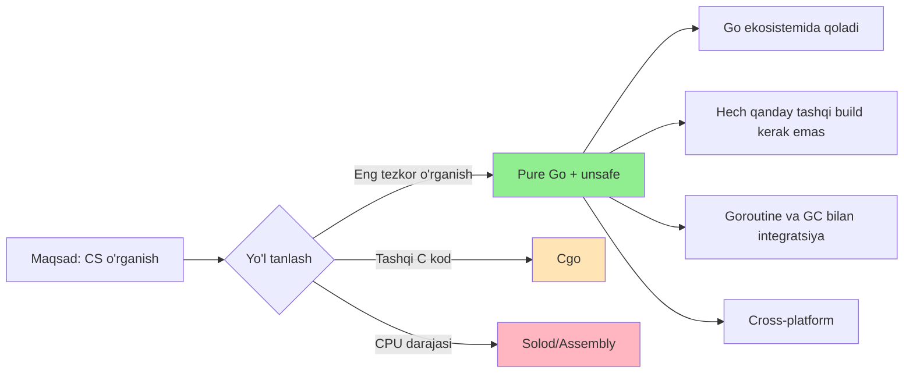
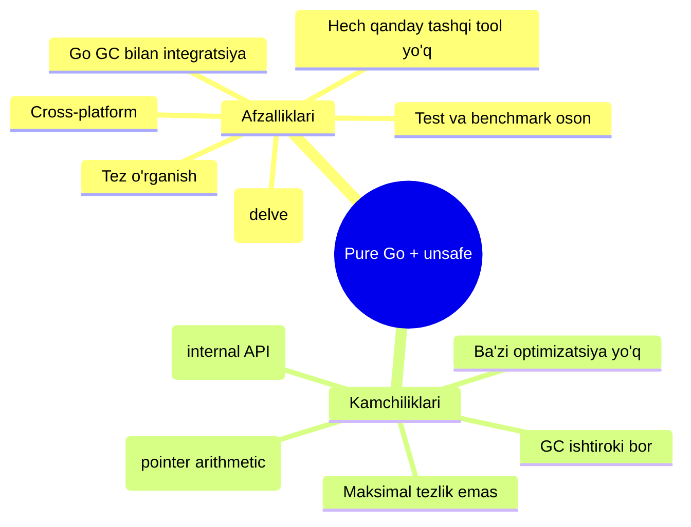
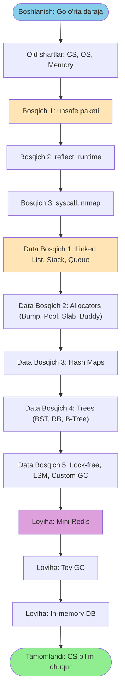

# 1. Kirish va maqsad

## 1.1. Nima uchun pure Go + `unsafe`?

Go tilida past darajadagi (low-level) ishlarni qilishning **uchta asosiy yo'li** bor:

| Yo'l | Tavsif | Murakkablik | Portativligi |
|------|--------|-------------|--------------|
| **Pure Go + `unsafe`** | Faqat Go tili va `unsafe` paketi | O'rta | Yuqori |
| **Cgo** | C kutubxonalarini chaqirish | Yuqori | Past |
| **Solod (Assembly)** | Plan9 assembly, `.s` fayllar | Juda yuqori | Past (CPU arch'ga bog'liq) |

### Nima uchun aynan **pure Go + `unsafe`**?

**Sabablari:**
1. **Go ekosistemasidan chiqmaysiz** — `go build`, `go test`, `go bench` hammasi ishlaydi
2. **Cross-platform** — Linux, macOS, Windows hammasida ishlaydi (kichik o'zgarishlar bilan)
3. **Goroutine va GC bilan integratsiya** — yozgan strukturangizni kodingizda ishlatish oson
4. **C bilmasangiz ham bo'ladi** — faqat Go bilish kifoya
5. **Asosiy fundamental bilim** — pointer, memory layout, alignment hammasini o'rganasiz
6. **Solod'ga kelajakda tayyorgarlik** — `unsafe`'da puxta bo'lsangiz, assembly osonroq ko'rinadi

## 1.2. Afzalliklari va kamchiliklari

| Afzallik | Kamchilik |
|----------|-----------|
| Tez o'rganasiz, sintaksis tanish | Maksimal tezlik (assembly darajasi) emas |
| Cross-platform (deyarli) | Go runtime ichidagi ba'zi narsalarga to'g'ridan-to'g'ri tegolmaysiz |
| GC bilan birga ishlaydi | `unsafe` xavfli — pointer xatosi `panic` chaqiradi |
| Test va benchmark stdlib bilan | Go versiyasi o'zgarsa, kod buzilishi mumkin |
| Pointer va memory tushunchasini chuqur o'rgatadi | C dasturchilari ko'pi hali ham Cgo'ni afzal ko'radi |

## 1.3. Kim uchun mos?

Bu yo'l mos keladi agar siz:
- Go'ni **o'rta darajada** bilsangiz (goroutine, channel, slice, map ishlata olsangiz)
- **CS fundamental** narsalarni o'rganmoqchi bo'lsangiz (pointer, memory, allocator)
- **Database internals**, **GC algorithms**, **lock-free data structures** ga qiziqsangiz
- **BadgerDB, CockroachDB, Redis** kabi loyihalarning ichki dunyosini ko'rmoqchi bo'lsangiz
- Production uchun **emas**, balki **bilim uchun** ishlamoqchi bo'lsangiz

Bu yo'l mos **kelmaydi** agar siz:
- Eng yuqori tezlik kerak bo'lsa (u holda assembly)
- C kutubxonalarini integratsiya qilish kerak bo'lsa (u holda Cgo)
- Faqat ishlaydigan kod kerak bo'lsa (u holda stdlib `slice`/`map` yetarli)

## 1.4. Umumiy yo'l (Roadmap diagrammasi)

---

