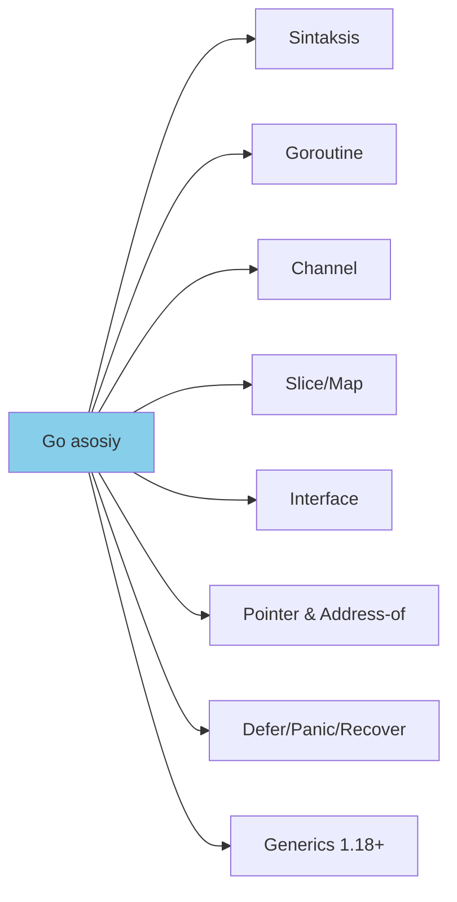
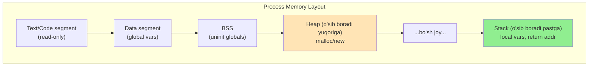
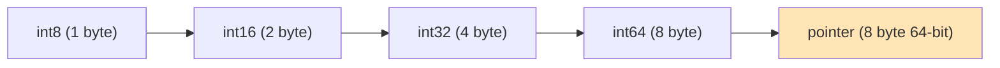

# 2. Old shartlar (Prerequisites)

## 2.1. Go bilim darajasi

Quyidagi mavzularni **bilishingiz shart**:



| Mavzu | Daraja | Tekshiruv savoli |
|-------|--------|------------------|
| Sintaksis | Bilish shart | `for`, `range`, `switch`, `func` ishlay olasizmi? |
| Pointer (`*T`, `&v`) | Bilish shart | `*int` va `int` farqini bilasizmi? |
| Slice | Yaxshi bilish | `make([]int, 5, 10)` ning ma'nosi? |
| Map | Yaxshi bilish | `map[K]V` zero value nima? |
| Goroutine | Bilish shart | `go f()` qanday ishlaydi? |
| Channel | Bilish shart | Buffered vs unbuffered farqi? |
| Interface | Bilish shart | `interface{}` va `any` bir xilmi? |
| Generics | Yaxshi bo'ladi | `func F[T any](x T) T` yoza olasizmi? |
| Defer | Bilish shart | LIFO tartibi? |

**Tavsiya:** Agar bularni hammasini bilmasangiz — avval [tour.golang.org](https://tour.golang.org) va "The Go Programming Language" kitobi (1-7 boblari).

## 2.2. Computer Science fundamental tushunchalari

### 2.2.1. Memory layout



**Bilish kerak:**
- **Stack** — funksiya local o'zgaruvchilari, LIFO, tez
- **Heap** — `new`, `make` orqali olinadigan xotira, sekinroq, GC tomonidan boshqariladi
- **Stack vs Heap** — Go compileri "escape analysis" qiladi
- **Pointer** — xotira manzilining ifodalanishi (64-bit tizimda 8 bayt)

### 2.2.2. Pointer va alignment



**Alignment** — har bir tipning xotirada qaysi manzildan boshlashi kerakligi:
- `int32` — 4 ga karrali manzilda
- `int64` — 8 ga karrali manzilda
- Bu CPU optimizatsiya uchun

**Misol struct:**
```go
type Bad struct {
    a bool   // 1 byte
    b int64  // 8 byte (lekin 7 bayt padding kerak)
    c bool   // 1 byte
}
// Sizeof = 24 byte (padding bilan)

type Good struct {
    b int64  // 8 byte
    a bool   // 1 byte
    c bool   // 1 byte
    // 6 bayt padding
}
// Sizeof = 16 byte
```

### 2.2.3. Bitwise operatsiyalar

| Operator | Ma'no | Misol |
|----------|-------|-------|
| `&` | AND | `0b1100 & 0b1010 = 0b1000` |
| `\|` | OR | `0b1100 \| 0b1010 = 0b1110` |
| `^` | XOR | `0b1100 ^ 0b1010 = 0b0110` |
| `<<` | Left shift | `1 << 3 = 8` |
| `>>` | Right shift | `8 >> 1 = 4` |
| `&^` | AND NOT (clear) | `0b1111 &^ 0b0011 = 0b1100` |

## 2.3. Operatsion tizim (OS) bilimlari

```mermaid
flowchart TD
    OS[OS bilimlar] --> VM[Virtual Memory]
    OS --> SC[Syscalls]
    OS --> MM[Memory Mapping]

    VM --> Page[Page (4KB odatda)]
    VM --> PT[Page Table]
    VM --> TLB[TLB cache]

    SC --> Mmap[mmap]
    SC --> Brk[brk/sbrk]
    SC --> Mprot[mprotect]

    MM --> Anon[Anonymous mapping]
    MM --> File[File mapping]
```

**Bilish kerak:**
- **Virtual memory** — har bir process o'z manzil maydoniga ega
- **Page** — odatda 4 KB bloklar
- **mmap** — OS dan to'g'ridan-to'g'ri xotira so'rash
- **Syscall** — kernel'ga murojaat (Go'da `syscall` paket)

**O'qish uchun:**
- "Operating Systems: Three Easy Pieces" — bepul kitob: [pages.cs.wisc.edu/~remzi/OSTEP](https://pages.cs.wisc.edu/~remzi/OSTEP)
- Linux `man 2 mmap`

## 2.4. Kompilyator va linker

**Boshlang'ich tushuncha:**
- Go compileri qanday ishlaydi (lex → parse → SSA → machine code)
- `go build -gcflags="-m"` — escape analysis ko'rish
- `go build -ldflags` — linker flags
- `go tool objdump` — disassembly

**Misol:**
```bash
# Funksiya escape qilganini tekshirish
go build -gcflags="-m" main.go

# Disassembly
go tool objdump -s "main.main" binary
```

---

