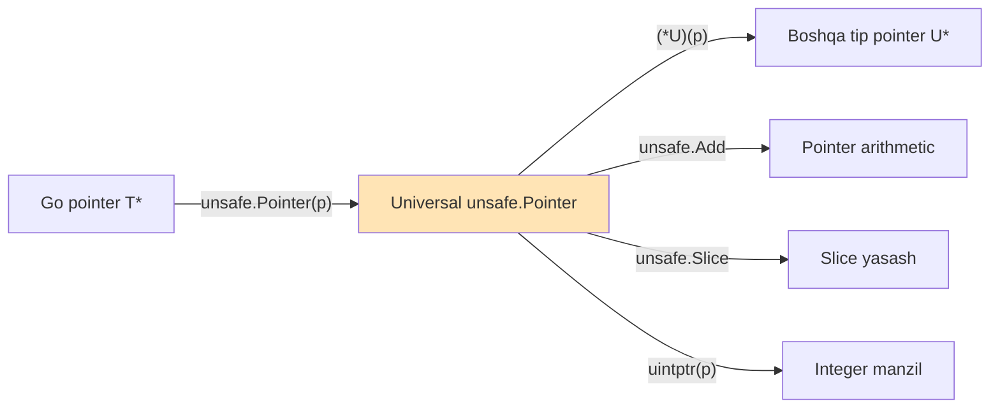
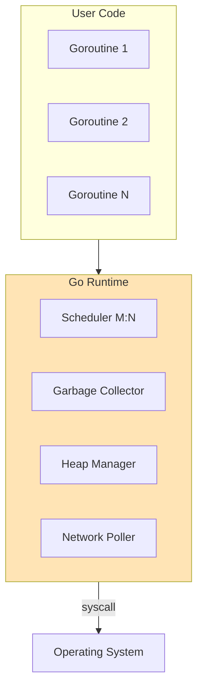
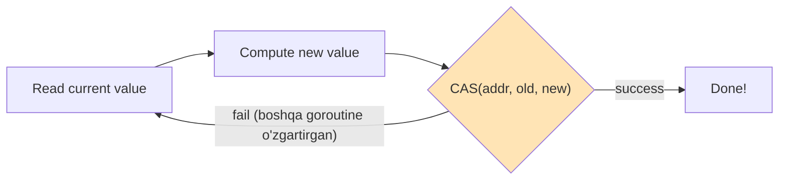
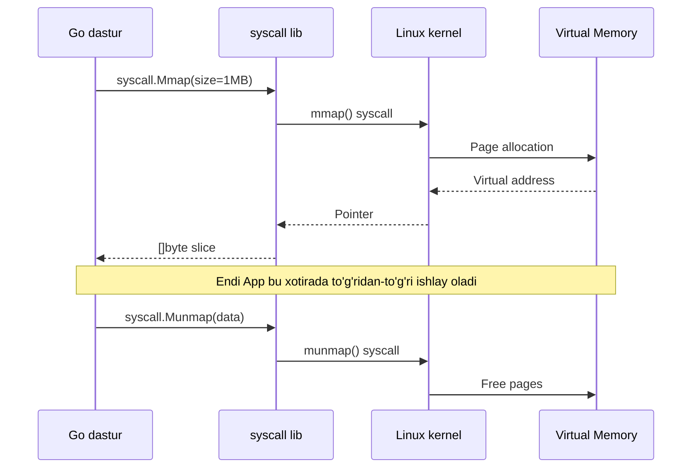
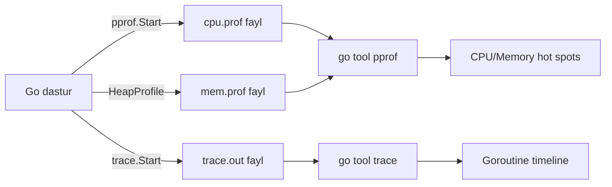

# 3. O'rganish kerak bo'lgan kutubxonalar

> **Tartib muhim!** Quyida ketma-ketlik bilan beriladi.

## 3.1. `unsafe` paketi

### Nima qiladi?
Go'ning tip xavfsizligini chetlab o'tish, raw pointer bilan ishlash, xotirani to'g'ridan-to'g'ri boshqarish.

### Nega kerak?
Hamma low-level data type'larni implement qilishda asosiy vosita.

### Asosiy funksiyalar va misollar

```go
package main

import (
    "fmt"
    "unsafe"
)

type Person struct {
    Name string  // 16 byte (string header)
    Age  int32   // 4 byte
    _    [4]byte // padding
    ID   int64   // 8 byte
}

func main() {
    p := Person{Name: "Quvonchbek", Age: 25, ID: 1001}

    // 1. Sizeof — tip o'lchami
    fmt.Println("Sizeof Person:", unsafe.Sizeof(p))     // 32 byte

    // 2. Alignof — alignment talabi
    fmt.Println("Alignof Person:", unsafe.Alignof(p))   // 8 byte

    // 3. Offsetof — strukturada maydon manzili
    fmt.Println("Offset Name:", unsafe.Offsetof(p.Name)) // 0
    fmt.Println("Offset Age:", unsafe.Offsetof(p.Age))   // 16
    fmt.Println("Offset ID:", unsafe.Offsetof(p.ID))     // 24

    // 4. Pointer — turli tip pointerlarni o'zaro almashtirish
    var x int64 = 42
    ptr := unsafe.Pointer(&x)
    intPtr := (*int32)(ptr) // int64 -> int32 ko'rsatish (xavfli!)
    fmt.Println("Quyi 32-bit:", *intPtr) // 42

    // 5. Add (Go 1.17+) — pointer arithmetic
    arr := [5]int32{10, 20, 30, 40, 50}
    base := unsafe.Pointer(&arr[0])
    third := (*int32)(unsafe.Add(base, 2*unsafe.Sizeof(arr[0])))
    fmt.Println("3-element:", *third) // 30

    // 6. Slice (Go 1.17+) — pointerdan slice yasash
    raw := unsafe.Slice(&arr[0], 5)
    fmt.Println("Slice:", raw)

    // 7. String (Go 1.20+) — bytedan string yasash (copy qilmasdan)
    bytes := []byte("salom")
    s := unsafe.String(&bytes[0], len(bytes))
    fmt.Println("String:", s)
}
```

### O'rganish tartibi
1. `Sizeof`, `Alignof`, `Offsetof` — kuzatuv funksiyalari
2. `unsafe.Pointer` — generic pointer
3. `Add` — pointer arithmetic
4. `Slice`, `String` — Go 1.17+ qulayliklari

### Rasmiy hujjatlar
- [pkg.go.dev/unsafe](https://pkg.go.dev/unsafe)
- [research.swtch.com/gorace](https://research.swtch.com/gorace) — Russ Cox'dan

### Diagram



## 3.2. `reflect` paketi

### Nima qiladi?
Run-time'da tip ma'lumotlarini olish (introspection), tip va qiymatlarni dinamik o'zgartirish.

### Nega kerak?
- Custom serializer yozish (JSON, MsgPack)
- Generic data type'larda tip ma'lumoti olish
- Test framework yozish

### Asosiy tushunchalar

```go
package main

import (
    "fmt"
    "reflect"
)

type User struct {
    Name string `json:"name"`
    Age  int    `json:"age"`
}

func main() {
    u := User{Name: "Ali", Age: 30}

    // 1. Type olish
    t := reflect.TypeOf(u)
    fmt.Println("Tip nomi:", t.Name())  // User
    fmt.Println("Kind:", t.Kind())      // struct

    // 2. Maydonlar bo'yicha aylanib chiqish
    for i := 0; i < t.NumField(); i++ {
        field := t.Field(i)
        fmt.Printf("Maydon: %s, Tip: %s, Tag: %s\n",
            field.Name, field.Type, field.Tag.Get("json"))
    }

    // 3. Value olish va o'zgartirish
    v := reflect.ValueOf(&u).Elem() // pointer dan Elem
    nameField := v.FieldByName("Name")
    if nameField.CanSet() {
        nameField.SetString("Vali")
    }
    fmt.Println("O'zgartirildi:", u)
}
```

### Asosiy funksiyalar
| Funksiya | Vazifasi |
|----------|----------|
| `reflect.TypeOf(v)` | Tipni olish |
| `reflect.ValueOf(v)` | Qiymatni olish |
| `t.Kind()` | Asosiy kind (struct, map, slice...) |
| `t.NumField()` | Struct maydonlari soni |
| `t.Field(i)` | i-maydon haqida ma'lumot |
| `v.Elem()` | Pointer ichidagi qiymat |
| `v.CanSet()` | O'zgartira olamizmi |

### Rasmiy hujjatlar
- [pkg.go.dev/reflect](https://pkg.go.dev/reflect)
- [The Laws of Reflection](https://go.dev/blog/laws-of-reflection) — rasmiy blog

## 3.3. `runtime` paketi

### Nima qiladi?
Go runtime (GC, scheduler, goroutine) bilan o'zaro aloqa.

### Asosiy funksiyalar

```go
package main

import (
    "fmt"
    "runtime"
)

func main() {
    // 1. CPU yadrolari
    fmt.Println("CPU:", runtime.NumCPU())

    // 2. Goroutine sonini sozlash
    runtime.GOMAXPROCS(4)

    // 3. Memory statistikasi
    var m runtime.MemStats
    runtime.ReadMemStats(&m)
    fmt.Printf("Alloc: %d KB\n", m.Alloc/1024)
    fmt.Printf("HeapAlloc: %d KB\n", m.HeapAlloc/1024)
    fmt.Printf("NumGC: %d\n", m.NumGC)

    // 4. Manual GC
    runtime.GC()

    // 5. Goroutine sonini olish
    fmt.Println("Goroutines:", runtime.NumGoroutine())

    // 6. KeepAlive — GC ga tegmasin deyish
    obj := makeObj()
    useObj(obj)
    runtime.KeepAlive(obj) // Bu nuqtagacha obj tirik bo'lsin

    // 7. SetFinalizer — obyekt o'lganda funksiya chaqirish
    type Resource struct{ id int }
    r := &Resource{id: 1}
    runtime.SetFinalizer(r, func(r *Resource) {
        fmt.Println("Finalize:", r.id)
    })
}

func makeObj() *int { x := 42; return &x }
func useObj(p *int)  { fmt.Println(*p) }
```

### Diagram: Go runtime



### Rasmiy hujjatlar
- [pkg.go.dev/runtime](https://pkg.go.dev/runtime)

## 3.4. `runtime/debug` paketi

### Nima qiladi?
GC va memory'ni nozik sozlash.

```go
import "runtime/debug"

// GC ko'p marta ishlasin (memory tejash)
debug.SetGCPercent(50)  // default 100

// GC ni o'chirish (test uchun)
debug.SetGCPercent(-1)

// OS ga xotirani qaytarish
debug.FreeOSMemory()

// Stack trace
debug.PrintStack()
```

| Funksiya | Vazifasi |
|----------|----------|
| `SetGCPercent(p)` | GC trigger threshold |
| `SetMaxStack(n)` | Goroutine stack max o'lchami |
| `SetMaxThreads(n)` | OS thread limit |
| `FreeOSMemory()` | OS ga xotira qaytarish |
| `ReadGCStats(s)` | GC statistikasi |

## 3.5. `sync/atomic` paketi

### Nima qiladi?
Lock'siz, atomic operatsiyalar (CAS — Compare-And-Swap, Load, Store, Add).

### Nega kerak?
Lock-free data strukturalar (lock-free queue, lock-free stack) uchun asos.

```go
package main

import (
    "fmt"
    "sync"
    "sync/atomic"
)

func main() {
    var counter int64
    var wg sync.WaitGroup

    for i := 0; i < 1000; i++ {
        wg.Add(1)
        go func() {
            defer wg.Done()
            atomic.AddInt64(&counter, 1) // atomic increment
        }()
    }
    wg.Wait()
    fmt.Println("Counter:", counter) // har doim 1000

    // CAS — Compare And Swap
    var val int64 = 10
    swapped := atomic.CompareAndSwapInt64(&val, 10, 20)
    fmt.Println("Swapped:", swapped, "Val:", val) // true 20

    // Load va Store
    atomic.StoreInt64(&val, 100)
    x := atomic.LoadInt64(&val)
    fmt.Println("X:", x)

    // Pointer atomic (Go 1.19+)
    var ptr atomic.Pointer[int]
    n := 42
    ptr.Store(&n)
    fmt.Println("Ptr:", *ptr.Load())
}
```

### CAS algoritm sxemasi



## 3.6. `sync` paketi

### Nima qiladi?
Asosiy synchronization primitivlari.

```go
import "sync"

// 1. Mutex
var mu sync.Mutex
mu.Lock()
defer mu.Unlock()

// 2. RWMutex — Read/Write
var rw sync.RWMutex
rw.RLock()  // ko'p reader bir vaqtda
rw.RUnlock()

// 3. WaitGroup — goroutine'larni kutish
var wg sync.WaitGroup
wg.Add(1)
go func() { defer wg.Done() }()
wg.Wait()

// 4. Once — bir marta ishlatish
var once sync.Once
once.Do(func() { /* init */ })

// 5. Pool — obyektlarni qayta ishlatish (GC bosimi kam)
pool := sync.Pool{
    New: func() any { return new(bytes.Buffer) },
}
buf := pool.Get().(*bytes.Buffer)
buf.Reset()
// ...ishlatish
pool.Put(buf)

// 6. Map — concurrent map (sharded)
var m sync.Map
m.Store("key", 42)
v, ok := m.Load("key")
```

### Nega `sync.Pool` muhim?

Custom allocator yozayotganda obyektlarni qayta ishlatish — performansni oshiradi va GC bosimini kamaytiradi.

## 3.7. `syscall` va `golang.org/x/sys/unix`

### Nima qiladi?
OS ga to'g'ridan-to'g'ri murojaat (mmap, munmap, mprotect).

### Nega kerak?
Allocator yozish uchun OS dan xotira olish.

```go
package main

import (
    "fmt"
    "syscall"
)

func main() {
    // Anonymous memory mapping (mmap orqali)
    size := 1 << 20 // 1 MB
    data, err := syscall.Mmap(
        -1,                                  // fd: -1 anonymous
        0,                                   // offset
        size,                                // size
        syscall.PROT_READ|syscall.PROT_WRITE, // protection
        syscall.MAP_ANON|syscall.MAP_PRIVATE, // flags
    )
    if err != nil {
        panic(err)
    }
    defer syscall.Munmap(data)

    // Foydalanish — bu OS'dan to'g'ridan to'g'ri olingan xotira!
    data[0] = 42
    fmt.Println("Birinchi byte:", data[0])
    fmt.Println("Hajm:", len(data))
}
```

### Tavsiya

`syscall` paketi **deprecated** holida. O'rniga ishlating:
```go
import "golang.org/x/sys/unix"

data, err := unix.Mmap(-1, 0, size,
    unix.PROT_READ|unix.PROT_WRITE,
    unix.MAP_ANON|unix.MAP_PRIVATE)
```

### Diagramma: mmap



## 3.8. `encoding/binary`

### Nima qiladi?
Byte order (LittleEndian/BigEndian) bilan ishlash, raw byte → primitive tip.

```go
package main

import (
    "encoding/binary"
    "fmt"
)

func main() {
    buf := make([]byte, 8)

    // uint64 -> bytes
    binary.LittleEndian.PutUint64(buf, 0x1234567890ABCDEF)
    fmt.Printf("%x\n", buf)

    // bytes -> uint64
    val := binary.LittleEndian.Uint64(buf)
    fmt.Printf("%x\n", val)
}
```

| Funksiya | Vazifasi |
|----------|----------|
| `binary.LittleEndian.Uint16/32/64` | Bytedan o'qish |
| `binary.LittleEndian.PutUint16/32/64` | Bytega yozish |
| `binary.Read/Write` | Reader/Writer bilan |
| `binary.Size(v)` | Tip o'lchami |

## 3.9. `hash/fnv`, `hash/maphash`

### Nima qiladi?
Hash funksiyalari (HashMap implementatsiyasi uchun).

```go
import (
    "hash/fnv"
    "hash/maphash"
)

// 1. FNV — oddiy va tez
h := fnv.New64a()
h.Write([]byte("hello"))
hash := h.Sum64()

// 2. maphash — Go runtime ishlatadigan, randomized
var seed = maphash.MakeSeed()
hash2 := maphash.String(seed, "hello")
```

### Hash xususiyatlari

| Hash | Tezligi | Kollizionlar | Ishlatish |
|------|---------|--------------|-----------|
| FNV | Tez | O'rta | Oddiy use case |
| maphash | Tez | Past | Production map |
| xxHash | Juda tez | Past | Tashqi paket |
| SipHash | O'rta | Juda past | Cryptographic |

## 3.10. `testing` va `testing/quick`

### Unit test, benchmark, property-based test

```go
package mypkg

import (
    "testing"
    "testing/quick"
)

// 1. Oddiy test
func TestStack_Push(t *testing.T) {
    s := NewStack[int]()
    s.Push(42)
    if s.Len() != 1 {
        t.Errorf("kutilgan 1, lekin %d", s.Len())
    }
}

// 2. Benchmark
func BenchmarkStack_Push(b *testing.B) {
    s := NewStack[int]()
    b.ResetTimer()
    b.ReportAllocs()
    for i := 0; i < b.N; i++ {
        s.Push(i)
    }
}

// 3. Property-based test
func TestStack_PushPopProperty(t *testing.T) {
    f := func(items []int) bool {
        s := NewStack[int]()
        for _, x := range items {
            s.Push(x)
        }
        // LIFO — oxirgi push birinchi pop
        for i := len(items) - 1; i >= 0; i-- {
            v, _ := s.Pop()
            if v != items[i] {
                return false
            }
        }
        return true
    }
    if err := quick.Check(f, nil); err != nil {
        t.Error(err)
    }
}
```

## 3.11. `runtime/pprof` va `runtime/trace`

### CPU va memory profiling

```go
import (
    "os"
    "runtime/pprof"
    "runtime/trace"
)

// CPU profiling
f, _ := os.Create("cpu.prof")
pprof.StartCPUProfile(f)
defer pprof.StopCPUProfile()

// Memory profiling
fm, _ := os.Create("mem.prof")
defer pprof.WriteHeapProfile(fm)

// Trace
ft, _ := os.Create("trace.out")
trace.Start(ft)
defer trace.Stop()
```

**Tahlil qilish:**
```bash
go tool pprof cpu.prof
(pprof) top
(pprof) web

go tool trace trace.out
```

### Diagram: profiling toolchain



---

