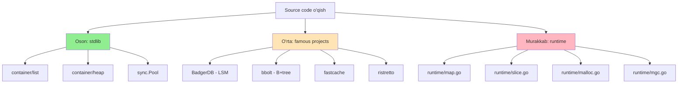

# 4. Kerakli tashqi resurslar

## 4.1. Kitoblar

| Kitob | Muallif | Daraja | Nega kerak? |
|-------|---------|--------|-------------|
| **The Go Programming Language** | Donovan & Kernighan | Asosiy | Go ni mukammal o'rganish |
| **100 Go Mistakes and How to Avoid Them** | Teiva Harsanyi | O'rta | Tez-tez uchraydi xatolar |
| **Concurrency in Go** | Katherine Cox-Buday | O'rta | Goroutine, channel chuqur |
| **Operating Systems: Three Easy Pieces** | Remzi Arpaci-Dusseau | OS | Bepul OS kitobi |
| **The Art of Computer Programming** | Donald Knuth | Yuqori | Algoritmlar (referans) |
| **Designing Data-Intensive Applications** | Martin Kleppmann | DB | LSM tree, B-tree, replikatsiya |
| **Database Internals** | Alex Petrov | DB | B+tree, LSM, MVCC |
| **The Linux Programming Interface** | Michael Kerrisk | Linux | mmap, syscall, signals |
| **Crafting Interpreters** | Robert Nystrom | Bonus | GC, allocator misol |

## 4.2. Bloglar va veb-saytlar

| Resurs | URL | Mavzu |
|--------|-----|-------|
| Dave Cheney | [dave.cheney.net](https://dave.cheney.net) | Go internals |
| Russ Cox | [research.swtch.com](https://research.swtch.com) | Go memory model, GC |
| Go Blog | [go.dev/blog](https://go.dev/blog) | Rasmiy yangiliklar |
| Vincent Blanchon | [medium.com/a-journey-with-go](https://medium.com/a-journey-with-go) | Go internals |
| Marcus Wilkin | [marcuswilkin.com](https://marcuswilkin.com) | Memory layout |
| Damian Gryski | [dgryski.medium.com](https://dgryski.medium.com) | Performance |
| Ardan Labs | [ardanlabs.com/blog](https://www.ardanlabs.com/blog) | Bill Kennedy |

## 4.3. Repolar (source code o'qish uchun)

| Repo | URL | Nima ko'rasiz |
|------|-----|---------------|
| **golang/go** | [github.com/golang/go](https://github.com/golang/go) | Stdlib + runtime |
| `runtime/slice.go` | runtime/slice.go | Slice growth, copy |
| `runtime/map.go` | runtime/map.go | Map (Swiss Tables 1.24+) |
| `runtime/malloc.go` | runtime/malloc.go | mheap, mcache |
| `runtime/mgc.go` | runtime/mgc.go | Garbage Collector |
| **CockroachDB** | [github.com/cockroachdb/cockroach](https://github.com/cockroachdb/cockroach) | Distributed SQL |
| **BadgerDB** | [github.com/dgraph-io/badger](https://github.com/dgraph-io/badger) | LSM tree DB |
| **bbolt** | [github.com/etcd-io/bbolt](https://github.com/etcd-io/bbolt) | B+tree DB |
| **fastcache** | [github.com/VictoriaMetrics/fastcache](https://github.com/VictoriaMetrics/fastcache) | mmap cache |
| **ristretto** | [github.com/dgraph-io/ristretto](https://github.com/dgraph-io/ristretto) | TinyLFU cache |
| **freecache** | [github.com/coocood/freecache](https://github.com/coocood/freecache) | Off-heap cache |

## 4.4. YouTube va konferensiyalar

| Talk | Speaker | Mavzu |
|------|---------|-------|
| Go Memory Model | Russ Cox | Memory ordering |
| Inside the Map | Keith Randall | Go map internals |
| The Go Garbage Collector | Rick Hudson | GC algoritm |
| Allocation Efficiency in Go | Bill Kennedy | Escape analysis |
| Understanding Allocations | Jacob Walker | Stack vs heap |
| Lock-free Programming | Hans-J. Boehm | Atomic, CAS |

**GopherCon channel:** [youtube.com/@GopherAcademy](https://www.youtube.com/@GopherAcademy)

## 4.5. Hujjatlar

| Hujjat | URL |
|--------|-----|
| Go Spec | [go.dev/ref/spec](https://go.dev/ref/spec) |
| Memory Model | [go.dev/ref/mem](https://go.dev/ref/mem) |
| `unsafe` rules | [pkg.go.dev/unsafe#Pointer](https://pkg.go.dev/unsafe#Pointer) |
| Plan9 assembly | [9p.io/sys/doc/asm.html](http://9p.io/sys/doc/asm.html) |

---

