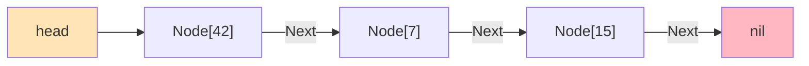
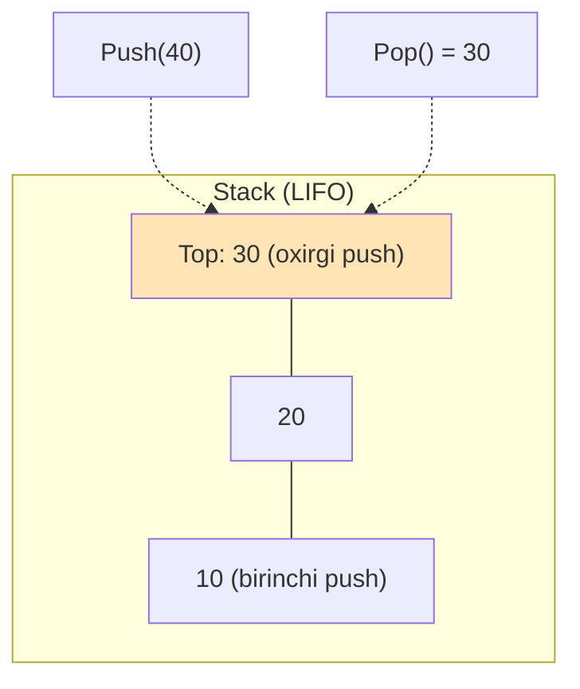
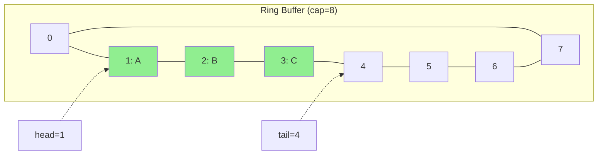

# 5. Data type'larni implement qilish ketma-ketligi

> **Maslahat:** Tartib bilan boring. Har bir bosqich keyingi uchun asos.

## Bosqich 1: Asoslar

### 1.1. Linked List (singly va doubly)

#### Maqsad
- Pointer ustida ishlash mahoratini oshirish
- `unsafe.Pointer` ishlatib generic versiyasini yozish
- O(1) insert/delete'ni tushunish

#### Konseptlar
- Pointer
- Generic types (Go 1.18+)
- Iterator pattern

#### Misol kod (Singly Linked List, Generic)

```go
package linkedlist

// Tugun (Node) — bitta element
type Node[T any] struct {
    Value T
    Next  *Node[T]
}

// LinkedList — boshi va o'lchami bilan
type LinkedList[T any] struct {
    head *Node[T]
    size int
}

// New — yangi ro'yxat yasash
func New[T any]() *LinkedList[T] {
    return &LinkedList[T]{}
}

// PushFront — boshiga qo'shish O(1)
func (l *LinkedList[T]) PushFront(v T) {
    l.head = &Node[T]{Value: v, Next: l.head}
    l.size++
}

// PushBack — oxiriga qo'shish O(n)
func (l *LinkedList[T]) PushBack(v T) {
    node := &Node[T]{Value: v}
    if l.head == nil {
        l.head = node
    } else {
        cur := l.head
        for cur.Next != nil {
            cur = cur.Next
        }
        cur.Next = node
    }
    l.size++
}

// Len — uzunlik
func (l *LinkedList[T]) Len() int { return l.size }

// Range — har bir element ustidan yuriish
func (l *LinkedList[T]) Range(f func(v T) bool) {
    for cur := l.head; cur != nil; cur = cur.Next {
        if !f(cur.Value) {
            break
        }
    }
}
```

#### Test va benchmark

```go
func TestLinkedList(t *testing.T) {
    l := New[int]()
    l.PushFront(1)
    l.PushFront(2)
    l.PushBack(3)

    var got []int
    l.Range(func(v int) bool {
        got = append(got, v)
        return true
    })
    want := []int{2, 1, 3}
    if !reflect.DeepEqual(got, want) {
        t.Errorf("got %v, want %v", got, want)
    }
}

func BenchmarkPushFront(b *testing.B) {
    l := New[int]()
    b.ResetTimer()
    for i := 0; i < b.N; i++ {
        l.PushFront(i)
    }
}
```

#### Diagram



### 1.2. Stack (array-based va linked-list-based)

#### Maqsad
- LIFO tushunchasi
- Ikki xil implementatsiya farqi
- Amortized O(1) tushunchasi (dynamic array)

#### Misol: Array-based stack

```go
package stack

type Stack[T any] struct {
    data []T
}

func New[T any]() *Stack[T] { return &Stack[T]{} }

func (s *Stack[T]) Push(v T) {
    s.data = append(s.data, v)
}

func (s *Stack[T]) Pop() (T, bool) {
    var zero T
    n := len(s.data)
    if n == 0 {
        return zero, false
    }
    v := s.data[n-1]
    s.data = s.data[:n-1]
    return v, true
}

func (s *Stack[T]) Peek() (T, bool) {
    var zero T
    n := len(s.data)
    if n == 0 {
        return zero, false
    }
    return s.data[n-1], true
}

func (s *Stack[T]) Len() int { return len(s.data) }
```

#### Diagram



### 1.3. Queue (circular buffer / ring buffer)

#### Maqsad
- FIFO tushunchasi
- Circular indexing
- Capacity boshqaruvi

#### Misol: Circular buffer queue

```go
package queue

type RingQueue[T any] struct {
    buf  []T
    head int // o'qish indeksi
    tail int // yozish indeksi
    size int // hozirgi elementlar soni
    cap  int
}

func New[T any](capacity int) *RingQueue[T] {
    return &RingQueue[T]{
        buf: make([]T, capacity),
        cap: capacity,
    }
}

// Enqueue — oxiriga qo'shish O(1)
func (q *RingQueue[T]) Enqueue(v T) bool {
    if q.size == q.cap {
        return false // to'la
    }
    q.buf[q.tail] = v
    q.tail = (q.tail + 1) % q.cap
    q.size++
    return true
}

// Dequeue — boshidan olish O(1)
func (q *RingQueue[T]) Dequeue() (T, bool) {
    var zero T
    if q.size == 0 {
        return zero, false
    }
    v := q.buf[q.head]
    q.buf[q.head] = zero // GC uchun
    q.head = (q.head + 1) % q.cap
    q.size--
    return v, true
}

func (q *RingQueue[T]) Len() int { return q.size }
```

#### Diagram



### 1.4. Dynamic Array (Vector / Go slice klonu)

#### Maqsad
- Slice ichki ishlash mexanizmini chuqur tushunish
- Growth strategy
- `unsafe.Pointer` bilan o'z slice header

#### Misol: Vector

```go
package vector

import (
    "unsafe"
)

// Vector — Go slice klonu
type Vector[T any] struct {
    ptr unsafe.Pointer // T turi pointer
    len int
    cap int
}

func New[T any]() *Vector[T] {
    return &Vector[T]{}
}

// Push — element qo'shish (amortized O(1))
func (v *Vector[T]) Push(val T) {
    if v.len == v.cap {
        v.grow()
    }
    // ptr + len*sizeof(T) ga yozish
    elemSize := unsafe.Sizeof(val)
    target := unsafe.Add(v.ptr, uintptr(v.len)*elemSize)
    *(*T)(target) = val
    v.len++
}

func (v *Vector[T]) grow() {
    newCap := v.cap * 2
    if newCap == 0 {
        newCap = 4 // boshlang'ich
    }
    // yangi xotira ajratish
    var zero T
    elemSize := unsafe.Sizeof(zero)
    newSlice := make([]T, newCap)
    newPtr := unsafe.Pointer(&newSlice[0])
    // eski ma'lumotni nusxalash
    if v.cap > 0 {
        oldSlice := unsafe.Slice((*T)(v.ptr), v.len)
        newSliceTyped := unsafe.Slice((*T)(newPtr), newCap)
        copy(newSliceTyped, oldSlice)
    }
    _ = elemSize
    v.ptr = newPtr
    v.cap = newCap
}

func (v *Vector[T]) Get(i int) T {
    var zero T
    elemSize := unsafe.Sizeof(zero)
    target := unsafe.Add(v.ptr, uintptr(i)*elemSize)
    return *(*T)(target)
}

func (v *Vector[T]) Len() int { return v.len }
func (v *Vector[T]) Cap() int { return v.cap }
```

> **Eslatma:** Bu ta'limiy maqsadda. Go GC tomonidan kuzatilishi uchun `make([]T, ...)` ishlatildi. To'liq mmap bilan yozish uchun "Allocator" bo'limga qarang.

### 1.5. Bit Array (Bitset)

#### Maqsad
- Bit manipulation
- Compact memory (8x kichik)
- Bloom filter uchun asos

#### Misol

```go
package bitset

type BitSet struct {
    bits []uint64
    size int
}

func New(n int) *BitSet {
    return &BitSet{
        bits: make([]uint64, (n+63)/64),
        size: n,
    }
}

func (b *BitSet) Set(i int) {
    b.bits[i/64] |= 1 << uint(i%64)
}

func (b *BitSet) Clear(i int) {
    b.bits[i/64] &^= 1 << uint(i%64)
}

func (b *BitSet) Get(i int) bool {
    return b.bits[i/64]&(1<<uint(i%64)) != 0
}

func (b *BitSet) Count() int {
    c := 0
    for _, w := range b.bits {
        c += bits.OnesCount64(w)
    }
    return c
}
```

