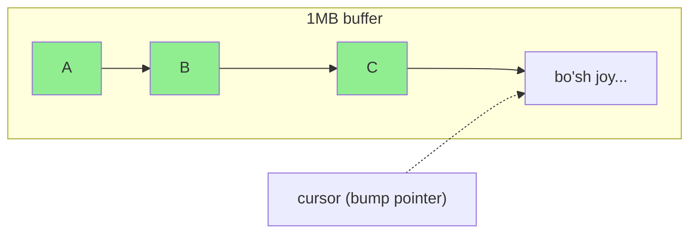
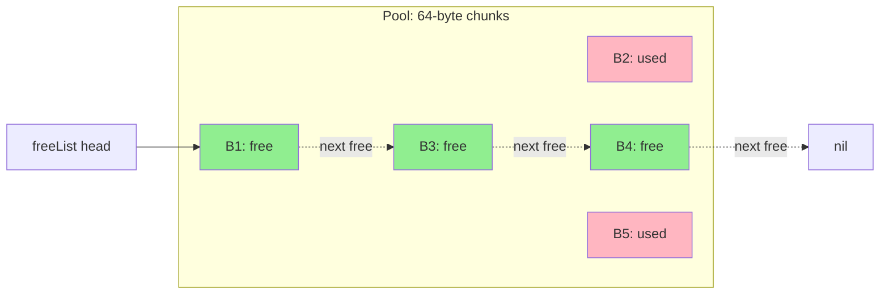
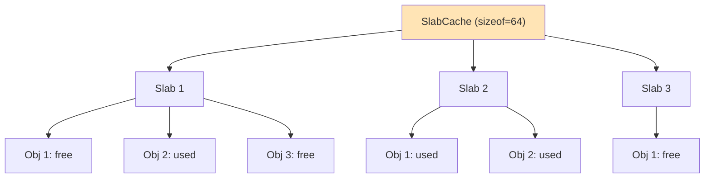
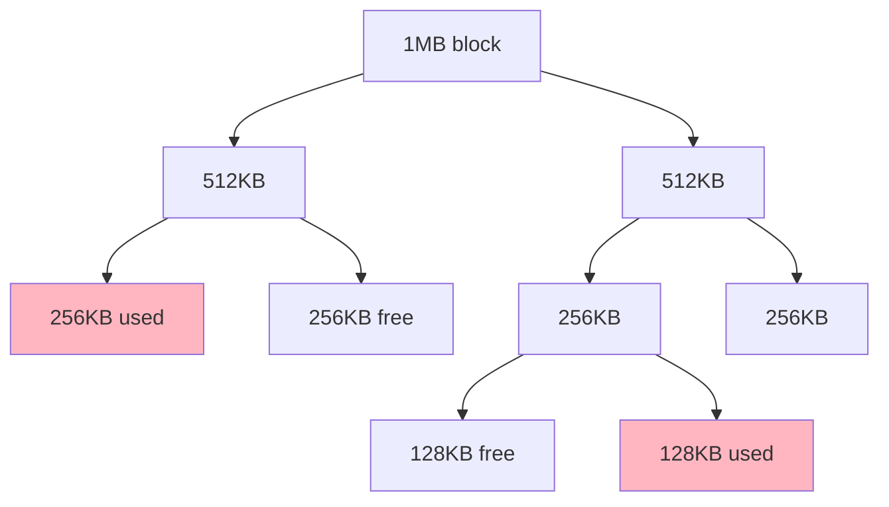
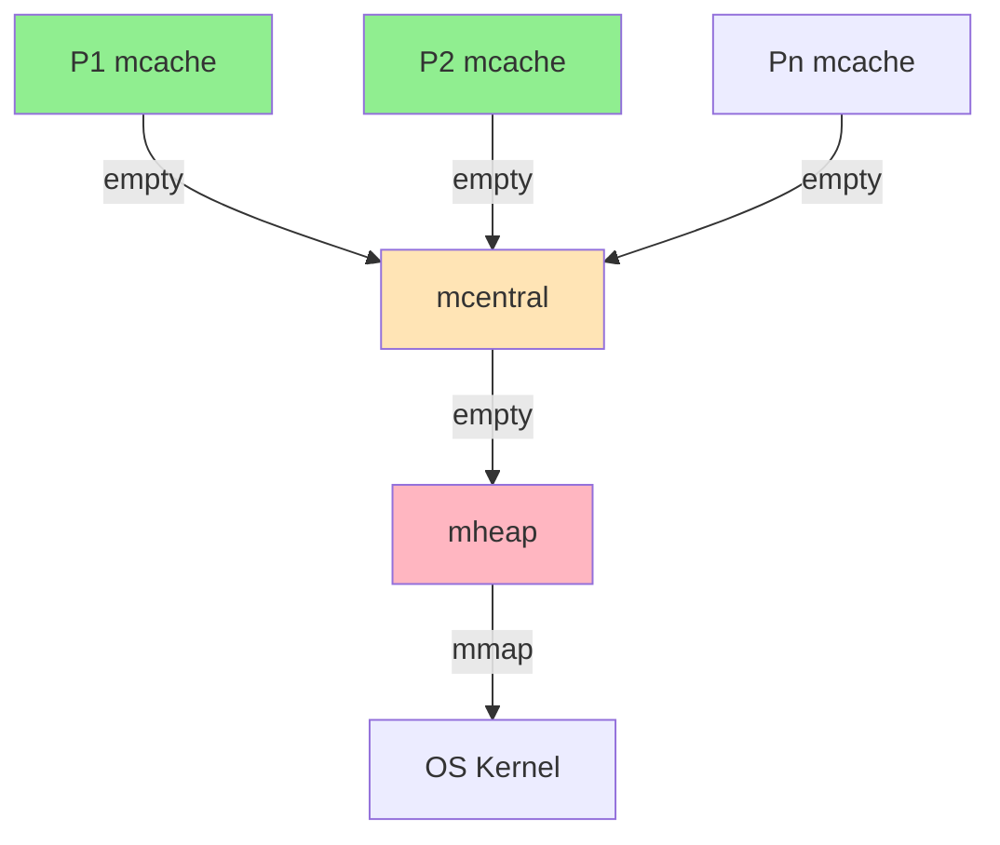

## Bosqich 2: Xotira boshqaruvi (Allocators)

### 2.1. Bump Allocator (Arena)

#### Tushuncha
Eng oddiy allocator: pointer'ni oldinga "bump" qiladi (suradi), free qilmaydi (faqat hammasini birga `Reset`).



#### Misol kod

```go
package bump

import "unsafe"

type Arena struct {
    buf    []byte
    offset uintptr
}

func New(size int) *Arena {
    return &Arena{buf: make([]byte, size)}
}

// Alloc — n bayt ajratish, alignment bilan
func (a *Arena) Alloc(n, align uintptr) unsafe.Pointer {
    // align ga rounded
    offset := (a.offset + align - 1) &^ (align - 1)
    if offset+n > uintptr(len(a.buf)) {
        return nil // joy yo'q
    }
    ptr := unsafe.Add(unsafe.Pointer(&a.buf[0]), offset)
    a.offset = offset + n
    return ptr
}

// Reset — hammasini o'chirish (free emas)
func (a *Arena) Reset() {
    a.offset = 0
}

// Generic helper
func Alloc[T any](a *Arena) *T {
    var zero T
    size := unsafe.Sizeof(zero)
    align := unsafe.Alignof(zero)
    ptr := a.Alloc(size, align)
    return (*T)(ptr)
}
```

#### Foydalanish

```go
arena := bump.New(1 << 20) // 1MB
type Node struct{ x, y int }
n := bump.Alloc[Node](arena)
n.x = 10
n.y = 20
arena.Reset() // hammasi bekor
```

### 2.2. Stack Allocator

LIFO tartibida free. Faqat oxirgi ajratilgan bloklarni qaytarish mumkin.

```go
type StackAlloc struct {
    buf    []byte
    offset uintptr
    marks  []uintptr // checkpoints
}

func (s *StackAlloc) Mark() int {
    s.marks = append(s.marks, s.offset)
    return len(s.marks) - 1
}

func (s *StackAlloc) Restore(mark int) {
    s.offset = s.marks[mark]
    s.marks = s.marks[:mark]
}
```

### 2.3. Pool Allocator (fixed-size blocks)

Bir xil o'lchamli bloklarni boshqaradi. Tez (free list orqali).



```go
type Pool struct {
    buf       []byte
    blockSize uintptr
    free      unsafe.Pointer // next free block
}

func NewPool(blockSize, count int) *Pool {
    p := &Pool{
        buf:       make([]byte, blockSize*count),
        blockSize: uintptr(blockSize),
    }
    // free list yasash
    var prev unsafe.Pointer
    for i := count - 1; i >= 0; i-- {
        cur := unsafe.Add(unsafe.Pointer(&p.buf[0]), uintptr(i)*p.blockSize)
        *(*unsafe.Pointer)(cur) = prev
        prev = cur
    }
    p.free = prev
    return p
}

func (p *Pool) Alloc() unsafe.Pointer {
    if p.free == nil {
        return nil
    }
    block := p.free
    p.free = *(*unsafe.Pointer)(block)
    return block
}

func (p *Pool) Free(ptr unsafe.Pointer) {
    *(*unsafe.Pointer)(ptr) = p.free
    p.free = ptr
}
```

### 2.4. Free List Allocator (variable-size)

Turli o'lchamli bloklarni boshqaradi. Fragmentatsiya muammosi paydo bo'ladi.

**Strategiyalar:**
- **First Fit** — birinchi mos joy
- **Best Fit** — eng mos (eng kichik) joy
- **Worst Fit** — eng katta joy

### 2.5. Slab Allocator (Linux kernel uslubi)

Object cache: bir xil tip uchun fixed pool.



### 2.6. Buddy Allocator (power-of-2 bloklar)

Bloklarni 2 ga bo'lib (split) yoki birga qo'shib (coalesce) ishlaydi.



### 2.7. TCMalloc-style (Go runtime kabi)

3 darajali allocator:
1. **mcache** — har bir P uchun (lock-free)
2. **mcentral** — global (size class bo'yicha)
3. **mheap** — OS dan oladi (mmap)



> Bu eng murakkab. Bosqich 8'da chuqur ko'rib chiqamiz.

