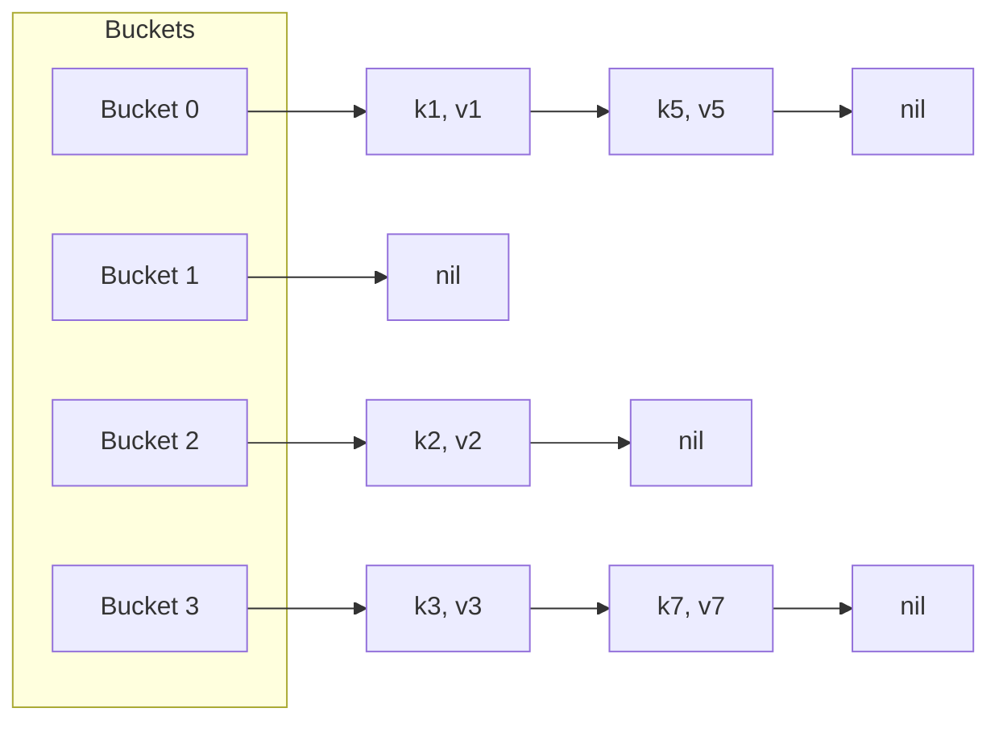
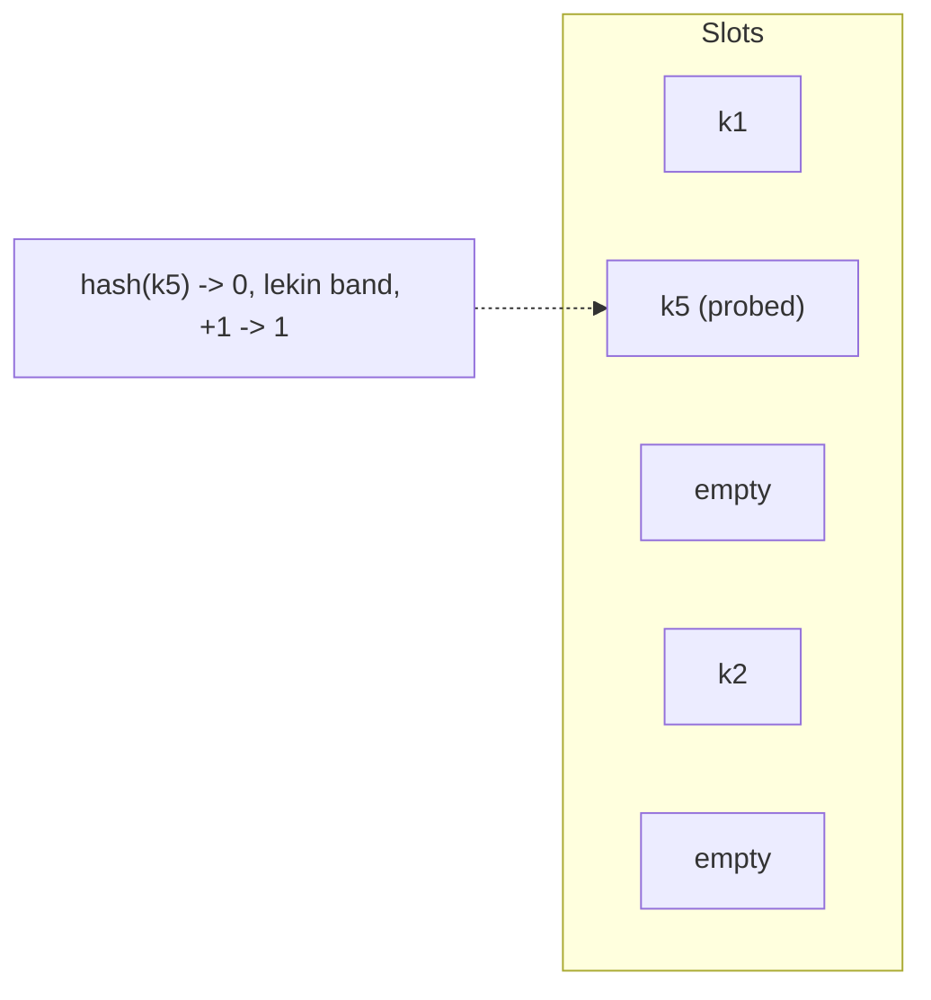
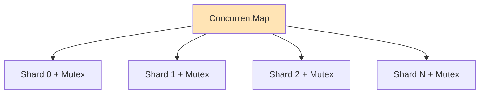
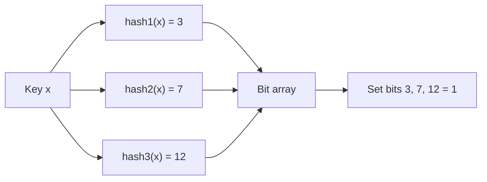

## Bosqich 3: Hash strukturalar

### 3.1. Hash Map (Chained — separate chaining)



```go
type Bucket[K comparable, V any] struct {
    key  K
    val  V
    next *Bucket[K, V]
}

type HashMap[K comparable, V any] struct {
    buckets []*Bucket[K, V]
    size    int
    hash    func(K) uint64
}

func (m *HashMap[K, V]) Get(k K) (V, bool) {
    h := m.hash(k) % uint64(len(m.buckets))
    for b := m.buckets[h]; b != nil; b = b.next {
        if b.key == k {
            return b.val, true
        }
    }
    var zero V
    return zero, false
}

func (m *HashMap[K, V]) Put(k K, v V) {
    h := m.hash(k) % uint64(len(m.buckets))
    for b := m.buckets[h]; b != nil; b = b.next {
        if b.key == k {
            b.val = v
            return
        }
    }
    m.buckets[h] = &Bucket[K, V]{key: k, val: v, next: m.buckets[h]}
    m.size++
    if m.size > len(m.buckets)*8 {
        m.resize()
    }
}
```

### 3.2. Hash Map (Open Addressing — Linear Probing)

Go map'ning eski versiyalari shunday ishlagan. Endi Swiss Tables.



### 3.3. Robin Hood Hashing

"Adolatli" probe distance: kim ko'p uzoq probe qilgan bo'lsa, o'rnini saqlaydi.

### 3.4. Cuckoo Hashing

Ikki hash funksiya, guaranteed O(1) lookup.

### 3.5. Concurrent Hash Map (Sharded)



```go
const N = 32

type ConcurrentMap[V any] struct {
    shards [N]struct {
        mu sync.RWMutex
        m  map[string]V
    }
}

func (c *ConcurrentMap[V]) shard(k string) *struct {
    mu sync.RWMutex
    m  map[string]V
} {
    h := fnv.New64a()
    h.Write([]byte(k))
    return &c.shards[h.Sum64()%N]
}

func (c *ConcurrentMap[V]) Get(k string) (V, bool) {
    s := c.shard(k)
    s.mu.RLock()
    defer s.mu.RUnlock()
    v, ok := s.m[k]
    return v, ok
}
```

### 3.6. Bloom Filter

Probabilistic data structure: "balki bor" yoki "aniq yo'q".



```go
type BloomFilter struct {
    bits  *BitSet
    k     int // hash funksiya soni
    seeds []uint64
}

func (b *BloomFilter) Add(s string) {
    for _, seed := range b.seeds {
        h := hashWith(seed, s) % uint64(b.bits.size)
        b.bits.Set(int(h))
    }
}

func (b *BloomFilter) MayContain(s string) bool {
    for _, seed := range b.seeds {
        h := hashWith(seed, s) % uint64(b.bits.size)
        if !b.bits.Get(int(h)) {
            return false // aniq yo'q
        }
    }
    return true // balki bor
}
```

