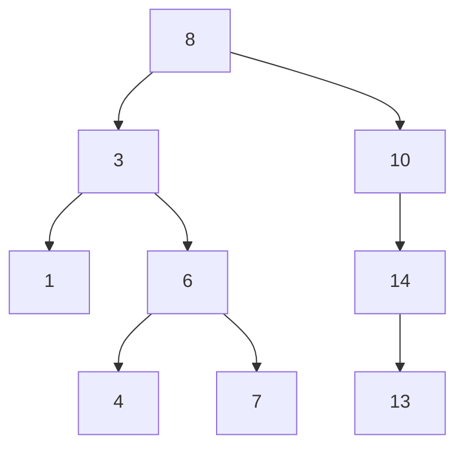
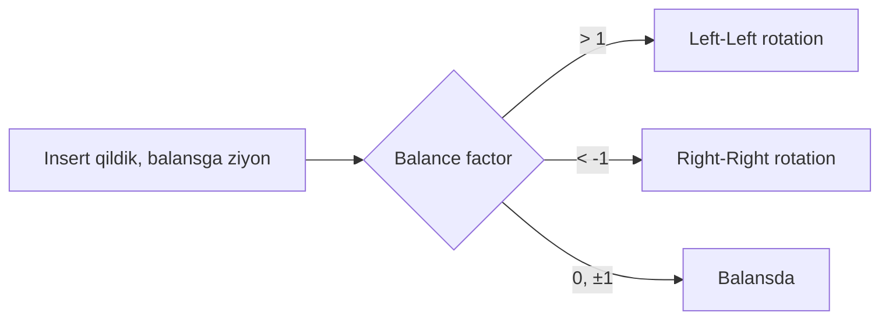
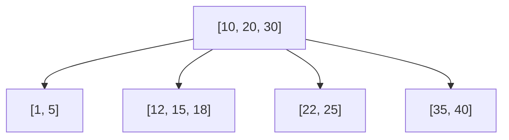
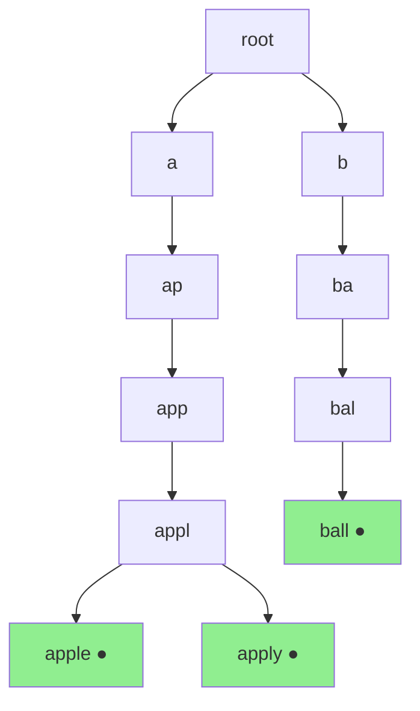
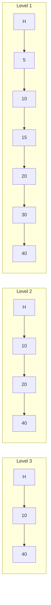

## Bosqich 4: Tree strukturalar

### 4.1. Binary Search Tree (BST)



```go
type BSTNode[T constraints.Ordered] struct {
    val   T
    left  *BSTNode[T]
    right *BSTNode[T]
}

func (n *BSTNode[T]) Insert(v T) *BSTNode[T] {
    if n == nil {
        return &BSTNode[T]{val: v}
    }
    if v < n.val {
        n.left = n.left.Insert(v)
    } else if v > n.val {
        n.right = n.right.Insert(v)
    }
    return n
}

func (n *BSTNode[T]) Contains(v T) bool {
    if n == nil {
        return false
    }
    if v == n.val {
        return true
    }
    if v < n.val {
        return n.left.Contains(v)
    }
    return n.right.Contains(v)
}
```

### 4.2. AVL Tree (self-balancing)

Balance factor: `height(left) - height(right)`. |bf| <= 1 bo'lishi shart. Aks holda — rotation.



### 4.3. Red-Black Tree

5 ta qoidaga rioya qilgan self-balancing BST. Linux kernel `rb_tree`, Java `TreeMap`, Go map (eski versiyalarda).

### 4.4. B-Tree

Disk uchun mo'ljallangan. Bir node'da ko'p kalit. Database'lar (PostgreSQL, MySQL) ishlatadi.



### 4.5. B+ Tree

B-Tree + linked list barglarda. SQL `range scan` uchun. **bbolt** ishlatadi.

### 4.6. Trie / Radix Tree

String prefix qidirish. `etcd`, IP routing.



### 4.7. Skip List

Probabilistik balanced struktura. Redis (sorted set) ishlatadi.



