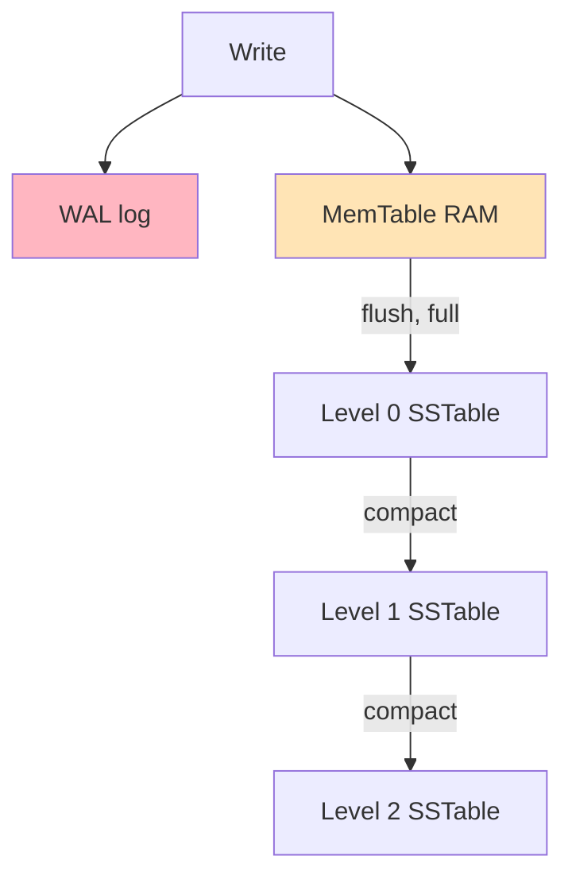
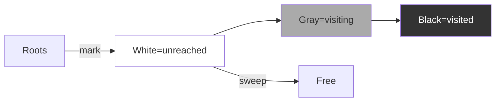

## Bosqich 5: Advanced

### 5.1. Lock-free Queue (Michael-Scott)

CAS bilan thread-safe FIFO queue.

```go
type lfQueue[T any] struct {
    head atomic.Pointer[node[T]]
    tail atomic.Pointer[node[T]]
}

type node[T any] struct {
    val  T
    next atomic.Pointer[node[T]]
}

func (q *lfQueue[T]) Enqueue(v T) {
    n := &node[T]{val: v}
    for {
        tail := q.tail.Load()
        next := tail.next.Load()
        if next == nil {
            if tail.next.CompareAndSwap(nil, n) {
                q.tail.CompareAndSwap(tail, n)
                return
            }
        } else {
            q.tail.CompareAndSwap(tail, next)
        }
    }
}
```

### 5.2. Lock-free Stack (Treiber)

```go
type lfStack[T any] struct {
    top atomic.Pointer[node[T]]
}

func (s *lfStack[T]) Push(v T) {
    n := &node[T]{val: v}
    for {
        old := s.top.Load()
        n.next.Store(old)
        if s.top.CompareAndSwap(old, n) {
            return
        }
    }
}
```

### 5.3. Wait-free SPSC ring buffer

Single-Producer Single-Consumer. Eng tez. LMAX Disruptor.

### 5.4. Concurrent Skip List

Java `ConcurrentSkipListMap`, Redis Sorted Set.

### 5.5. LSM Tree (Log-Structured Merge)

LevelDB, RocksDB, BadgerDB, Cassandra ishlatadi.



### 5.6. Custom Garbage Collector

Bosqichlar:
1. **Mark-Sweep** — eng oddiy
2. **Copying GC** — yarmiga ko'chirish
3. **Generational** — yosh va keksa avlod
4. **Concurrent GC** — Go ishlatadi (tricolor)



### 5.7. Reference Counting

Har obyektda `refCount`. 0 ga tushganda free. Cycles muammosi.

```go
type RefCounted[T any] struct {
    val   T
    count atomic.Int32
}

func (r *RefCounted[T]) Acquire() {
    r.count.Add(1)
}

func (r *RefCounted[T]) Release() {
    if r.count.Add(-1) == 0 {
        // free qilish
    }
}
```

---

