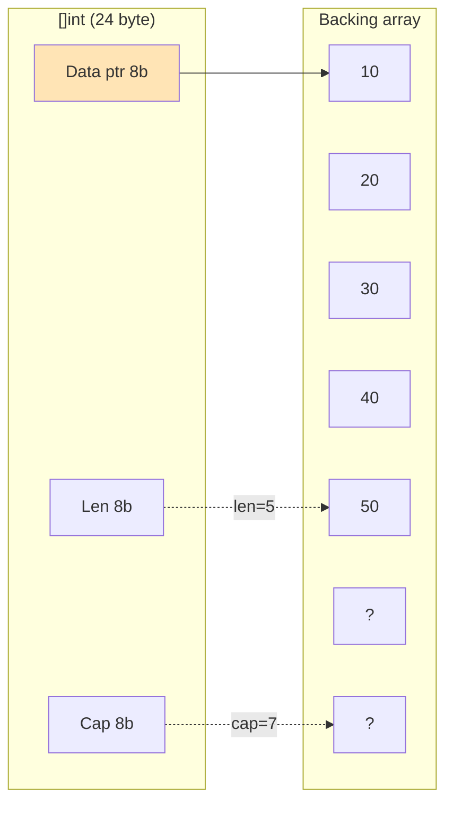

# 6. Slice ichki ishlash mexanizmi (chuqur bo'lim)

## 6.1. SliceHeader strukturasi

Go'da `[]T` aslida quyidagi struct:

```go
type SliceHeader struct {
    Data uintptr // pointer asl arrayga
    Len  int     // hozirgi uzunlik
    Cap  int     // sig'imi
}
```



## 6.2. Growth algoritm (Go versiyalari bo'yicha)

| Go versiyasi | Growth strategy |
|--------------|-----------------|
| < 1.18 | < 1024: 2x, >= 1024: 1.25x |
| 1.18+ | Smooth: > 256 dan boshlab gradualy 1.25x ga |

**Go 1.18+ kod (`runtime/slice.go`):**
```go
newcap := old.cap
doublecap := newcap + newcap
if cap > doublecap {
    newcap = cap
} else {
    if old.cap < 256 {
        newcap = doublecap
    } else {
        for 0 < newcap && newcap < cap {
            newcap += (newcap + 3*256) / 4
        }
    }
}
```

## 6.3. `append` qanday ishlaydi

```mermaid
sequenceDiagram
    participant U as User code
    participant G as Go runtime
    participant H as Heap

    U->>G: append(s, x)
    G->>G: len(s) < cap(s)?
    alt len < cap
        G->>U: s[len] = x; len++; (joyida)
    else len == cap
        G->>G: newCap = grow(cap)
        G->>H: malloc(newCap)
        H-->>G: yangi pointer
        G->>G: copy(new, old)
        G->>U: yangi slice
    end
```

## 6.4. O'z slice'ingni `unsafe` bilan yozish

```go
package myslice

import (
    "unsafe"
)

// SliceHeader — Go'ning ichki ko'rinishi
type SliceHeader struct {
    Data unsafe.Pointer
    Len  int
    Cap  int
}

type MySlice[T any] struct {
    SliceHeader
}

// Make — yangi slice
func Make[T any](length, capacity int) MySlice[T] {
    if capacity < length {
        panic("cap < len")
    }
    var zero T
    elemSize := unsafe.Sizeof(zero)
    // backing array — bu yerda asl Go slice ishlatamiz GC uchun
    backing := make([]T, capacity)
    _ = elemSize

    return MySlice[T]{
        SliceHeader: SliceHeader{
            Data: unsafe.Pointer(unsafe.SliceData(backing)),
            Len:  length,
            Cap:  capacity,
        },
    }
}

// Get — i-element
func (s MySlice[T]) Get(i int) T {
    if i < 0 || i >= s.Len {
        panic("out of range")
    }
    var zero T
    elemSize := unsafe.Sizeof(zero)
    p := unsafe.Add(s.Data, uintptr(i)*elemSize)
    return *(*T)(p)
}

// Set — i-elementga yozish
func (s MySlice[T]) Set(i int, v T) {
    if i < 0 || i >= s.Len {
        panic("out of range")
    }
    var zero T
    elemSize := unsafe.Sizeof(zero)
    p := unsafe.Add(s.Data, uintptr(i)*elemSize)
    *(*T)(p) = v
}

// Append — qo'shish
func (s MySlice[T]) Append(v T) MySlice[T] {
    if s.Len == s.Cap {
        // grow
        newCap := s.Cap * 2
        if newCap == 0 {
            newCap = 4
        }
        newSlice := Make[T](s.Len, newCap)
        for i := 0; i < s.Len; i++ {
            newSlice.Set(i, s.Get(i))
        }
        s = newSlice
    }
    s.Len++
    s.Set(s.Len-1, v)
    return s
}
```

## 6.5. Tezlik trick'lari

- **Pre-allocate:** `make([]int, 0, 100)` — capacity oldindan
- **Avoid copy:** `s = s[:len(s)+1]` faqat capacity bo'lsa
- **Reuse:** `s = s[:0]` — buffer'ni qayta ishlatish

---

