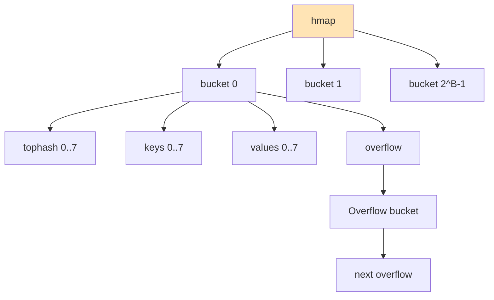
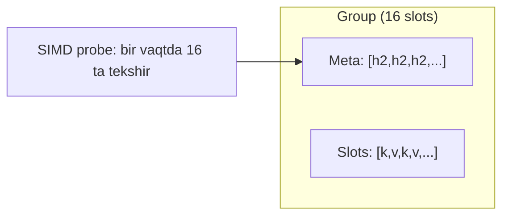
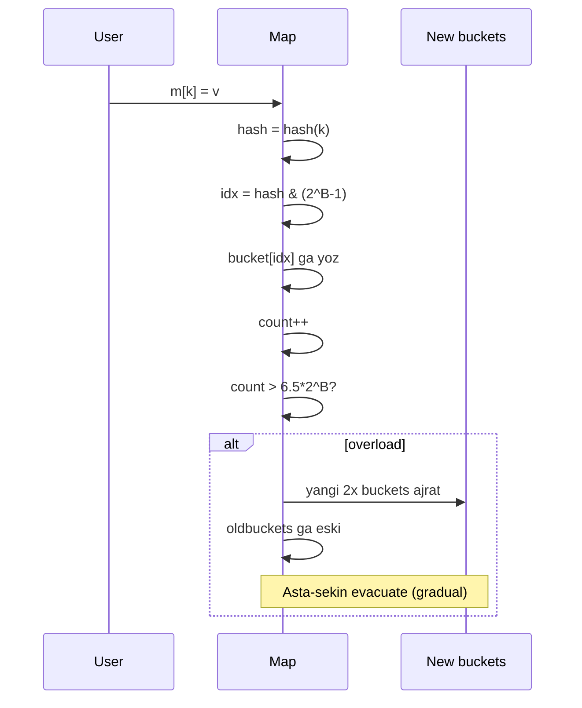

# 7. Map ichki ishlash mexanizmi (chuqur bo'lim)

## 7.1. Eski Go (< 1.24): `hmap` va `bmap`

```go
type hmap struct {
    count     int    // elementlar soni
    flags     uint8
    B         uint8  // log2(buckets soni)
    noverflow uint16
    hash0     uint32 // hash seed
    buckets   unsafe.Pointer // 2^B ta bucket
    oldbuckets unsafe.Pointer // resize chog'ida
    nevacuate uintptr
    extra     *mapextra
}

type bmap struct {
    tophash [8]uint8 // hash'ning yuqori 8 biti
    keys    [8]K
    values  [8]V
    overflow *bmap // overflow bucket
}
```



## 7.2. Go 1.24+: Swiss Tables

Go 1.24 dan boshlab map Swiss Tables ga o'tdi. Asosiy g'oya:
- **Group** (16 slot) — bitta cache line
- **SIMD probe** — bir vaqtda 16 slot tekshirish
- **Metadata array** — 1 byte har slot



## 7.3. Hash, Evacuation, Resize



## 7.4. O'z map'ingni implement qilish

```go
package mymap

import (
    "hash/maphash"
    "unsafe"
)

const bucketSize = 8

type bucket[K comparable, V any] struct {
    tophash  [bucketSize]uint8
    keys     [bucketSize]K
    values   [bucketSize]V
    overflow *bucket[K, V]
}

type Map[K comparable, V any] struct {
    seed    maphash.Seed
    buckets []bucket[K, V]
    count   int
    B       uint8
}

func New[K comparable, V any]() *Map[K, V] {
    return &Map[K, V]{
        seed:    maphash.MakeSeed(),
        buckets: make([]bucket[K, V], 1),
        B:       0,
    }
}

func (m *Map[K, V]) hash(k K) uint64 {
    var h maphash.Hash
    h.SetSeed(m.seed)
    // K ni byte ga aylantirish — bu yerda soddalashtirildi
    // Real implementatsiya tip-specific bo'lishi kerak
    bytes := unsafe.Slice((*byte)(unsafe.Pointer(&k)), unsafe.Sizeof(k))
    h.Write(bytes)
    return h.Sum64()
}

func (m *Map[K, V]) Get(k K) (V, bool) {
    h := m.hash(k)
    idx := h & ((1 << m.B) - 1)
    top := uint8(h >> 56)
    if top < 1 {
        top = 1
    }

    for b := &m.buckets[idx]; b != nil; b = b.overflow {
        for i := 0; i < bucketSize; i++ {
            if b.tophash[i] == top && b.keys[i] == k {
                return b.values[i], true
            }
        }
    }
    var zero V
    return zero, false
}

func (m *Map[K, V]) Put(k K, v V) {
    h := m.hash(k)
    idx := h & ((1 << m.B) - 1)
    top := uint8(h >> 56)
    if top < 1 {
        top = 1
    }

    b := &m.buckets[idx]
    for {
        for i := 0; i < bucketSize; i++ {
            if b.tophash[i] == 0 {
                b.tophash[i] = top
                b.keys[i] = k
                b.values[i] = v
                m.count++
                return
            }
            if b.tophash[i] == top && b.keys[i] == k {
                b.values[i] = v
                return
            }
        }
        if b.overflow == nil {
            b.overflow = &bucket[K, V]{}
        }
        b = b.overflow
    }
}
```

> **Eslatma:** Bu juda soddalashtirilgan. Real Go map'da resize, evacuation, race detection bor.

---

