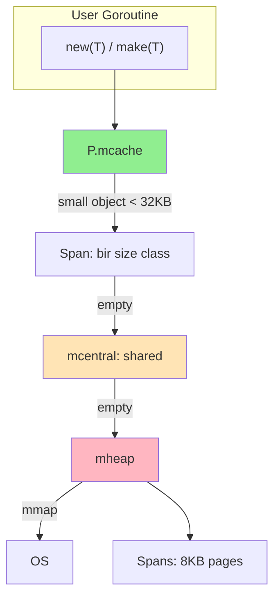

# 8. Allocator implementatsiyasi (chuqur bo'lim)

## 8.1. mmap orqali xotira olish

```go
package allocator

import (
    "syscall"
    "unsafe"
)

type Region struct {
    base unsafe.Pointer
    size uintptr
}

func MmapRegion(size uintptr) (*Region, error) {
    data, err := syscall.Mmap(
        -1, 0, int(size),
        syscall.PROT_READ|syscall.PROT_WRITE,
        syscall.MAP_ANON|syscall.MAP_PRIVATE,
    )
    if err != nil {
        return nil, err
    }
    return &Region{
        base: unsafe.Pointer(&data[0]),
        size: size,
    }, nil
}

func (r *Region) Free() error {
    bytes := unsafe.Slice((*byte)(r.base), r.size)
    return syscall.Munmap(bytes)
}
```

## 8.2. Pointer arithmetic

```go
// Base + offset = yangi pointer
ptr := unsafe.Add(r.base, offset)

// 2 ta pointer orasidagi masofa
diff := uintptr(p2) - uintptr(p1)

// Alignment ga rounded
aligned := (offset + alignment - 1) &^ (alignment - 1)
```

## 8.3. Alignment muammolari

CPU'lar ko'pincha aligned access talab qiladi:
- `int32` — 4-byte aligned
- `int64` — 8-byte aligned
- struct — eng katta maydon alignment

```go
func align(n, a uintptr) uintptr {
    return (n + a - 1) &^ (a - 1)
}

// Misol: 5 -> 8 (a=8 da)
// (5 + 7) & ^7 = 12 & ~7 = 12 & 11000... = 8
```

## 8.4. Go runtime allocator: mheap, mcache, mcentral



**Size classes:** Go ~70 ta size class ishlatadi (8, 16, 24, 32, 48, 64, ..., 32768). Har bir size class uchun alohida pool.

## 8.5. O'z allocator interfeysi

```go
package allocator

import "unsafe"

// Allocator — universal allocator interface
type Allocator interface {
    Alloc(size, align uintptr) unsafe.Pointer
    Free(ptr unsafe.Pointer, size uintptr)
    Reset()
    Stats() Stats
}

type Stats struct {
    TotalAllocated uintptr
    InUse          uintptr
    NumAllocs      uint64
    NumFrees       uint64
}

// Generic helper
func New[T any, A Allocator](a A) *T {
    var zero T
    size := unsafe.Sizeof(zero)
    align := unsafe.Alignof(zero)
    ptr := a.Alloc(size, align)
    if ptr == nil {
        return nil
    }
    return (*T)(ptr)
}

func Delete[T any, A Allocator](a A, p *T) {
    var zero T
    size := unsafe.Sizeof(zero)
    a.Free(unsafe.Pointer(p), size)
}
```

## 8.6. Misol: Pool + Bump kombinatsiyasi (Slab)

```go
type SlabAllocator struct {
    classes [32]*Pool // size class bo'yicha
    fallback *Region   // katta uchun mmap
}

func (s *SlabAllocator) Alloc(size, align uintptr) unsafe.Pointer {
    class := sizeClass(size)
    if class >= 32 {
        return s.fallback.Alloc(size, align)
    }
    return s.classes[class].Alloc()
}

func sizeClass(size uintptr) int {
    // Round up to power of 2
    if size <= 8 { return 0 }
    if size <= 16 { return 1 }
    if size <= 32 { return 2 }
    // ...
    return 31
}
```

---

