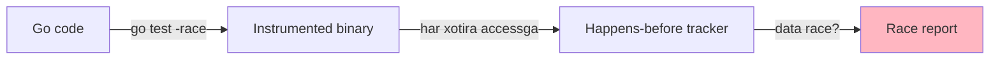

# 9. Testing va Benchmarking

## 9.1. Unit test

```go
func TestMyMap(t *testing.T) {
    t.Run("empty", func(t *testing.T) {
        m := New[string, int]()
        _, ok := m.Get("foo")
        if ok {
            t.Error("empty map should not have keys")
        }
    })

    t.Run("put-get", func(t *testing.T) {
        m := New[string, int]()
        m.Put("a", 1)
        v, ok := m.Get("a")
        if !ok || v != 1 {
            t.Errorf("got %v, %v; want 1, true", v, ok)
        }
    })
}
```

## 9.2. Property-based testing

```go
import "testing/quick"

func TestMapProperty(t *testing.T) {
    f := func(keys []string, values []int) bool {
        if len(keys) != len(values) {
            return true // skip
        }
        m := New[string, int]()
        std := make(map[string]int)
        for i, k := range keys {
            m.Put(k, values[i])
            std[k] = values[i]
        }
        for k, v := range std {
            got, ok := m.Get(k)
            if !ok || got != v {
                return false
            }
        }
        return true
    }
    if err := quick.Check(f, nil); err != nil {
        t.Error(err)
    }
}
```

## 9.3. Benchmark

```go
func BenchmarkMyMap_Put(b *testing.B) {
    m := New[int, int]()
    b.ResetTimer()
    b.ReportAllocs()
    for i := 0; i < b.N; i++ {
        m.Put(i, i)
    }
}

func BenchmarkStdMap_Put(b *testing.B) {
    m := make(map[int]int)
    b.ResetTimer()
    b.ReportAllocs()
    for i := 0; i < b.N; i++ {
        m[i] = i
    }
}
```

**Ishga tushirish:**
```bash
go test -bench=. -benchmem -count=10 > bench.txt
benchstat bench.txt
```

## 9.4. Profiling

```bash
# CPU profile
go test -bench=. -cpuprofile=cpu.prof
go tool pprof -http=:8080 cpu.prof

# Memory profile
go test -bench=. -memprofile=mem.prof
go tool pprof mem.prof

# Trace
go test -bench=. -trace=trace.out
go tool trace trace.out
```

## 9.5. Memory leak topish

```go
func TestNoLeak(t *testing.T) {
    var m1, m2 runtime.MemStats
    runtime.GC()
    runtime.ReadMemStats(&m1)

    for i := 0; i < 1000; i++ {
        m := New[string, int]()
        for j := 0; j < 100; j++ {
            m.Put(fmt.Sprintf("key%d", j), j)
        }
        // m chiqmasin
    }

    runtime.GC()
    runtime.ReadMemStats(&m2)

    diff := m2.HeapAlloc - m1.HeapAlloc
    if diff > 1<<20 { // 1MB dan ko'p
        t.Errorf("possible leak: %d bytes", diff)
    }
}
```

## 9.6. Race detector

```bash
go test -race ./...
```

Concurrent strukturalar uchun shart!



---

