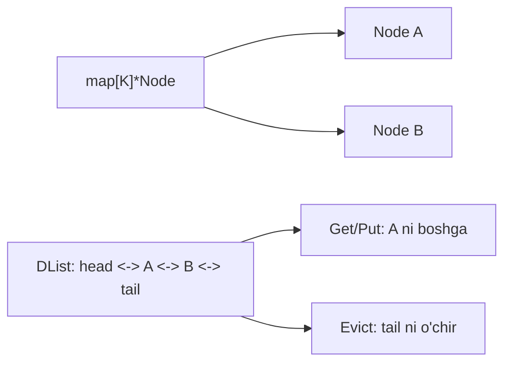

# 10. Loyiha amaliyoti (Hands-on Projects)

## 10.1. Mini-Go runtime

**Maqsad:** O'z slice + map + channel implementatsiyasi.

**Bosqichlar:**
1. `myslice` paketi — append, copy, slicing
2. `mymap` paketi — Put, Get, Delete, Iterate
3. `mychan` paketi — buffered/unbuffered channel
4. Hammasi bilan `mini-runtime` integration test

## 10.2. In-memory cache (LRU, LFU)

**LRU (Least Recently Used):** doubly linked list + map



```go
type LRU[K comparable, V any] struct {
    cap   int
    m     map[K]*lruNode[K, V]
    head  *lruNode[K, V]
    tail  *lruNode[K, V]
}

type lruNode[K comparable, V any] struct {
    key  K
    val  V
    prev *lruNode[K, V]
    next *lruNode[K, V]
}
```

## 10.3. Mini Redis klonu

**Featurelari:**
- String: GET, SET, INCR
- List: LPUSH, RPUSH, LRANGE
- Hash: HSET, HGET
- Set: SADD, SMEMBERS
- Sorted Set: ZADD, ZRANGE (Skip List)
- TTL (expiration)
- Persistence (AOF / snapshot)

**Componentlar:**
- TCP server (`net` paket)
- RESP protocol parser
- Custom data strukturalar (loyihada yozganingiz)

## 10.4. Mini-allocator with profiler

```go
type ProfilingAllocator struct {
    inner Allocator
    stats sync.Map // size -> count
}

func (p *ProfilingAllocator) Alloc(size, align uintptr) unsafe.Pointer {
    p.stats.LoadOrStore(size, new(atomic.Int64))
    if v, ok := p.stats.Load(size); ok {
        v.(*atomic.Int64).Add(1)
    }
    return p.inner.Alloc(size, align)
}
```

## 10.5. Toy Garbage Collector

**Mark-Sweep simulator:**

```go
type GC struct {
    objects map[unsafe.Pointer]*Object
    roots   []unsafe.Pointer
}

type Object struct {
    refs   []unsafe.Pointer
    marked bool
}

func (g *GC) Mark() {
    var stack []unsafe.Pointer
    stack = append(stack, g.roots...)
    for len(stack) > 0 {
        p := stack[len(stack)-1]
        stack = stack[:len(stack)-1]
        obj := g.objects[p]
        if obj == nil || obj.marked {
            continue
        }
        obj.marked = true
        stack = append(stack, obj.refs...)
    }
}

func (g *GC) Sweep() {
    for p, obj := range g.objects {
        if !obj.marked {
            delete(g.objects, p)
        } else {
            obj.marked = false // keyingi GC uchun
        }
    }
}
```

---

