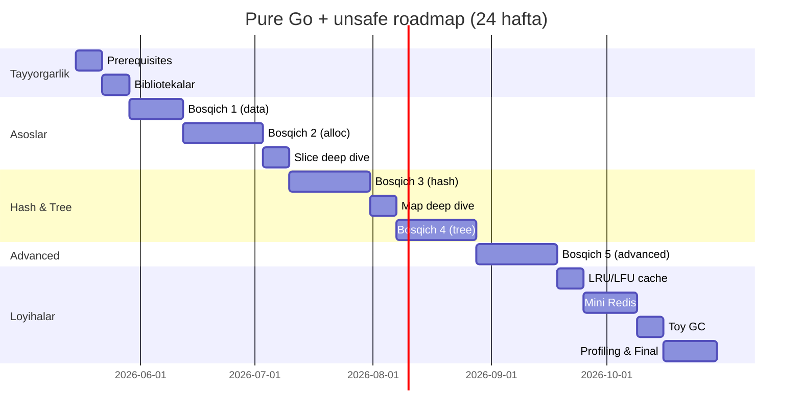

# 11. Vaqt jadvali (Timeline)

> Asos: kuniga **2-3 soat**, haftada **6 kun**

| Hafta | Bosqich | Mavzu |
|-------|---------|-------|
| 1 | Prerequisites | Memory, OS, pointer (qaytarish) |
| 2 | Bibliotekalar | unsafe, reflect chuqur |
| 3 | Bosqich 1.1-1.3 | Linked list, Stack, Queue |
| 4 | Bosqich 1.4-1.5 | Vector, Bitset |
| 5 | Bosqich 2.1-2.3 | Bump, Stack, Pool allocator |
| 6 | Bosqich 2.4-2.5 | Free list, Slab |
| 7 | Bosqich 2.6-2.7 | Buddy, TCMalloc |
| 8 | Slice deep dive | SliceHeader, growth, o'z slice |
| 9 | Bosqich 3.1-3.2 | Hash Map (chained, open addr) |
| 10 | Bosqich 3.3-3.4 | Robin Hood, Cuckoo |
| 11 | Bosqich 3.5-3.6 | Concurrent map, Bloom filter |
| 12 | Map deep dive | hmap, bmap, Swiss Tables |
| 13 | Bosqich 4.1-4.3 | BST, AVL, Red-Black |
| 14 | Bosqich 4.4-4.5 | B-Tree, B+Tree |
| 15 | Bosqich 4.6-4.7 | Trie, Skip List |
| 16 | Bosqich 5.1-5.3 | Lock-free queue, stack, SPSC |
| 17 | Bosqich 5.4-5.5 | Concurrent skip list, LSM |
| 18 | Bosqich 5.6-5.7 | GC, Reference counting |
| 19 | Loyiha 1 | LRU + LFU cache |
| 20 | Loyiha 2 | Mini Redis (1-qism) |
| 21 | Loyiha 2 | Mini Redis (2-qism) |
| 22 | Loyiha 3 | Toy GC |
| 23 | Profiling | pprof, trace, optimization |
| 24 | Yakuniy | Source code o'qish (BadgerDB) |

**Jami:** ~6 oy intensiv o'rganish

---

