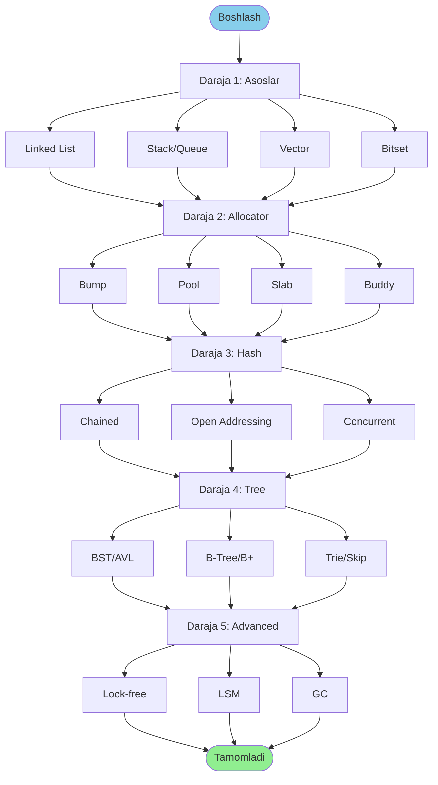
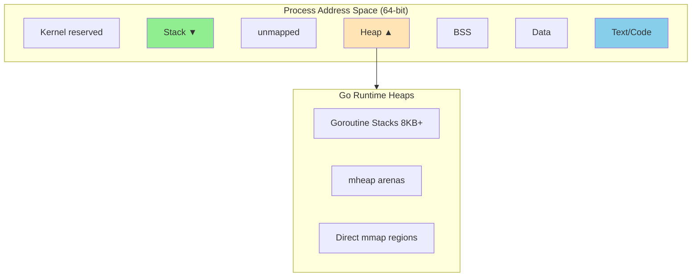
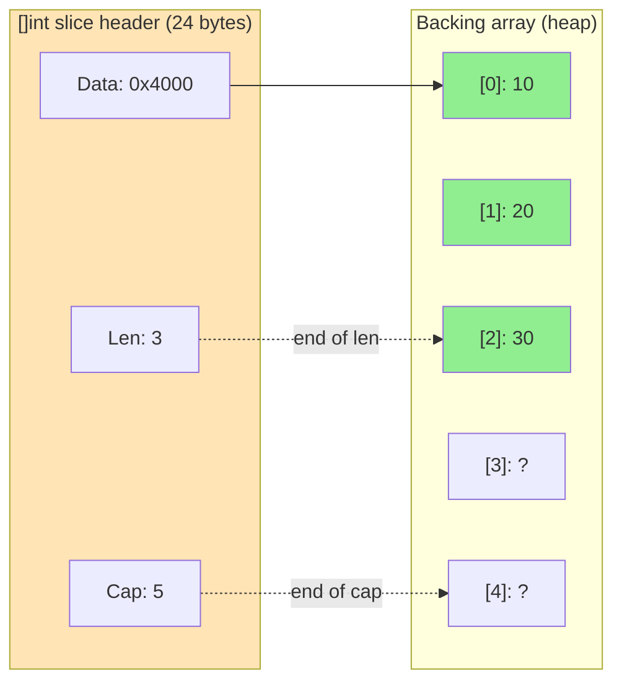
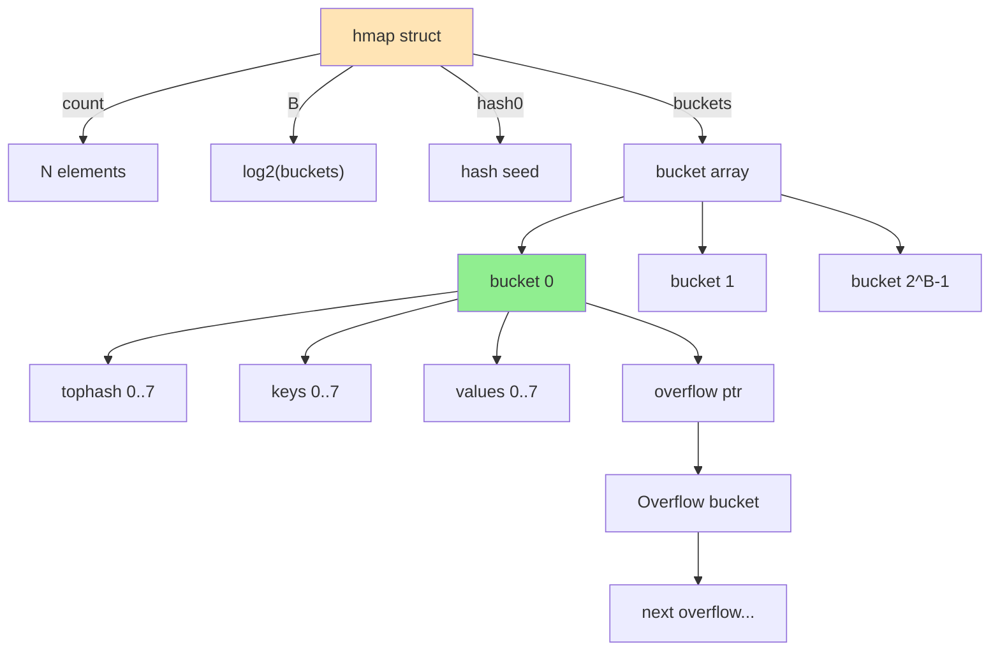
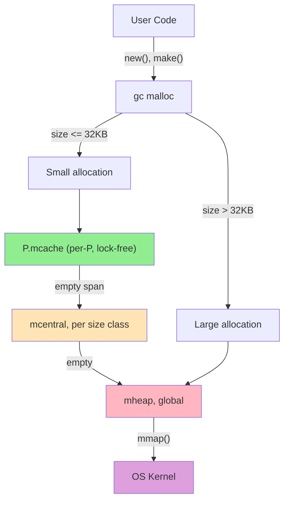
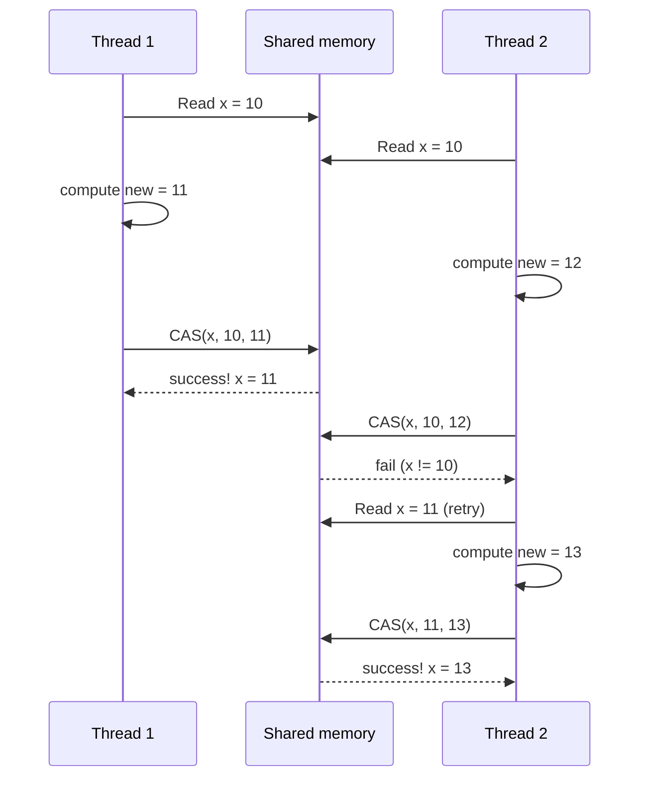
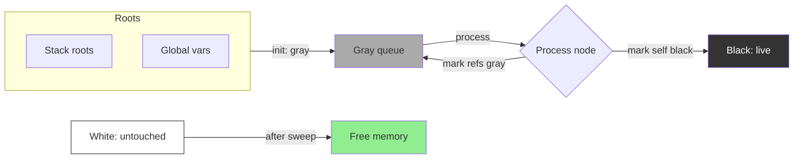
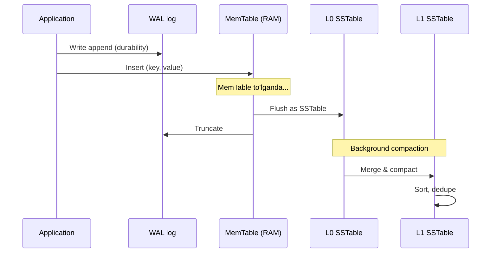

# 14. Diagrammalar to'plami

## 14.1. Umumiy yo'l xaritasi

## 14.2. Memory layout

## 14.3. Slice strukturasi

## 14.4. Map strukturasi (Go 1.18-1.23)

## 14.5. Allocator hierarchy (Go runtime)

## 14.6. Lock-free CAS algoritm

## 14.7. Garbage collector tricolor algoritm

## 14.8. LSM Tree write path

---

