# Pure Go + `unsafe` yo'li — Roadmap (bo'limlarga ajratilgan)

Go data type'larini (allocator, array, slice, map, tree va h.k.) **noldan** implement qilish uchun roadmap. Maqsad — Computer Science bilimlarini kuchaytirish.

> Asl to'liq fayl: [`../purego_unsafe.md`](../purego_unsafe.md) (3274 qator)
> Bu folder o'sha faylning **bo'limlarga ajratilgan** versiyasi.

## O'qish tartibi

| # | Fayl | Mavzu | Qisqacha |
|---|------|-------|----------|
| 1 | [01_kirish.md](01_kirish.md) | **Kirish va maqsad** | Nima uchun pure Go + unsafe, afzallik/kamchiliklar, kim uchun mos |
| 2 | [02_old_shartlar.md](02_old_shartlar.md) | **Old shartlar (Prerequisites)** | Go bilim darajasi, CS fundamentals, OS, kompilyator |
| 3 | [03_kutubxonalar.md](03_kutubxonalar.md) | **11 ta kutubxona** | `unsafe`, `reflect`, `runtime`, `sync/atomic`, `syscall` va boshqalar |
| 4 | [04_resurslar.md](04_resurslar.md) | **Tashqi resurslar** | Kitoblar, bloglar, repolar, YouTube |

### Data Type'larni implement qilish (5 bosqich)

| # | Fayl | Bosqich | Tarkibi |
|---|------|---------|---------|
| 5 | [05_bosqich_1_asoslar.md](05_bosqich_1_asoslar.md) | **Bosqich 1: Asoslar** | Linked List, Stack, Queue, Vector, Bitset |
| 6 | [06_bosqich_2_allocators.md](06_bosqich_2_allocators.md) | **Bosqich 2: Allocators** | Bump, Stack, Pool, Free List, Slab, Buddy, TCMalloc |
| 7 | [07_bosqich_3_hash.md](07_bosqich_3_hash.md) | **Bosqich 3: Hash strukturalar** | Chained, Open Addressing, Robin Hood, Cuckoo, Concurrent, Bloom |
| 8 | [08_bosqich_4_tree.md](08_bosqich_4_tree.md) | **Bosqich 4: Tree strukturalar** | BST, AVL, Red-Black, B-Tree, B+, Trie, Skip List |
| 9 | [09_bosqich_5_advanced.md](09_bosqich_5_advanced.md) | **Bosqich 5: Advanced** | Lock-free, SPSC, LSM, Custom GC, Reference counting |

### Chuqur bo'limlar (Deep Dives)

| # | Fayl | Mavzu | Qisqacha |
|---|------|-------|----------|
| 10 | [10_slice_deep_dive.md](10_slice_deep_dive.md) | **Slice ichki ishlash** | SliceHeader, growth, append, o'z slice'ing |
| 11 | [11_map_deep_dive.md](11_map_deep_dive.md) | **Map ichki ishlash** | hmap/bmap, Swiss Tables, evacuation |
| 12 | [12_allocator_deep_dive.md](12_allocator_deep_dive.md) | **Allocator implementatsiyasi** | mmap, alignment, mheap/mcache/mcentral |

### Amaliyot va boshqarish

| # | Fayl | Mavzu | Qisqacha |
|---|------|-------|----------|
| 13 | [13_testing_benchmarking.md](13_testing_benchmarking.md) | **Testing va Benchmark** | Unit test, property-based, pprof, race detector |
| 14 | [14_loyihalar.md](14_loyihalar.md) | **Hands-on loyihalar** | Mini-Go runtime, LRU/LFU, Mini Redis, Toy GC |
| 15 | [15_timeline.md](15_timeline.md) | **24 haftalik vaqt jadvali** | Gantt diagrammasi |
| 16 | [16_checklist.md](16_checklist.md) | **Tekshirish ro'yxati** | 60+ checkbox |
| 17 | [17_keyingi_qadamlar.md](17_keyingi_qadamlar.md) | **Keyingi qadamlar** | Solod, source code o'qish, open source |
| 18 | [18_diagrammalar.md](18_diagrammalar.md) | **Diagrammalar to'plami** | 8 ta katta Mermaid diagramma |
| 19 | [19_yakun.md](19_yakun.md) | **Yakuniy so'z** | Eslab qol, amaliyot, motivatsiya |

## Tavsiya etilgan o'qish yo'li

```mermaid
graph LR
    A[01 Kirish] --> B[02 Old shartlar]
    B --> C[03 Kutubxonalar]
    C --> D[04 Resurslar]
    D --> E[05 Bosqich 1]
    E --> F[06 Bosqich 2]
    F --> G[07 Bosqich 3]
    G --> H[08 Bosqich 4]
    H --> I[09 Bosqich 5]
    I --> J[10-12 Deep Dive]
    J --> K[13 Testing]
    K --> L[14 Loyihalar]
    L --> M[15-19 Yakun]
```

## Boshlash

1. [01_kirish.md](01_kirish.md) — nima uchun bu yo'lni tanlaganingni tushun
2. [02_old_shartlar.md](02_old_shartlar.md) — bilimlarni tekshir
3. [03_kutubxonalar.md](03_kutubxonalar.md) dan `unsafe` paketidan boshla
4. [05_bosqich_1_asoslar.md](05_bosqich_1_asoslar.md) — Linked List dan implement qilishni boshla
