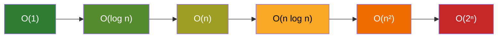

# Big O — Algoritm murakkabligi

**Big O** — algoritm tezligi (vaqt) va xotira sarfi kirish hajmi (**n**) o'sishi bilan qanday o'zgarishini ifodalovchi belgi. LeetCode'da har bir yechimdan keyin "bu yechimning time/space complexity'si qancha?" deb so'rash — eng muhim odat.

- **n** — algoritmga kiruvchi elementlar soni
- **Time complexity** — bajariladigan amallar soni qanday o'sadi
- **Space complexity** — qo'shimcha xotira qanday o'sadi

## Qiyosiy jadval

| Murakkablik | n=10 | n=100  | n=1000    | Tavsif              | Misol                          |
| ----------- | ---- | ------ | --------- | ------------------- | ------------------------------ |
| O(1)        | 1    | 1      | 1         | Doimiy vaqt         | Array'dan indeks bo'yicha o'qish, hash table lookup |
| O(log n)    | ~3   | ~7     | ~10       | Logarifmik          | Binary search                  |
| O(n)        | 10   | 100    | 1000      | Chiziqli            | Bitta for loop, linear search  |
| O(n log n)  | ~30  | ~700   | ~10,000   | Chiziqli-logarifmik | Merge sort, quick sort         |
| O(n²)       | 100  | 10,000 | 1,000,000 | Kvadratik           | Ichma-ich ikkita loop, bubble sort |
| O(2ⁿ)       | 1024 | juda katta | —     | Eksponensial        | Naive fibonacci rekursiyasi    |



Chapdan o'ngga — yaxshidan yomonga.

## Qoidalar

1. **Konstantalar tashlanadi**: O(2n) → O(n), O(n/2) → O(n)
2. **Kichik hadlar tashlanadi**: O(n² + n) → O(n²)
3. **Eng yomon holat** (worst case) asos qilib olinadi
4. Ketma-ket ikkita loop: O(n + n) = O(n). Ichma-ich ikkita loop: O(n · n) = O(n²)

## Go misolida

```go
// O(1) — kirish hajmiga bog'liq emas
func first(nums []int) int { return nums[0] }

// O(n) — har bir element bir marta ko'riladi
func sum(nums []int) int {
    total := 0
    for _, v := range nums { total += v }
    return total
}

// O(n²) — har bir element uchun yana n ta amal
func hasDuplicate(nums []int) bool {
    for i := 0; i < len(nums); i++ {
        for j := i + 1; j < len(nums); j++ {
            if nums[i] == nums[j] { return true }
        }
    }
    return false
}
```

## LeetCode'da amaliy qoida

Masala constraint'iga qarab kerakli murakkablikni taxmin qilish mumkin:

| n chegarasi | Kutilgan murakkablik |
| ----------- | -------------------- |
| n ≤ 20      | O(2ⁿ) ham bo'ladi (backtracking) |
| n ≤ 5000    | O(n²) o'tadi         |
| n ≤ 10⁵–10⁶ | O(n log n) yoki O(n) kerak |
| n ≥ 10⁷     | faqat O(n) yoki O(log n) |

> Agar brute-force yechiming O(n²) bo'lib TLE (Time Limit Exceeded) olsang — hash table, two pointers, binary search yoki prefix sum bilan O(n) / O(n log n) ga tushirish yo'lini qidir.
