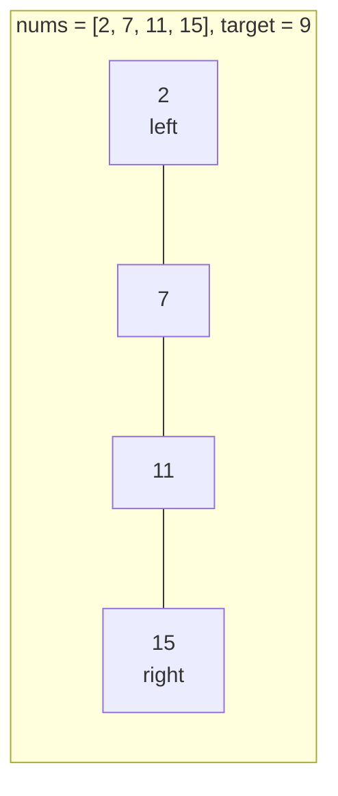

# Two Pointers (Ikki ko'rsatkich)

**Two pointers** — array yoki string bo'ylab **ikkita indeks** yuritish texnikasi. Brute-force O(n²) yechimlarni ko'pincha O(n) ga tushiradi, chunki har bir pointer array bo'ylab ko'pi bilan bir marta yuradi.

Tasavvur qil: kitob javonidan ikki kishi kitob qidiryapti — biri chapdan, biri o'ngdan. Har bir kitob faqat bir marta ko'riladi.

## 3 ta asosiy shakl

### 1. Qarama-qarshi uchlardan (converging)

Pointerlar ikki uchdan boshlanib bir-biriga qarab yuradi. **Tartiblangan array** va palindrom masalalarining klassik yechimi.

```go
// Two Sum II: tartiblangan arraydan yig'indisi target bo'lgan juftlik
func twoSum(numbers []int, target int) []int {
    left, right := 0, len(numbers)-1
    for left < right {
        sum := numbers[left] + numbers[right]
        switch {
        case sum == target:
            return []int{left + 1, right + 1}
        case sum < target:
            left++   // yig'indini oshirish kerak
        default:
            right--  // yig'indini kamaytirish kerak
        }
    }
    return nil
}
```



### 2. Sekin-tez (slow & fast, bir tomondan)

Ikkala pointer bir uchdan boshlanadi: `slow` — "yozish" pozitsiyasi, `fast` — "o'qish" pozitsiyasi. In-place o'zgartirish masalalarida (duplikat o'chirish, nol surish) ishlatiladi.

```go
// Move Zeroes: nollarni oxiriga surish, tartibni saqlab
func moveZeroes(nums []int) {
    slow := 0
    for fast := 0; fast < len(nums); fast++ {
        if nums[fast] != 0 {
            nums[slow], nums[fast] = nums[fast], nums[slow]
            slow++
        }
    }
}
```

Linked list'da esa `fast` ikki qadam, `slow` bir qadam yuradi — o'rtani yoki cycle'ni topish uchun (Floyd algoritmi, [Linked List](10.%20Linked%20List.md)).

### 3. Ikki alohida ketma-ketlikda

Har bir pointer o'z arrayida yuradi — ikkita tartiblangan arrayni birlashtirish (merge), taqqoslash.

```go
// Merge Sorted Array g'oyasi: oxiridan boshlab birlashtirish
i, j, k := m-1, n-1, m+n-1
for j >= 0 {
    if i >= 0 && nums1[i] > nums2[j] {
        nums1[k] = nums1[i]; i--
    } else {
        nums1[k] = nums2[j]; j--
    }
    k--
}
```

## Qachon ishlatasan? (signallar)

- Array **tartiblangan** va juftlik/uchlik qidirilyapti (Two Sum II, 3Sum)
- **Palindrom** tekshirish
- **In-place** o'zgartirish: duplikat o'chirish, elementlarni surish
- Ikkita tartiblangan strukturani **birlashtirish**
- "Eng katta idish/oraliq" tipidagi masala (Container With Most Water)

## Murakkablik

| | |
|---|---|
| Time | O(n) — har pointer ko'pi bilan n qadam |
| Space | O(1) — qo'shimcha struktura yo'q |

> **3Sum uchun eslatma:** avval arrayni tartibla (O(n log n)), keyin har bir element uchun qolgan qismda converging two pointers yurit — jami O(n²), lekin duplikatlarni o'tkazib yuborishni unutma.
