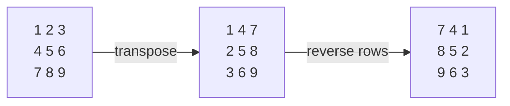

# Matrix (2D Array)

**Matrix** — ikki o'lchamli array: qatorlar (rows) va ustunlar (columns). Go'da `[][]int` sifatida ifodalanadi. `matrix[i][j]` — i-qator, j-ustun elementi.

```go
matrix := [][]int{
    {1, 2, 3},
    {4, 5, 6},
    {7, 8, 9},
}
rows, cols := len(matrix), len(matrix[0])
```

## Asosiy yurish shakllari

```go
// Qatorma-qator (row-major)
for i := 0; i < rows; i++ {
    for j := 0; j < cols; j++ { _ = matrix[i][j] }
}

// Asosiy diagonal: i == j          → matrix[i][i]
// Qarshi diagonal: i + j == n - 1  → matrix[i][n-1-i]
```

## Klassik amallar

### Transpose (qator ↔ ustun)

`matrix[i][j]` ↔ `matrix[j][i]`. Kvadrat matritsada in-place, faqat diagonaldan yuqorisini almashtirasan:

```go
for i := 0; i < n; i++ {
    for j := i + 1; j < n; j++ {
        matrix[i][j], matrix[j][i] = matrix[j][i], matrix[i][j]
    }
}
```

### Rotate 90° (soat yo'nalishida)

Formula: **transpose + har qatorni reverse**. Alohida xotirasiz, in-place ishlaydi.



### Spiral yurish

To'rtta chegara (`top`, `bottom`, `left`, `right`) yuritiladi; har aylanishda tashqi halqa o'qiladi va chegaralar ichkariga suriladi:

```go
top, bottom, left, right := 0, rows-1, 0, cols-1
for top <= bottom && left <= right {
    for j := left; j <= right; j++  { res = append(res, matrix[top][j]) }    // →
    top++
    for i := top; i <= bottom; i++  { res = append(res, matrix[i][right]) }  // ↓
    right--
    if top <= bottom {
        for j := right; j >= left; j-- { res = append(res, matrix[bottom][j]) } // ←
        bottom--
    }
    if left <= right {
        for i := bottom; i >= top; i-- { res = append(res, matrix[i][left]) }   // ↑
        left++
    }
}
```

## Qachon qanday texnika? (signallar)

| Masala turi | Texnika |
| ----------- | ------- |
| Diagonal yig'indi | `i == j` va `i+j == n-1` indekslari |
| 90° burish | transpose + reverse |
| Spiral | 4 ta chegara pointer |
| Har qator/ustun/kvadratda unikallikni tekshirish (Sudoku) | har biriga alohida hash set |
| Katakni qo'shnilariga qarab yangilash (Game of Life) | holatni kodlash yoki nusxa matritsa |
| Oraliq (submatrix) yig'indilar | [2D Prefix Sum](05.%20Prefix%20Sum.md) |

> **In-place o'zgartirish tuzog'i:** yangilanish paytida hali o'qilmagan eski qiymatlarni buzib qo'yma. Yechim — yo qo'shimcha nusxa, yo vaqtinchalik "oraliq holat" kodlash (masalan, Game of Life'da 2 = "tirik edi, o'ladi").
