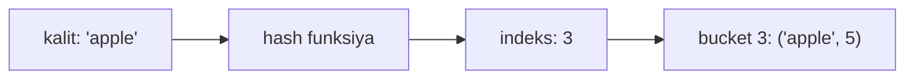

# Hash Table

**Hash table** — kalit-qiymat (key-value) juftliklarini saqlaydigan struktura. **Hash funksiya** kalitni array indeksiga aylantiradi, shuning uchun qidirish, qo'shish, o'chirish o'rtacha **O(1)**.

Tasavvur qil: kutubxonachi kitob nomidan (kalit) qaysi javonda turishini (indeks) bir zumda hisoblab beradi — barcha javonlarni aylanib chiqish shart emas.

## Qanday ishlaydi?



1. **Hash funksiya** kalitdan son (hash) hisoblaydi
2. Hash array o'lchamiga moslashtiriladi (masalan `hash % size`) → bucket indeksi
3. Qiymat shu bucket'ga yoziladi

### Collision (to'qnashuv)

Ikki xil kalit bir xil indeksga tushishi mumkin. Yechimlar:
- **Chaining** — har bucket'da linked list saqlanadi (Go map shunga yaqin usul ishlatadi)
- **Open addressing** — bo'sh joy topilguncha keyingi katakka suriladi

Collision ko'paysa amallar O(n) gacha sekinlashadi — shuning uchun sifatli hash funksiya va load factor nazorati muhim.

| Amal | O'rtacha | Eng yomon |
| ---- | -------- | --------- |
| Qidirish | O(1) | O(n) |
| Qo'shish | O(1) | O(n) |
| O'chirish | O(1) | O(n) |

## Go'da map

```go
m := map[string]int{}
m["apple"] = 5              // qo'shish / yangilash
v, ok := m["apple"]         // olish: ok=false bo'lsa kalit yo'q
delete(m, "apple")          // o'chirish
for k, v := range m { ... } // iteratsiya (tartib kafolatlanmagan!)

// Set sifatida (faqat mavjudlik kerak bo'lsa)
seen := map[int]struct{}{}
seen[42] = struct{}{}
_, exists := seen[42]
```

## LeetCode'dagi 4 ta asosiy shakl

```go
// 1. "Ko'rganmisan?" — seen set (Two Sum)
seen := map[int]int{} // qiymat → indeks
for i, v := range nums {
    if j, ok := seen[target-v]; ok { return []int{j, i} }
    seen[v] = i
}

// 2. Chastota sanash (Valid Anagram)
count := map[rune]int{}
for _, c := range s { count[c]++ }
for _, c := range t { count[c]-- }

// 3. Guruhlash — kanonik kalit (Group Anagrams)
// har so'zni tartiblab kalit qilamiz: "eat","tea" → "aet"
groups := map[string][]string{}

// 4. Moslik (mapping) tekshirish (Isomorphic Strings)
// ikki tomonlama map kerak: s→t va t→s
```

## Qachon ishlatasan? (signallar)

- "Juftlik/element **mavjudmi**?" — O(n²) ichma-ich loop o'rniga
- **Chastota/sanash**: anagram, eng ko'p uchraydigan element
- **Guruhlash**: umumiy belgiga ega elementlarni yig'ish
- Indeks yoki oldingi holatni **eslab qolish**

> **Asosiy evristika:** ichma-ich ikkita loop yozayotgan bo'lsang, ichki loop'ni map lookup bilan almashtirish mumkinligini o'yla — bu O(n²) → O(n).
