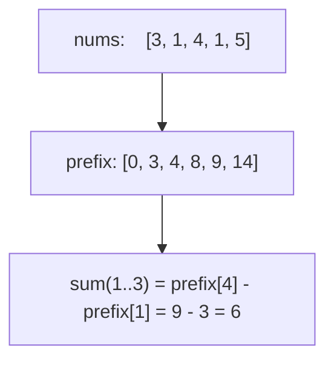

# Prefix Sum (Prefiks yig'indi)

**Prefix sum** — arrayning boshidan har bir pozitsiyagacha bo'lgan yig'indilarni **oldindan hisoblab** qo'yish texnikasi. Shundan keyin istalgan oraliq `[l, r]` yig'indisi **O(1)** da topiladi.

Tasavvur qil: yo'l chetidagi kilometr ustunlari — 70-km ustunidan 30-km ustunini ayirsang, oradagi masofa chiqadi. Har safar yo'lni qayta o'lchash shart emas.

## Formula

```
prefix[0] = 0
prefix[i] = nums[0] + nums[1] + ... + nums[i-1]

sum(l..r) = prefix[r+1] - prefix[l]
```

```go
// Qurish — O(n)
prefix := make([]int, len(nums)+1)
for i, v := range nums {
    prefix[i+1] = prefix[i] + v
}

// So'rov — O(1)
sumLR := prefix[r+1] - prefix[l]
```

> `len+1` o'lchamli qilib, `prefix[0] = 0` saqlash — chegara holatlarini (l=0) tekshirishdan qutqaradi.



## Variantlar

### Pivot index / balans nuqtasi

Chap yig'indi == o'ng yig'indi bo'lgan indeks: `left == total - left - nums[i]`. Bitta o'tishda hal bo'ladi.

### Prefix sum + Hash Map (Subarray Sum Equals K)

"Yig'indisi k ga teng **nechta subarray** bor?" — prefix yig'indilarni map'da sanab boramiz:

```go
count, sum := 0, 0
seen := map[int]int{0: 1} // prefix sum → necha marta uchradi
for _, v := range nums {
    sum += v
    count += seen[sum-k] // sum - k oldin uchragan bo'lsa, oradagi qism k ga teng
    seen[sum]++
}
```

Bu shakl juda ko'p "yig'indisi shartga mos subarray" masalalarida ishlaydi.

### 2D Prefix Sum

Har katakda "chap-yuqori burchakdan shu katakgacha" yig'indi saqlanadi:

```
P[i][j] = M[i-1][j-1] + P[i-1][j] + P[i][j-1] - P[i-1][j-1]

sumRegion(r1,c1,r2,c2) = P[r2+1][c2+1] - P[r1][c2+1] - P[r2+1][c1] + P[r1][c1]
```

Qo'shib-ayirishda ustma-ust tushgan qism ikki marta ayirilgani uchun bir marta qaytarib qo'shiladi (inclusion-exclusion).

## Qachon ishlatasan? (signallar)

- Bir arrayda **ko'p marta** oraliq yig'indi so'raladi (Range Sum Query)
- "Yig'indisi X bo'lgan subarray" tipidagi masalalar → prefix + hash map
- Matritsada submatrix yig'indilari → 2D prefix
- Balans/pivot nuqta topish

| | |
|---|---|
| Qurish | O(n) yoki O(m·n) |
| Har so'rov | O(1) |
| Xotira | O(n) yoki O(m·n) |
