# Intervals (Intervallar)

**Interval** — boshi va oxiri bo'lgan oraliq: `[start, end]`. Uchrashuvlar jadvali, band vaqtlar, IP diapazonlar — hammasi interval masalalari.

## Asosiy tushuncha: overlap (kesishish)

Ikkita interval `a` va `b` kesishadi, agar:

```
a.start <= b.end && b.start <= a.end
```



```mermaid
gantt
    dateFormat X
    axisFormat %s
    section Kesishadi
    a [1,5]     :1, 5
    b [3,8]     :3, 8
    section Kesishmaydi
    c [1,3]     :1, 3
    d [5,8]     :5, 8
```

## Universal birinchi qadam: SORT

Deyarli barcha interval masalalari **start bo'yicha tartiblash**dan boshlanadi. Shundan keyin faqat **qo'shni** intervallarni solishtirish kifoya.

```go
sort.Slice(intervals, func(i, j int) bool {
    return intervals[i][0] < intervals[j][0]
})
```

## Merge Intervals shabloni

```go
func merge(intervals [][]int) [][]int {
    sort.Slice(intervals, func(i, j int) bool { return intervals[i][0] < intervals[j][0] })
    res := [][]int{intervals[0]}
    for _, cur := range intervals[1:] {
        last := res[len(res)-1]
        if cur[0] <= last[1] {
            // kesishadi — birlashtiramiz (end ni uzaytiramiz)
            last[1] = max(last[1], cur[1])
        } else {
            // kesishmaydi — yangi interval boshlaymiz
            res = append(res, cur)
        }
    }
    return res
}
```

## Insert Interval

Tartiblangan ro'yxatga yangi interval qo'shish — uch bosqich:
1. Yangi intervaldan **oldin** tugaydiganlarni to'g'ridan-to'g'ri qo'shib boramiz
2. Kesishganlarning hammasini yangi intervalga **yutdiramiz** (`start=min`, `end=max`)
3. Qolganlarini qo'shamiz

## Non-overlapping Intervals (greedy)

"Minimal nechta intervalni o'chirsak, qolganlari kesishmaydi?" — **greedy**: `end` bo'yicha tartibla, har doim eng erta tugaydigan intervalni saqla — u keyingilarga eng ko'p joy qoldiradi:

```go
sort.Slice(intervals, func(i, j int) bool { return intervals[i][1] < intervals[j][1] })
count, prevEnd := 0, math.MinInt
for _, cur := range intervals {
    if cur[0] >= prevEnd {
        prevEnd = cur[1] // kesishmaydi — saqlaymiz
    } else {
        count++          // kesishadi — o'chiramiz
    }
}
```

## Qachon ishlatasan? (signallar)

- Masalada `[start, end]` juftliklar bor
- "Birlashtir", "kesishganlarni top", "minimal xona/resurs", "bo'sh vaqt top"
- Birinchi refleks: **tartibla** (masalaga qarab start yoki end bo'yicha), keyin bir o'tishda hal qil

| | |
|---|---|
| Time | O(n log n) — sort hukmron |
| Space | O(1)–O(n) |
