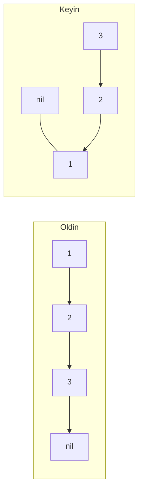

# Linked List (Bog'langan ro'yxat)

**Linked list** — har bir element (**node**) qiymat va keyingi node'ga **pointer** saqlaydigan struktura. Array'dan farqli, elementlar xotirada ketma-ket turmaydi — zanjir kabi bog'lanadi.

- **Singly linked list** — har node faqat `next` pointer saqlaydi
- **Doubly linked list** — `next` va `prev` ikkalasi ham bor (Go'ning `container/list` paketi shu)

| Amal | Linked List | Array |
| ---- | ----------- | ----- |
| Indeks bo'yicha kirish | O(n) | O(1) |
| Boshiga qo'shish/o'chirish | O(1) | O(n) |
| O'rtaga qo'shish (node ma'lum bo'lsa) | O(1) | O(n) |
| Qidirish | O(n) | O(n) |

**Afzalligi:** dinamik o'lcham, boshiga/o'rtasiga tez qo'shish-o'chirish. **Kamchiligi:** indeks bo'yicha kirish yo'q, pointer uchun qo'shimcha xotira. Stack, queue va LRU cache kabi strukturalar tagida ishlatiladi.

## LeetCode'dagi ko'rinishi

```go
type ListNode struct {
    Val  int
    Next *ListNode
}
```

## 4 ta asosiy shablon

### 1. Slow & Fast pointers (Floyd)

`fast` 2 qadam, `slow` 1 qadam yuradi:

```go
// O'rtani topish: fast oxiriga yetganda slow o'rtada bo'ladi
slow, fast := head, head
for fast != nil && fast.Next != nil {
    slow = slow.Next
    fast = fast.Next.Next
}
// slow == o'rta node

// Cycle aniqlash: uchrashsalar — cycle bor
for fast != nil && fast.Next != nil {
    slow, fast = slow.Next, fast.Next.Next
    if slow == fast { return true }
}
```

### 2. Reverse (uchta pointer)

```go
func reverseList(head *ListNode) *ListNode {
    var prev *ListNode
    cur := head
    for cur != nil {
        next := cur.Next // keyingisini saqlab qo'yamiz
        cur.Next = prev  // strelkani teskari buramiz
        prev = cur
        cur = next
    }
    return prev
}
```



### 3. Dummy node

Boshi o'zgarishi mumkin bo'lgan amallarda (merge, o'chirish) **dummy** (soxta bosh) node chegara holatlarini yo'q qiladi:

```go
dummy := &ListNode{}
tail := dummy
for l1 != nil && l2 != nil {
    if l1.Val <= l2.Val {
        tail.Next = l1; l1 = l1.Next
    } else {
        tail.Next = l2; l2 = l2.Next
    }
    tail = tail.Next
}
if l1 != nil { tail.Next = l1 } else { tail.Next = l2 }
return dummy.Next
```

### 4. Ikki ro'yxat kesishuvi (Intersection)

Ikkala pointer o'z ro'yxati tugagach **ikkinchisining boshiga** o'tadi — ikkalasi teng masofa yurib kesishish nuqtasida uchrashadi (yoki ikkalasi nil bo'ladi):

```go
a, b := headA, headB
for a != b {
    if a == nil { a = headB } else { a = a.Next }
    if b == nil { b = headA } else { b = b.Next }
}
return a
```

## Qachon qaysi shablon? (signallar)

| Signal | Shablon |
| ------ | ------- |
| O'rta element / cycle | slow & fast |
| Teskari qilish / palindrom | reverse (palindrom = o'rta + yarmini reverse) |
| Ikki ro'yxatni birlashtirish, node o'chirish | dummy node |
| Sort List | merge sort (o'rtani top → ikkiga bo'l → merge) |

> **Klassik tuzoq:** node'ni o'chirishda undan **oldingi** node kerak. "Delete Node" masalasida esa oldingisiga kirish yo'q — hiyla: keyingi node qiymatini o'ziga ko'chirib, keyingisini o'chirasan.
