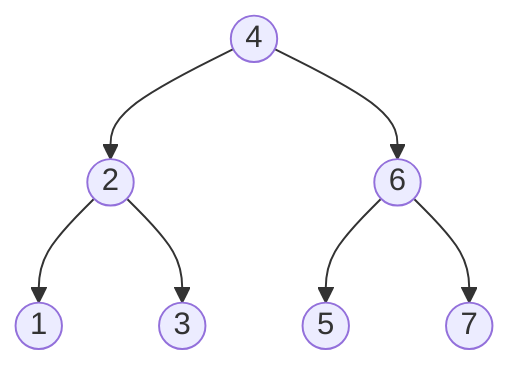

# Tree va Binary Search Tree

**Tree** — graph'ning maxsus turi: ildizdan (root) boshlanadigan, **cycle'siz**, ierarxik struktura. Istalgan tree — graph, ammo istalgan graph tree emas.

- **Root** — eng yuqori node
- **Leaf** — bolasi yo'q node
- **Depth/Height** — ildizdan eng uzoq leaf'gacha masofa
- **Binary tree** — har node'ning ko'pi bilan **2 ta** bolasi (left, right)

```go
type TreeNode struct {
    Val   int
    Left  *TreeNode
    Right *TreeNode
}
```

## Traversal (yurish tartiblari)



| Traversal | Tartib | Yuqoridagi tree'da |
| --------- | ------ | ------------------ |
| **Inorder** | left → root → right | 1 2 3 4 5 6 7 (BST'da tartiblangan!) |
| **Preorder** | root → left → right | 4 2 1 3 6 5 7 |
| **Postorder** | left → right → root | 1 3 2 5 7 6 4 |
| **Level order** | qavatma-qavat (BFS) | 4, 2 6, 1 3 5 7 |

```go
// Inorder — rekursiv
func inorder(node *TreeNode, res *[]int) {
    if node == nil { return }
    inorder(node.Left, res)
    *res = append(*res, node.Val)
    inorder(node.Right, res)
}

// Level order — queue bilan (BFS)
func levelOrder(root *TreeNode) [][]int {
    if root == nil { return nil }
    res, queue := [][]int{}, []*TreeNode{root}
    for len(queue) > 0 {
        var level []int
        size := len(queue) // shu qavatdagi node'lar soni
        for i := 0; i < size; i++ {
            node := queue[0]; queue = queue[1:]
            level = append(level, node.Val)
            if node.Left != nil  { queue = append(queue, node.Left) }
            if node.Right != nil { queue = append(queue, node.Right) }
        }
        res = append(res, level)
    }
    return res
}
```

## Rekursiya — tree'ning ona tili

Deyarli har qanday tree masalasi shu qolipga tushadi:

```go
func solve(node *TreeNode) T {
    if node == nil { return baza }        // 1. Base case
    left := solve(node.Left)              // 2. Bolalardan javob olamiz
    right := solve(node.Right)
    return combine(node, left, right)     // 3. Birlashtiramiz
}

// Misol: Maximum Depth
func maxDepth(root *TreeNode) int {
    if root == nil { return 0 }
    return 1 + max(maxDepth(root.Left), maxDepth(root.Right))
}
```

**Diameter** ham shu qolip: har node'da `leftDepth + rightDepth` ni global maksimum bilan solishtirasan. **Symmetric Tree**: ikki subtree'ni oynadagidek solishtirasan — `isMirror(a.Left, b.Right) && isMirror(a.Right, b.Left)`.

## Binary Search Tree (BST)

**BST invarianti**: har node uchun `chap subtree < node.Val < o'ng subtree`. Shu tufayli qidirish/qo'shish/o'chirish balanslangan holda **O(log n)** — har qadamda yarmi tashlanadi, xuddi binary search kabi.

```go
// Search — qiymatga qarab chap yoki o'ngga buriling
func searchBST(root *TreeNode, val int) *TreeNode {
    for root != nil && root.Val != val {
        if val < root.Val { root = root.Left } else { root = root.Right }
    }
    return root
}
```

### Delete (eng qiyin amal) — 3 holat

1. **Leaf** — shunchaki o'chir
2. **Bitta bola** — bolasi bilan almashtir
3. **Ikki bola** — o'ng subtree'ning **eng kichigi** (inorder successor) bilan qiymatni almashtir, keyin o'sha node'ni o'chir

### Validate BST tuzog'i

Faqat `node.Left.Val < node.Val` tekshirish **yetarli emas** — butun chap subtree kichik bo'lishi kerak. Yechim: har node'ga ruxsat etilgan `(min, max)` oraliqni uzatish, yoki inorder traversal qat'iy o'sib borishini tekshirish.

> **BST'da eng foydali fakt:** inorder traversal = tartiblangan ketma-ketlik. "BST + k-chi element / tartib / oraliq" ko'rsang — inorder haqida o'yla. Range Sum of BST'da esa invariantdan foydalanib butun subtree'larni kesib tashlaysan (pruning).
