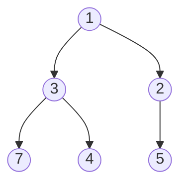

# Heap / Priority Queue

**Binary heap** — eng katta (max-heap) yoki eng kichik (min-heap) elementni **O(log n)** da qo'shish/olish imkonini beruvchi struktura. **Priority queue**'ning standart implementatsiyasi.

Tasavvur qil: shifoxona qabulxonasi — navbat kelish tartibida emas, holati og'irligi bo'yicha. Har safar "eng og'ir bemor" birinchi chaqiriladi.

## Tuzilishi

Heap — **to'liq binary tree** (complete binary tree), lekin array'da saqlanadi:

- `parent(i) = (i-1)/2`
- `left(i) = 2i+1`, `right(i) = 2i+2`
- **Heap invarianti** (min-heap): har node o'z bolalaridan kichik yoki teng



Array ko'rinishi: `[1, 3, 2, 7, 4, 5]`

| Amal | Murakkablik |
| ---- | ----------- |
| Eng kichigini ko'rish (peek) | O(1) |
| Qo'shish (push) | O(log n) — yuqoriga suzadi (sift up) |
| Olish (pop) | O(log n) — pastga cho'kadi (sift down) |
| Array'dan heap qurish | O(n) |

## Go'da: container/heap

Go'da heap interfeys orqali ishlaydi — 5 ta metod yozasan:

```go
import "container/heap"

type MinHeap []int

func (h MinHeap) Len() int            { return len(h) }
func (h MinHeap) Less(i, j int) bool  { return h[i] < h[j] } // > qilsang max-heap
func (h MinHeap) Swap(i, j int)       { h[i], h[j] = h[j], h[i] }
func (h *MinHeap) Push(x any)         { *h = append(*h, x.(int)) }
func (h *MinHeap) Pop() any {
    old := *h
    n := len(old)
    x := old[n-1]
    *h = old[:n-1]
    return x
}

// Ishlatish
h := &MinHeap{}
heap.Init(h)
heap.Push(h, 5)
smallest := heap.Pop(h).(int)
```

## "Top K" shabloni

**Kth Largest / Top K Frequent** masalalarining standart yechimi: o'lchami **k** dan oshmaydigan **min-heap** saqla:

```go
// Kth largest: min-heap'da faqat eng katta k ta element yashaydi
h := &MinHeap{}
for _, v := range nums {
    heap.Push(h, v)
    if h.Len() > k {
        heap.Pop(h) // eng kichigi chiqib ketadi
    }
}
return (*h)[0] // heap boshi = k-chi eng katta
```

Time: O(n log k) — to'liq sortdan (O(n log n)) yaxshi, ayniqsa k kichik bo'lsa.

## Qachon ishlatasan? (signallar)

- "**K-chi eng katta/kichik**", "**top K**", "eng yaqin K nuqta"
- Oqimdagi (stream) ma'lumotdan doim min/max kerak
- Dijkstra, Prim (MST) — "keyingi eng arzon yo'l/qirra"ni olish
- Bir nechta tartiblangan ro'yxatni birlashtirish (merge k lists)

> **Alternativlar:** Top K uchun quickselect (o'rtacha O(n)) yoki bucket sort (chastotalar uchun O(n)) ham ishlaydi — Top K Frequent Elements'da uchalasini ham sinab ko'r.
