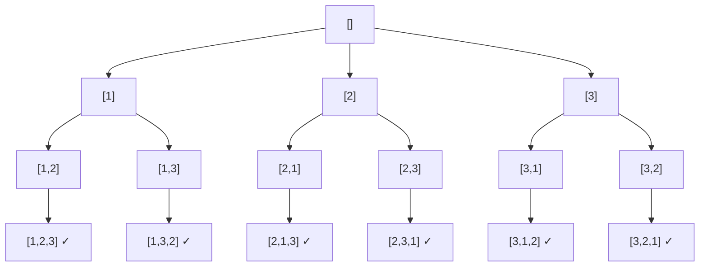

# Recursion va Backtracking

## Recursion (Rekursiya)

**Rekursiya** — funksiya o'z-o'zini kichikroq masala uchun chaqirishi. Har rekursiv funksiyada **ikkita majburiy qism** bor:

1. **Base case** — to'xtash sharti (busiz cheksiz chaqiruv → stack overflow)
2. **Recursive case** — masalani kichraytirib o'ziga murojaat

```go
// Factorial: n! = n · (n-1)!
func factorial(n int) int {
    if n <= 1 { return 1 }        // base case
    return n * factorial(n-1)     // recursive case
}

// Fibonacci: F(n) = F(n-1) + F(n-2)
func fib(n int) int {
    if n < 2 { return n }
    return fib(n-1) + fib(n-2)    // sodda, lekin O(2ⁿ)!
}
```

> Naive fibonacci O(2ⁿ) — bir xil qiymatlar qayta-qayta hisoblanadi. Yechim: **memoization** (natijalarni map'da saqlash) yoki iterativ hisoblash — bu [Dynamic Programming](17.%20Dynamic%20Programming.md)'ga ko'prik.

Har chaqiruv **call stack**'da joy oladi — chuqurlik n bo'lsa, xotira O(n). Tree va graph masalalarining tabiiy tili ham rekursiya (DFS).

## Backtracking (Qaytish bilan qidiruv)

**Backtracking** — barcha variantlarni **tizimli ravishda** sinab ko'rish: variant tanla → chuqurroq kir → ish bermasa **orqaga qaytib** (backtrack) boshqasini sinab ko'r. "Barcha kombinatsiyalar / permutatsiyalar / variantlarni toping" masalalarining standart quroli.

Tasavvur qil: labirintda yurish — chorrahada bir yo'lni tanlaysan, boshi berk bo'lsa chorrahaga **qaytib** boshqa yo'lni sinaysan.



Permutations qidiruv daraxti: har qavatda bitta pozitsiya tanlanadi, leaf'larda tayyor javoblar.

## Universal shablon

```go
func backtrack(path []int, tanlovlar) {
    if /* path tayyor javob bo'lsa */ {
        res = append(res, copyOf(path)) // MUHIM: nusxa ol!
        return
    }
    for _, tanlov := range tanlovlar {
        if /* tanlov yaroqsiz */ { continue } // pruning (kesish)
        path = append(path, tanlov)           // 1. TANLA
        backtrack(path, qolganTanlovlar)      // 2. CHUQURROQ KIR
        path = path[:len(path)-1]             // 3. BEKOR QIL (backtrack)
    }
}
```

### Uch klassik masala

```go
// Combinations: C(n, k) — start indeks bilan takrorni oldini olamiz
func backtrack(start int, path []int) {
    if len(path) == k { saqla(path); return }
    for i := start; i <= n; i++ {
        path = append(path, i)
        backtrack(i+1, path) // faqat kattaroq indekslar — [1,2] bor, [2,1] yo'q
        path = path[:len(path)-1]
    }
}

// Permutations: used massiv bilan har elementni bir marta
// Generate Parentheses: ochiq < n bo'lsa '(' qo'sh; yopiq < ochiq bo'lsa ')' qo'sh
```

## Qachon ishlatasan? (signallar)

- "**Barcha** ... larni qaytaring": kombinatsiyalar, permutatsiyalar, subset'lar
- Constraint kichik (n ≤ 15-20) — eksponensial yechimga ruxsat degani
- Qadam-baqadam qurish + yaroqsiz shoxlarni erta kesish (pruning) mumkin

| Masala | Variantlar soni |
| ------ | --------------- |
| Subsets | 2ⁿ |
| Permutations | n! |
| Combinations C(n,k) | n! / (k!(n-k)!) |

> **Ikki klassik xato:** (1) `path`ni nusxasiz saqlash — keyingi o'zgarishlar saqlangan javobni buzadi; (2) backtrack qadamini (bekor qilishni) unutish.
