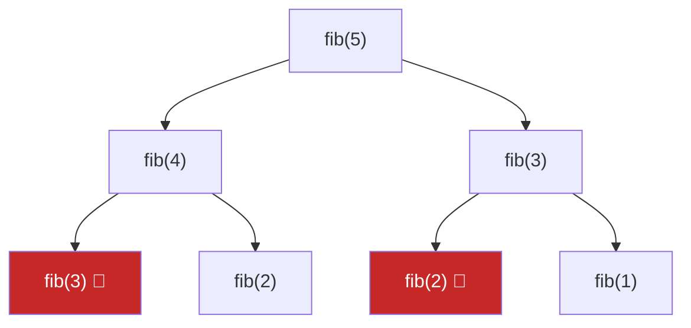

# Dynamic Programming (DP)

**Dynamic programming** — katta masalani **takrorlanuvchi kichik masalalarga** bo'lib, har kichik masalani **bir marta** yechib natijasini saqlash texnikasi.

DP ishlashi uchun ikkita shart:
1. **Optimal substructure** — katta javob kichik javoblardan quriladi
2. **Overlapping subproblems** — kichik masalalar takrorlanadi (aks holda oddiy divide & conquer)

Fibonacci bilan solishtir: naive rekursiya `fib(5)` uchun `fib(3)`ni 2 marta, `fib(2)`ni 3 marta hisoblaydi — O(2ⁿ). Natijani saqlasak — O(n).



## Ikki yondashuv

```go
// 1. Top-down: rekursiya + memoization
var memo map[int]int
func fib(n int) int {
    if n < 2 { return n }
    if v, ok := memo[n]; ok { return v }
    memo[n] = fib(n-1) + fib(n-2)
    return memo[n]
}

// 2. Bottom-up: iterativ jadval (tabulation)
func fib(n int) int {
    if n < 2 { return n }
    a, b := 0, 1
    for i := 2; i <= n; i++ {
        a, b = b, a+b // faqat oxirgi 2 holat kerak — O(1) xotira
    }
    return b
}
```

## DP masalani yechish tartibi (framework)

1. **Holatni aniqla**: `dp[i]` nimani anglatadi? (eng muhim qadam!)
2. **O'tish formulasi** (recurrence): `dp[i]` oldingi holatlardan qanday chiqadi?
3. **Base case**: eng kichik holatlar qiymati
4. **Hisoblash tartibi**: base case'dan javobgacha
5. **Xotira optimizatsiyasi**: faqat oxirgi 1-2 holat kerak bo'lsa, massiv shart emas

## Klassik masalalar tahlili

### Climbing Stairs
`dp[i]` = i-pog'onaga chiqish yo'llari soni. Oxirgi qadam 1 yoki 2 pog'ona:
```
dp[i] = dp[i-1] + dp[i-2]   (bu fibonacci!)
```

### House Robber
`dp[i]` = birinchi i uydan maksimal o'lja. Har uyda ikki tanlov — o'g'irla (oldingisini tashla) yoki tashla:
```
dp[i] = max(dp[i-1], dp[i-2] + nums[i])
```

### Coin Change
`dp[a]` = a summani yig'ish uchun minimal tangalar. Har tanga uchun:
```
dp[a] = min(dp[a], dp[a-coin] + 1)
```

```go
func coinChange(coins []int, amount int) int {
    dp := make([]int, amount+1)
    for i := 1; i <= amount; i++ {
        dp[i] = amount + 1 // "cheksiz"
        for _, c := range coins {
            if i >= c && dp[i-c]+1 < dp[i] {
                dp[i] = dp[i-c] + 1
            }
        }
    }
    if dp[amount] > amount { return -1 }
    return dp[amount]
}
```

### Jump Game — DP yoki Greedy
DP yechim bor, lekin greedy soddaroq: chapdan o'ngga yurib "eng uzoq yetib borish mumkin" nuqtani yangilab borasan:
```go
reach := 0
for i, v := range nums {
    if i > reach { return false } // bu yerga yetib bo'lmaydi
    reach = max(reach, i+v)
}
return true
```

### Maximum Subarray (Kadane)
`dp[i]` = i'da tugaydigan eng katta yig'indi: `dp[i] = max(nums[i], dp[i-1]+nums[i])` — davom ettir yoki yangidan boshla.

## Qachon ishlatasan? (signallar)

- "**Necha usul** bilan...?" (count ways)
- "**Minimal/maksimal** narx/yo'l/summa"
- "Mumkinmi?" (can you reach/make...)
- Hozirgi tanlov keyingi imkoniyatlarga ta'sir qiladi va kichik masalalar takrorlanadi
- Brute-force rekursiya daraxtida bir xil shoxlar qayta-qayta uchraydi → memoization qo'sh

> **Boshlang'ich maslahat:** avval oddiy rekursiv yechim yoz, keyin takrorlanayotgan chaqiruvlarni ko'rib memo qo'sh (top-down), oxirida xohlasang iterativga (bottom-up) ag'dar.
