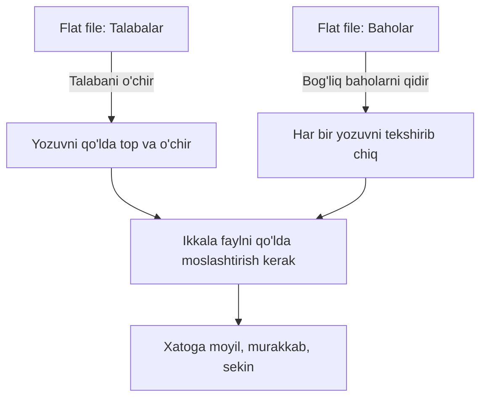
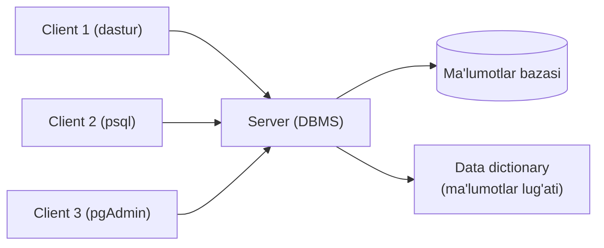
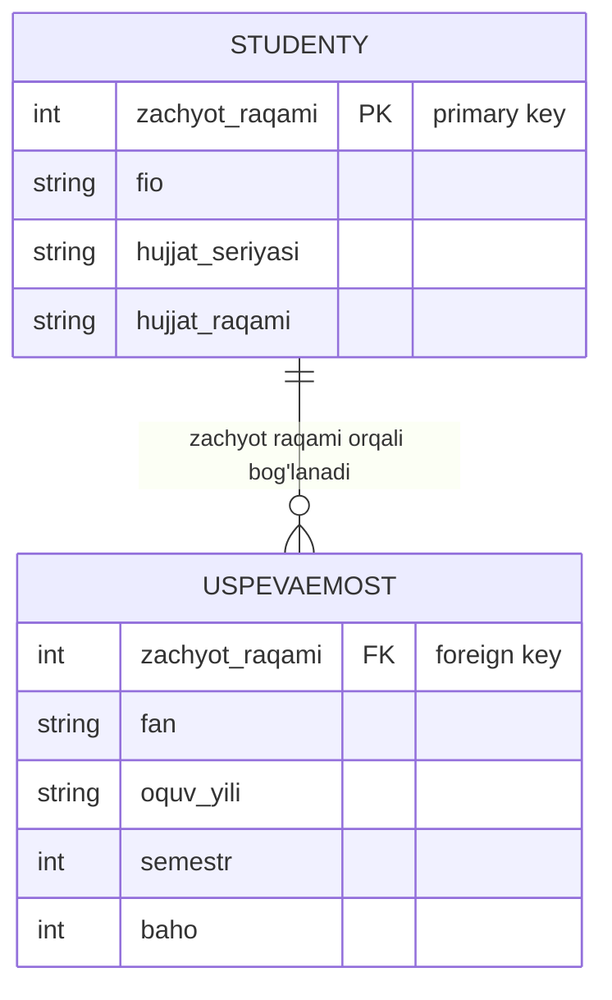
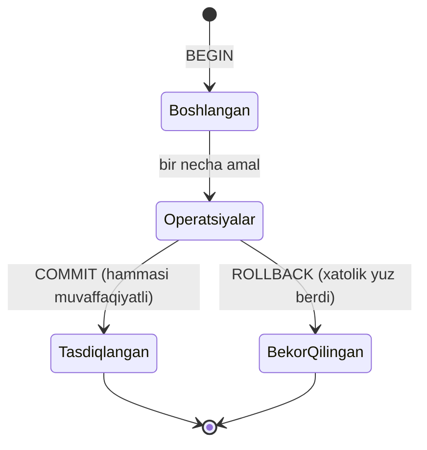
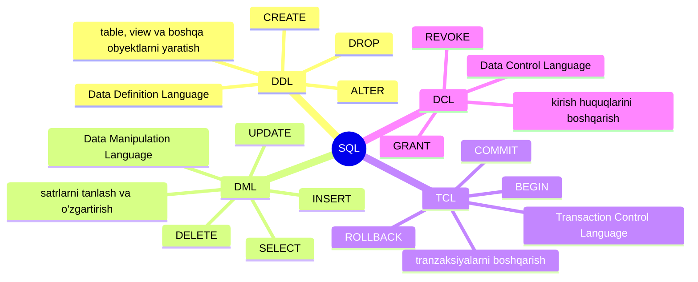
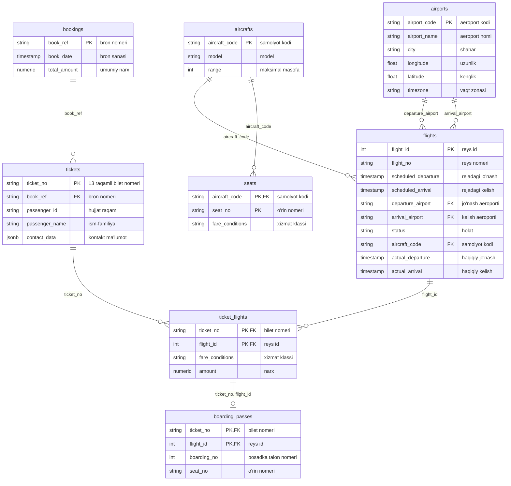

# 1. Kirish — Database va SQL

> 📖 Manba: Моргунов, "PostgreSQL. Основы языка SQL", 1-bob

## Nima uchun kerak?

Tasavvur qiling, siz bir universitetning talabalari va ularning imtihon baholarini kompyuterda saqlamoqchisiz. Buni oddiy matnli fayllarda ham saqlash mumkin. Lekin talaba universitetdan chiqib ketsa, uning ma'lumotlarini bir fayldan o'chirib, keyin boshqa fayldagi baholarini ham qo'lda topib o'chirishingiz kerak bo'ladi. Bir talabaning ma'lumoti bir necha joyda saqlansa, hammasini bir-biriga mos qilib turish juda qiyin.

Database (ma'lumotlar bazasi) texnologiyalari aynan shu muammoni hal qiladi. U ma'lumotlarni tartibli saqlaydi, ular orasidagi bog'lanishlarni o'zi kuzatib turadi va dasturchini "qo'lda" bir-bir yozib chiqish mashaqqatidan xalos qiladi.

Bu darsda biz database nima ekanini, relational model ning asosiy tushunchalarini va SQL tili nimaligini o'rganamiz. Shuningdek, keyingi darslarda ishlatiladigan "Aviaqatnovlar" o'quv bazasi bilan tanishamiz.

---

## Database texnologiyalaridan oldin nima bo'lgan?

Database paydo bo'lishidan avval ham odamlar ma'lumot yig'ib, qayta ishlagan. Buning bir usuli — **flat files** (yassi fayllar) deb ataladigan oddiy fayllar edi. Bunda ma'lumotlar belgilangan uzunlikdagi maydonlarga (fields) bo'lingan yozuvlar (records) ko'rinishida saqlangan.

Muammo shundaki, real hayotda ma'lumotlar orasida murakkab bog'lanishlar bo'ladi. Flat file larda bu bog'lanishlarni tashkil qilish qiyin, ma'lumotni o'zgartirish yoki o'chirish esa bundan ham qiyin edi.

**Misol:** Talabalar ma'lumoti "Talabalar" faylida, imtihon baholari esa "Baholar" faylida saqlanadi. Bitta talabani o'chirmoqchi bo'lsangiz, avval "Talabalar" faylidan uning yozuvini topib o'chirasiz, keyin "Baholar" faylini boshdan-oxir aylanib chiqib, o'sha talabaga tegishli barcha baholarni ham qo'lda topib o'chirishingiz kerak. Bu ish **navigatsion** yondashuv deb atalgan — chunki dasturchi har bir yozuvga "yo'l topib borishi" kerak edi.

---

## Data model (ma'lumotlar modeli) nima?

**Data model** — bu ma'lumotlarni qanday tashkil qilish va ularga qanday murojaat qilish usulini belgilaydi. Tarixda bir necha model taklif qilingan:

- **Ierarxik model** (daraxtsimon)
- **Setli (network) model**
- **Relational model** (relatsion model)

Bugungi kunda **relational model** ustunlik qiladi. Uning asosiy xususiyati — foydalanuvchi ma'lumotlarni **jadvallar (tables)** ko'rinishida ko'radi. Foydalanuvchi jadvallardan ma'lumot tanlab olishi, yangi ma'lumot qo'shishi, mavjudini o'zgartirishi yoki o'chirishi mumkin.

Relational database ning eng katta afzalligi — u ma'lumotlar orasidagi bog'lanishlarni **o'zi** ta'minlaydi. Dasturchi bu og'ir va zerikarli ishni qo'lda qilmaydi.

### Deklarativ yondashuv

Relational database bilan ishlaganda dasturchi "atom" darajasida (har bir yozuvni bir-bir ko'zdan kechirib) dasturlashdan xalos bo'ladi. Zamonaviy tillar **deklarativ**dir — bu shuni anglatadiki, siz faqat **nima** kerakligini ko'rsatasiz, ammo natijani **qanday** olishni tushuntirib bermaysiz. Buni database o'zi hal qiladi.

> Oddiy qilib aytganda: siz "menga uzoq masofaga uchadigan samolyotlar ro'yxatini ber" deysiz, lekin "avval birinchi qatorni o'qi, keyin ikkinchisini tekshir..." deb ko'rsatmaysiz.

---

## Database tizimi (database system) qanday tuzilgan?

**Database tizimi** — bu foydalanuvchilar so'roviga ko'ra axborotni saqlash, qayta ishlash va berish uchun mo'ljallangan kompyuterlashtirilgan tizim. Uning tarkibida:

- Dasturiy ta'minot (software)
- Apparat ta'minoti (hardware)
- Ma'lumotlarning o'zi
- Foydalanuvchilar

Zamonaviy database tizimlari odatda **ko'p foydalanuvchili** bo'ladi — bir vaqtda bir necha foydalanuvchi bazaga murojaat qila oladi.

### DBMS — asosiy dasturiy ta'minot

Asosiy dasturiy ta'minot **DBMS** (Database Management System, ya'ni ma'lumotlar bazasini boshqarish tizimi) deb ataladi. DBMS dan tashqari database tizimiga yordamchi utilitalar, dastur ishlab chiqish vositalari, hisobot generatorlari va boshqalar kirishi mumkin.

Foydalanuvchilar uch toifaga bo'linadi:

| Toifa | Kim | Nima qiladi |
| --- | --- | --- |
| Amaliy dasturchilar | Dastur yozuvchilar | Bazaga murojaat qiladigan dasturlar yaratadi |
| Oxirgi foydalanuvchilar | Butun ish shular uchun bajariladi | Dasturlar orqali bazadan foydalanadi |
| Ma'murlar (administrators) | Baza boshqaruvchilari | Bazani yaratadi, kirish huquqlarini belgilaydi, zaxira nusxa oladi |

### Client va server

Database tizimini ikkita asosiy qismga bo'lish mumkin:

- **Server** — bu DBMS ning o'zi.
- **Client** (yoki tashqi interfeys) — serverdan xizmat so'raydigan dasturlar.

Bitta server ko'plab client larga xizmat ko'rsatishi mumkin.

Zamonaviy DBMS lar tarkibida **data dictionary** (ma'lumotlar lug'ati) bo'ladi — bu bazaning bir qismi bo'lib, unda saqlanayotgan ma'lumotlarning o'zini tavsiflaydi va DBMS ga o'z vazifasini bajarishda yordam beradi.

---

## Relational model ning asosiy tushunchalari

Har bir texnologiya sohasida o'z atamalari bo'ladi. Database sohasida uch guruh atama mavjud va ular ko'pincha bir-birining sinonimi sifatida ishlatiladi.

| Fayllar davri | Jadval (table) atamasi | Formal nazariya (matematika) |
| --- | --- | --- |
| Fayl (file) | Table (jadval) | Relation (munosabat) |
| Yozuv (record) | Row / Qator (satr) | Tuple (kortej) |
| Maydon (field) | Column / Ustun (kolonka) | Attribute (atribut) |

**Table** qator (row) va ustun (column) lardan iborat. Ularning kesishmasida **atom** qiymatlar turadi — ya'ni ma'noni yo'qotmasdan bo'linmaydigan qiymatlar.

Formal nazariyada bu jadvallar **relations** (munosabatlar) deb ataladi — shuning uchun bazalar **relatsion** deyiladi. Relation matematik atama bo'lib, uni tavsiflashda to'plamlar nazariyasi (theory of sets) ishlatiladi. Bu nazariyada:

- jadval satrlari — **tuples** (kortejlar)
- ustunlar — **attributes** (atributlar)
- atributlar soni — relation ning **darajasi** (degree)
- kortejlar soni — **kardinal son** (cardinality)

### Misol: ikkita jadvalli sodda tizim

**Talabalar (Studenty)** jadvali:

| Zachyot daftarcha № | F.I.O. | Hujjat seriyasi | Hujjat raqami |
| --- | --- | --- | --- |
| 55500 | Ivanov Ivan Petrovich | 0402 | 645327 |
| 55800 | Klimov Andrey Ivanovich | 0402 | 673211 |
| 55865 | Novikov Nikolay Yuryevich | 0202 | 554390 |

**Baholar (Uspevaemost)** jadvali:

| Zachyot daftarcha | Fan | O'quv yili | Semestr | Baho |
| --- | --- | --- | --- | --- |
| 55500 | Fizika | 2016/2017 | 1 | 5 |
| 55500 | Matematika | 2016/2017 | 1 | 4 |
| 55800 | Fizika | 2016/2017 | 1 | 4 |
| 55800 | Fizika | 2016/2017 | 2 | 3 |

---

## Constraint lar (cheklovlar)

Baza bilan ishlaganda ko'pincha turli **constraint** larga (cheklovlarga) rioya qilish kerak. Bu cheklovlar aynan shu predmet sohasidan kelib chiqadi. Yuqoridagi misol uchun:

- Zachyot daftarcha raqami 5 raqamdan iborat va manfiy bo'lmasligi kerak.
- Hujjat seriyasi — 4 xonali son, hujjat raqami — 6 xonali son.
- Semestr raqami faqat 2 qiymat qabul qiladi: 1 (kuzgi) va 2 (bahorgi).
- Baho faqat 3 qiymat qabul qiladi: 3 (qoniqarli), 4 (yaxshi), 5 (a'lo).

---

## Key lar (kalitlar)

Jadvaldagi satrlarni bir-biridan ajratish va jadvallarni o'zaro bog'lash uchun **key** lar (kalitlar) ishlatiladi.

### Potential key (potensial kalit)

**Potential key** — jadvaldagi satrni yagona (unique) tarzda aniqlab beruvchi atributlar kombinatsiyasi. Kalit bitta atributdan ham, bir necha atributdan ham iborat bo'lishi mumkin.

- "Talabalar" jadvalida bunday kalit "Zachyot daftarcha raqami" bo'lishi mumkin.
- Yoki "Hujjat seriyasi" + "Hujjat raqami" birgalikda ham kalit bo'la oladi (alohida-alohida emas, chunki bir seriyada ko'p hujjat bo'ladi). Bunday kalit **составной** (murakkab, ya'ni bir necha atributdan iborat) deyiladi.

Muhim shart: potential key **ortiqcha bo'lmasligi (неизбыточный)** kerak — ya'ni undagi biror kichik qismi ham o'z-o'zidan uniqueness xususiyatiga ega bo'lmasligi kerak.

### Primary key va alternative key

Agar jadvalda bir nechta potential key bo'lsa, ulardan biri **primary key** (birlamchi kalit) qilib tanlanadi, qolganlari esa **alternative key** (muqobil kalit) bo'lib qoladi. Primary key satrlarga (yozuvlarga) manzil berish uchun kerak.

### Foreign key (tashqi kalit)

"Baholar" jadvalidagi "Zachyot daftarcha raqami" ustunini ko'raylik. Agar "Talabalar" jadvalida 55900 raqamli talaba bo'lmasa, "Baholar" jadvaliga shu raqamli satr qo'shishning ma'nosi yo'q. Demak, "Baholar" jadvalidagi bu ustun qiymatlari "Talabalar" jadvalidagi shu ustun qiymatlari bilan mos kelishi kerak.

Bu yerda "Baholar" jadvalidagi "Zachyot daftarcha raqami" — **foreign key** (tashqi kalit) misolidir.

- Foreign key ni saqlaydigan jadval — **ссылающаяся** (murojaat qiluvchi, referencing) jadval deyiladi.
- Mos primary key ni saqlaydigan jadval — **ссылочная / целевая** (maqsadli, referenced) jadval deyiladi.

Foreign key murakkab (bir necha atributli) bo'lishi mumkin, va u unique bo'lishi shart emas.

### Referential integrity (murojaat yaxlitligi)

Foreign key da noto'g'ri qiymatlar bo'lmasligini ta'minlash muammosi **referential integrity** (murojaat yaxlitligi) muammosi deb ataladi. Foreign key qiymatlari potential key qiymatlariga mos bo'lishini talab qiluvchi cheklov — **referential integrity constraint** (murojaat yaxlitligi cheklovi) deyiladi.

Bu cheklovni DBMS o'zi ta'minlaydi, dasturchidan faqat qaysi atributlar foreign key ekanini ko'rsatish talab qilinadi.

### Cascade update / delete

Baza loyihalashda ko'pincha shunday qilinadi: referenced jadvaldan satr o'chirilsa, referencing jadvaldagi mos satrlar ham o'chirilsin, primary key o'zgarsa, foreign key qiymatlari ham o'zgarsin. Bu yondashuv **каскадное удаление / обновление** (cascade delete / update) deb ataladi.

---

## NULL qiymati

Ba'zan referencing jadvaldan satrni o'chirish o'rniga, foreign key atributiga maxsus **NULL** qiymati qo'yiladi.

**NULL** — "hech narsa" yoki "qiymat yo'q" degan maxsus qiymat. U **nol** (0) yoki **bo'sh satr** (empty string) bilan bir xil emas! NULL — foydalanuvchi hech qanday aniq qiymat kiritmaganda qo'yiladigan standart qiymat sifatida ham ishlatiladi.

> Muhim: **Primary key NULL qiymatni saqlay olmaydi.**

---

## Transaction (tranzaksiya)

**Transaction** — database nazariyasidagi eng muhim tushunchalardan biri. Bu bazaga nisbatan bajariladigan operatsiyalar to'plami bo'lib, ular **bitta va bo'linmas** ish birligi sifatida qaraladi. Transaction yo **to'liq** bajariladi, yo **umuman** bajarilmaydi (agar jarayonda biror uzilish bo'lsa).

Shu tarzda transaction ma'lumotlarning **kelishilganligini (consistency)** ta'minlaydi.

**Misol:** "Talabalar" jadvalidan bir satrni o'chirish va shu satrga foreign key orqali bog'langan "Baholar" jadvalidagi satrlarni o'chirish — birgalikda bitta transaction bo'lishi mumkin. Ikkalasi ham bajarilsin, yoki hech qaysi bajarilmasin.

---

## SQL tili nima?

**SQL** (Structured Query Language) — bu **noprotsedurali** (deklarativ) til bo'lib, barcha relatsion DBMS larda ma'lumotlar bilan ishlashning standart vositasidir. SQL da yozilgan operatorlar (buyruqlar) DBMS ga **qanday** natija olish kerakligini emas, faqat **qaysi** natija kerakligini ko'rsatadi. Natija olish usulini DBMS o'zi aniqlaydi.

SQL operatorlari an'anaviy tarzda guruhlarga bo'linadi:

| Guruh | To'liq nomi | Vazifasi | Asosiy buyruqlar |
| --- | --- | --- | --- |
| **DDL** | Data Definition Language | table, view va boshqa obyektlarni yaratish, o'zgartirish, o'chirish | CREATE, ALTER, DROP |
| **DML** | Data Manipulation Language | satrlarni tanlash, qo'shish, yangilash, o'chirish | SELECT, INSERT, UPDATE, DELETE |
| **TCL** | Transaction Control Language | tranzaksiyalarni boshqarish | BEGIN, COMMIT, ROLLBACK |
| **DCL** | Data Control Language | baza obyektlariga kirish huquqlarini boshqarish | GRANT, REVOKE |

> Eslatma: Kitobda **DCL** operatorlari ko'rib chiqilmaydi, chunki PostgreSQL da SQL o'rganishning boshlang'ich bosqichida ularsiz ishlash mumkin. **TCL** ni ba'zi manbalar DML tarkibiga qo'shadi, ammo tushunish qulay bo'lishi uchun alohida guruh sifatida keltirdik.

---

## "Aviaqatnovlar" o'quv bazasi

SQL ning barcha imkoniyatlarini ko'rsatish uchun bizga bir database kerak. U juda murakkab bo'lmasligi (o'rganish uzoq cho'zilmasligi), ammo yetarlicha xilma-xil bo'lishi (so'rovlar real ishga o'xshab tuyulishi) kerak. Predmet sohasi sifatida **yo'lovchi aviaqatnovlari** tanlangan.

### Predmet sohasining tavsifi

Bir rossiyalik aviakompaniya yo'lovchi tashiydi. Uning turli modeldagi samolyotlari bor. Har bir model **IATA** (Xalqaro aviatashuvchilar assotsiatsiyasi) beradigan kodga ega. Bir modeldagi samolyotlarning salon tarkibi bir xil deb qabul qilamiz — o'rindiqlar joylashuvi va raqamlanishi bir xil (biznes-klass va ekonom-klass o'rindiqlari).

Aviakompaniya Rossiya **aeroportlari** o'rtasida uchadi. Har bir aeroportga uch harfli unique kod beriladi (faqat lotin bosh harflari). Aeroport nomi shahar nomiga mos kelmasligi mumkin (masalan, Novosibirskda aeroport "Tolmachyovo" deb ataladi). Ba'zi shaharlarda bir nechta aeroport bor (Moskvada Domodedovo, Sheremetyevo, Vnukovo). Har bir aeroport geografik koordinatalar (uzunlik va kenglik) hamda vaqt zonasi bilan tavsiflanadi.

Shaharlar o'rtasida **marshrutlar** shakllanadi. Har bir marshrutning **jo'nash aeroporti** va **kelish aeroporti** bor. Marshrut olti belgili raqamga ega (raqam va lotin harflar).

Marshrutlar asosida **reyslar (flights) jadvali** shakllanadi. Jadvalda rejadagi jo'nash va kelish vaqti, hamda reysni bajaradigan samolyot turi ko'rsatiladi.

Reys real bajarilganda qo'shimcha ma'lumot kerak: haqiqiy jo'nash va kelish vaqti, hamda reys **holati (status)**. Status quyidagi qiymatlarni oladi:

- **Scheduled** — bir oy oldin bron qilish ochiladi
- **On Time** — bir kun oldin ro'yxatga olish ochiladi
- **Delayed** — reys kechiktirildi
- **Departed** — uchdi
- **Arrived** — yetib keldi
- **Cancelled** — bekor qilindi

### Yo'lovchilar va biletlar

Uchish **bilet bron qilish**dan boshlanadi. Har bir bilet 13 raqamli unique nomerga ega. Bitta bron jarayonida bir necha bilet rasmiylashtirilishi mumkin, ammo har bir bron olti belgili unique **bron nomeriga (book_ref)** ega. Har bron uchun bron sanasi va biletlarning umumiy narxi yoziladi.

Har bir biletga yo'lovchi identifikatori (shaxsni tasdiqlovchi hujjat raqami), ism-familiya (lotin transkripsiyasida) va kontakt ma'lumotlari yoziladi.

Har bir biletda bir nechta parvoz (segment) bo'lishi mumkin. Masalan: Krasnoyarsk — Moskva, Moskva — Anapa, Anapa — Moskva, Moskva — Krasnoyarsk. Har bir parvoz uchun reys nomeri, aeroportlar, vaqtlar va **xizmat klassi (fare_conditions)** ko'rsatiladi.

Yo'lovchi jo'nash aeroportiga kelib ro'yxatdan o'tganda **boarding pass (posadka taloni)** rasmiylashtiriladi. Talonda bilet nomeri, reys nomeri, salondagi o'rin nomeri va posadka talon nomeri bo'ladi.

### Baza sxemasi (ER diagram)

Quyida "Aviaqatnovlar" bazasining barcha jadvallari va ular orasidagi bog'lanishlar keltirilgan. Belgilar: `PK` — primary key, `FK` — foreign key.

### Jadvallarning qisqacha ma'nosi

| Jadval (table) | Ruscha nomi | Nimani saqlaydi |
| --- | --- | --- |
| **bookings** | Бронирования | Bron ma'lumotlari (nomer, sana, umumiy narx) |
| **tickets** | Билеты | Biletlar (bilet nomeri, yo'lovchi, kontakt) |
| **ticket_flights** | Перелеты | Bilet ichidagi har bir parvoz (segment) |
| **flights** | Рейсы | Reyslar (jo'nash/kelish, status, samolyot) |
| **airports** | Аэропорты | Aeroportlar (kod, nom, shahar, koordinatalar) |
| **aircrafts** | Самолеты | Samolyotlar (kod, model, uchish masofasi) |
| **seats** | Места | Salon o'rindiqlari (samolyot, o'rin, klass) |
| **boarding_passes** | Посадочные талоны | Posadka talonlari (bilet, reys, o'rin) |

> Eslatma: Aniq data type lar, primary key va foreign key lar, hamda atributlarga qo'yilgan cheklovlarni keyingi darslarda CREATE TABLE buyruqlarini ko'rib chiqishda o'rganamiz.

---

## Xulosa

- **Database** ma'lumotlarni tartibli saqlaydi va ular orasidagi bog'lanishlarni o'zi kuzatadi — flat file lardan farqli o'laroq.
- Bugungi kunda **relational model** ustunlik qiladi: ma'lumotlar **table** lar ko'rinishida bo'ladi, table lar **row** va **column** lardan iborat.
- Uch guruh atama bir xil narsani anglatadi: table = relation, row = tuple, column = attribute.
- **Primary key** satrni yagona tarzda aniqlaydi; **foreign key** jadvallarni o'zaro bog'laydi.
- **Referential integrity** foreign key qiymatlari haqiqiy primary key qiymatlariga mos bo'lishini ta'minlaydi.
- **NULL** — "qiymat yo'q" degani; u 0 yoki bo'sh satr emas. Primary key NULL bo'la olmaydi.
- **Transaction** — bo'linmas ish birligi: yo hammasi bajariladi, yo hech qaysi.
- **SQL** — deklarativ til; guruhlari: **DDL, DML, TCL, DCL**.
- Kitobning butun davomida **"Aviaqatnovlar"** o'quv bazasi (8 ta table) ishlatiladi.

### Eslab qol

- Row = tuple = record; Column = attribute = field; Table = relation = file.
- Primary key NULL bo'lmaydi va unique bo'ladi.
- Foreign key unique bo'lishi shart emas, lekin referenced jadvaldagi mavjud qiymatga mos bo'lishi kerak.
- NULL ≠ 0 ≠ bo'sh satr.
- SQL — "nima" kerakligini aytasiz, "qanday" ni DBMS hal qiladi.

### Amaliyot

1. O'zingiz bilgan biror soha uchun (masalan, kutubxona: kitoblar, o'quvchilar, ijaraga berish) ikki-uchta jadval o'ylab ko'ring va ular orasida qaysi primary key va foreign key bo'lishini aniqlang.
2. "Aviaqatnovlar" bazasidan bitta jadval uchun ortiqcha (избыточный) potential key misolini o'ylab toping va nega u ortiqcha ekanini tushuntiring.
3. Quyidagi qiymatlarning farqini ta'riflang: `NULL`, `0`, `''` (bo'sh satr).
4. SQL buyruqlarini to'g'ri guruhga ajrating: `CREATE`, `SELECT`, `DELETE`, `GRANT`, `COMMIT`, `ALTER`, `INSERT`.

---

## Nazorat savollari

1. SQL tili tarkibida qanday operator guruhlari ajratiladi? Har biriga bir misol keltiring.
2. Relational model ning asosiy tushunchalariga norasmiy ta'rif bering: relation, tuple, attribute.
3. Relatsion jadvallarda foreign key nima uchun kerak?
4. Potential key nima? Primary key va alternative key dan farqi nimada?
5. "Aviaqatnovlar" bazasidagi biror jadval uchun ortiqcha potential key misolini keltiring va nega u ortiqcha bo'lishini tushuntiring.
6. NULL qiymati nima? U nol yoki bo'sh satrdan qanday farq qiladi?
7. Transaction nima va u ma'lumotlarning kelishilganligini qanday ta'minlaydi?
8. Flat file larda ishlash relational database ga qaraganda nima uchun qiyinroq edi?
