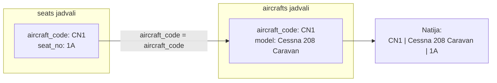
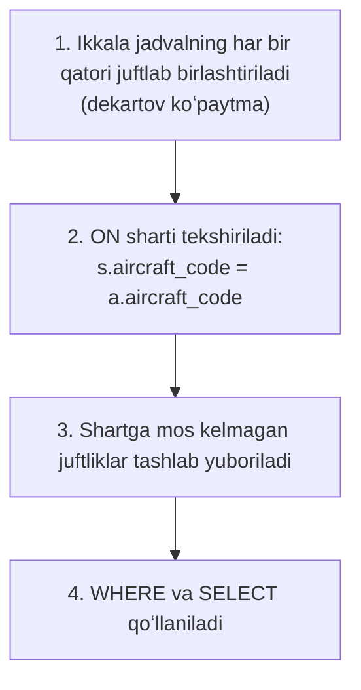
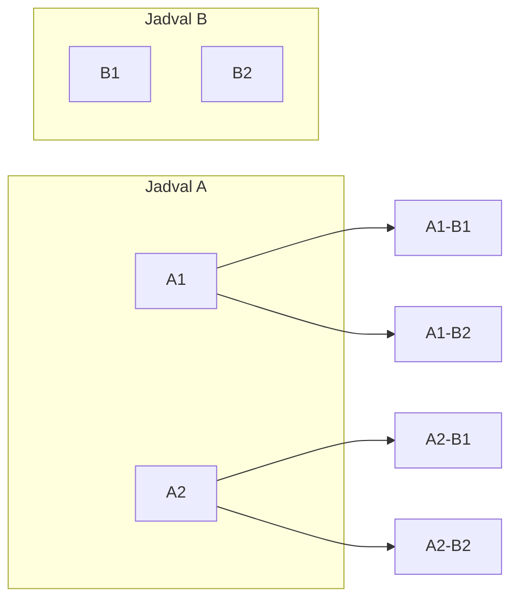
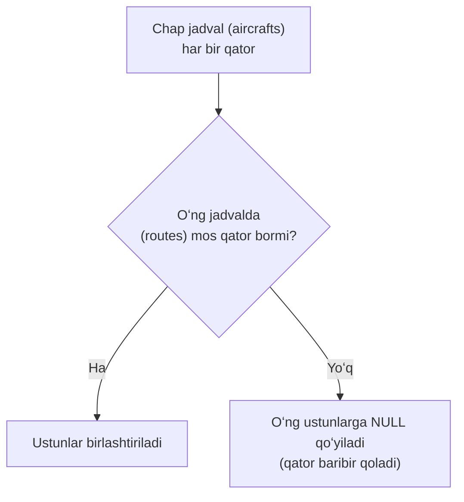
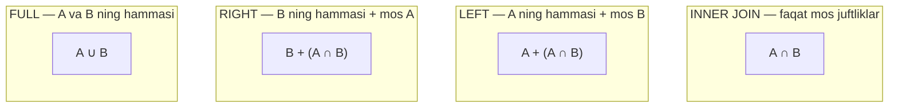

# 10. JOIN — jadvallarni birlashtirish

> 📖 Manba: Моргунов, "PostgreSQL. Основы языка SQL", 6-bob ("Запросы", 6.2-bo'lim, 152–168-betlar)

## Nima uchun kerak?

Relatsion bazada ma'lumotlar **bir necha jadvalga bo'lib** saqlanadi — bu takrorlanishning (dublikatlarning) oldini oladi. Masalan, demo bazada:

- `seats` (o'rindiqlar) jadvalida `aircraft_code` va `seat_no` bor, lekin samolyot **nomi** yo'q.
- `aircrafts` (samolyotlar) jadvalida `aircraft_code` va `model` bor.

Endi "`Cessna 208 Caravan` samolyotining barcha o'rindiqlarini chiqar" desak, muammo tug'iladi: o'rindiqlar `seats` da, model nomi esa `aircrafts` da. Bitta jadvaldan yetarli ma'lumot yo'q.

Yechim — ikkala jadvalni bog'lovchi ustun (`aircraft_code`) orqali **birlashtirish** (join). Aynan shu vazifani `JOIN` bajaradi.



Bu darsda biz `JOIN` ning barcha turlarini ko'ramiz: `INNER`, `LEFT`/`RIGHT OUTER`, `FULL OUTER`, `CROSS` va jadvalning o'zi bilan birlashuvi (self join).

---

## 1. INNER JOIN — mos keladigan qatorlar

Vazifamizni hal qilaylik: `Cessna 208 Caravan` samolyotining barcha o'rindiqlarini chiqaraylik. Ikki jadvalni `aircraft_code` tengligi asosida birlashtiramiz:

```sql
SELECT a.aircraft_code, a.model, s.seat_no, s.fare_conditions
  FROM seats AS s
  JOIN aircrafts AS a
    ON s.aircraft_code = a.aircraft_code
  WHERE a.model ~ '^Cessna'
  ORDER BY s.seat_no;
```

Bu yerda:
- `FROM seats AS s` va `JOIN aircrafts AS a` — ikkala jadvalga qisqa **alias** (`s` va `a`) berildi. Alias'lar `AS` bilan beriladi (`AS` majburiy emas).
- `ON s.aircraft_code = a.aircraft_code` — **birlashtirish sharti**: `seats` dagi `aircraft_code` `aircrafts` dagisiga teng bo'lgan qatorlar bog'lanadi.
- `WHERE a.model ~ '^Cessna'` — faqat Cessna qatorlarini qoldiramiz.

| aircraft_code | model              | seat_no | fare_conditions |
| ------------- | ------------------ | ------- | --------------- |
| CN1           | Cessna 208 Caravan | 1A      | Economy         |
| CN1           | Cessna 208 Caravan | 1B      | Economy         |
| CN1           | Cessna 208 Caravan | 2A      | Economy         |
| CN1           | Cessna 208 Caravan | ...     | Economy         |
| CN1           | Cessna 208 Caravan | 6B      | Economy         |

(Jami 12 qator)

### JOIN mexanizmi qanday ishlaydi?

Ichki mexanizmni soddalashtirib tushuntiramiz (aslida PostgreSQL planner samaraliroq reja quradi, lekin natija shu):



`INNER JOIN` — eng ko'p ishlatiladigan tur. Faqat **ikkala** jadvalda mos juftligi bor qatorlar natijaga tushadi. `JOIN` so'zi o'zi `INNER JOIN` ni bildiradi (`INNER` so'zini yozmasa ham bo'ladi).

### Muqobil yozuv (JOIN so'zisiz)

Xuddi shu so'rovni `JOIN` kalit so'zisiz ham yozish mumkin — jadvallarni `FROM` da vergul bilan sanab, birlashtirish shartini `WHERE` ga o'tkazamiz:

```sql
SELECT a.aircraft_code, a.model, s.seat_no, s.fare_conditions
  FROM seats s, aircrafts a
  WHERE s.aircraft_code = a.aircraft_code
    AND a.model ~ '^Cessna'
  ORDER BY s.seat_no;
```

Ikkala variant **teng kuchli**. Oddiy so'rovlarni ko'pincha aynan shu ikkinchi shaklda yozadilar. Lekin `JOIN ... ON` yozuvi aniqroq: birlashtirish sharti (`ON`) va filtrlash sharti (`WHERE`) alohida ko'rinib turadi.

---

## 2. USING va ON farqi

Birlashtirish sharti ikkala jadvalda **bir xil nomli** ustun bo'yicha bo'lsa (bizdagi `aircraft_code`), `ON` o'rniga qisqaroq `USING` yozish mumkin:

```sql
-- ON bilan:
SELECT * FROM seats s JOIN aircrafts a ON s.aircraft_code = a.aircraft_code;

-- USING bilan (bir xil nomli ustun uchun):
SELECT * FROM seats JOIN aircrafts USING (aircraft_code);
```

Farqi:

| Jihat | `ON` | `USING (ustun)` |
| ----- | ---- | --------------- |
| Ustun nomlari | Turlicha bo'lishi mumkin | **Bir xil bo'lishi shart** |
| Shart | Istalgan ifoda (`<`, `<>`, va h.k.) | Faqat tenglik |
| Natijadagi ustun | Ikkala jadvaldan alohida (`s.aircraft_code`, `a.aircraft_code`) | **Bitta** birlashtirilgan `aircraft_code` |

Ya'ni `USING (aircraft_code)` natijada `aircraft_code` ni faqat **bir marta** chiqaradi, `ON` esa ikkala jadvaldan ham chiqaradi.

---

## 3. Self join — jadvalning o'zi bilan birlashuvi

Bir jadval **o'zi bilan** ham birlasha oladi. Buni **self join** deyiladi. Klassik misol — `flights_v` (reyslar) ko'rinishini yaratishda `airports` jadvali ikki marta ishlatiladi: bir marta **uchish** aeroporti uchun, ikkinchi marta **qo'nish** aeroporti uchun.

Nima uchun ikki marta? Har bir reysning uchish (`departure_airport`) va qo'nish (`arrival_airport`) aeroporti **har xil**. Bitta `airports` jadvali bilan ikkalasini bir vaqtda bog'lab bo'lmaydi. Yechim — jadvalga ikkita turli alias (`dep` va `arr`) berib, xuddi ikkita nusxadek murojaat qilish:

```sql
SELECT f.flight_no,
       dep.airport_name AS departure_airport_name,
       dep.city AS departure_city,
       arr.airport_name AS arrival_airport_name,
       arr.city AS arrival_city
  FROM flights f,
       airports dep,
       airports arr
  WHERE f.departure_airport = dep.airport_code
    AND f.arrival_airport = arr.airport_code;
```

Bu yerda `airports` jadvali `dep` (departure) va `arr` (arrival) nomlari ostida ikki marta qatnashadi. Aslida hech qanday nusxa yaratilmaydi — DBMS shunchaki jadval bo'ylab ikki marta qidiradi. Alias'lar shu ikki "murojaatni" bir-biridan farqlaydi.

### Self join'ning yana bir misoli — CROSS JOIN bilan

Savol: hamma aeroportlar orasida qancha yo'nalish (marshrut) bor? Ya'ni har bir shaharni qolgan hamma shaharlar bilan bog'lab, bir xil shaharga bo'lganlarini chiqarib tashlaymiz. `airports` jadvalini o'zi bilan birlashtiramiz:

```sql
SELECT count( * )
  FROM airports a1, airports a2
  WHERE a1.city <> a2.city;
```

Natija: `10704`. DBMS avval `a1` va `a2` ning barcha juftliklarini (dekartov ko'paytma) tuzadi, so'ng `WHERE a1.city <> a2.city` bilan bir xil shaharlarni tashlab yuboradi.

Xuddi shu narsani `JOIN ... ON` orqali (tenglik emas, **nomo'tenglik** sharti bilan) yozish mumkin:

```sql
SELECT count( * )
  FROM airports a1
  JOIN airports a2 ON a1.city <> a2.city;
```

Natija yana `10704`.

---

## 4. CROSS JOIN — dekartov ko'paytma

`CROSS JOIN` ikkala jadvalning **har bir qatorini** ikkinchi jadvalning **har bir qatori** bilan juftlashtiradi — ya'ni ochiq-oydin **dekartov ko'paytma** yasaydi. Hech qanday `ON` sharti yo'q:

```sql
SELECT count( * )
  FROM airports a1 CROSS JOIN airports a2
  WHERE a1.city <> a2.city;
```

Natija yana `10704`. Ortiqcha qatorlarni (bir xil shahar) `WHERE` bilan filtrladik.



Yuqoridagi 3 ta yozuv (`FROM a1, a2 WHERE`, `JOIN ... ON`, `CROSS JOIN ... WHERE`) DBMS uchun **teng kuchli** — faqat sintaksisi farq qiladi. `CROSS JOIN` da ehtiyot bo'ling: jadvallar katta bo'lsa, natijadagi qatorlar soni portlab ketishi mumkin (N × M).

---

## 5. LEFT OUTER JOIN — chap tashqi birlashuv

`INNER JOIN` da faqat **ikkala** jadvalda juftligi bor qatorlar qoladi. Lekin ba'zan bir jadvaldagi **hamma** qatorlarni saqlashimiz kerak — hatto ikkinchi jadvalda mos qatori bo'lmasa ham.

Savol: har bir samolyot turi qancha yo'nalishda ishlatiladi? `routes` (marshrutlar) jadvalini `aircrafts` bilan birlashtirib, `count` bilan sanaymiz. Avval oddiy `INNER JOIN` bilan:

```sql
SELECT r.aircraft_code, a.model, count( * ) AS num_routes
  FROM routes r
  JOIN aircrafts a ON r.aircraft_code = a.aircraft_code
  GROUP BY 1, 2
  ORDER BY 3 DESC;
```

| aircraft_code | model               | num_routes |
| ------------- | ------------------- | ---------- |
| CR2           | Bombardier CRJ-200  | 232        |
| CN1           | Cessna 208 Caravan  | 170        |
| SU9           | Sukhoi SuperJet-100 | 158        |
| 319           | Airbus A319-100     | 46         |
| ...           | ...                 | ...        |
| 773           | Boeing 777-300      | 10         |

**Muammo:** `aircrafts` da 9 ta model bor, natijada esa faqat 8 ta qator. Demak, bitta samolyot **hech qanday reysda ishlatilmagan** — u `INNER JOIN` natijasidan tushib qoldi. Uni qanday aniqlaymiz?

Yechim — `LEFT OUTER JOIN`:

```sql
SELECT a.aircraft_code AS a_code,
       a.model,
       r.aircraft_code AS r_code,
       count( r.aircraft_code ) AS num_routes
  FROM aircrafts a
  LEFT OUTER JOIN routes r ON r.aircraft_code = a.aircraft_code
  GROUP BY 1, 2, 3
  ORDER BY 4 DESC;
```

| a_code | model               | r_code | num_routes |
| ------ | ------------------- | ------ | ---------- |
| CR2    | Bombardier CRJ-200  | CR2    | 232        |
| CN1    | Cessna 208 Caravan  | CN1    | 170        |
| SU9    | Sukhoi SuperJet-100 | SU9    | 158        |
| ...    | ...                 | ...    | ...        |
| 773    | Boeing 777-300      | 773    | 10         |
| 320    | Airbus A320-200     | *(NULL)* | 0        |

Endi 9 ta qator chiqdi. `320` (Airbus A320-200) samolyoti hech qanday reysda ishlatilmagan.

### LEFT OUTER JOIN qanday ishlaydi?

- **Asosiy (bazaviy) jadval** — `LEFT OUTER JOIN` dan **chapdagi** jadval (`aircrafts`).
- Chap jadvalning **har bir qatori** natijada, albatta, bo'ladi.
- O'ng jadvalda (`routes`) mos qator topilsa — ustunlari birlashtiriladi.
- Mos qator **topilmasa** — o'ng jadval ustunlariga `NULL` qo'yiladi.

Shuning uchun `320` qatorida `r_code` = `NULL` bo'ldi.

**Nozik nuqta — `count( r.aircraft_code )`:** biz `count(*)` emas, aynan `count( r.aircraft_code )` yozdik. Sababi: `count(*)` qatorlar sonini sanaydi va `320` uchun `1` chiqadi (chunki `LEFT JOIN` bitta qator hosil qildi). Ammo `count(ustun)` faqat **`NULL` bo'lmagan** qiymatlarni sanaydi. `320` da `r.aircraft_code` = `NULL` bo'lgani uchun `count` `0` beradi — bu bizga aynan kerak.



---

## 6. RIGHT OUTER JOIN — o'ng tashqi birlashuv

`RIGHT OUTER JOIN` — `LEFT` ning ko'zgudagi aksi. Bunda **o'ngdagi** jadval asosiy bo'ladi va uning hamma qatorlari saqlanadi. O'ng jadval qatoriga chap jadvalda juft topilmasa, chap ustunlarga `NULL` qo'yiladi.

Amalda `RIGHT JOIN` shunchaki **sintaktik qulaylik**: har qanday `RIGHT JOIN` ni jadvallar o'rnini almashtirib `LEFT JOIN` ga aylantirish mumkin. `A RIGHT JOIN B` ≡ `B LEFT JOIN A`.

`RIGHT JOIN` ba'zan tabiiy chiqadi. Masalan, bronlar summasini 100 ming rubl qadam bilan diapazonlarga taqsimlaganimizda "bo'sh" diapazonlarni ham ko'rsatish uchun `RIGHT JOIN` ishlatiladi (virtual `VALUES` jadvali o'ngda turgani uchun):

```sql
SELECT r.min_sum, r.max_sum, count( b.* )
  FROM bookings b
  RIGHT OUTER JOIN
    ( VALUES (       0,  100000 ), (  100000,  200000 ),
             (  200000,  300000 ), (  300000,  400000 ),
             ( 1200000, 1300000 )
    ) AS r ( min_sum, max_sum )
  ON b.total_amount >= r.min_sum AND b.total_amount < r.max_sum
  GROUP BY r.min_sum, r.max_sum
  ORDER BY r.min_sum;
```

| min_sum | max_sum | count  |
| ------- | ------- | ------ |
| 0       | 100000  | 198314 |
| 100000  | 200000  | 46943  |
| ...     | ...     | ...    |
| 1100000 | 1200000 | 0      |
| 1200000 | 1300000 | 1      |

`RIGHT JOIN` bo'lganligi uchun `1 100 000 – 1 200 000` diapazoni bo'sh bo'lsa ham (count = 0) natijaga tushdi. `INNER JOIN` bo'lganda bu qator umuman ko'rinmasdi.

> 💡 **Muhim:** `LEFT`/`RIGHT OUTER JOIN` dagi jadvallar tartibi `SELECT` dagi ustunlar tartibiga **ta'sir qilmaydi**. Ustunlarni `SELECT` da xohlagan tartibda yozishingiz mumkin.

---

## 7. FULL OUTER JOIN — to'liq tashqi birlashuv

`FULL OUTER JOIN` — `LEFT` va `RIGHT` ning birlashmasi. Natijaga:

- Chap jadvalning **hamma** qatorlari (o'ngda juft bo'lmasa `NULL` bilan),
- O'ng jadvalning **hamma** qatorlari (chapda juft bo'lmasa `NULL` bilan)

tushadi. Ya'ni **ikkala jadvalning hamma qatorlari** saqlanadi.



Kundalik hayotdan analogiya: ikkita do'stlar ro'yxati bor deylik. `INNER JOIN` — ikkalasida ham bor odamlar; `LEFT` — birinchi ro'yxatdagilarning hammasi; `RIGHT` — ikkinchi ro'yxatdagilarning hammasi; `FULL` — har ikki ro'yxatdagi barcha odamlar.

---

## 8. Bir nechta jadvalni birlashtirish (multi-table)

Amaliyotda ko'pincha **uch va undan ortiq** jadval birlashtiriladi. Masalan, ro'yxatdan (registratsiyadan) o'tmagan yo'lovchilarni topaylik. Bunda uchta jadval kerak: `ticket_flights` (uchishlar), `flights` (reyslar), `boarding_passes` (posadka taloni):

```sql
SELECT count( * )
  FROM ( ticket_flights t
         JOIN flights f ON t.flight_id = f.flight_id
       )
  LEFT OUTER JOIN boarding_passes b
    ON t.ticket_no = b.ticket_no AND t.flight_id = b.flight_id
  WHERE f.actual_departure IS NOT NULL AND b.flight_id IS NULL;
```

G'oya:
- `ticket_flights` `JOIN` `flights` — reys ma'lumotlarini olamiz.
- `LEFT OUTER JOIN boarding_passes` — chunki yo'lovchi ro'yxatdan o'tmagan bo'lishi mumkin, ya'ni `boarding_passes` da mos qator bo'lmasligi mumkin.
- `WHERE ... b.flight_id IS NULL` — aynan **posadka taloni yo'q** (ya'ni ro'yxatdan o'tmagan) qatorlarni topadi. `LEFT JOIN` dan keyin `NULL` bo'lgan o'ng ustun — "juft topilmadi" degani.

**Jadvallar chapdan o'ngga birlashtiriladi:** avval `FROM` dagi birinchi jadval, unga ikkinchisi, so'ng natijaga uchinchisi va h.k. Tartibni o'zgartirish kerak bo'lsa, qavslardan foydalaniladi.

### Yana murakkabroq — 5 ta jadval

"Bron qilishda tanlangan sinf posadka talonidagi sinfdan farq qilgan holatlarni top" degan vazifada 5 ta jadval birlashtiriladi:

```sql
SELECT f.flight_no, f.scheduled_departure, t.passenger_name,
       tf.fare_conditions AS fc_to_be,
       s.fare_conditions AS fc_fact,
       b.seat_no
  FROM boarding_passes b
  JOIN ticket_flights tf
    ON b.ticket_no = tf.ticket_no AND b.flight_id = tf.flight_id
  JOIN tickets t ON tf.ticket_no = t.ticket_no
  JOIN flights f ON tf.flight_id = f.flight_id
  JOIN seats s
    ON b.seat_no = s.seat_no AND f.aircraft_code = s.aircraft_code
  WHERE tf.fare_conditions <> s.fare_conditions
  ORDER BY f.flight_no, f.scheduled_departure;
```

Bu yerda `boarding_passes` bazaviy jadval sifatida olindi, so'ng bosqichma-bosqich qolgan 4 jadval ulanadi. `WHERE tf.fare_conditions <> s.fare_conditions` — talab qilingan va haqiqiy sinf mos kelmagan holatlarni ajratadi. Ko'p jadvalli so'rovlar aynan shu tamoyilda — bittalab ulanib boradi.

---

## Xulosa

- `JOIN` bir nechta jadvalni bog'lovchi ustun orqali birlashtiradi. `AS` bilan berilgan alias'lar so'rovni qisqartiradi.
- `INNER JOIN` (yoki oddiy `JOIN`) — faqat **ikkala** jadvalda mos juftligi bor qatorlar.
- `ON` — istalgan shart bo'yicha; `USING (ustun)` — bir xil nomli ustun uchun qisqartma (natijada ustun bir marta chiqadi).
- `LEFT OUTER JOIN` — chap jadvalning hamma qatorlari (o'ngda juft yo'q bo'lsa `NULL`).
- `RIGHT OUTER JOIN` — o'ng jadvalning hamma qatorlari; `A RIGHT JOIN B` ≡ `B LEFT JOIN A`.
- `FULL OUTER JOIN` — ikkala jadvalning hamma qatorlari.
- `CROSS JOIN` — dekartov ko'paytma (har bir qator har biriga juftlanadi).
- **Self join** — jadval o'zi bilan birlashadi (turli alias'lar bilan), masalan uchish va qo'nish aeroportlari.
- Bir nechta jadval **chapdan o'ngga** ketma-ket birlashtiriladi.

### Eslab qol

> - `INNER JOIN` — kesishma (∩), `FULL JOIN` — birlashma (∪), `LEFT`/`RIGHT` — bir tomonning hammasi.
> - `LEFT JOIN` dan keyin `WHERE oʻng_ustun IS NULL` — "juft topilmadi" holatlarini topadi (masalan, ro'yxatdan o'tmaganlar).
> - `count(*)` va `count(ustun)` farqi: `count(ustun)` `NULL` larni **sanamaydi** — outer join'da 0 chiqarish uchun muhim.
> - Self join — bitta jadvalga ikki turli alias bilan murojaat qilish.

### Amaliyot

1. `seats` va `aircrafts` ni birlashtirib, `Boeing 777-300` samolyotining barcha `Business` sinf o'rindiqlarini chiqaring.
2. Yuqoridagi so'rovni `USING` bilan qayta yozing.
3. `routes` va `aircrafts` ni `LEFT JOIN` bilan birlashtirib, hech qanday reysda ishlatilmaydigan samolyot(lar)ni toping.
4. `flights` va `airports` ni ikki marta (self join) birlashtirib, har bir reysning uchish va qo'nish shaharlarini chiqaring.
5. `CROSS JOIN` bilan `aircrafts` va `seats` jadvallaridagi qatorlar sonining ko'paytmasini hisoblang (natija sonini oldindan taxmin qiling).
6. Uchta jadvalni (`tickets`, `ticket_flights`, `flights`) birlashtirib, biror yo'lovchining hamma reyslarini chiqaring.

## Nazorat savollari

1. Nima uchun ma'lumotlar bir nechta jadvalga bo'lib saqlanadi va bu `JOIN` ni zaruriy qiladi?
2. `INNER JOIN` va `LEFT OUTER JOIN` orasidagi asosiy farq nimada? Qaysi biri qatorlarni "yo'qotishi" mumkin?
3. `ON` va `USING` orasidagi farqlarni ayting. `USING` qachon ishlatib bo'lmaydi?
4. `A RIGHT JOIN B` ni `LEFT JOIN` orqali qanday yozish mumkin?
5. `FULL OUTER JOIN` natijasiga qaysi qatorlar tushadi? Uni to'plamlar tili bilan tushuntiring.
6. `CROSS JOIN` nima qiladi va nima uchun katta jadvallarda ehtiyot bo'lish kerak?
7. Self join nima va u qanday holatlarda kerak bo'ladi? Uchish/qo'nish aeroporti misolida tushuntiring.
8. `LEFT JOIN` da nima uchun `count(*)` emas, `count(ustun_nomi)` ishlatilishi mumkinligini tushuntiring.
