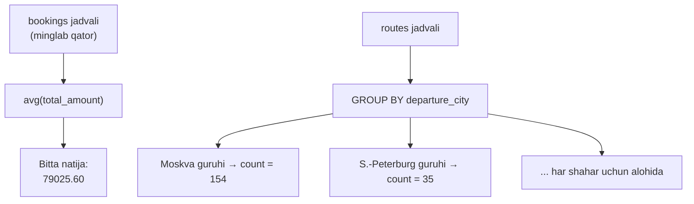
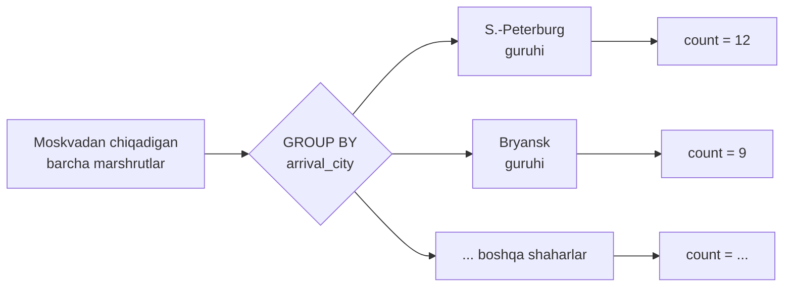
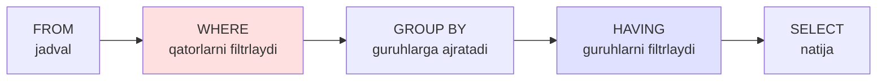
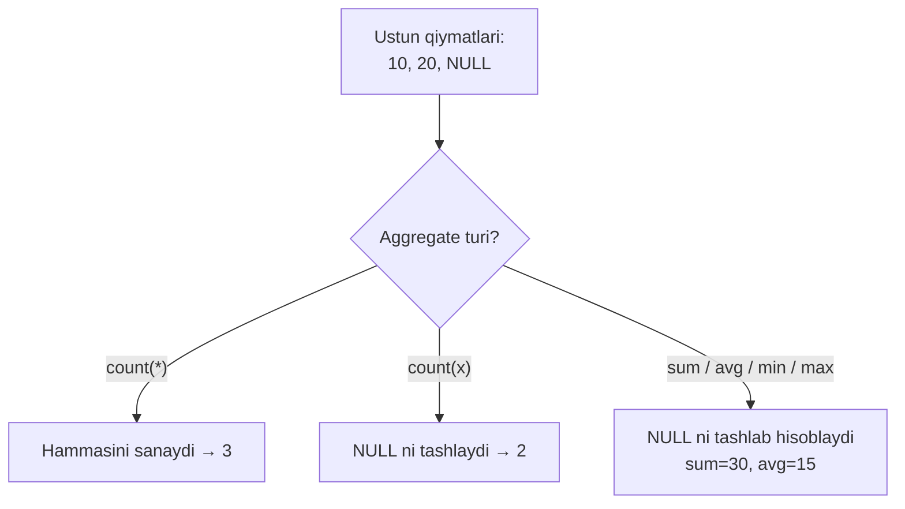
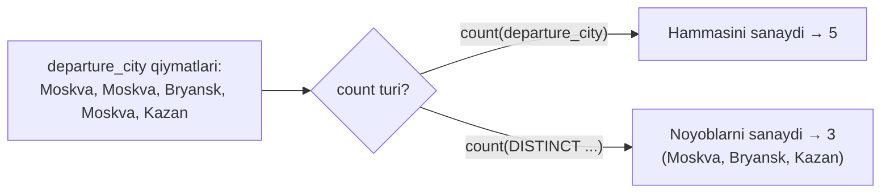

# 11. Aggregation va GROUP BY

> 📖 Manba: Моргунов, "PostgreSQL. Основы языка SQL", 6-bob ("Запросы", 6.3-bo'lim, 168–176-betlar)

## Nima uchun kerak?

Odatdagi `SELECT` **har bir qator** uchun bittadan natija qaytaradi: 100 ta qator kirsa — 100 ta qator chiqadi. Lekin ko'pincha bizga alohida qatorlar emas, **umumlashtirilgan** (jamlangan) ma'lumot kerak bo'ladi:

- "Bronlarning **o'rtacha** summasi qancha?"
- "Eng **qimmat** bron qancha turadi?"
- "Moskvadan **nechta** yo'nalish (marshrut) bor?"

Bu savollarga javob berish uchun ko'p qatorni **bitta** qiymatga siqib chiqarish kerak. Aynan shu vazifani **aggregate funksiyalar** (`count`, `sum`, `avg`, `min`, `max`) bajaradi — ular ustundagi butun bir qatorlar to'plamini oladi va bitta natija qaytaradi.

`GROUP BY` esa bir qadam oldinga boradi: qatorlarni **guruhlarga** ajratib, har bir guruh uchun aggregate funksiyani alohida hisoblaydi. Masalan, "har bir shahardan nechta yo'nalish bor?" degan savolda har bir shahar — alohida guruh.



Oldingi darsda (`10. JOIN`) biz `count(*)` va `GROUP BY` ni bir necha marta ishlatgan edik. Bu darsda ularni **tartib bilan**, chuqurroq o'rganamiz.

---

## 1. Aggregate funksiyalar: count, sum, avg, min, max

Aggregate funksiya bir ustunning ko'p qatoridagi qiymatlarini oladi va bitta qiymat qaytaradi. Eng ko'p ishlatiladigan beshtasi:

| Funksiya | Vazifasi |
| -------- | -------- |
| `count()` | qatorlar **sonini** sanaydi |
| `sum()`   | qiymatlar **yig'indisini** hisoblaydi |
| `avg()`   | **o'rtacha** qiymatni hisoblaydi (average) |
| `min()`   | eng **kichik** qiymat |
| `max()`   | eng **katta** qiymat |

Barcha misollarni demo bazadagi `bookings` (bronlar) jadvali ustida ko'ramiz. Uning `total_amount` ustunida har bir bronning umumiy summasi saqlanadi.

**O'rtacha summa** (`avg` — average so'zidan):

```sql
SELECT avg( total_amount ) FROM bookings;
```

```
        avg
--------------------
 79025.605811528685
(1 qator)
```

**Eng katta summa** (`max`):

```sql
SELECT max( total_amount ) FROM bookings;
```

```
    max
------------
 1204500.00
(1 qator)
```

**Eng kichik summa** (`min`):

```sql
SELECT min( total_amount ) FROM bookings;
```

```
   min
---------
 3400.00
(1 qator)
```

Diqqat qiling: bu so'rovlarda `bookings` jadvalida minglab qator bor, lekin natija — har doim **bitta** qator, **bitta** son. Bir nechta aggregate funksiyani bitta so'rovda birlashtirsa ham bo'ladi:

```sql
SELECT count( * ) AS jami_bron,
       min( total_amount ) AS eng_arzon,
       max( total_amount ) AS eng_qimmat,
       round( avg( total_amount ), 2 ) AS ortacha
  FROM bookings;
```

Bu yerda `round( ..., 2 )` o'rtacha qiymatni ikki xona aniqlikda yaxlitlaydi. Bitta so'rovda to'rttala ko'rsatkichni birga oldik.

### count() ning ikki ko'rinishi

`count` ikki xil ishlaydi va bu farqni yaxshi tushunish muhim:

- `count( * )` — jadvaldagi **barcha qatorlarni** sanaydi (qiymati `NULL` bo'lganini ham).
- `count( ustun )` — faqat o'sha ustunda qiymati `NULL` **bo'lmagan** qatorlarni sanaydi.

Bu farqni 4-bo'limda batafsil ko'ramiz.

---

## 2. GROUP BY — qatorlarni guruhlash

Yuqoridagi misollarda aggregate funksiya butun jadvalni bitta guruh deb qaradi. Ammo ko'pincha bizga "har bir shahar uchun alohida", "har bir sana uchun alohida" kabi **guruhlangan** natija kerak. Aynan shu yerda `GROUP BY` yordamga keladi.

Vazifa: **Moskvadan** boshqa shaharlarga qancha marshrut mavjud? Bunda reysning haftada necha marta uchishini hisobga olmaymiz — bir marta uchsa ham, yetti marta uchsa ham, marshrut bitta hisoblanadi. `routes` (marshrutlar) materiallashtirilgan ko'rinishidan foydalanamiz:

```sql
SELECT arrival_city, count( * )
  FROM routes
  WHERE departure_city = 'Москва'
  GROUP BY arrival_city
  ORDER BY count DESC;
```

```
   arrival_city    | count
-------------------+-------
 Санкт-Петербург   |    12
 Брянск            |     9
 Ульяновск         |     5
 ...
```

So'rov qanday ishladi:
- `WHERE departure_city = 'Москва'` — avval faqat Moskvadan chiqadigan marshrutlarni qoldiramiz.
- `GROUP BY arrival_city` — qolgan qatorlarni **kelish shahri** bo'yicha guruhlarga ajratamiz (barcha "S.-Peterburg" qatorlari bitta guruh, barcha "Bryansk" qatorlari boshqa guruh va h.k.).
- `count( * )` — har bir guruhdagi qatorlar sonini sanaydi.
- `ORDER BY count DESC` — natijani kamayish tartibida chiqaramiz.



### Muhim qoida: SELECT da nima yozish mumkin?

`GROUP BY` ishlatilganda `SELECT` ro'yxatida faqat quyidagilar bo'lishi mumkin:
1. `GROUP BY` da sanab o'tilgan ustunlar (bizda `arrival_city`),
2. aggregate funksiyalar (bizda `count(*)`).

Chunki har bir guruh natijada **bitta** qatorga aylanadi. Agar guruhlanmagan oddiy ustunni yozsak, DBMS "bu ustunning qaysi qiymatini olay?" deb tushunmay qoladi va xatolik beradi.

### Ifoda bo'yicha guruhlash

`GROUP BY` da nafaqat ustun, balki **ifoda** ham bo'lishi mumkin. Vazifa: kompaniya rahbariyatiga umumlashtirilgan ma'lumot kerak — haftada nechta reys **har kuni** uchadi, nechtasi **haftada olti kun**, nechtasi **besh kun** va hokazo. `routes` jadvalining `days_of_week` ustunida reys uchadigan hafta kunlari **massiv** ko'rinishida saqlanadi:

```sql
SELECT array_length( days_of_week, 1 ) AS days_per_week,
       count( * ) AS num_routes
  FROM routes
  GROUP BY days_per_week
  ORDER BY 1 DESC;
```

```
 days_per_week | num_routes
---------------+------------
             7 |        482
             3 |         54
             2 |         88
             1 |         86
(4 qator)
```

Bu yerda:
- `array_length( days_of_week, 1 )` — massivdagi elementlar sonini qaytaradi, ya'ni reys haftada necha kun uchishini. Massiv bir o'lchamli bo'lgani uchun ikkinchi parametr `1` (birinchi o'lchov).
- `GROUP BY days_per_week` — haftadagi kunlar soni bo'yicha guruhlaymiz.
- `ORDER BY 1 DESC` — bu yerda `1` birinchi ustun (`days_per_week`) degani. Ustun raqami bilan tartiblash qulay qisqartma.

---

## 3. HAVING — guruhlarni filtrlash (WHERE bilan farqi)

`WHERE` bilan biz **alohida qatorlarni** filtrlaymiz. Xuddi shunday, guruhlarni ham filtrlash mumkin: natijaga hamma guruhlarni emas, balki biror **shartni qanoatlantiradigan** guruhlarni kiritish. Buning uchun `HAVING` qo'llaniladi.

**Eng muhim farq — qachon ishlaydi:**

- `WHERE` guruhlashdan **oldin** ishlaydi — alohida qatorlar bilan.
- `HAVING` guruhlashdan **keyin** ishlaydi — tayyor guruhlar bilan.

Shuning uchun `HAVING` ichida aggregate funksiyalar (`count(*)`, `sum(...)`) ishlatish mumkin, `WHERE` ichida esa mumkin emas (guruh hali hosil bo'lmagan bo'ladi).



Vazifa: har bir shahardan boshqa shaharlarga qancha marshrut chiqishini aniqlab, faqat **kamida 15 ta** marshrut chiqadigan shaharlarni chiqaramiz:

```sql
SELECT departure_city, count( * )
  FROM routes
  GROUP BY departure_city
  HAVING count( * ) >= 15
  ORDER BY count DESC;
```

```
 departure_city  | count
-----------------+-------
 Москва          |   154
 Санкт-Петербург |    35
 Новосибирск     |    19
 Екатеринбург    |    15
(4 qator)
```

Diqqat: `HAVING count( * ) >= 15` shartini `WHERE` ga yozib bo'lmaydi, chunki `count(*)` — guruh hosil bo'lgandan **keyin** hisoblanadigan qiymat.

Yana bir misol: aksariyat shaharlarda bitta aeroport bor, lekin bir nechta aeroportli shaharlar ham bor. Ularni topamiz:

```sql
SELECT city, count( * )
  FROM airports
  GROUP BY city
  HAVING count( * ) > 1;
```

```
   city    | count
-----------+-------
 Ульяновск |     2
 Москва    |     3
(2 qator)
```

Moskvada 3 ta aeroport (Vnukovo, Domodedovo, Sheremetyevo), Ulyanovskda 2 ta. `HAVING count(*) > 1` aynan shu ko'p aeroportli shaharlarni ajratib berdi.

### WHERE va HAVING birga

Bitta so'rovda ikkalasi ham bo'lishi mumkin. Masalan: "Moskvadan chiqadigan marshrutlarni ko'rib, kamida 3 marta uchraydigan kelish shaharlarini chiqar":

```sql
SELECT arrival_city, count( * )
  FROM routes
  WHERE departure_city = 'Москва'   -- avval qatorlarni filtrlaydi
  GROUP BY arrival_city
  HAVING count( * ) >= 3            -- keyin guruhlarni filtrlaydi
  ORDER BY count DESC;
```

Bu yerda `WHERE` avval Moskvadan chiqmagan qatorlarni tashlaydi, so'ng `GROUP BY` guruhlaydi, oxirida `HAVING` kam uchraydigan guruhlarni chiqarib tashlaydi. Har bir band o'z o'rnida ishlaydi.

---

## 4. NULL va aggregate funksiyalar

`NULL` — "qiymat noma'lum yoki yo'q" degani. Aggregate funksiyalar `NULL` ga alohida munosabatda bo'ladi va buni bilmaslik **noto'g'ri natijalarga** olib keladi.

**Asosiy qoida:** `count(*)` dan tashqari barcha aggregate funksiyalar (`sum`, `avg`, `min`, `max`, `count(ustun)`) `NULL` qiymatlarni **e'tiborsiz qoldiradi** — go'yo ular umuman yo'qdek.

Buni kichik misolda ko'ramiz. `VALUES` orqali uchta qatordan iborat vaqtinchalik jadval yasaymiz, uchinchisi `NULL`:

```sql
SELECT count( * )  AS jami_qator,
       count( x )  AS null_bolmagan,
       sum( x )    AS yigindi,
       avg( x )    AS ortacha
  FROM ( VALUES (10), (20), (NULL) ) AS t(x);
```

```
 jami_qator | null_bolmagan | yigindi |        ortacha
------------+---------------+---------+------------------------
          3 |             2 |      30 | 15.0000000000000000
```

Muhim kuzatishlar:
- `count(*)` = **3** — hamma qatorni sanadi (`NULL` ni ham).
- `count(x)` = **2** — `NULL` qatorni sanamadi.
- `sum(x)` = **30** — `NULL` ni qo'shmadi (10 + 20).
- `avg(x)` = **15**, **10 emas!** — o'rtacha `30 / 2` deb hisoblandi (`NULL` maxrajga ham kirmadi). Agar `NULL` ni `0` deb sanaganda, `30 / 3 = 10` bo'lardi. Demak `avg` uchun "`NULL`" bilan "`0`" **butunlay boshqa narsa**.



### Demo bazada NULL ni sanash

Amaliy misol: `flights` (reyslar) jadvalida `actual_departure` ustuni reys **haqiqatda** uchgan vaqtni saqlaydi. Agar reys hali uchmagan bo'lsa (rejalashtirilgan), bu ustun `NULL` bo'ladi. `count` ning ikki ko'rinishi bilan uchgan va uchmagan reyslarni ajratamiz:

```sql
SELECT count( * )                          AS jami_reys,
       count( actual_departure )           AS uchgan,
       count( * ) - count( actual_departure ) AS uchmagan
  FROM flights;
```

Bu yerda `count(*)` barcha reyslarni, `count(actual_departure)` esa faqat haqiqatda uchgan (ya'ni `actual_departure` `NULL` emas) reyslarni sanadi. Ularning ayirmasi — hali uchmagan reyslar soni. Bir ustunning `NULL` liligini `count` bilan shu tarzda "o'lchash" mumkin.

> 💡 **Yodda tuting:** agar guruhda barcha qiymat `NULL` bo'lsa, `sum`/`avg`/`min`/`max` `NULL` qaytaradi (0 emas!), `count(ustun)` esa `0` qaytaradi.

---

## 5. DISTINCT bilan aggregate

Ba'zan bizga qiymatlarning **barchasi** emas, balki faqat **noyob (takrorlanmas)** qiymatlar kerak bo'ladi. Buning uchun aggregate funksiya ichiga `DISTINCT` yoziladi.

Misol: `routes` jadvalida qancha **noyob** chiqish shahri borligini sanaymiz. Agar oddiy `count` ishlatsak, bir shahar necha marta uchrasa, shuncha sanaladi. `DISTINCT` bilan esa har bir shahar **bir marta** hisoblanadi:

```sql
SELECT count( departure_city )          AS jami,
       count( DISTINCT departure_city ) AS noyob_shaharlar
  FROM routes;
```

- `count( departure_city )` — barcha qatorlardagi chiqish shaharlarini sanaydi (Moskva 154 marta uchrasa, 154 ta hisoblaydi).
- `count( DISTINCT departure_city )` — nechta **har xil** shahar borligini sanaydi (Moskva necha marta uchrasa ham, bir marta).

Bu ikki son ancha farq qiladi: birinchisi — umumiy marshrutlar, ikkinchisi — reyslar chiqadigan shaharlar soni.

`DISTINCT` ni boshqa aggregate funksiyalar bilan ham ishlatish mumkin:

```sql
-- Noyob bron summalarining o'rtachasi:
SELECT avg( DISTINCT total_amount ) FROM bookings;

-- Nechta har xil bron summasi mavjud:
SELECT count( DISTINCT total_amount ) FROM bookings;
```



> `DISTINCT` — takrorlanuvchi qiymatlar noyob hisobga aylanishi kerak bo'lganda ishlatiladi. Ammo katta jadvallarda u qo'shimcha ish (saralash/tozalash) talab qilishini yodda tuting.

---

## Xulosa

- **Aggregate funksiyalar** ko'p qatorni **bitta** qiymatga siqadi: `count`, `sum`, `avg`, `min`, `max`.
- `count( * )` — barcha qatorlarni (NULL bilan), `count( ustun )` — faqat NULL bo'lmaganlarni sanaydi.
- `GROUP BY` qatorlarni **guruhlarga** ajratadi; har bir guruh natijada bitta qatorga aylanadi.
- `GROUP BY` bilan `SELECT` da faqat guruhlangan ustunlar va aggregate funksiyalar bo'lishi mumkin.
- `WHERE` — guruhlashdan **oldin** (qatorlar bilan), `HAVING` — guruhlashdan **keyin** (guruhlar bilan) ishlaydi. `HAVING` ichida aggregate ishlatsa bo'ladi, `WHERE` ichida yo'q.
- `sum`/`avg`/`min`/`max` va `count(ustun)` `NULL` ni **e'tiborsiz qoldiradi**; faqat `count(*)` NULL ni ham sanaydi.
- `avg` uchun `NULL` bilan `0` — boshqa-boshqa: `NULL` maxrajga umuman kirmaydi.
- `count( DISTINCT ustun )` — noyob qiymatlar sonini beradi.

### Eslab qol

> - Bajarilish tartibi: **FROM → WHERE → GROUP BY → HAVING → SELECT → ORDER BY**.
> - `WHERE` — qatorlar uchun, `HAVING` — guruhlar uchun.
> - `count(*)` ≠ `count(ustun)`: farqi — NULL larni sanaydimi yoki yo'qmi.
> - `avg` da NULL ≠ 0. Agar 0 kerak bo'lsa, `COALESCE(ustun, 0)` bilan almashtiring.
> - `count(DISTINCT ...)` — "nechta har xil qiymat bor?" savoliga javob.

### Amaliyot

1. `bookings` jadvalidagi barcha bronlar sonini va umumiy summasini (`sum`) bitta so'rovda chiqaring.
2. `flights` jadvalida har bir `departure_city` uchun reyslar sonini `GROUP BY` bilan sanang, kamayish tartibida chiqaring.
3. Yuqoridagi so'rovga `HAVING` qo'shib, faqat 100 tadan ko'p reysi bor shaharlarni qoldiring.
4. `seats` jadvalida har bir `aircraft_code` uchun o'rindiqlar sonini sanang.
5. `flights` jadvalida `actual_arrival` ustuni bo'yicha `count(*)` va `count(actual_arrival)` ni taqqoslab, hali qo'nmagan reyslar sonini toping.
6. `routes` jadvalida nechta noyob `arrival_city` borligini `count(DISTINCT ...)` bilan aniqlang.

## Nazorat savollari

1. Aggregate funksiya oddiy `SELECT` dan nimasi bilan farq qiladi? Nechta qator qaytaradi?
2. `count( * )` va `count( ustun )` orasidagi farqni tushuntiring. Qaysi biri `NULL` larni sanaydi?
3. `GROUP BY` ishlatilganda `SELECT` ro'yxatida qanday ustunlar bo'lishi mumkin? Nima uchun cheklov bor?
4. `WHERE` va `HAVING` orasidagi asosiy farq nimada? Nima uchun `count(*)` ni `WHERE` ga yoza olmaymiz?
5. `avg( x )` funksiyasi `NULL` qiymatlarni qanday ishlaydi? `NULL` bilan `0` orasidagi farq natijaga qanday ta'sir qiladi?
6. Bir guruhdagi barcha qiymat `NULL` bo'lsa, `sum` va `count(ustun)` nima qaytaradi?
7. `count( DISTINCT departure_city )` va `count( departure_city )` qanday holatlarda turli natija beradi?
8. So'rovda `WHERE`, `GROUP BY`, `HAVING`, `SELECT` bandlari qaysi tartibda bajariladi?
