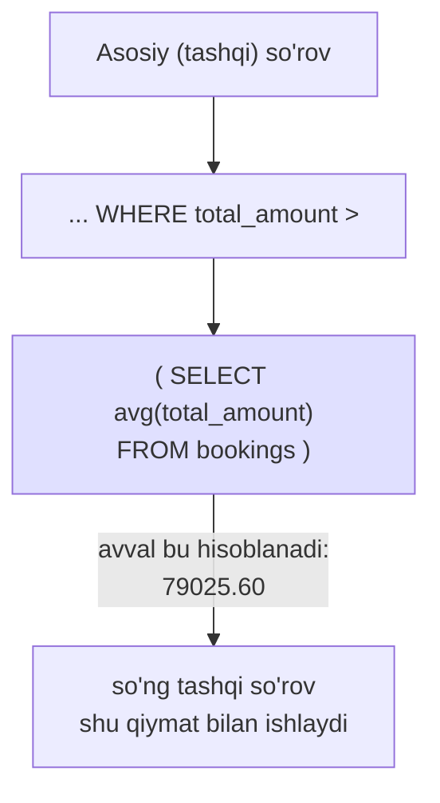
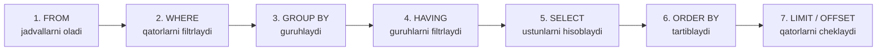
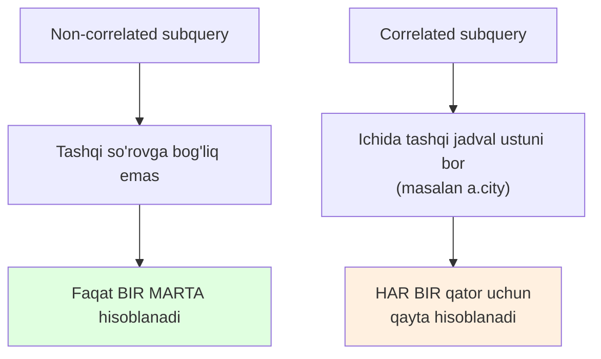
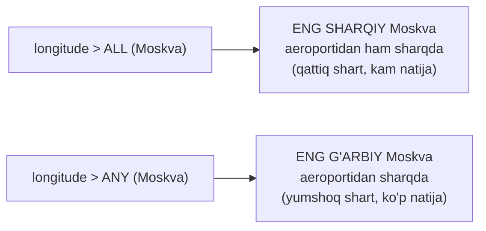
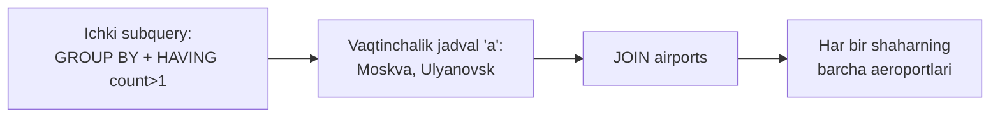
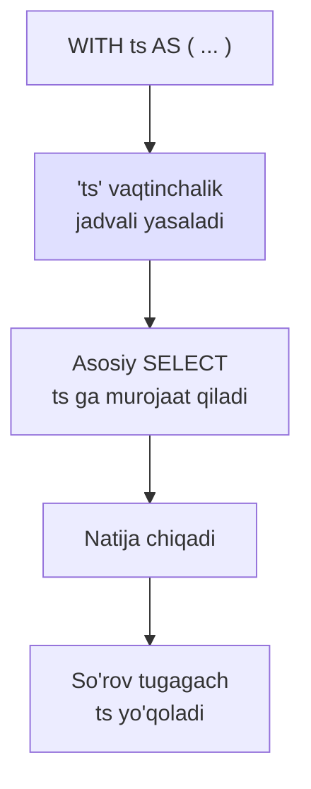

# 12. Subquery — ichma-ich so'rovlar

> 📖 Manba: Моргунов, "PostgreSQL. Основы языка SQL", 6-bob ("Запросы", 6.4-bo'lim, 176–192-betlar)

## Nima uchun kerak?

Ba'zan bitta savolga javob berish uchun **avval boshqa savolga** javob topish kerak bo'ladi. Masalan:

> "Umumiy summasi **o'rtachadan yuqori** bo'lgan bronlar nechta?"

Buni bir bosqichda hal qilib bo'lmaydi. Avval "o'rtacha summa qancha?" ni bilishimiz, so'ng shu qiymatdan yuqori bronlarni sanashimiz kerak. Ya'ni bitta `SELECT` ichida yana bitta `SELECT` yashiringan bo'ladi. Aynan shu ichki so'rov — **subquery** (ichma-ich so'rov, podzapros) deb ataladi.

Subquery — qavs ichiga olingan `SELECT`, u kattaroq so'rovning bir qismidir. U quyidagi joylarda uchrashi mumkin: `SELECT`, `FROM`, `WHERE`, `HAVING` va `WITH` bandlarida.



Oldingi darslarda (`10. JOIN`, `11. Aggregation`) o'rgangan `JOIN`, `count`, `GROUP BY`, `HAVING` larni bu darsda subquery bilan birlashtiramiz.

---

## 0. Avval: SELECT mantiqan qanday ishlaydi?

Subquery larni tushunish uchun `SELECT` ning bandlari qaysi **tartibda** bajarilishini bilish kerak (bu mantiqiy tartib; amalda planner optimallashtiradi):



Diqqat: `SELECT` (5-qadam) `WHERE` (2-qadam) dan **keyin** bajariladi. Shuning uchun `SELECT` da yaratilgan alias larni `WHERE` da ishlatib bo'lmaydi. Bu tartibni bilib, endi subquery larga o'tamiz.

---

## 1. Scalar subquery — bitta qiymat qaytaruvchi subquery

Agar subquery **bitta** qiymat (bitta ustun, bitta qator) qaytarsa, u **scalar subquery** deyiladi. Bunday qiymatni boshqa qiymatlar bilan solishtirsa bo'ladi (`>`, `<`, `=` va h.k.).

Vazifa: umumiy summasi **butun jadvaldagi o'rtachadan** yuqori bo'lgan bronlar nechta?

```sql
SELECT count( * ) FROM bookings
  WHERE total_amount >
    ( SELECT avg( total_amount ) FROM bookings );
```

```
 count
-------
 87224
(1 qator)
```

Bu yerda ikkita `SELECT` bor:
- **Ichki** (subquery): `SELECT avg( total_amount ) FROM bookings` — bitta son qaytaradi (o'rtacha ≈ 79025.60). Bu scalar subquery.
- **Tashqi** (asosiy): har bir bronning summasini shu o'rtacha bilan solishtiradi va yuqorilarini sanaydi.

**Muhim xususiyat:** bu subquery butun tashqi so'rov uchun **faqat bir marta** hisoblanadi, chunki uning natijasi tashqi so'rovning qatorlariga bog'liq emas. Bunday subquery lar **non-correlated** (bog'lanmagan) deb ataladi.

---

## 2. WHERE ichida subquery: IN predikati

Agar subquery **ko'p qiymat** (bitta ustun, ko'p qator) qaytarsa, uni `IN` predikati bilan ishlatish mumkin. `IN` biror qiymat berilgan to'plamga **tegishli yoki yo'qligini** tekshiradi.

Vazifa: `Asia/Krasnoyarsk` vaqt mintaqasidagi shaharlar orasida qanday marshrutlar mavjud? Subquery shu mintaqadagi shaharlar ro'yxatini beradi, tashqi so'rov esa marshrutning ikkala uchi ham shu ro'yxatda ekanligini tekshiradi:

```sql
SELECT flight_no, departure_city, arrival_city
  FROM routes
  WHERE departure_city IN (
      SELECT city
        FROM airports
        WHERE timezone ~ 'Krasnoyarsk'
    )
    AND arrival_city IN (
      SELECT city
        FROM airports
        WHERE timezone ~ 'Krasnoyarsk'
    );
```

```
 flight_no | departure_city | arrival_city
-----------+----------------+--------------
 PG0070    | Абакан         | Томск
 PG0071    | Томск          | Абакан
 PG0313    | Абакан         | Кызыл
 PG0314    | Кызыл          | Абакан
 PG0653    | Красноярск     | Барнаул
 PG0654    | Барнаул        | Красноярск
(6 qator)
```

Bu subquery ham **non-correlated**: `Krasnoyarsk` mintaqasidagi shaharlar ro'yxati bir marta hisoblanadi, so'ng har bir marshrut shu ro'yxat bilan taqqoslanadi.

### IN uchun to'plamni scalar subquery lardan yasash

`IN` ichida bir nechta scalar subquery ni ham sanab yozish mumkin. Vazifa: eng **g'arbiy** va eng **sharqiy** aeroportlarni topamiz (`longitude` — geografik uzunlik):

```sql
SELECT airport_name, city, longitude
  FROM airports
  WHERE longitude IN (
    ( SELECT max( longitude ) FROM airports ),
    ( SELECT min( longitude ) FROM airports )
  )
  ORDER BY longitude;
```

```
 airport_name |    city     | longitude
--------------+-------------+------------
 Храброво     | Калининград |  20.592633
 Анадырь      | Анадырь     | 177.741483
(2 qator)
```

Eng kichik `longitude` — g'arbdagi Kaliningrad, eng katta — sharqdagi Anadyr.

Aksincha, biror qiymatlarni **chiqarib tashlash** kerak bo'lsa, `NOT IN` ishlatiladi.

---

## 3. WHERE ichida subquery: EXISTS predikati

Ba'zan subquery dan faqat **qator bor-yo'qligini** bilish talab qilinadi — qatorlardagi aniq qiymatlar bizni qiziqtirmaydi. Bunday holatda `EXISTS` (yoki `NOT EXISTS`) ishlatiladi. `EXISTS` "shu shartga mos kamida bitta qator bormi?" degan savolga `true`/`false` bilan javob beradi.

Vazifa: **Moskvadan reys yo'q** shaharlarni topamiz:

```sql
SELECT DISTINCT a.city
  FROM airports a
  WHERE NOT EXISTS (
    SELECT 1 FROM routes r
      WHERE r.departure_city = 'Москва'
        AND r.arrival_city = a.city
    )
    AND a.city <> 'Москва'
  ORDER BY city;
```

```
      city
-----------------
 Благовещенск
 Иваново
 ...
 Якутск
 Ярославль
(20 qator)
```

Bu so'rovda muhim jihatlar:
- `routes` (marshrutlar) da faqat **mavjud** yo'nalishlar bor, shuning uchun "yo'q" yo'nalishlarni topish uchun to'liq shaharlar ro'yxati kerak — u `airports` jadvalida. Har bir shahar uchun `routes` da mos qator qidiriladi; **topilmasa**, demak Moskvadan bu shaharga marshrut yo'q.
- `SELECT 1` — `EXISTS` ga qatorning **mavjudligi** yetarli, ustun qiymatlari kerak emas, shuning uchun `*` yoki ustunlar ro'yxati o'rniga oddiy `1` yoziladi (hujjatda tavsiya etilgan uslub).
- `DISTINCT` — bir shaharda bir nechta aeroport bo'lishi mumkin (masalan, Ulyanovsk), `DISTINCT` bo'lmasa dublikat qatorlar chiqishi mumkin.

### Correlated (bog'langan) subquery

Yuqoridagi subquery ning muhim xususiyati — u ichida **tashqi so'rovning jadvaliga murojaat** bor:

```sql
WHERE ...
  AND r.arrival_city = a.city
```

Bu yerda `a.city` — tashqi so'rovning (`airports a`) ustuni. Bunday subquery lar **correlated (bog'langan)** deb ataladi. Ular non-correlated dan farqli o'laroq, nazariy jihatdan tashqi so'rovning **har bir qatori uchun** qaytadan bajariladi (amalda planner buni optimallashtirishga harakat qiladi).



---

## 4. ANY va ALL — to'plam bilan solishtirish

`IN` — bu aslida "to'plamdagi qiymatlardan **biriga teng**" degani. Umumiyroq solishtirish uchun `ANY` va `ALL` ishlatiladi. Ular scalar qiymatni subquery qaytargan **to'plam** bilan `>`, `<`, `>=`, `=` kabi operatorlar orqali solishtiradi:

- `x > ANY (subquery)` — `x` to'plamdagi **kamida bitta** qiymatdan katta bo'lsa `true`.
- `x > ALL (subquery)` — `x` to'plamdagi **barcha** qiymatlardan katta bo'lsa `true`.

Foydali tengliklar:

| Yozuv | Teng ma'nosi |
| ----- | ------------ |
| `x = ANY (...)` | `x IN (...)` |
| `x <> ALL (...)` | `x NOT IN (...)` |

Vazifa: **barcha** Moskva aeroportlaridan sharqroqda joylashgan aeroportlarni topamiz. "Sharqroq" — `longitude` kattaroq. "Barchasidan" so'zi `ALL` ni bildiradi:

```sql
SELECT airport_name, city, longitude
  FROM airports
  WHERE longitude > ALL (
    SELECT longitude
      FROM airports
      WHERE city = 'Москва'
  )
  ORDER BY longitude;
```

Bu so'rov `longitude` qiymati **hamma** Moskva aeroportlarinikidan katta bo'lgan aeroportlarni beradi (ya'ni eng sharqiy Moskva aeroportidan ham sharqda joylashganlar).

Endi `ANY` bilan solishtiraylik — **kamida bitta** Moskva aeroportidan sharqroqda bo'lganlar:

```sql
SELECT airport_name, city, longitude
  FROM airports
  WHERE longitude > ANY (
    SELECT longitude
      FROM airports
      WHERE city = 'Москва'
  )
  ORDER BY longitude;
```

`ANY` versiyasi ancha ko'proq aeroport qaytaradi, chunki eng g'arbiy Moskva aeroportidan sharqroqda bo'lish yetarli.



---

## 5. FROM ichida subquery — vaqtinchalik jadval

Subquery `FROM` bandida ham turishi mumkin. Bunda uning natijasi **vaqtinchalik jadval** sifatida ishlatiladi va unga albatta **alias** berish shart.

Vazifa: bir nechta aeroporti bor shaharlardagi aeroportlar ro'yxatini chiqaramiz. Bunda avval "ko'p aeroportli shaharlar"ni ajratib olamiz (`HAVING` bilan), so'ng ularni `airports` jadvaliga `JOIN` qilamiz:

```sql
SELECT aa.city, aa.airport_code, aa.airport_name
  FROM (
    SELECT city, count( * )
      FROM airports
      GROUP BY city
      HAVING count( * ) > 1
    ) AS a
  JOIN airports AS aa ON a.city = aa.city
  ORDER BY aa.city, aa.airport_name;
```

Ichki subquery (`AS a`) shunday vaqtinchalik jadval yasaydi:

```
   city    | count
-----------+-------
 Ульяновск |     2
 Москва    |     3
(2 qator)
```

So'ng tashqi so'rov shu vaqtinchalik jadvalni `airports` bilan birlashtiradi:

```
   city    | airport_code |   airport_name
-----------+--------------+-------------------
 Москва    | VKO          | Внуково
 Москва    | DME          | Домодедово
 Москва    | SVO          | Шереметьево
 Ульяновск | ULV          | Баратаевка
 Ульяновск | ULY          | Ульяновск-Восточный
(5 qator)
```



---

## 6. SELECT ichida subquery

Subquery `SELECT` ro'yxatida ham turishi mumkin — u har bir qator uchun bitta qiymat (odatda scalar) qaytaradi. Vazifa: har bir samolyot modeli uchun turli sinf o'rindiqlar sonini alohida ustunlarda chiqaramiz:

```sql
SELECT a.model,
  ( SELECT count( * )
      FROM seats s
      WHERE s.aircraft_code = a.aircraft_code
        AND s.fare_conditions = 'Business'
  ) AS business,
  ( SELECT count( * )
      FROM seats s
      WHERE s.aircraft_code = a.aircraft_code
        AND s.fare_conditions = 'Comfort'
  ) AS comfort,
  ( SELECT count( * )
      FROM seats s
      WHERE s.aircraft_code = a.aircraft_code
        AND s.fare_conditions = 'Economy'
  ) AS economy
  FROM aircrafts a
  ORDER BY 1;
```

```
        model         | business | comfort | economy
----------------------+----------+---------+---------
 Airbus A319-100      |       20 |       0 |      96
 Airbus A320-200      |       20 |       0 |     120
 Boeing 777-300       |       30 |      48 |     324
 Bombardier CRJ-200   |        0 |       0 |      50
 ...
(9 qator)
```

Uchala subquery ham **correlated** — ular `a.aircraft_code` orqali tashqi so'rovning `aircrafts` jadvaliga bog'langan. Ular faqat `fare_conditions` sharti bilan bir-biridan farq qiladi. Har bir samolyot qatori uchun uchta subquery ishlaydi.

---

## 7. HAVING ichida subquery

Subquery `HAVING` bandida ham ishlatiladi — guruhlarni subquery natijasiga qarab filtrlaydi. Vazifa: geografik uzunligi 150° dan sharqroqda joylashgan aeroportlardan chiqadigan marshrutlar sonini aniqlaymiz:

```sql
SELECT departure_airport, departure_city, count( * )
  FROM routes
  GROUP BY departure_airport, departure_city
  HAVING departure_airport IN (
    SELECT airport_code
      FROM airports
      WHERE longitude > 150
  )
  ORDER BY count DESC;
```

```
 departure_airport |     departure_city      | count
-------------------+-------------------------+-------
 DYR               | Анадырь                 |     4
 GDX               | Магадан                 |     3
 PKC               | Петропавловск-Камчатский|     1
(3 qator)
```

Subquery `longitude > 150` shartiga mos aeroportlar ro'yxatini beradi, `HAVING` esa guruhlashdan keyin faqat shu aeroportlardan chiqadigan guruhlarni qoldiradi.

---

## 8. Nested subquery — subquery ichida subquery

Murakkab so'rovlarda bitta subquery ikkinchisining **ichida** bo'lishi mumkin. Vazifa: har bir reysda samolyot qanchalik to'lganini (sotilgan chipta / jami o'rindiq) hisoblaymiz. Bunda `FROM` ichidagi subquery ichida yana bitta scalar subquery bor:

```sql
SELECT ts.flight_no,
       ts.departure_city,
       ts.arrival_city,
       ts.fact_passengers,
       ts.total_seats,
       round( ts.fact_passengers::numeric /
              ts.total_seats::numeric, 2 ) AS fraction
  FROM (
    SELECT f.flight_id,
           f.flight_no,
           f.departure_city,
           f.arrival_city,
           f.aircraft_code,
           count( tf.ticket_no ) AS fact_passengers,
           ( SELECT count( s.seat_no )     -- ichma-ich subquery
               FROM seats s
               WHERE s.aircraft_code = f.aircraft_code
           ) AS total_seats
      FROM flights_v f
      JOIN ticket_flights tf ON f.flight_id = tf.flight_id
      WHERE f.status = 'Arrived'
      GROUP BY 1, 2, 3, 4, 5
  ) AS ts
  ORDER BY ts.flight_no;
```

Bu yerda:
- Eng ichki subquery (`total_seats`) — **correlated**, u har bir samolyot modeli uchun umumiy o'rindiqlar sonini beradi.
- Uni o'rab turgan `FROM` subquery (`ts`) — sotilgan chiptalarni sanaydi va o'rindiqlar soni bilan birga bitta vaqtinchalik jadval yasaydi.
- Tashqi so'rov to'lish ulushini (`fraction`) hisoblaydi.

Natija taxminan shunday:

```
 flight_no | departure_city | ... | fact_passengers | total_seats | fraction
-----------+----------------+-----+-----------------+-------------+----------
 PG0032    | Пенза          | ... |               2 |          12 |     0.17
 PG0360    | Санкт-Петербург| ... |               6 |          50 |     0.12
 ...
```

Bunday ichma-ich so'rovlar tez o'qishga qiyin bo'ladi. Aynan shu muammoni keyingi bo'limdagi `WITH` (CTE) hal qiladi.

---

## 9. WITH — Common Table Expression (CTE) asoslari

Yuqoridagi murakkab so'rovni `FROM` ichiga subquery yozish o'rniga **alohida nomlangan bloc**ga ajratish mumkin. Bu blok **Common Table Expression (CTE)** deb ataladi va `WITH` kalit so'zi bilan yoziladi.

CTE ning afzalligi: asosiy so'rovni **soddalashtiradi**, uni o'qishga qulay qiladi, va bitta so'rovda **bir nechta** vaqtinchalik jadval e'lon qilish imkonini beradi. Har bir CTE nomlangan vaqtinchalik jadval yasaydi — unga xuddi doimiy jadvaldek murojaat qilish mumkin.

Xuddi 8-bo'limdagi so'rovni CTE bilan qayta yozamiz:

```sql
WITH ts AS (
  SELECT f.flight_id,
         f.flight_no,
         f.departure_city,
         f.arrival_city,
         f.aircraft_code,
         count( tf.ticket_no ) AS fact_passengers,
         ( SELECT count( s.seat_no )
             FROM seats s
             WHERE s.aircraft_code = f.aircraft_code
         ) AS total_seats
    FROM flights_v f
    JOIN ticket_flights tf ON f.flight_id = tf.flight_id
    WHERE f.status = 'Arrived'
    GROUP BY 1, 2, 3, 4, 5
)
SELECT ts.flight_no,
       ts.departure_city,
       ts.arrival_city,
       ts.fact_passengers,
       ts.total_seats,
       round( ts.fact_passengers::numeric /
              ts.total_seats::numeric, 2 ) AS fraction
  FROM ts
  ORDER BY ts.flight_no;
```

`WITH ts AS ( ... )` — bu CTE. U `ts` nomli vaqtinchalik jadval yasaydi, so'ng pastdagi asosiy `SELECT` unga oddiy jadvaldek murojaat qiladi. Natija 8-bo'limdagi bilan **bir xil**, lekin kod ancha tushunarli.

> 💡 **Muhim:** CTE yasagan vaqtinchalik jadval **faqat shu so'rov bajarilishi davomida** mavjud bo'ladi. So'rov tugagach, u yo'qoladi.



### Recursive CTE — o'ziga murojaat qiluvchi CTE

CTE ning kuchli imkoniyati — u **o'ziga o'zi murojaat** qila oladi (`WITH RECURSIVE`). Bu takrorlanuvchi (iterativ) hisoblashlar uchun ishlatiladi. Vazifa: bron summalari uchun 100 000 rubl qadamli diapazonlar ro'yxatini yasaymiz:

```sql
WITH RECURSIVE ranges ( min_sum, max_sum ) AS (
    VALUES ( 0, 100000 )                          -- boshlang'ich qator
  UNION ALL
    SELECT min_sum + 100000, max_sum + 100000     -- rekursiv qadam
      FROM ranges
      WHERE max_sum < ( SELECT max( total_amount ) FROM bookings )
)
SELECT * FROM ranges;
```

```
 min_sum | max_sum
---------+---------
       0 |  100000
  100000 |  200000
  200000 |  300000
 ...
 1200000 | 1300000
(13 qator)
```

Rekursiv algoritm shunday ishlaydi:
1. Avval boshlang'ich qism bajariladi: `VALUES ( 0, 100000 )` — birinchi qator.
2. So'ng rekursiv qism shu qatorga qo'llaniladi: har safar `min_sum` va `max_sum` ga 100 000 qo'shiladi.
3. Bu jarayon `max_sum` eng katta bron summasidan oshib ketguncha davom etadi (`WHERE max_sum < (SELECT max(...))`).
4. `UNION ALL` barcha hosil bo'lgan qatorlarni bitta jadvalga yig'adi.

`UNION` emas, `UNION ALL` ishlatildi, chunki bu yerda dublikatlar yo'q — dublikatlarni tozalash (`UNION`) ortiqcha ish bo'lardi.

Bu diapazonlarni `bookings` bilan `JOIN` qilib, har bir diapazonga nechta bron tushishini sanash mumkin (7-dars `RIGHT OUTER JOIN` ni eslang — bo'sh diapazonlarni ham ko'rsatish uchun aynan tashqi join kerak bo'ladi).

---

## Xulosa

- **Subquery** — kattaroq so'rovning bir qismi bo'lgan, qavs ichiga olingan `SELECT`. `SELECT`, `FROM`, `WHERE`, `HAVING`, `WITH` bandlarida turadi.
- **Scalar subquery** — bitta qiymat qaytaradi, uni `>`, `<`, `=` bilan solishtirsa bo'ladi.
- `WHERE ... IN (subquery)` — qiymat to'plamga tegishliligini tekshiradi; `NOT IN` — teskarisi.
- `EXISTS` / `NOT EXISTS` — qatorning bor-yo'qligini tekshiradi (qiymatlar muhim emas); `SELECT 1` yoziladi.
- `ANY` / `ALL` — to'plam bilan `>`, `<` kabi solishtirish. `= ANY` ≡ `IN`, `<> ALL` ≡ `NOT IN`.
- **Non-correlated** subquery bir marta hisoblanadi; **correlated** subquery ichida tashqi jadval ustuni bor va har bir qator uchun qayta bajariladi.
- `FROM` ichidagi subquery vaqtinchalik jadval yasaydi va unga **alias** kerak.
- **CTE** (`WITH nom AS (...)`) — nomlangan vaqtinchalik jadval; murakkab so'rovni soddalashtiradi. `WITH RECURSIVE` — takroriy hisoblashlar uchun.

### Eslab qol

> - `IN` = "to'plamdan biriga teng"; `EXISTS` = "kamida bitta qator bormi?".
> - Correlated subquery — ichida `tashqi_jadval.ustun` bo'lsa (masalan `a.city`).
> - `= ANY` = `IN`, `<> ALL` = `NOT IN` — bir xil ma'no.
> - `FROM` ichidagi subquery ga alias berish **majburiy**.
> - CTE (`WITH`) — o'qishga qiyin ichma-ich so'rovni tozalaydigan eng foydali vosita.

### Amaliyot

1. Scalar subquery bilan `total_amount` **maksimal** summaga teng bo'lgan bronni (`book_ref`) toping.
2. `IN` subquery bilan `Asia/Yekaterinburg` vaqt mintaqasidagi shaharlar orasidagi marshrutlarni chiqaring.
3. `NOT EXISTS` bilan **hech qanday reys chiqmaydigan** aeroportlar bor-yo'qligini tekshiring.
4. `ALL` bilan barcha `Cessna` samolyotlaridan uzoqroq masofaga uchadigan (`range` katta) samolyotlarni toping.
5. `FROM` ichidagi subquery bilan har bir `aircraft_code` uchun o'rtacha o'rindiqlar sonini hisoblang.
6. `SELECT` ichidagi correlated subquery bilan har bir samolyot uchun jami o'rindiqlar sonini chiqaring.
7. CTE (`WITH`) yordamida 4-amaliyotdagi so'rovni qayta yozing.

## Nazorat savollari

1. Subquery nima va u qaysi bandlarda (SELECT, FROM, WHERE, ...) uchrashi mumkin?
2. Scalar subquery boshqa turlaridan nimasi bilan farq qiladi? Nechta qiymat qaytaradi?
3. `IN` va `EXISTS` predikatlari orasidagi farq nimada? Qaysi biri qiymatlarni, qaysi biri qatorning mavjudligini tekshiradi?
4. `EXISTS` ichida nima uchun `SELECT *` o'rniga `SELECT 1` yozish tavsiya etiladi?
5. Correlated va non-correlated subquery orasidagi farqni tushuntiring. Qaysi biri tezroq ishlaydi va nima uchun?
6. `x > ALL (subquery)` va `x > ANY (subquery)` shartlari qanday farq qiladi? `= ANY` qaysi predikatga teng?
7. `FROM` ichidagi subquery ga nima uchun alias berish shart?
8. CTE (`WITH`) nima uchun kerak? U yasagan vaqtinchalik jadval qachongacha mavjud bo'ladi?
