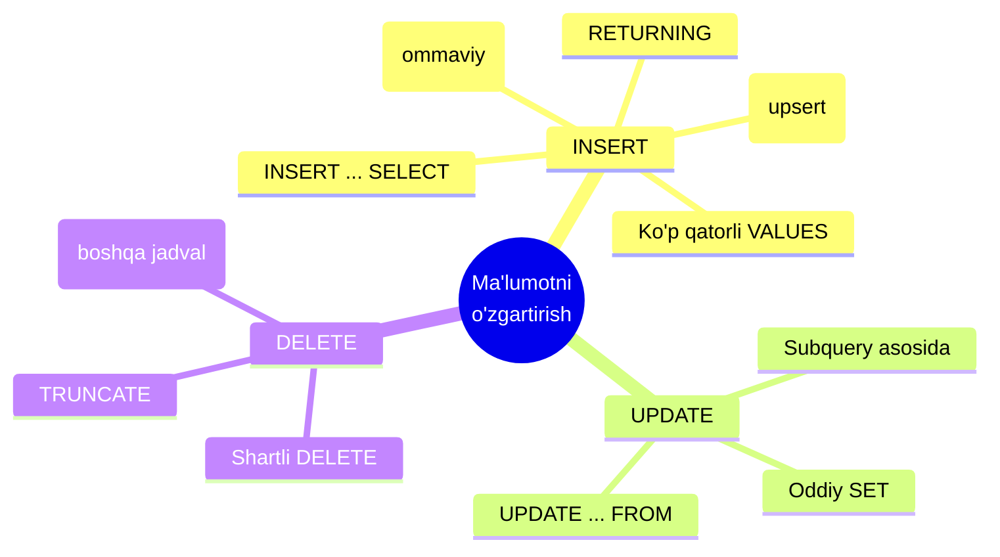
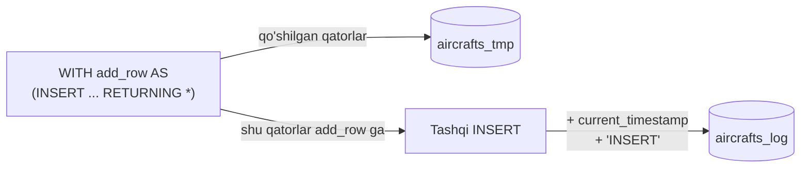
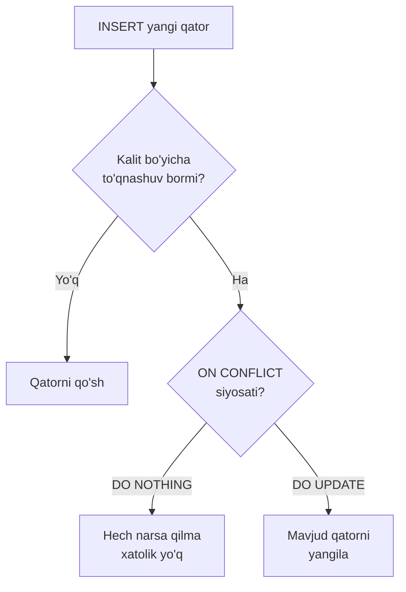
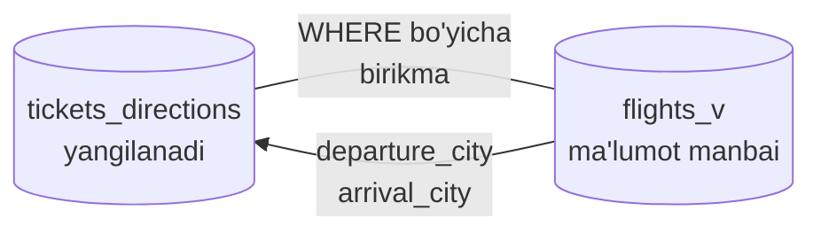
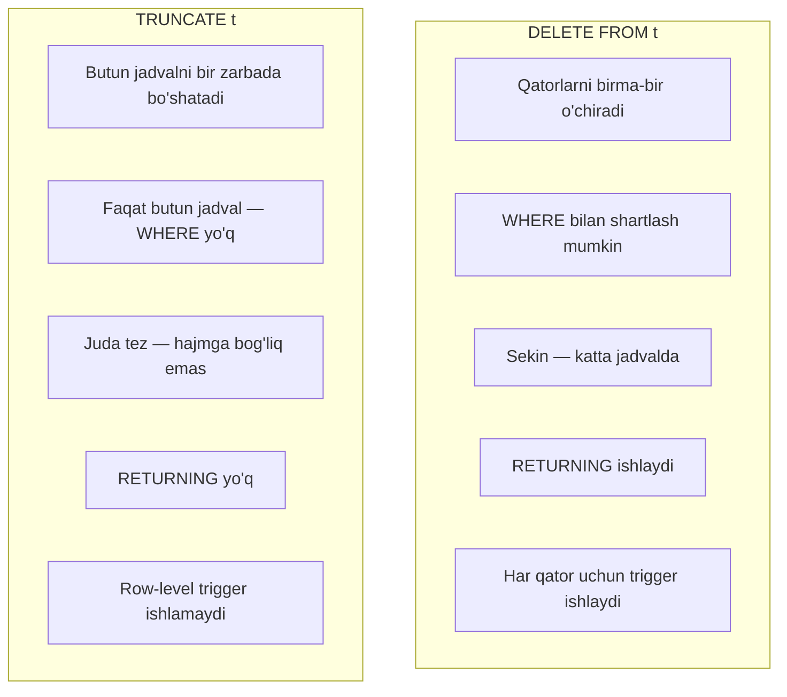

# 13. INSERT, UPDATE, DELETE — chuqurroq

> 📖 Manba: Моргунов, "PostgreSQL. Основы языка SQL", 7-bob ("Изменение данных")

## Nima uchun kerak?

`INSERT`, `UPDATE` va `DELETE` buyruqlari bilan siz oldingi darslarda tanishgansiz — ular bilan jadvalga qator qo'shish, mavjud qatorni o'zgartirish va o'chirish mumkin. Lekin bu buyruqlarning imkoniyatlari juda ancha keng.

Amaliyotda quyidagi savollar tez-tez uchraydi:

- Bitta jadvaldagi minglab qatorni ikkinchi jadvalga qanday **tez** ko'chiraman?
- Tashqi fayldagi ma'lumotlarni jadvalga qanday **ommaviy** yuklayman?
- Yangi qator qo'shmoqchiman, lekin bunday qator allaqachon bo'lsa — **xatolik chiqarmasdan** uni yangilamoqchiman (bu `upsert` deyiladi)?
- `UPDATE` yoki `DELETE`ni **boshqa jadvaldagi** ma'lumotga tayanib bajarsam bo'ladimi?
- Jadvaldagi **hamma** qatorni tez tozalashning yo'li bormi?

Ana shu savollarga bu darsda javob beramiz. Ishlaganda kitobdagi demo "Aviaqatnovlar" (`demo`) bazasidan foydalanamiz: `aircrafts`, `flights`, `tickets`, `ticket_flights`, `bookings`, `routes` jadvallari.



---

## Tayyorgarlik: vaqtinchalik jadvallar

Tajriba o'tkazganda doimiy jadvallarga zarar yetmasligi uchun kitob **vaqtinchalik** (temporary) jadval yaratishni tavsiya qiladi. Bunday jadval bazaga ulanish uzilishi bilan avtomatik o'chib ketadi.

`aircrafts` jadvalining ikkita nusxasini yaratamiz. Birinchisi (`aircrafts_tmp`) — ustida tajriba qiladigan jadval, ikkinchisi (`aircrafts_log`) — jurnal jadvali, ya'ni har bir amalni yozib boradigan "log".

```sql
-- Struktura nusxalanadi, lekin ma'lumot ko'chirilmaydi (WITH NO DATA)
CREATE TEMP TABLE aircrafts_tmp AS
  SELECT * FROM aircrafts WITH NO DATA;

-- Cheklovlar (constraint) nusxada ko'chirilmaydi — ularni qo'lda qo'shamiz
ALTER TABLE aircrafts_tmp ADD PRIMARY KEY ( aircraft_code );
ALTER TABLE aircrafts_tmp ADD UNIQUE ( model );
```

> Izoh: `WITH NO DATA` — "faqat ustunlar ko'chirilsin, qatorlar emas" degani. Agar uni yozmasak, qatorlar ham nusxalanadi (`WITH DATA` — bu standart holat).

Endi jurnal jadvalini yaratamiz. Unga qo'shimcha ikkita ustun kerak: amal qachon bajarilgani (`when_add`) va qanday amal bajarilgani (`operation`).

```sql
CREATE TEMP TABLE aircrafts_log AS
  SELECT * FROM aircrafts WITH NO DATA;

ALTER TABLE aircrafts_log ADD COLUMN when_add timestamp;
ALTER TABLE aircrafts_log ADD COLUMN operation text;
```

> Muqobil yo'l: `CREATE TEMP TABLE aircrafts_tmp ( LIKE aircrafts INCLUDING CONSTRAINTS INCLUDING INDEXES );` — bu bir zarba bilan ustunlar, cheklovlar va indexlarni ham ko'chiradi.

---

## 1. INSERT — bir vaqtda ko'p qator qo'shish

Eng oddiy holatda `INSERT` bitta qator qo'shadi. Lekin `VALUES` ichida vergul bilan ajratib bir necha qatorni bir buyruqda kiritish mumkin. Bu alohida-alohida `INSERT` yozishdan **tezroq**.

```sql
INSERT INTO aircrafts_tmp ( aircraft_code, model, range )
VALUES ( 'SU9', 'Sukhoi SuperJet-100', 3000 ),
       ( 'CN1', 'Cessna 208 Caravan',  1200 ),
       ( 'CR2', 'Bombardier CRJ-200',  2700 );
```

> Bir `INSERT` uchta qator qo'shdi. Har bir qator o'z qavsida beriladi va ustunlar tartibi yuqoridagi ro'yxatga mos bo'lishi shart.

---

## 2. INSERT ... SELECT — bir jadvaldan ikkinchisiga

Ko'pincha qiymatlarni qo'lda yozmaymiz, balki **boshqa jadvaldan tanlab** olamiz. Buning uchun `VALUES` o'rniga `SELECT` yoziladi.

```sql
-- aircrafts jadvalidagi HAMMA qatorni aircrafts_tmp ga ko'chiramiz
INSERT INTO aircrafts_tmp
  SELECT * FROM aircrafts;
```

Muhim qoida: `SELECT` qaytaradigan ustunlar **soni va tur (type)i** maqsad jadvaldagi ustunlarga mos bo'lishi kerak.

Xohlasak faqat ma'lum ustunlarni va shartli qatorlarni ko'chiramiz:

```sql
-- Faqat uzoq masofaga uchadigan samolyotlar (range > 5000)
INSERT INTO aircrafts_tmp ( aircraft_code, model, range )
  SELECT aircraft_code, model, range
    FROM aircrafts
   WHERE range > 5000;
```

---

## 3. RETURNING — qo'shilgan qatorni qaytarish

Odatda `INSERT`/`UPDATE`/`DELETE` faqat "nechta qator o'zgardi" degan xabar qaytaradi. Agar o'zgargan qatorlarning **o'zini** ko'rmoqchi bo'lsak, `RETURNING` ishlatamiz. Bu, ayniqsa, avtomatik hosil bo'lgan qiymatlarni (masalan, `DEFAULT` yoki ketma-ketlik) bilib olish uchun qulay.

```sql
INSERT INTO aircrafts_tmp ( aircraft_code, model, range )
VALUES ( 'IL9', 'Ilyushin IL96', 9800 )
RETURNING *;
```

Natija:

```
 aircraft_code |    model     | range
---------------+--------------+-------
 IL9           | Ilyushin IL96 | 9800
(1 строка)
```

> `RETURNING *` — barcha ustunni qaytaradi. `RETURNING aircraft_code` deb faqat kerakli ustunni ham so'rash mumkin.

---

## 4. INSERT + CTE bilan o'zgarishlar jurnalini yuritish

Endi qiziq bir texnikani ko'ramiz: bitta buyruqda ham "foydali ish" (asosiy jadvalga qo'shish), ham "log yuritish" (jurnal jadvaliga yozish) qilamiz. Buning uchun **CTE** (`WITH ... AS`) ichida `INSERT ... RETURNING` yozamiz.

```sql
WITH add_row AS
( INSERT INTO aircrafts_tmp
    SELECT * FROM aircrafts
    RETURNING *
)
INSERT INTO aircrafts_log
  SELECT add_row.aircraft_code, add_row.model, add_row.range,
         current_timestamp, 'INSERT'
    FROM add_row;
```

Bu qanday ishlaydi:

1. `WITH add_row AS ( INSERT ... RETURNING * )` — bu yerda haqiqiy qo'shish `aircrafts_tmp` ga bajariladi, va qo'shilgan qatorlar `add_row` nomli **vaqtinchalik natija**ga qaytadi.
2. Tashqi `INSERT INTO aircrafts_log ... FROM add_row` — shu qatorlarni oladi, ularga hozirgi vaqt (`current_timestamp`) va amal nomini (`'INSERT'`) qo'shib, jurnal jadvaliga yozadi.

> Natijada `aircrafts_tmp` ga qatorlar ham qo'shildi, ham har bir qo'shish `aircrafts_log` da qayd etildi. Bu — CTE'ning kuchini ko'rsatuvchi illyustratsiya (real loyihalarda buni ko'pincha `trigger` yordamida qilishadi).



---

## 5. COPY — ommaviy yuklash (fayldan / faylga)

Minglab qatorni fayldan bir zarbada yuklash kerak bo'lsa, `INSERT` sekin bo'ladi. Bunday hollar uchun `COPY` buyrug'i bor — u faylni to'g'ridan-to'g'ri jadvalga oqizadi.

Avval matnli fayl tayyorlanadi. Har bir qator — jadvalning bir qatori, ustunlar orasida **tabulyatsiya** (`Tab`) belgisi turadi. Fayl `\.` bilan yakunlanadi:

```
IL9	Ilyushin IL96	9800
I93	Ilyushin IL96-300	9800
\.
```

Endi fayl to'liq yo'li bilan `COPY` beriladi (fayl serverdan ko'rinadigan bo'lishi kerak):

```sql
COPY aircrafts_tmp FROM '/home/postgres/aircrafts.txt';
```

Natija:

```
COPY 2
```

> `COPY 2` — ikkita qator qo'shildi degani. Muhim: `COPY` ham jadvaldagi barcha cheklovlarni (PK, UNIQUE) tekshiradi, ya'ni dublikat qator kirmaydi. Eski qatorlar o'chirilmaydi — yangilari ustiga qo'shiladi.

`COPY` teskari yo'nalishda ham ishlaydi — jadvaldan faylga chiqarish:

```sql
COPY aircrafts_tmp TO '/home/postgres/aircrafts_tmp.txt'
  WITH ( FORMAT csv );
```

`FORMAT csv` — ustunlar vergul bilan ajratiladi (CSV — Comma Separated Values):

```
773,Boeing 777-300,11100
763,Boeing 767-300,7900
SU9,Sukhoi SuperJet-100,3000
```

> Format ko'rsatilmasa, ajratuvchi sifatida tabulyatsiya ishlatiladi.

---

## 6. ON CONFLICT — upsert (qo'shish yoki yangilash)

Yangi qator qo'shganda uning kaliti (PK yoki UNIQUE) jadvaldagi mavjud qator bilan **to'qnashishi** (conflict) mumkin. Odatda bu holat xatolik beradi. `ON CONFLICT` bunday holatda nima qilishni oldindan aytib qo'yish imkonini beradi.

Ikki variant bor:

- `ON CONFLICT ... DO NOTHING` — to'qnashuv bo'lsa, hech narsa qilma (xatolik chiqarmasdan e'tiborsiz qoldir).
- `ON CONFLICT ... DO UPDATE` — to'qnashuv bo'lsa, mavjud qatorni yangila.



### 6.1. DO NOTHING

```sql
INSERT INTO aircrafts_tmp
VALUES ( 'SU9', 'Sukhoi SuperJet-100', 3000 )
ON CONFLICT DO NOTHING
RETURNING *;
```

Natija (qator qo'shilmadi, xatolik ham yo'q):

```
 aircraft_code | model | range
---------------+-------+-------
(0 строк)
INSERT 0 0
```

> `INSERT 0 0` — nol qator qo'shildi. Xato xabari chiqmadi.

Qaysi cheklov bo'yicha to'qnashuvni kuzatishni aniq ko'rsatish ham mumkin:

```sql
INSERT INTO aircrafts_tmp
VALUES ( 'SU9', 'Sukhoi SuperJet-100', 3000 )
ON CONFLICT ( aircraft_code ) DO NOTHING
RETURNING *;
```

> Bu yerda faqat `aircraft_code` (primary key) bo'yicha to'qnashuv tekshiriladi. Agar `aircraft_code` yangi, lekin `model` mavjud bo'lsa — `model` bo'yicha UNIQUE cheklov ishga tushib, an'anaviy xatolik beradi.

### 6.2. DO UPDATE va `excluded` jadvali

`DO UPDATE` bilan to'qnashgan qatorni yangilaymiz. Yangi (qo'shilmoqchi bo'lgan) qiymatlarga `excluded` degan maxsus jadval orqali murojaat qilinadi — uni PostgreSQL o'zi yuritadi.

```sql
INSERT INTO aircrafts_tmp
VALUES ( 'SU9', 'Sukhoi SuperJet', 3000 )
ON CONFLICT ON CONSTRAINT aircrafts_tmp_pkey
DO UPDATE SET model = excluded.model,
              range = excluded.range
RETURNING *;
```

Natija:

```
 aircraft_code |     model      | range
---------------+----------------+-------
 SU9           | Sukhoi SuperJet | 3000
(1 строка)
```

Tushuntirish:

- `ON CONFLICT ON CONSTRAINT aircrafts_tmp_pkey` — to'qnashuv primary key bo'yicha aniqlanadi (ustun nomi o'rniga cheklov nomi ko'rsatildi).
- `DO UPDATE SET model = excluded.model` — mavjud qatorning `model`ini yangi kelgan qiymatga (`Sukhoi SuperJet`) o'zgartiradi. `excluded` — "qo'shilishi kerak bo'lgan, lekin to'qnashuv sabab rad etilgan" qator.
- `DO UPDATE` ichida jadval nomi yozilmaydi — u har doim `INSERT`dagi jadval bilan bir xil.

> Bu **atomar** amal — tekshirish va yangilash bo'linmas bitta operatsiya sifatida bajariladi. Shuning uchun uni "UPSERT" (UPDATE yoki INSERT) deb ham atashadi.

---

## 7. UPDATE — boshqa jadval asosida yangilash

`UPDATE`ning yangi qatorga beriladigan qiymatlari **boshqa jadvaldan** olinishi mumkin. Ikki yo'l bor: `WHERE` ichida subquery yozish, yoki `UPDATE ... FROM` orqali jadvallarni birlashtirish.

Kitobdagi misol: kompaniya rahbariyati har bir yo'nalish (shahardan-shaharga) bo'yicha sotilgan biletlar sonini va oxirgi sotuv vaqtini ko'rmoqchi. Buning uchun `tickets_directions` jadvalini yaratamiz.

```sql
CREATE TEMP TABLE tickets_directions AS
  SELECT DISTINCT departure_city, arrival_city FROM routes;

ALTER TABLE tickets_directions ADD COLUMN last_ticket_time timestamp;
ALTER TABLE tickets_directions ADD COLUMN tickets_num integer DEFAULT 0;
```

> `DISTINCT` shart — bizga faqat noyob (shahar → shahar) juftliklari kerak.

### 7.1. Subquery orqali (WHERE ichida)

Yangi bilet sotilganda, tegishli yo'nalish hisoblagichini bittaga oshiramiz. Buni ham CTE bilan bir buyruqqa birlashtiramiz:

```sql
WITH sell_ticket AS
( INSERT INTO ticket_flights_tmp
    ( ticket_no, flight_id, fare_conditions, amount )
    VALUES ( '1234567890123', 30829, 'Economy', 12800 )
    RETURNING *
)
UPDATE tickets_directions td
  SET last_ticket_time = current_timestamp,
      tickets_num = tickets_num + 1
  WHERE ( td.departure_city, td.arrival_city ) =
    ( SELECT departure_city, arrival_city
        FROM flights_v
       WHERE flight_id = ( SELECT flight_id FROM sell_ticket ) );
```

Tushuntirish:

- CTE ichida `ticket_flights_tmp` ga yangi bilet qo'shiladi.
- Tashqi `UPDATE` esa `tickets_directions` da mos yo'nalishning hisoblagichini oshiradi.
- `WHERE ( departure_city, arrival_city ) = ( SELECT ... )` — bu yerda **ikkita ustun** birdaniga solishtirilyapti. Ichki subquery `flights_v` dan sotilgan biletga tegishli yo'nalishning shaharlarini topadi.

### 7.2. UPDATE ... FROM (jadvallarni birlashtirib)

Xuddi shu vazifani `FROM` orqali, ya'ni jadvallarni **join** qilib ham bajarish mumkin. Bu ko'pincha tushunarliroq va tezroq:

```sql
WITH sell_ticket AS
( INSERT INTO ticket_flights_tmp
    ( ticket_no, flight_id, fare_conditions, amount )
    VALUES ( '1234567890123', 7757, 'Economy', 3400 )
    RETURNING *
)
UPDATE tickets_directions td
  SET last_ticket_time = current_timestamp,
      tickets_num = tickets_num + 1
  FROM flights_v f
  WHERE td.departure_city = f.departure_city
    AND td.arrival_city   = f.arrival_city
    AND f.flight_id = ( SELECT flight_id FROM sell_ticket );
```

Tushuntirish:

- `FROM flights_v f` — yangilanadigan `tickets_directions` jadvalini `flights_v` bilan bog'laydi.
- `SET` ichida faqat `UPDATE`dagi jadval (`tickets_directions`) ustunlariga yangi qiymat berish mumkin — `FROM`dagi jadval faqat ma'lumot manbai.
- Natijani ko'rish uchun `UPDATE`ga `RETURNING *` qo'shsak, birlashgan qatorni ham ko'rsatadi.



---

## 8. DELETE — shartli va boshqa jadval asosida o'chirish

`DELETE` — qatorlarni o'chiradi. `WHERE` shartisiz yozsangiz, **hamma** qatorni o'chirib yuboradi, shuning uchun ehtiyot bo'ling.

### 8.1. Shartli DELETE (+ jurnalga yozish)

```sql
WITH delete_row AS
( DELETE FROM aircrafts_tmp
    WHERE model ~ '^Bom'      -- 'Bom' bilan boshlanadigan modellar
    RETURNING *
)
INSERT INTO aircrafts_log
  SELECT dr.aircraft_code, dr.model, dr.range,
         current_timestamp, 'DELETE'
    FROM delete_row dr;
```

> `model ~ '^Bom'` — regular expression: "Bom" bilan boshlanadigan modellar (Bombardier). O'chirilgan qatorlar `RETURNING *` orqali jurnal jadvaliga 'DELETE' amali sifatida yoziladi.

### 8.2. Boshqa jadval asosida DELETE (USING)

`DELETE ... USING` — o'chirishni boshqa jadval bilan birlashtirib bajaradi (bu `UPDATE ... FROM` ning analogi).

Vazifa: har bir ishlab chiqaruvchi (Airbus, Boeing) bo'yicha **eng qisqa masofaga** uchadigan modelni o'chirish.

```sql
WITH min_ranges AS
( SELECT aircraft_code,
         rank() OVER (
           PARTITION BY left( model, 6 )   -- ishlab chiqaruvchi bo'yicha guruh
           ORDER BY range                   -- masofa bo'yicha o'sish tartibida
         ) AS rank
    FROM aircrafts_tmp
   WHERE model ~ '^Airbus' OR model ~ '^Boeing'
)
DELETE FROM aircrafts_tmp a
  USING min_ranges mr
  WHERE a.aircraft_code = mr.aircraft_code
    AND mr.rank = 1
  RETURNING *;
```

Tushuntirish:

- CTE `min_ranges` — window function `rank()` yordamida har bir ishlab chiqaruvchi guruhida modellarni masofa bo'yicha tartiblaydi. `rank = 1` — eng qisqa masofa.
- `DELETE FROM aircrafts_tmp a USING min_ranges mr` — `aircrafts_tmp`ni `min_ranges` bilan bog'laydi.
- `WHERE ... AND mr.rank = 1` — faqat rangi 1 bo'lgan (eng qisqa masofali) qatorlar o'chiriladi.

---

## 9. TRUNCATE — jadvalni butunlay tozalash

Agar jadvaldagi **barcha** qatorni o'chirish kerak bo'lsa, `DELETE FROM jadval;` ishlaydi, lekin u har bir qatorni birma-bir o'chiradi va sekin bo'ladi. Buning tezkor muqobili — `TRUNCATE`:

```sql
TRUNCATE TABLE aircrafts_tmp;
```

`TRUNCATE` jadvalni bir zarbada bo'shatadi.

### TRUNCATE va DELETE farqi



| Xususiyat | `DELETE` | `TRUNCATE` |
|-----------|----------|------------|
| Nima o'chiradi | Shartga mos qatorlarni | Har doim **hamma** qatorni |
| `WHERE` shart | Bor | Yo'q |
| Tezlik | Katta jadvalda sekin | Juda tez (hajmga deyarli bog'liq emas) |
| `RETURNING` | Ishlaydi | Ishlamaydi |
| Trigger | Har qator uchun ishga tushadi | Row-level triggerlar ishlamaydi |
| Bir necha jadval | Bittadan | Bir vaqtda bir necha jadval: `TRUNCATE t1, t2;` |
| Transaction ichida qaytarish | `ROLLBACK` bilan qaytadi | `ROLLBACK` bilan qaytadi (PostgreSQL'da) |

> Umumiy qoida: **butun jadvalni tozalash** kerak bo'lsa — `TRUNCATE`; **ba'zi** qatorlarni tanlab o'chirish kerak bo'lsa — `DELETE ... WHERE`.

---

## Xulosa

- `INSERT` bilan `VALUES` ichida vergul orqali **bir vaqtda ko'p qator** qo'shsa bo'ladi.
- `INSERT ... SELECT` — boshqa jadvaldan qatorlarni ko'chiradi; ustun soni va turlari mos bo'lishi shart.
- `RETURNING` — o'zgargan qatorlarni qaytaradi (avtomatik hosil bo'lgan qiymatlarni bilish uchun juda qulay).
- `COPY` — fayldan jadvalga (yoki jadvaldan faylga) **ommaviy** ma'lumot ko'chiradi; cheklovlarni tekshiradi.
- `ON CONFLICT` — upsert: to'qnashuvda `DO NOTHING` (e'tiborsiz qoldir) yoki `DO UPDATE` (yangila). Yangi qiymatlar `excluded` orqali olinadi.
- CTE (`WITH ... AS ( INSERT/UPDATE/DELETE ... RETURNING )`) yordamida "foydali ish" va "jurnal yuritish"ni bitta buyruqda birlashtirish mumkin.
- `UPDATE` boshqa jadvalga tayanib ishlashi mumkin: `WHERE` ichida subquery yoki `UPDATE ... FROM` (join).
- `DELETE` ham shartli, ham boshqa jadval asosida (`DELETE ... USING`) ishlaydi.
- `TRUNCATE` — butun jadvalni tez tozalaydi; `DELETE`dan farqi — `WHERE` yo'q, `RETURNING` yo'q, ammo ancha tez.

### Eslab qol

> `RETURNING` — o'zgartirish buyruqlarini "so'rovga" aylantiradi. `ON CONFLICT` bo'lmasa upsert yozib bo'lmaydi. `TRUNCATE` — "hammasini o'chir va tez", `DELETE ... WHERE` — "tanlab o'chir".

---

## Nazorat savollari

1. Bitta `INSERT` buyrug'ida uchta qatorni qanday qo'shasiz? `VALUES` sintaksisini yozib ko'rsating.
2. `INSERT ... SELECT` ishlashi uchun `SELECT` natijasi bilan maqsad jadval o'rtasida qanday moslik bo'lishi shart?
3. `RETURNING` nima uchun kerak va u qanday hollarda ayniqsa foydali?
4. `ON CONFLICT DO NOTHING` va `ON CONFLICT DO UPDATE` orasidagi farq nima? `excluded` jadvali nimani anglatadi?
5. `COPY` buyrug'i `INSERT`dan qaysi holatda afzalroq? U cheklovlarni (constraint) tekshiradimi?
6. `UPDATE ... FROM` konstruksiyasida `SET` ichida qaysi jadval ustunlariga qiymat berish mumkin — yangilanadiganigami yoki `FROM`dagigami?
7. `DELETE ... USING` nima vazifa bajaradi va `UPDATE`dagi qaysi konstruksiyaga o'xshaydi?
8. `TRUNCATE` va `DELETE` orasidagi kamida 3 ta farqni ayting. Qaysi biri `WHERE` shartini qo'llab-quvvatlaydi?
