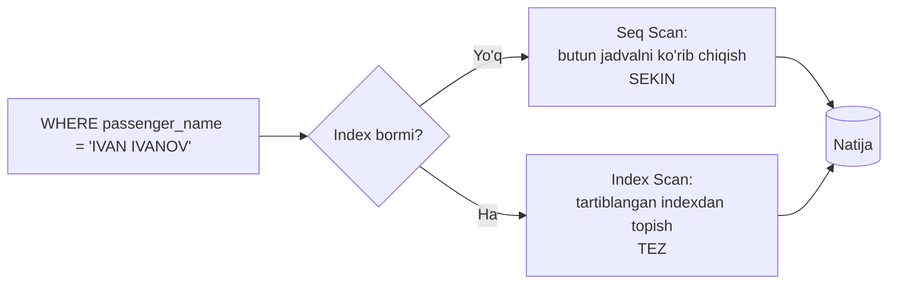
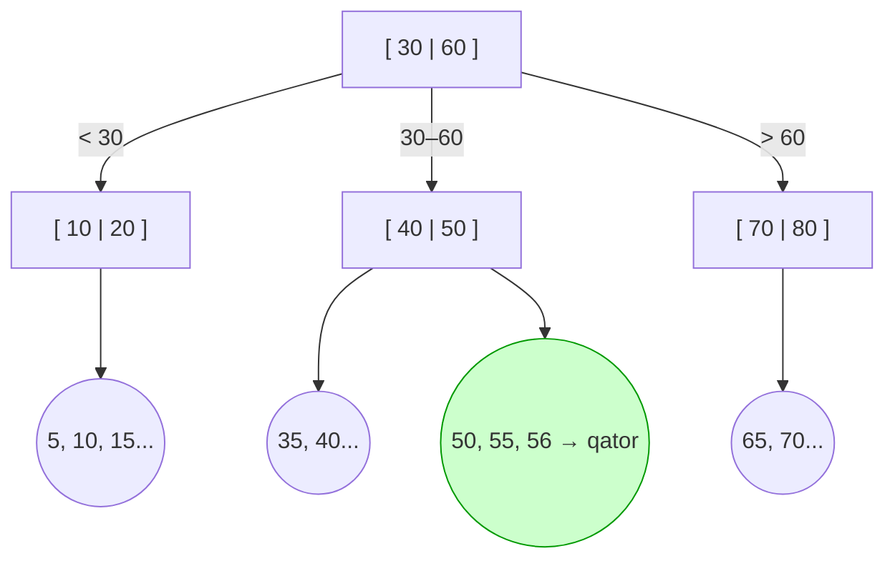
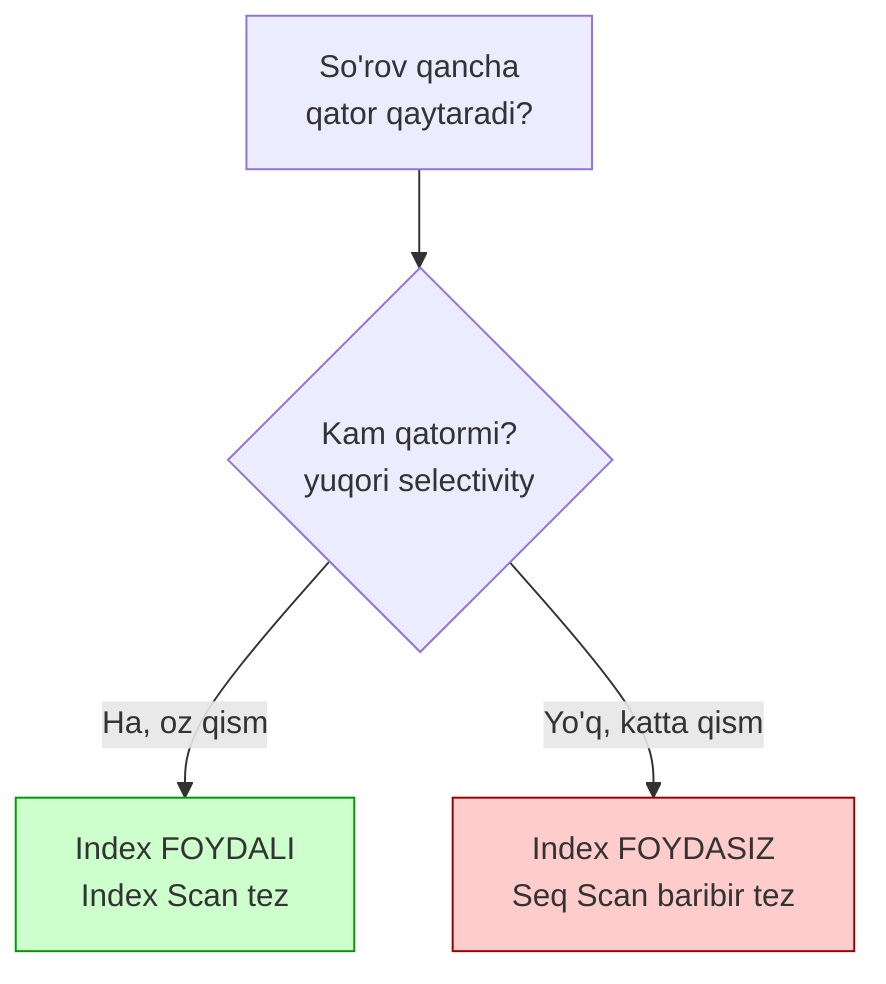
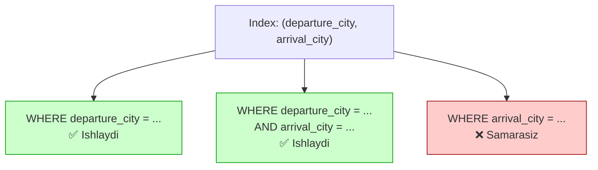
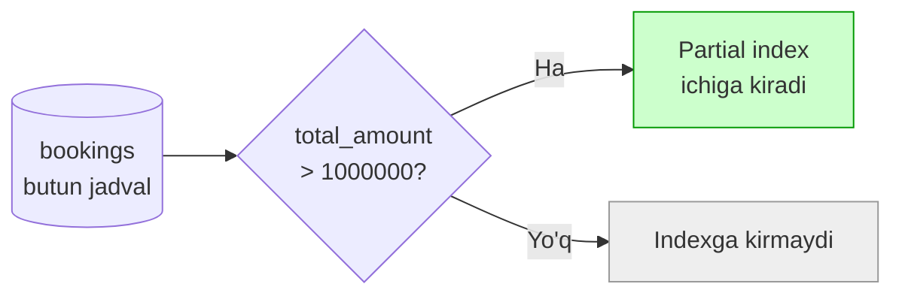

# 14. Indexlar

> 📖 Manba: Моргунов, "PostgreSQL. Основы языка SQL", 8-bob ("Индексы")

## Nima uchun kerak?

Tasavvur qiling: qalin kitobda "mutex" so'zi qaysi sahifalarda uchrashini topmoqchisiz. Ikki yo'l bor:

1. Kitobni **birinchi sahifadan oxirigacha** varaqlab, har sahifada bu so'zni qidirish — juda sekin.
2. Kitob oxiridagi **alifboli ko'rsatkich** (index)ga qarash: u yerda so'zlar tartiblangan, yoniga sahifa raqami yozilgan — bir zumda topasiz.

Ma'lumotlar bazasida ham xuddi shunday. Jadvaldagi qatorlar **tartibsiz** saqlanadi. `WHERE passenger_name = 'IVAN IVANOV'` deb so'raganingizda, PostgreSQL kerakli qatorni topishi kerak. Agar `index` bo'lmasa, u **butun jadvalni boshdan-oxir** ko'rib chiqadi (buni *Sequential Scan*, ya'ni ketma-ket skanerlash deyiladi). Jadvalda million qator bo'lsa — bu sekin.

`index` — bu jadval bilan bog'langan, ustundagi qiymatlar asosida qurilgan, **tartiblangan** maxsus struktura. Uning asosiy maqsadi — qidiruvni tezlashtirish.



Bu darsda index qanday ishlashini, qachon foyda va qachon zarar berishini, va turli xil indexlarni ko'rib chiqamiz. Demo "Aviaqatnovlar" bazasidan foydalanamiz.

---

## 1. Index qanday ishlaydi?

Index ustundagi qiymatlar asosida quriladi. Har bir index yozuvida ikki narsa bor:

1. **Qiymat** (masalan, `passenger_name`).
2. Shu qiymatga tegishli jadval qatoriga **ko'rsatkich** (pointer, to'g'ridan-to'g'ri havola).

Index yozuvlari **tartiblangan** holda saqlanadi. Shuning uchun kerakli qiymatni topish tez — xuddi tartiblangan lug'atda so'z izlagandek. Qiymat topilgach, PostgreSQL ko'rsatkich orqali **to'g'ridan-to'g'ri** jadvaldagi qatorga o'tadi.

Jadvalning maxsus quyi tizimi — **planner** (rejalashtiruvchi) — har bir so'rov uchun index ishlatish foydali yoki yo'qligini baholaydi. Agar foydali deb topsa, avval indexdan qidiradi, so'ng ko'rsatkichlar orqali qatorlarga o'tadi. Shunday qilib, butun jadvalni ko'rib chiqishning o'rniga tartiblangan indexda qidirish yetarli bo'ladi.

### Muhim ogohlantirish

Index bepul emas. U:

- **Disk joyi** egallaydi.
- **Yozish amallarini sekinlashtiradi**: jadvalga har `INSERT`/`UPDATE`/`DELETE` bo'lganda, index ham yangilanishi kerak.

Shu sabab indexni **o'ylab** yaratish kerak — hamma ustunga index qo'yish yaxshi emas.

---

## 2. B-tree — indexning asosiy strukturasi

PostgreSQL turli xil index turlarini qo'llab-quvvatlaydi, lekin standart va eng ko'p ishlatiladigani — **B-tree** (Balanced tree, "muvozanatli daraxt"). Bu darsda faqat B-tree'ni ko'ramiz, chunki u tipik vazifalarning ko'pchiligiga mos keladi.

B-tree — bu tartiblangan qiymatlardan tuzilgan **daraxt** shaklidagi struktura. Uni yuqoridan pastga bosqichma-bosqich qidiriladi:

- **Root** (ildiz) — daraxtning eng yuqori tuguni.
- **Internal** (oraliq) tugunlar — qidiruvni to'g'ri shoxga yo'naltiradi.
- **Leaf** (barg) tugunlar — eng pastda, aynan shu yerda qiymatlar va jadval qatoriga ko'rsatkichlar saqlanadi.

Aytaylik, `ticket_no` bo'yicha index qurilgan va biz `56` qiymatini qidiryapmiz:



`56`ni qidirish yo'li:

1. **Root**: `56` qaysi oraliqda? `30 ≤ 56 ≤ 60` → o'rtadagi shoxga tush.
2. **Internal** tugun `[ 40 | 50 ]`: `56 > 50` → oxirgi shoxga tush.
3. **Leaf**: `50, 55, 56...` orasidan `56`ni topamiz va uning yonidagi ko'rsatkich orqali jadval qatoriga o'tamiz.

Diqqat qiling: million qator bo'lsa ham, daraxtning **balandligi** kichik bo'ladi (bir necha bosqich). Shuning uchun butun jadvalni ko'rish o'rniga bir necha "sakrash" bilan kerakli qatorga yetib boriladi. Qiymatlar tartiblangani uchun B-tree quyidagi amallarni tez bajaradi:

- `=` (aniq tenglik)
- `<`, `<=`, `>`, `>=` (oraliq)
- `BETWEEN`, `ORDER BY` (tartiblangan chiqarish)

---

## 3. Index yaratish (CREATE INDEX)

Index yaratish buyrug'i:

```sql
CREATE INDEX index_nomi
  ON jadval_nomi ( ustun_nomi, ... );
```

Index nomini tashlab ketish ham mumkin — u holda PostgreSQL nomni o'zi hosil qiladi.

```sql
-- 'airports' jadvalining 'airport_name' ustuni bo'yicha index
CREATE INDEX
  ON airports ( airport_name );
```

Jadval indexlarini ko'rish uchun `psql`da `\d jadval_nomi` buyrug'i beriladi:

```
\d airports
...
Индексы:
    ...
    "airports_airport_name_idx" btree (airport_name)
```

> Avtomatik hosil qilingan nom — `jadval_ustun_idx` shaklida (`airports_airport_name_idx`), va turi `btree` deb ko'rsatilgan.

### PRIMARY KEY va UNIQUE avtomatik index yaratadi

Siz jadval yaratganda `PRIMARY KEY` yoki `UNIQUE` cheklov qo'ygan bo'lsangiz, PostgreSQL ular uchun **avtomatik** index yaratadi — bu cheklovlarni tez tekshirish uchun kerak.

```
\d boarding_passes
...
Индексы:
    "boarding_passes_pkey" PRIMARY KEY, btree (ticket_no, flight_id)
    "boarding_passes_flight_id_boarding_no_key" UNIQUE CONSTRAINT, btree (flight_id, boarding_no)
```

- `..._pkey` qo'shimchasi — primary key indexi.
- `..._key` qo'shimchasi — unique cheklov indexi.

### Index ustidagi amallar

```sql
-- Barcha indexlar ro'yxati
\di

-- Indexni o'chirish
DROP INDEX index_nomi;
```

---

## 4. Index qachon foyda, qachon zarar beradi?

Bu — indexdagi eng muhim mavzu. Index **har doim** yaxshi emas.

### Foydani o'lchash: \timing

`psql`da amal bajarilish vaqtini ko'rsatish uchun sekundomerni yoqamiz:

```sql
\timing on
```

Index yo'q holatda `tickets` jadvalidan qidiramiz:

```sql
SELECT count( * )
  FROM tickets
  WHERE passenger_name = 'IVAN IVANOV';
```

Natija (indexsiz):

```
 count
-------
   200
(1 строка)

Время: 373,232 мс
```

Endi `passenger_name` bo'yicha index yaratamiz:

```sql
CREATE INDEX passenger_name
  ON tickets ( passenger_name );
```

Xuddi shu so'rovni qayta bajaramiz:

```
Время: 17,660 мс
```

> Vaqt **373 ms → 17 ms** ga kamaydi — deyarli 20 barobar tezroq! (Sizning kompyuteringizda raqamlar boshqacha bo'lishi mumkin, lekin nisbat saqlanadi.)

### Selectivity — indexning asosiy qonuni

Index **kam qator tanlanganda** foydali. Agar so'rov jadvalning **katta qismini** (masalan, yarmini yoki undan ko'pini) qaytarsa, index deyarli foyda bermaydi — hattoki zarar ham qilishi mumkin.

Bu tushuncha **selectivity** (tanlanuvchanlik) deb ataladi:

- **Yuqori selectivity** = oz qator tanlanadi (masalan, aniq `passenger_name`). Index **foydali**.
- **Past selectivity** = ko'p qator tanlanadi (masalan, `fare_conditions` faqat 3 xil qiymatga ega: Comfort, Business, Economy). Index **foydasiz**.



### Yozish narxi

Yana bir zarar: jadvalga `INSERT`/`UPDATE`/`DELETE` qilinganda har bir index yangilanishi kerak. Ya'ni index **yozish amallarini sekinlashtiradi**. Shuning uchun ko'p yoziladigan, kam o'qiladigan jadvallarda ortiqcha index qo'ymaslik kerak.

> Xulosa: index — bu **kelishuv** (kompromis). O'qishni tezlashtiradi, lekin joy egallaydi va yozishni sekinlashtiradi. Har bir indexni "bu haqiqatan kerakmi?" deb baholang.

---

## 5. EXPLAIN — index ishlatilyaptimi, tekshiramiz

`\timing` bilan vaqtni ko'rdik, lekin PostgreSQL so'rovni aynan qanday bajarayotganini — index ishlatdimi yoki yo'qmi — bilish uchun `EXPLAIN` buyrug'i bor. U so'rovning **rejasini** (plan) ko'rsatadi, so'rovni bajarmasdan.

```sql
EXPLAIN
SELECT count( * )
  FROM tickets
  WHERE passenger_name = 'IVAN IVANOV';
```

Index **yo'q** bo'lsa, rejada `Seq Scan` (butun jadvalni skanerlash) ko'rinadi:

```
Seq Scan on tickets  (cost=0.00.....  rows=200 ...)
  Filter: (passenger_name = 'IVAN IVANOV'::text)
```

Index **bor** bo'lsa, `Index Scan` (yoki `Bitmap Index Scan`) ko'rinadi:

```
Index Scan using passenger_name on tickets  (cost=0.42..... rows=200 ...)
  Index Cond: (passenger_name = 'IVAN IVANOV'::text)
```

Farqni tushunish:

- `Seq Scan` — butun jadval ko'rib chiqilyapti (index ishlatilmayapti).
- `Index Scan` — index ishlatilyapti; `Index Cond` shu indexdan qidirilgan shartni ko'rsatadi.

Haqiqiy vaqtni ham o'lchash uchun `EXPLAIN ANALYZE` ishlatiladi — u so'rovni **rostakam bajaradi** va real vaqtni chiqaradi:

```sql
EXPLAIN ANALYZE
SELECT count( * )
  FROM tickets
  WHERE passenger_name = 'IVAN IVANOV';
```

> Muhim: planner har doim index ishlatishga majbur emas. Agar u "Seq Scan tezroq" deb hisoblasa (past selectivity holatida), indexni e'tiborsiz qoldiradi. `EXPLAIN` aynan shuni ko'rish imkonini beradi.

---

## 6. Multicolumn index — bir necha ustun bo'yicha

Index bitta ustun bo'yicha emas, bir necha ustun bo'yicha ham quriladi. Masalan, `ticket_flights` jadvalining primary key indexi ikkita ustun bo'yicha qurilgan: `ticket_no` va `flight_id`.

```sql
CREATE INDEX idx_dep_arr
  ON tickets_directions ( departure_city, arrival_city );
```

### Ustunlar tartibi juda muhim!

Multicolumn indexda ustunlar **qaysi tartibda** yozilgani hal qiluvchi ahamiyatga ega. Index avval birinchi ustun bo'yicha, keyin ikkinchisi bo'yicha tartiblangan — xuddi telefon kitobida avval familiya, keyin ism bo'yicha.

`(departure_city, arrival_city)` indexi quyidagilarda ishlaydi:

- `WHERE departure_city = 'Москва'` — ✅ ishlaydi (birinchi ustun).
- `WHERE departure_city = 'Москва' AND arrival_city = 'Сочи'` — ✅ ishlaydi (ikkalasi).

Lekin bunda **ishlamaydi** (yoki samarasiz):

- `WHERE arrival_city = 'Сочи'` — ❌ birinchi ustunsiz ikkinchisini qidirish — index samarasiz.



> Qoida: multicolumn indexda **eng ko'p filtrlanadigan** yoki tenglik (`=`) sharti qo'yiladigan ustunni **birinchi** yozing.

### ORDER BY + LIMIT bilan index

Index `ORDER BY`ni ham tezlashtiradi — qiymatlar allaqachon tartiblangan bo'lgani uchun PostgreSQL alohida saralashdan qutuladi. Bu, ayniqsa, `LIMIT` bilan birga kuchli:

```sql
CREATE INDEX tickets_book_ref_test_key
  ON tickets ( book_ref );

SELECT *
  FROM tickets
  ORDER BY book_ref
  LIMIT 5;
```

> Index bo'lsa, PostgreSQL to'g'ridan-to'g'ri indexdan birinchi 5 qatorni oladi — qolgan qatorlarni umuman ko'rmaydi. Bu juda tez (kitobda ~0,442 ms). Indexni o'chirsangiz, u butun jadvalni saralashi kerak bo'ladi va vaqt bir necha barobar oshadi.

---

## 7. Unique index — noyoblikni ta'minlash

Unique index qiymatlarning **takrorlanmasligini** kafolatlaydi. `UNIQUE` cheklov qo'yganda ham xuddi shunday index avtomatik yaratiladi.

```sql
CREATE UNIQUE INDEX aircrafts_unique_model_key
  ON aircrafts ( model );
```

> Endi `aircrafts` jadvaliga bir xil `model` nomiga ega ikkita qator qo'shib bo'lmaydi.

Muhim nozik jihat: unique indexda **NULL** qiymatlar takror hisoblanmaydi. Ya'ni bir necha `NULL` qiymat yonma-yon tursa ham, ular bir-biriga teng deb qaralmaydi (SQL'da `NULL ≠ NULL`). Multicolumn unique indexda esa faqat **barcha** ustunlari to'liq mos kelgan ikki qatorgina takror deb hisoblanadi.

---

## 8. Expression asosidagi index

Index nafaqat ustun bo'yicha, balki **ustunlar ustidagi ifoda (expression)** bo'yicha ham quriladi. Masalan, `model` qiymatlari faqat harf registri bilan farq qilishiga yo'l qo'ymaslik uchun:

```sql
CREATE UNIQUE INDEX aircrafts_unique_model_key
  ON aircrafts ( lower( model ) );
```

Endi bunday qatorni qo'shib bo'lmaydi (registr farqi hisobga olinmaydi):

```sql
INSERT INTO aircrafts
  VALUES ( '123', 'Cessna 208 CARAVAN', 1300 );
-- ОШИБКА: повторяющееся значение ключа нарушает ограничение уникальности
-- Ключ "(lower(model))=(cessna 208 caravan)" уже существует.
```

Tushuntirish:

- `lower( model )` — barcha harflarni kichik registrga o'giradi.
- Index shu **oldindan hisoblangan** qiymatlar ustiga quriladi. Qidiruvda ham qiymat avval `lower`ga o'giriladi, keyin indexdan izlanadi.

> Expression asosidagi index quloqqa yoqimli, lekin uni **yaratish va yangilash qimmatroq**. Uni ko'p marta takrorlanadigan murakkab hisob-kitobli so'rovlarga ishlating — bunda oldindan hisoblangan qiymat vaqtni tejaydi.

---

## 9. Partial index — qatorlarning bir qismi uchun index

`Partial index` — bu jadvalning **barcha** qatorlari uchun emas, balki faqat bir **qismi** uchun quriladigan index. Qaysi qatorlar kirishini `WHERE` sharti (index **predikati** deb ataladi) belgilaydi.

Misol: rahbariyat faqat **1 million rubldan** yuqori bronlarga qiziqadi. Bunday qatorlar butun `bookings` jadvalining kichik qismi. Demak, faqat shu qatorlar uchun index qursak yetarli:

```sql
CREATE INDEX bookings_book_date_part_key
  ON bookings ( book_date )
  WHERE total_amount > 1000000;
```

Endi shunday so'rov tez ishlaydi:

```sql
SELECT *
  FROM bookings
  WHERE total_amount > 1000000
  ORDER BY book_date DESC;
```



### Partial index qachon ishlatiladi?

PostgreSQL partial indexni faqat so'rovdagi shart index predikatiga **mos kelganda** ishlatadi:

```sql
-- ✅ Index ISHLATILADI (1100000 > 1000000 predikatga mos)
SELECT * FROM bookings WHERE total_amount > 1100000 ...;

-- ❌ Index ISHLATILMAYDI (900000 < 1000000, predikatga sig'maydi)
SELECT * FROM bookings WHERE total_amount > 900000 ...;
```

> Diqqat: index `book_date` bo'yicha qurilgan, lekin predikatda boshqa ustun — `total_amount` ishlatilgan. Bu mumkin va tez-tez uchraydi.

Partial indexning afzalligi: u oddiy indexdan **kichikroq** (kamroq joy egallaydi, tezroq yangilanadi). Lekin real foyda olish uchun predikatni to'g'ri tanlash va indexlar qanday ishlashini tushunish tajriba talab qiladi.

---

## 10. Tartib va NULL joylashuvi (ASC / DESC / NULLS)

Index yaratganda qiymatlar tartibini boshqarish mumkin:

- `ASC` — o'sish tartibida (standart holat).
- `DESC` — kamayish tartibida.
- `NULLS FIRST` — `NULL` qiymatlar boshida.
- `NULLS LAST` — `NULL` qiymatlar oxirida (standart `ASC` uchun).

```sql
CREATE INDEX
  ON tickets_directions ( arrival_city DESC NULLS LAST );
```

> Bitta ustunli B-tree index bo'lsa, `ASC`/`DESC`ni ko'rsatishga odatda hojat yo'q — PostgreSQL indexni ikkala yo'nalishda ham teng tezlikda o'qiy oladi. Bu ko'rsatkichlar, asosan, **multicolumn** indexda turli ustunlar turli yo'nalishda saralanganda zarur bo'ladi.

---

## Xulosa

- `index` — jadval bilan bog'langan, ustun qiymatlari asosida qurilgan **tartiblangan** struktura; qidiruvni tezlashtiradi.
- Standart index turi — **B-tree**: daraxt shaklidagi, root → internal → leaf bosqichlari orqali tez qidiriladigan struktura. `=`, oraliq (`<`, `>`, `BETWEEN`) va `ORDER BY` amallarini tez bajaradi.
- `CREATE INDEX ... ON jadval ( ustun )` bilan yaratiladi; `PRIMARY KEY` va `UNIQUE` avtomatik index yaratadi.
- Index **kam qator** tanlanganda (yuqori **selectivity**) foydali; jadvalning katta qismi tanlansa foydasiz.
- Index disk joyi egallaydi va **yozish amallarini sekinlashtiradi** — shuning uchun o'ylab yaratiladi.
- `EXPLAIN` — index ishlatilyaptimi (`Index Scan` vs `Seq Scan`) tekshiradi; `EXPLAIN ANALYZE` real vaqtni ham beradi.
- **Multicolumn** indexda ustunlar **tartibi** muhim: birinchi ustun bo'yicha filtr bo'lmasa, index samarasiz.
- **Unique index** noyoblikni ta'minlaydi; `NULL` qiymatlar takror hisoblanmaydi.
- **Expression** indexi ifoda (`lower(model)`) ustiga quriladi; qimmatroq, lekin takroriy murakkab so'rovlarda foydali.
- **Partial index** faqat qatorlarning bir qismi (predikat `WHERE`) uchun quriladi; kichikroq va tezroq, lekin so'rov predikatga mos kelishi kerak.

### Eslab qol

> Index — bepul emas: o'qishni tezlashtiradi, lekin joy oladi va yozishni sekinlashtiradi. **Selectivity yuqori bo'lgandagina** foyda beradi. Ishlatilyaptimi yoki yo'qmi — har doim `EXPLAIN` bilan tekshiring. Multicolumn indexda ustun tartibini unutmang.

---

## Nazorat savollari

1. Index nima va u `Sequential Scan`dan (butun jadvalni ko'rish) qanday tezroq ishlashga yordam beradi?
2. B-tree strukturasining root, internal va leaf tugunlari nima vazifa bajaradi? Qiymat qanday topiladi?
3. `PRIMARY KEY` yoki `UNIQUE` qo'yganingizda index avtomatik yaratiladimi? `\d jadval` buyrug'i nimani ko'rsatadi?
4. "Selectivity" nima? Index qaysi holatda foyda, qaysi holatda foydasiz? Misol keltiring (`passenger_name` va `fare_conditions`).
5. `EXPLAIN` chiqishida `Seq Scan` va `Index Scan` nimani anglatadi? `EXPLAIN` va `EXPLAIN ANALYZE` farqi nima?
6. `(departure_city, arrival_city)` multicolumn indexi `WHERE arrival_city = 'Сочи'` so'rovida ishlaydimi? Nima uchun?
7. Expression asosidagi index (`lower(model)`) qanday holatda foydali va uning kamchiligi nima?
8. Partial index nima uchun oddiy indexdan kichikroq? `WHERE total_amount > 900000` so'rovi `WHERE total_amount > 1000000` predikatli partial indexni ishlatadimi?
